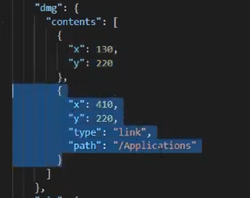

# 基础

1. 跨平台window，mac，Linux。上手简单
2. chromium和Nodejs合并到一个运行时环境中，打包为各个系统的应用。
3. **npm config set ELECTRON_MIRROR https://npm.taobao.org/mirrors/electron/**

# 调式技巧

1. 渲染进程和主进程

   - 主进程，**Electron运行package.json的main脚本的进程被称为主进程**。一个electron应用总是**有且只有一个主进程**
   - 渲染进程：**web界面是用渲染进程描绘的包括html,css,js**

2. 渲染进程调试和主进程调试

   - 渲染调试：网页调试

   - 主进程调试：

     `````javascript
     //package.json文件
     "start": "electron --inspect=5858"
     //浏览器
     chrome://inspect
     //配置5858端口
     //npm start 重新运行
     `````

     

   - 使用vs code调试

     ``````json
     //添加.vscode/launch.json文件并配置
     {
         "version":"0.2.0",
         "configurations":[
             {
                 "name":"Debug Main Process",
                 "type":"node",
                 "request":"launch",
                 "cmd":"${workspaceRoot}",
                 "runtimeExecutable":"${workspaceRoot}/node_modules/.bin/electron",
                 "windows":{
                     "runtimeExecutable":"${workspaceRoot}/node_modules/.bin/electron.cmd"
                 },
                 "args":["."],
                 "outputCapture":"std"
             }
         ]
     }
     ``````

     

     

   

# Electron API

1. app常用事件

   - **ready**，当Electron完成初始化时被触发
   - **window-all-closed**：所有窗口被关闭
   - **before-quit** :  应用开始关闭窗口前触发
   - **will-quit** : 所有窗口已经关闭并且应用程序将要退出时发出
   - **quit**  : 应用程序退出时发出

2. webcontents常用事件

   - **did-finish-load**  : 导航完成时触发

   - **dom-ready** : 框架中的文本加载完成后触发该事件

     ``````
     ready事件
     dom-ready事件
     did-finish-load 事件
     window-all-closed 事件
     ``````

3. 常用api进程对象

   **网页开发，进程由浏览器管理，由于单线程原因，进程也可以不关心**

   renderer.js文件

   - process.getCPUUsage()  CPU占用情况
   - process.env 环境变量属性
   - process.arch 系统32/64系统属性
   - process.platform   获取用户系统属性

   **require,process等属性不可用错误**

   ​	**main.js文件 ,nodeIntegration:true**

   ```javascript
   function createWindow(){
       mainWindow=new BrowserWindow({
           width:800,
           height:600,
           WebPreferences:{
               preload:path.join(__dirname,'preload.js')
               nodeIntegration:true
           }
       })
   }
   ```

   

   

4. 常用File文档对象

   -  

     ``````html
     <doby>
     	<div class="for_file_drag">
             <h2>
                 file对象
             </h2>
             <span>
             	往这里拖文件
             </span>
             
             
         </div>
     
     </doby>
     <script>
         const fs=require('fs');
     	  const dragWrapper=document.getElementById('drag_test')
           dragWrapper.addEventListener('drap',(e)=>{
               e.preventDefault();
               const files=e.dataTransfer.files;
               if(files&&files.length>0){
                   const path=files[0].path;
                   const content=fs.readFileSync(path);
                   console.log(content.toString());
               }
           })
         dragWrapper.addEventLister('dragover',(e)=>{
             e.preventDefault();
         })
     
     </script>
     ``````

     

5. webview标签

   - electron 版本大于等于5 ，webview会禁用。启用**webviewTag:true**

     ``````javascript
     function createWindow(){
         minWindow=new BrowserWindow({
             width:800,
             height:600,
             webPreferences:{
                 preload:path.join(__dirname,'preload.js'),
                 webviewTag:true,
                 nodeIntegration:true
             }
         })
     }
     ``````

     

   - did-start-loading函数,开始加载时触发

   - did-stop-loading函数，停止加载时触发

   - nodeintegration属性，拥有可以使用系统底层的资源，例如 `require` 和 `process` .默认禁用

   - plugins属性，使用浏览器插件。默认禁用

   - httpreferrer，设置请求头

   - insertCSS(css)，向访客页注入CSS

   - executeJavaScript()，向访客注入JS

   - openDevTools()函数，打开开发工具调试窗口.

   ```javascript
   <webview src="https://www.baidu.com"/ style="height:400px" id="wb" plugins='./webview/index.js'>
     <span id="loading"></span>  
   const wb=document.querySelector('#wb');
   const loading=document.querySelector('#loading')
   wb.addEventListener('did-start-loading',()=>{
       console.log("did-start-loading")
       loading.innerHtml='---loading---'
   })
   wb.addEventListener('did-stop-loading',()=>{
       console.log("did-stop-loading")
       loading.innerHtml='---stop---'
   })
   //webview/index.js
   setTimeout(()=>{
       alert(document.querySelector('.index-logo.src').src);
       document.querySelector('#su').onclick=(()=>{
           alert('点击了')
       })
   }，3000)
   wb.insertCSS(`
   #su:{
   	background:red;!important
   }
   `)
   wb.executeJavaScript(
   `
   setTimeout(()=>{
   alert(document.getElementById('su').value);
   },1000)
   
   `
   )
   we.openDevTools();
   
   ```

   

   

6. window.open函数

   - 三个参数：url，子窗口名称，BrowserWindow中的功能字段.并返回一个BrowserWindowProxy对象
   - BrowserWindowProxy对象的方法：blur，close等
   - window.opener.postMessage(message,targetOrigin); 向父窗口传递消息

   - renders.js函数

   ```javascript
   let subwin;
   function openNewWindow(){
      subwin=  window.open('popup_page.html','popup');
       
   }
   window.addEventListener('message',(msg)=>{
       console.log('接收的消息：',msg)
   })
   function closeWindow(){
       subwin.close();
   }
   
   ```

   - popup_page.html

   ```javascript
   <h1>弹出子窗口</h1>
   <button onclick='sendMessageToParent'>向父窗口传递</button>
   function sendMessageToParent(){
       window.opener.postMessage('传递的消息')
   }
   ```

   

7. BrowserWindow对象

   - frame:false ,表示无边框的窗口
   - modal:true，表示模态窗口

   - ready-to-show事件，进程第一次完成绘制时触发事件，此事件后显示窗口没有视觉闪烁
   - minwindow.once()，代表事件仅响应一次。
   - new BrowserWindow({parent:top})，指定父窗口
   - new BrowserWindow({x:0,y:0}) ,指定弹出位置
   - webPreferences对象，网页功能的设置
   - main.js

   ``````javascript
   function createWindow(){
       mainWindow=new BrowserWindow({
           width:800,
           height=600,
           //frame:false,
           //backgroundColor:'#000000',
          	
           show:false,
           WebPreferences:{
           preload:path.join(__dirname,'preload.js')
       }
       })
   }
   mainWindow.once('ready-to-show',()=>{
       mainwindow.show();
   })
   child=new BrowserWindow({
       parent:mainWindow，
       model:true
   })
   ``````

   

8. BrowserView 创建和控制视图

   - destroy() 关闭视图

   ``````javascript
   const {BrowserView}=require('electron');
   const view =new BrowserView();
   view.setBounds({
       x:10,
       y:10,
       width:300,
       height:200
       
   })
   view.webcContents.loadURL('https://www.baidu.com');
   mainWindow.setBrowserView(view);
   ``````

   

9. dialog对话框

   - 主进程上打开，require('electron')

   - 渲染器进程上打开，require('electron').remote

   - showOpenDialogSync()函数，打开窗口

   - showSaveDialog()函数，保存窗口

   - showMessageBoxSync()函数，消息提示窗口

     renderer.js

   ``````javascript
   const {dialog}=require('electron').remote;
   const fs=require('fs');
   function openDialog(){
       dialog.showOpenDialog({
           title:'请选择',
           buttonLabel:'已确认',
           filters:[
               {name:Image',extensions:['jpd','png']}
           ]
       },result=>{
           console.log(result);//打印路径
           fs.writeFile(result,'保存文件测试',)
       })
   }
   function showMessageDialog(){
       dialog.showMessageDialog({
           type:'waring',
           title:'你确定吗？',
           message:'想要删除吗？'
           button:['Ok','Cancel']
       },result=>{
           console.log('你的选择时：'，result);//打印buton数据的下标
       })
   }
   
   ``````

   

10. 系统快捷键

    快捷键是全局的，即使没有键盘焦点；再ready事件之前不应使用此模块

    - 主进程快捷键

      ``````javascript
      const { app, globalShortcut } = require('electron')
      
      app.on('ready', () => {
        // 注册一个 'CommandOrControl+X' 的全局快捷键
        const ret = globalShortcut.register('CommandOrControl+X', () => {
          console.log('CommandOrControl+X is pressed')
        })
      
        if (!ret) {
          console.log('registration failed')
        }
      
        // 检查快捷键是否注册成功
        console.log(globalShortcut.isRegistered('CommandOrControl+X'))
      })
      
      app.on('will-quit', () => {
        // 注销快捷键
        globalShortcut.unregister('CommandOrControl+X')
      
        // 注销所有快捷键
        globalShortcut.unregisterAll()
      })
      
      
      ``````

      

    - 渲染进程快捷键 renderer.js

      ``````javascript
      const {remote}=require('electron');
      remote.globalShortcut.register("CommandOrControl+G",()=>{
          console.log("CommandOrControl+X is pressed")
      })
      ``````

      

      

11. 进程通信：ipcMain和ipcRenderer

    - event.returnValue
    - event.reply
    - 主动向渲染进程发出消息

    ``````javascript
    // 在主进程中.
    const { ipcMain } = require('electron')
    ipcMain.on('asynchronous-message', (event, arg) => {
      console.log(arg) // prints "ping"
      event.reply('asynchronous-reply', 'pong')
    })
    
    ipcMain.on('synchronous-message', (event, arg) => {
      console.log(arg) // prints "ping"
      event.returnValue = 'pong'
    })
    
    ``````

    ``````javascript
    //在渲染器进程 (网页) 中。
    const { ipcRenderer } = require('electron')
    console.log(ipcRenderer.sendSync('synchronous-message', 'ping')) // prints "pong"
    
    ipcRenderer.on('asynchronous-reply', (event, arg) => {
      console.log(arg) // prints "pong"
    })
    ipcRenderer.send('asynchronous-message', 'ping')
    
    ``````

    

12. 原生应用菜单Menu

    - 一般写在渲染进程中

    - Menu.buildFromTemplate(template)， `template`是一个`options`类型的数组，用于构建一个 MenuItem

    - Menu.setApplicationMenu(menu)，设置在各个程序窗体的顶层，即是菜单栏

      renderer.js

    ``````javascript
    const {remote}=require('electron');
    const {Menu,MenuItem}=remote;
    function openMenu(){
        const template=[
            {label:'diyige'},
            {label:'点击测试',click:()=>{
                console.log('点击事件触发')
            }},
            {rule:'undo'},
            {rule:'ando'},
            {label:'路由',type:'checkbox',checked:true},
            {label:'chifa',type:'checkbox',checked:true},
            {label:'guangjie',type:'checkbox',checked:true},
            new MenuItem({label:'menuItem',click:()=>{
                console.log('click menuItem')
            }}),
           	{
                label:'子菜单测试',
                submenu:[
                {label:'子菜单1'},
                {label:'子菜单2'},
                {label:'子菜单3'}
            ]}
        ];
        const menu=Menu.buildFromTemplate(template);
       // Menu.setApplicationMenu(menu);
        menu.popup();
        
    }
    
    ``````

    

13. net 网络

    - 支持wpad协议和代理pac文件

    - https请求的自动隧道

    - 支持basic,digest,ntlm,kerberos或协商身份验证方案对代理进行身份验证

    - 支持传输监控代理，类似fiddler代理，用于访问控制和监视

    - new ClientRequest(options)对象，

      renderer.js

      ``````javascript
      const {net}=require('electron').remote;
      
      const request=net.request('https://baidu.com');
      
      request.on('data',(response)=>{
          console.log(`statusCode:+${response.statusCode}`);
          console.log(`header:+${JSOn.stringify(response.headers)}`)
          response.on('data',(chunk)=>{
              console.log('接收的数据',chunk.toString());
              
          })
          response.on('end',()=>{
              console.log('数据接收完毕')
          })
      })
      request.on('end')
      ``````

      

      

    

# 与高级框架集成

## React

```javascript
//安装 git clone --depth 1 --single-branch https://github.com/electron-react-boilerplate/electron-react-boilerplate.git electron-react-start
// cd electron-react-start 
// yarn  安装依赖
//yarn dev  开发启动

```


## Vue(cli 2.X)

``````javascript
// npm i vue-cli -g
// vue init  simulatedgreg/electron-vue electron-vue-start
//cd electron-vue-start
// yarn  安装
// yarn dev 

//解决Windows无法编辑node-sass
//npm i -g node-gyp
//npm i -g --production windows-build-tools
``````


# 应用打包发布

## React

```javascript
//resources文件，打包生成的exe文件所在
//package.json文件
//*icns是MAC的图标，*ico是window图标
//dmg,mac的图标位置；directories，指定的生成文件夹
```




## Vue

```javascript
//打包yarn build
//package.js文件
```

