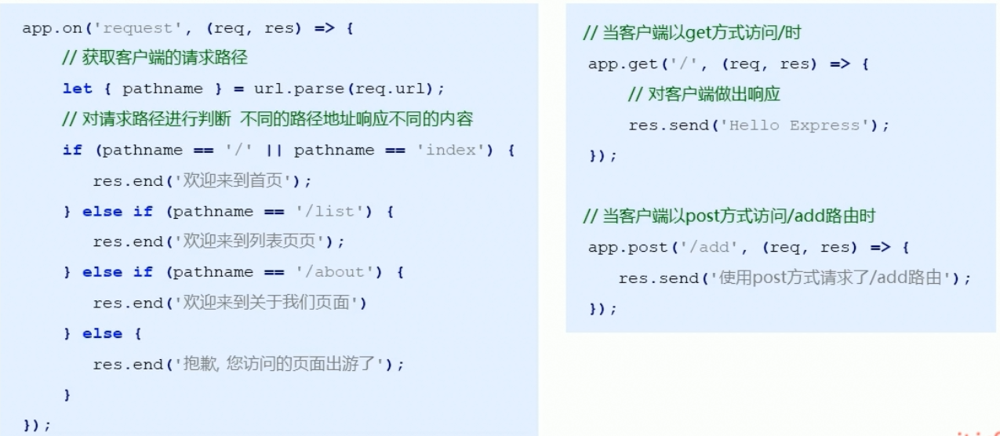
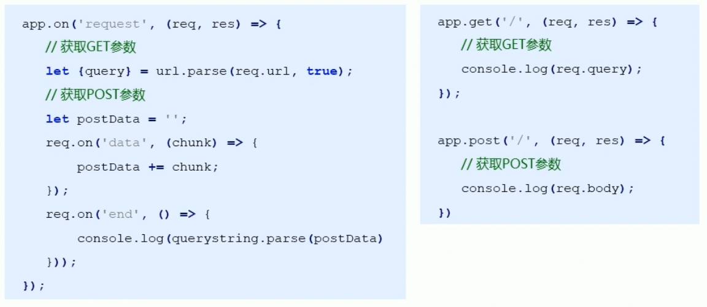
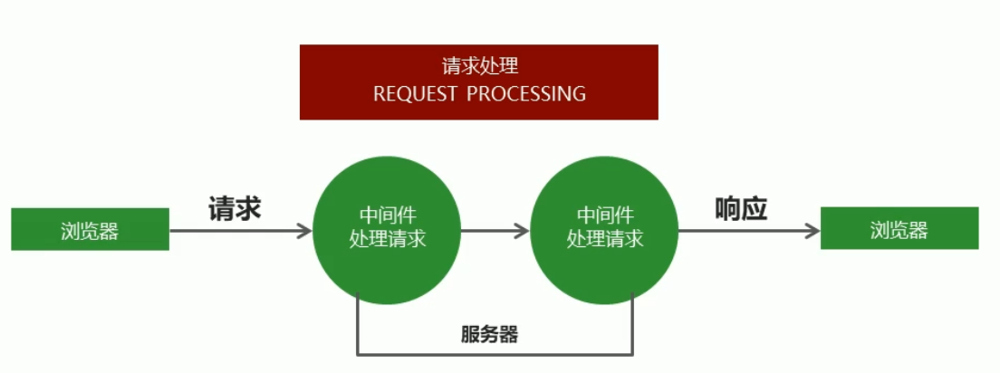

# 介绍

**Express，基于Node的web应用开发框架**

# 对比Node.js

1. Express提供了**方便简洁的路由定义方式**

   **简化了获取HTTP请求参数的处理**

   **对模板引擎支持程度高，方便渲染动态HTML页面**

   提供了**中间件机制有效控制HTTP请求**

   拥有大量**第三方中间件对功能进行扩展**

2. 路由对比

   

3. 获取请求参数

   

   


# 使用

1. **res.send()**
- **自动检测响应内容的类型**
   
- **自动设置http状态吗**
   
- **自动设置相应的内容和编码类型**
   
- **可以响应JSON对象**

``````javascript
//安装 npm i express
const express=require('express');
//创建网站服务器
const app=express();
app.get('/',(req,res)=>{
    //send()方法
   // res.send('hello express')
    res.send({name:'zhangsan',age:20})
})
//监听端口
app.listen(3000);
console.log('webserver success');

``````

# 中间件



1. 就是一堆方法，可以接收客户端发来的请求、对请求做出响应，也可以将请求交给下一个中间件继续处理。

2.  **中间件由两部分组成**

   - **中间件方法，由Express提供，负责拦截请求**
   - **请求处理函数，由开发人员提供，负责处理请求**

3. 针对同一个请求设置多个中间件，对同一个请求进行多次处理

   - **默认情况下，请求从上到下依次匹配中间件，一旦匹配成功，终止匹配**

   - **权限控制函数next，调用next()函数将请求的控制权交给下一个中间件，直到遇到结束请求的中间件**

     `````javascript
     app.get('/request',(req,res,next)=>{
     	req.name='zhangsan'
         //移交请求控制权
         next();
     });
     app.get('/request',(req,res)=>{
     	res.send(req.name);
     })
     `````

     

4. **app.use()中间件**

   - 匹配所有的请求方式，可以直接传入请求处理函数，代表接收所有的请求。
   - **但是不能改变请求是从上到下的匹配模式**

   ```javascript
   app.use((req,res,next)=>{
       console.log(req.url);
       next();
   })
   ```

   - **第一个参数也可以传入请求地址，代表无论什么请求方式，只有是该请求地址就接收这个请求**

   ``````javascript
   app.use('/admin',(req,res)=>{
       console.log(req.url);
       next();
   })
   ``````

   

   

5. 中间件应用

   - 路由保护

     ``````javascript
     //模拟登陆判断
     app.use('/admin',(req,res,next)=>{
         let isLogin=false;
         if(isLogin){
             next()
         }else{
             res.send('未登录,不能访问')
         }
     })
     ``````

     

   - **网站维护公告，放置在请求的最前并相应维护信息**

     ``````javascript
     app.use((req,res,next)=>{
         res.send('网站正在维护')
     })
     ``````

     

   - 自定义404页面，放置在路由的最底部并响应404信息

     - 返回status状态码

     ``````javascript
     ...
     ...
     //
     app.use((req,res,next)=>{
         res.status(404).send('页面不存在');//链式操作
     	
     })
     ``````

     

6. **错误处理中间件，只能主动捕获同步代码的错误**

   - 一个集中处理错误的地方,**有四个参数（err,req,res,next)**

   - **err参数message属性**

   - Error()函数，表示错误

   - throw关键字，抛出错误

     ``````javascript
     app.get('/index',(req,res)=>{
         throw new Error('程序的未知错误')
     })
     //错误处理中间件
     app.use((err,req,res,next)=>{
         res.status(500).send(err.message);
     })
     ``````

   - **对于异步代码的错误，只能手动触发错误处理中间件,传递错误参数给next()**

     ``````javascript
     app.get('/',(req,res.next)=>{
         //文件读取不存在的文件出错
         fs.readFile('/file-does-not-exist',(err,data)=>{
             if(err){
                 next(err);//手动触发错误处理中间件
             }else{
                 res.send(data);
             }
         })
     })
     ``````

     

7. **trycatch函数捕获错误（异步和同步）**

   - node中，异步api的错误由回调函数捕获，支持promise对象的异步api可以通过catch方法捕获

   - try catch可以**捕获异步函数及其他同步代码**执行中发生的错误，不能捕获其他类型的API发生的错误

   - **utli模块中，promisify函数**

     ``````javascript
     const promisify=require('util').promisify;
     //包装成一个promise对象
     const readFile=promisify(fs.readFile);
     
     app.use('/',async (req,res,next)=>{
         try{
             //数据库查找操作
             //await User.find({name:'张三'})
             await readFile('./aaa.js');
         }catch(ex){
             //手动触发error中间件
             next(ex);
         }
     })
     ``````

     

   

8. 构建模块化路由

   ``````javascript
   //示例
   const express=require('express');
   //创建路由对象Router()
   const home=express.Router();
   //将路由和请求路径进行匹配
   app.use('/home',home);
   //在home路由下继续创建路由
   home.get('/index',()=>{
       // 访问路径为/home/index
       res.send('welcome blog show page');
   })
   ``````

   

   - 模块化路由基础代码

     ``````javascript
     const express=require('express');
     //创建web服务器对象
     const app=express();
     //创建路由对象home
     const home=express.Router();
     //将路由对象和请求路径匹配
     app.use('/home',home);
     //在home路由下继续创建路由
     home.get('/index',(req,res)=>{
         res.send('/home/index welcome ')
     })
     app.listen(3000);
     console.log('web server success');
     ``````

   - 构建模块化路由

     app.js

     ``````javascript
     const express=require('express');
     //创建web服务器对象
     const app=express();
     //引入home,admin路由模块
     const home=require('./route/home')
     const admin=require('./route/admin');
     app.use('/home',home);
     app.use('admin',admin);
     
     app.listen(3000);
     console.log('web server success');
     ``````

     

   - admin.js

     ``````javascript
     const express=require('express');
     const admin =express.Router();
     admin.get('/index',(req,res)=>{
         res.send('welcome to admin page')
     });
     //导出admin路由模块
     module.exports=admin;
     ``````

     

   - home.js

     ```javascript
     const express=require('express');
     const home =express.Router();
     home.get('/index',(req,res)=>{
         res.send('welcome to home page')
     });
     //导出home路由模块
     module.exports=home;
   ```
     

     

     
     

9. **GET** 参数的获取

   - Express框架中使用**req.query获取GET参数**

   - **框架内部会将GET参数转换为对象并返回**

     ``````javascript
     //示例
     //接收地址栏中问号后面的参数
     app.get('/',(req,res)=>{
         //接收的是JSON对象
     	console.log(req,query);
     })
     ``````

     ``````javascript
     app.get('/index',(req,res)=>{
         //获取get请求参数
         res.send(req.query);
     })
     ``````

     

10. POST参数

    - 安装**npm i body-parser** ，req.body即是解析后的参数对象

    - **extended参数为false，**

      - **false内部使用queryString模块处理请求参数（参数解析为对象格式）**
      - **true则为第三方模块qs处理。**

      ``````javascript
      //示例
      //引入body-parser模块
      const bodyParser=require('body-parser');
      //拦截所有请求，配置body-parser模块
      app.use(bodyParser.urlencoded({extended:false}))；
      //接收参数
      app.post('/add',(req,res)=>{
          //接收请求参数
         // console.log(req.body);
          res.send(req.body);
      })
      
      ``````

      

      

11. app.use方法

    - 参数为一个函数

    - **调用函数的同时传入参数，可以改变该函数的行为。**

      ``````javascript
      const express=require('express');
      const bodyParser=require('body-parser');
      const app=express();
      app.use(fn({a:1}))
      //函数fn返回了一个匿名函数
      function fn(obj){
          return function(req,res,next){
              if(obj.a==1){
                  console.log(req.url);
              }else{
                  console.log(req.method)
              }
              next();
          }
      }
      app.get('/',(req,res)=>{
          //接收post请求参数
          res.send(req.body);
      })
      
      app.listen(3000);
      console.log('server success');
    ``````
      
      

12. Express路由参数

    - 传值形式：**/：id** 

    - params参数存储的就是请求参数对象

      ``````javascript
      //示例，路由定义参数
      app.get('/find/:id',(req,res)=>{
          console.log(req.params);//{id:123}
      })
      ``````

      ``````javascript
      //示例，页面传值
      localhost:3000/find/123
      ``````

      

13. 静态资源的处理

    - **express.static()函数可以托管静态文件，如JS，CSS，JS文件等**

    - **静态资源文件夹，推荐使用绝对路径**

    - **指定虚拟路径**

      ``````javascript
      app.use('虚拟路径',express.static(path.join(__dirname,'public')))
      ``````

      

      ``````javascript
      const express=require('express');
      const app=express();
      const path=require('path');
      
      //静态资源文件夹使用绝对路径
      app.use('/static',express.static(path.join(__dirname,'public')))
      app.listen(3000);
      ``````

14. app.locals对象

    - app.locals对象下面的数据都可以在所有模板文件中获取到。

      

      ``````javascript
      //示例
      app.locals.users=[{
          name:'zhangsan',
          age:20
      },{
          name:'lisi',
          age:30
      }]
      ``````

      

    - index.art

      ``````html
      <ul>
          {{each users}}
          <li>
              {{$value.name}}
              {{$value.age}}
          </li>
          {/each}
      </ul>
      ``````

      

15. 模板引擎

    - 安装 **npm i art-template express-art-template** 

    - **engine()两个参数，模板后缀和模板引擎**

    - **set()两个参数，固定参数views和模板的绝对路径**

    - **渲染模板时候，不写后缀，默认拼接art后缀**

      ``````javascript
      app.set('view engine ','art');
      ``````

    - **render()函数**，第一个参数是模板名称,第二个参数是传递的数据

      - **拼接模板路径**
      - **拼接模板后缀**
      - **模板和数据的拼接关系**
      - **拼接的结果响应给客户端**

      ``````javascript
      //示例
      //当渲染后缀为art的模板时候，使用express-art-template
      app.engine('art',require('express-art-template'));
      //设置模板存放目录
      app.set('views',path.join(__dirname,'views'));
      //渲染模板时候，不写后缀，默认拼接art后缀
      app.set('view engine ','art');
      app.get('/',(req,res)=>{
          //渲染模板
          res.render('index');
      })
      ``````

      ``````javascript
      const express=require('express');
      const path=require('path');
      const app=express();
      
      app.engine('art',require('express-art-template'));
      app.set('views',path.join(__dirname,'views'))
      app.set('view egnine','art');
      
      app.get('/index',(req,res,next)=>{
          
          res.render('index',{
              msg:'message'
          })
      })
      app.get('/list',(req,res)=>{
          res.render('list',{
              msg:'list message'
          })
      })
      
      
      app.listen(3000);
      ``````

      

      

