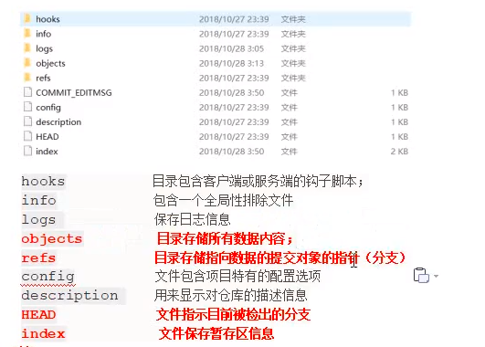
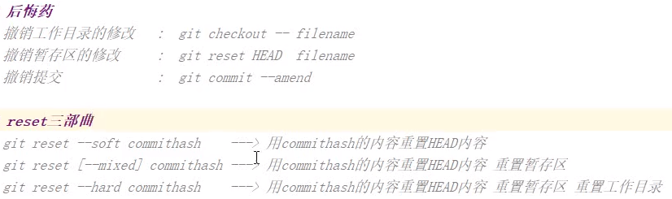
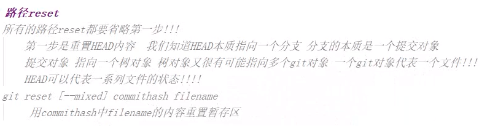
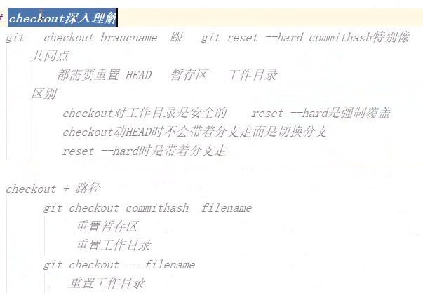
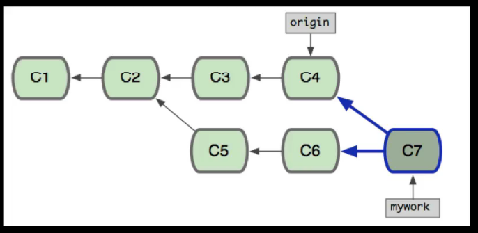
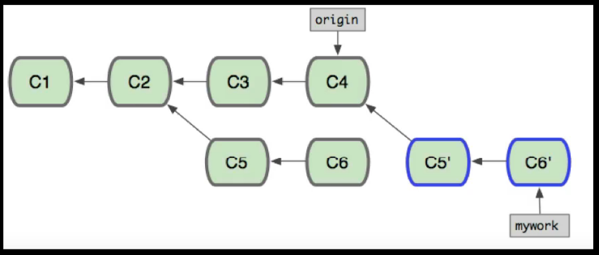

集中式管理和分布式管理
======================

集中式
------

1.  **svn保存的是差异，需要的硬盘空间相对小一些。回滚速度会慢一些**

2.  优点是

    - 代码存放在单一服务器上，方便项目的管理

3.  缺点是

    - 容易丢失历史纪录

分布式
------

1.  **git保存的是项目的完整快照，硬盘空间相对大一些，git回滚速度很快**

2.  优点是

    - 断网情况下可以开发，分布式开发

3.  缺点是

    - 每个客户端保存的是整个项目的完整快照，学习成本高

基础
====



安装
----

**git --version**

初始化
------

**git config --global user.name ‘’name‘’**

**git config --global user.email** <name@example.com>

**git config --list**

```
/etc/gitconfig  文件：所有用户得普适文件。    git config --system
~/.gitignore 文件:用户文件                 git config --global
.git/config 文件，当前git的配置文件 
```


区域
----

1.  **工作区**
2.  **暂存区**
3.  **版本库**
4.  **三个对象：Git对象，树对象，提交对象**

对象
----

1.  git对象（**完整保存单个文件的内容并压缩**）

    - key/value组成的键值对，key是value组成的hash。在**git内部是一个blob类型**

    - **hash-object -w 文件路径或--stdin**
- **–w指定存储对象,不指定此项，也返回对应的键值同时存入版本库**
      
- \--stdin 不指定此项，须在命令尾部给出存储文件的路径
      
- **cat-file –p 文件hash值 根据键值拉取数据**
  - **–p 指示该命令自动判断内容的类型并显示内容**
    
  - **–t显示git内部对应的类型（tree,blob，commit）**
    
2.  树对象（**包含了一条或多条记录每条记录含有一个git对象或子对象的hash指针**）

    - **update-index --add --cacheinfo 标识名 对应的hash值 对应的名字
      命令，为文件的首个版本创建一个暂存区**
1.  **标识名 100644
            标识普通文件；100755表示可执行文件；120000标识符号链接**
    
2.  **--cacheinfo 选项，标识将要添加的文件位于git数据库中。**
    
3.  **--add 首次加入版本库需要加上**
    
2.  **find ./.git/objects/ -type f** 查看树对象
    - **t 表示类型**
    - **git ls-list -s**
    - d 表示文件夹
1.  **查看暂存区**
    
4.  **git write-tree**
    
    1.  **暂存区快照命令，生成树对象放入版本库中**
    
5.  **git read-tree --prefix=bak 第一个树对象的hash值**
    
    1.  **把第一个树对象加入第二个树对象并读入暂存区**
    
3.  提交对象（**封装了树对象，添加了作者和注释信息**）

    1.  **commit-tree 树对象的hash值 -p 该提交的父提交对象的hash值**

        1.  **创建并提交对象**

    2.  **具有链式特性**

4.  **git add ./ 命令**

    - **先生成git对象到版本库，然后生成树对象由版本库里再到暂存区**

5.  **git commit –m ‘注释内容’**

    - **git write-tree命令创建树对象**

    - **git commit-tree 命令创建提交对象**

基础命令
--------

1.  **clear:清除屏幕**
2.  **echo ‘haha’\>test.txt :打印控制台信息并写入文件**

    - **echo ‘haha’ \>\> test.txt:文件的末尾追加一行文字**
3.  **ll:浏览当前目录下的子文件和子目录**
- **ll -a 查看隐藏文件**
4.  **find 目录名：对应目录下的子孙文件和子孙目录打印控制台**
5.  **find 目录名 –type f：对应目录下的文件平铺在控制台**
6.  **find 目录名 –type d：对应目录下的文件夹平铺在控制台**
7.  **rm 目录名：删除文件**
8.  **mv 源文件 重命名文件 ：重命名**
9.  **cat 文件的url：查看文件内容**
10.  **vim 文件的url:**
     - **i，进入编辑模式**

     - **esc键进入命令执行**

     - **:q! 不保存强制退出**

     - **:wq 保存退出**

     - **:set nu 设置行号**
11.  **ssh-keygen -t rsa -C 邮箱名**
12.  **rm -rf 文件夹 递归删除文件及文件夹**
13.  **mkdir mydir && cd mydir 先创建文件夹然后进入该文件夹**
14.  **pwd 显示当前路径**
15.  **cd \~ 进入用户主目录；**
16.  **cd - 返回进入此目录之前所在的目录；**
17.  **git checkout - 返回之前所在的分支**

高级命令
========

底层命令
--------

1. git对象（blob）

   - **git hash-object -w 文件路径**：生成一个hash值，存入objects文件中。
   - **git hash-object --stdin** ：生成一个hash值
   - **git cat-file –p或-t 该hash值：查看内容或对应的类型**
     -  `-w` 选项会指示该命令不要只返回键，还要将该对象写入数据库中。 
     - 最后，`--stdin` 选项则指示该命令从标准输入读取内容；若不指定此选项，则须在命令尾部给出待存储文件的路径。

2. tree对象（tree）

   - **git update-index --add --cacheinfo 标识名 对应的hash值 对应的名字
     构建树对象并添加入暂存区。即.git/index文件**
     -  `git update-index` 为一个单独文件——我们的 test.txt 文件的首个版本——创建一个暂存区。 利用该命令，可以把 `test.txt` 文件的首个版本人为地加入一个新的暂存区。
     -  必须为上述命令指定 `--add` 选项，因为此前该文件并不在暂存区中（我们甚至都还没来得及创建一个暂存区呢）；
     -  同样必需的还有 `--cacheinfo` 选项，因为将要添加的文件位于 Git 数据库中，而不是位于当前目录下。 同时，需要指定文件模式、SHA-1 与文件名：
     - `100644`，表明这是一个普通文件。 其他选择包括：`100755`，表示一个可执行文件；`120000`，表示一个符号链接。
   - **git write-tree 生成一个树对象存入到objects文件中**

3.  commit对象（commit）

    - **git  commit-tree  tree对象的hash值**    生成一个提交对象

4.  **查看暂存区**

    - **git ls-files -s**
    
5. git add ./ 和git commit -m 'comment'

   ``````javascript
   git hash-object -w 工作区的文件名
   git update-index ...
   //
   git write-tree
   git commit-tree  tree对象的hash值
   ``````

   

常用命令
--------

1.  **code .** 使用默认的编辑器打开当前文件

2.  **git init** 初始化仓库

3.  **git add ./** 添加暂存区

4.  **git commit –m** ‘注释’ 添加版本库
- **git commit 进入注释编辑，顶头编辑**
  
- **git commit -a -m ‘注释’
      跳过暂存区，将所有已跟踪的文件暂存起来一并提交**
  
- **同git commit -am ‘注释’**
  
5.  **git status** 查看状态

    - **git rm --cached \<file\>** 不暂存某文件

6.  **git add 文件名 跟踪新文件**

7.  **git diff (不加参数直接输入git diff) 查看已暂存和未暂存的更新**
- **git diff --cached 或者 git diff --staged(1.6.1以上)
      查看已暂存起来准备提交的修改**
  
8.  **git clone url 仓库名** 指定远程仓库的名称

9.  **git log** 查看历史记录

    - **按Q键退出**

    - **--pretty =oneline 一行显示缩略信息**
  - **git log --oneline 一行显示缩略信息**
    
10. **git rm 文件名，然后git commit -m 完成删除**

11. **git mv 原文件名 新文件名** 然后**git commit –m** 完成修改名称

```
git log 
-p 展开显示每次提交的内容差异
-n 显示最近n次更新
--stat 简要的增改行数统计
--pretty=oneline
--pretty=format:”%h-%an,%ar:%s”
--graph 图形化展示
--graph --abbrev-commit 图形化简要信息展示
--pretty=oneline --abbrev-commit图形化精要信息展示

```


12. **git merge --ff**和**--no-ff**和**--squash**区别
- \--ff:
      (fast-forward)默认的提交方式。方式就是当条件允许的时候，git直接把HEAD指针指向合并分支的头，完成合并。属于“快进方式”，不过这种情况如果删除分支，则会丢失分支信息。因为在这个过程中没有创建commit
  
- \--no-ff:
      指的是强行关闭fast-forward方式。不使用fast-forward方式合并，保留分支的commit历史,并生成一次合并的提交记录
  
- \--squash:
      是用来把一些不必要commit进行压缩，比如说，你的feature在开发的时候写的commit很乱，那么我们合并的时候不希望把这些历史commit带过来，于是使用--squash进行合并，此时文件已经同合并后一样了，但不移动HEAD，不提交。需要进行一次额外的commit来“总结”一下，然后完成最终的合并。
  
- 使用squash方式合并，把多次分支commit历史压缩为一次。然后在合并时所在的分支主动做commit，产生一次合并记录

分支命令
--------







1.  分支，就是**指向最新提交对象**的指针

    - head是一个指针，默认指向master分支。切换分支就是head指向不同的分支。

    - 新的提交，head都会带着当前分支向前移动

    - develop分支

      - 频繁变化

    - test分支

      - 供测试和产品人员使用的分支，变化不频繁

    - master分支

      - 生产分支

    - bugfix分支（hotfix分支）

      - 用于紧急修复的分支

2.  **git branch 分支名** 创建分支
- **git branch 可以得到分支列表**
  
3.  **git checkout 分支名** 切换到该分支
- **git checkout –b 新建分支名   新建分支并切换到该分支**

4.  **git branch –d 分支名** 删除已合并的分支

    - **git branch –D 分支名 强制删除**

2.  **查看项目的分支历史**

    **git log --oneline --decorate --graph --all**

    配别名（**命令较长时，使用双引号括起来**）

>   **git config --global alias.别名 “log --oneline --decorate --graph –-all”**

>   **git config --global alias.别名 “!gitk” 已外部命令的方式运行指定程序（git
>   ui）**

>   **使用别名**

>   **git 别名**

1.  **git branch –v** 查看当前分支的最新提交

    - **git branch -av 查看所有分支的最新提交**

2.  **git branch name commitHash**

    - **新建分支并且使分支指向对应的提交对象。版本穿梭，时光机**

3.  **切换分支（git status 确认暂存区已经提交了）**

    - **修改了head，暂存区，工作区**

4.  **git reflog**

    - **引用日志记录了最近几个月你的 HEAD 和分支引用所指向的历史。**

5.  **切换分支**

    - **快进合并**fast-forward**和典型合并**

    - **git status查看状态确定没有待提交的文件后再切换**
    
      **git checkout 合并的分支**
    
      **git merge 新分支**
    
6. **分支模式**

   - **长期分支：master和develop**

   - **特性分支：**

7. **git分支的本质**

   - **指向提交对象的可变指针(head)**

8. **.git/refs目录，保存了分支及其对应的提交对象**

9. **git branch --merged**

   - **查看那些分支已经合并到当前分支**

   - **该列表中没有\*号的分支通常可以使用**

10. **git branch --no-merged**

    - **查看所有包含未合并工作的分支**

11. **git merge --no -ff 分支名**

    - **禁用fast-forword ，这样会多出一个commitID方便看出合并的痕迹。**

12. **git branch --set-upstream-to=origin/remote_branch  your_branch**

    - **origin/remote_branch是你本地分支对应的远程分支；your_branch是你当前的本地分支。**

13. **git branch -m 原分支名 新分支名                   分支改名**

git存储
-------

1.  **git stash**命令
- **将未完成的修改保存到栈上**
  
- 重新应用**git stash apply**
  
  - **先进后出的模式**
  
- **git stash list** 查看存储
      - **git stash apply stash@{0} 展示指定的栈内容**

    - **git stash pop 删除的名字**
      - **应用存储并立即删除**
  
- **git stash drop 删除的名字** 将要删除的存储的名字来移除它
  
- **git stash save ‘说明内容’ 添加说明内容**

撤销和重置
----------

1.  红色文件：撤回工作区修改（丢失掉相对于暂存区里的最新内容）

    - **git checkout --文件的名称**

    - **暂存区依然存在着该文件**

2.  撤回暂存区修改（从暂存区移除到工作区）

    - **git reset HEAD   文件的名称**

    - **git rm --cache 文件名称 将文件从暂存区中删除**
  - **git将不再管理该文件，工作目录中依然存在该文件**
3.  **撤回版本库的提交(修改注释内容)**
- **git commit --amend 修改最新的提交注释内容**
  
- **如果提交后有了新的修改，应该**
      - **git add 加入暂存区的文件**

      - **git commit --amend**
        
      - **第二次提交将代替第一次提交**

4.  **git reset --soft HEAD\~ 撤回提交命令 只修改了HEAD指向**
- **本质上撤销了上一次git commit 命令。在运行git
      commit命令时，创建一个新的提交并移动HEAD所指向的分支类使其指向该提交。**
  
- **只改变了head，并带着分支一起移动**
  
- **重置回去：git reset --soft 提交hash值**
  
5.  **git reset --mixed HEAD\~ 撤销暂存区命令  修改了HEAD指向同时修改了暂存区**
- **get reset HEAD\~等同于 git reset --mixed HEAD\~**
  
- **撤销上一次提交，同时取消暂存区所有的东西。回滚到所有git add和git
      commit命令执行之前**
  
- **重置回去：git reset --mixed 提交hash值**
  
6.  **git reset --hard HEAD\~（慎用）**
- **改变了head,撤销了最后的提交、git add和git
      commit及其工作目录中的所有工作**
  
- **重置回去：git reset --hard提交hash值**
  
7.  **git checkout 提交对象  和   git reset --hard 提交对象的区别**
- **checkout仅改动head，hard改动head而且带着分支一起走**
  
- **checkout对工作目录是安全的，hard是强制覆盖工作目录。**
  
8.  **git reset [--mixed]  HEAD(或hash值) 文件路径**
- **不改动head指针，只改动暂存区，完成重置该文件。**
  
- **等同于git reset 文件名**
9.  **git checkout 分支名 和git checkout --文件名**
- **仅仅改动了工作目录**
  
10. **恢复误删除的文件**
- **git rm命令删除并纳入暂存区**
      - **git commit -m**

>   **或者**

- **先git reset HEAD 被删除的文件**

- **然后git checkout -- 被删除的文件**

- **rm 命令仅仅是删除**

  - **git add 命令添加到暂存区**

>   **或者**

- **先git reset HEAD 被删除的文件**

- **然后git checkout -- 被删除的文件**

- **版本回退**

  1.  **回退到上一个版本**

  2.  **git reset --hard HEAD\^**

      1.  **git reset --hard HEAD\^\^ 回退到上上个版本**

  3.  **git reset --hard HEAD\~1 回退到第n个版本**

  4.  **git reset --hard commitID 回退到指定版本**

数据恢复
--------

1.  **git branch 新分支名 丢失的分支的hash值**
1.  创建一个新分支来找回丢失的分支

tag标签
-------

1.  **轻量标签和附注标签**
- 轻量标签是一个特定提交的引用
  
- 附注标签可以包含打标签者的名字、电邮等信息。
  
  - **git tag –a 标签名**
    
  - **git tag –a 标签名 指定的提交对象hash 给指定的提交对象打tag**
    
  - **git tag –a 标签名 指定的提交对象hash –m ‘内容信息’
        给指定的提交对象打附注tag**
    
2.  **git tag** 列出标签

3.  **git tag –l '正则表达式’** 按照正则表达式匹配

4.  **git tag 标签名 创建标签**

    - **git tag 标签名 指定的提交对象hash**

5.  **git tag -d 标签名 删除本地标签**

    - **git push origin :refs/tags/远程tag名 删除远程指定标签**

    - **git push origin --delete tag 远程tag名 删除远程标签**

6.  **git show 标签名** 查看标签

7.  **git checkout 标签名 检出标签**

    - **git checkout -b 新分支名   分离头指针状态下进行修改操作**

8.  **git push origin [tagname]** 向远程服务器提交tag

    - **git push origin --tags**
      把所有不在远程仓库服务器上的标签全部传送到那里。

9.  **git fetch origin tag 远程tag名 拉取指定的tag**

10. **git blame 命令**

    - 查看文件的每个部分是谁修改的

    - **git blame -L 开始行号,结束行号 文件名** 指定行号

    - **git blame -C -L 开始行号,结束行号
      文件名**尝试找出文件中从别的地方复制过来的代码片段的原始出处

远程仓库
--------


1.  **git remote add \<别名\> url 配置别名**

2.  **git remote -v 显示远程仓库使用的Git别名与其对应的url**

3.  **git remote show 远程仓库名 查看远程仓库**

4.  **git remote rename 原名称 新名称 重命名远程仓库**

5.  **git remote rm 仓库名 移除远程仓库**

6.  **git push 别名仓库 分支名 推送远程仓库**
- **git push -u 仓库名 分支名 首次使用-u，以后可以省略仓库名和分支名**
  
7.  **git config --global --unset user.name 取消全局的username**

8.  **git fetch 仓库名 分支名 拉取远程仓库内容**

    - **git merge 跟踪分支 在本地master分支上合并跟踪分支**

9.  **git pull 仓库名 分支名 拉取最新版本**
- **首先本地分支和远程分支建立联系**
  
10. **git branch -u 仓库名/分支名 本地分支和远程跟踪分支建立联系**

11. **git checkout -b 本地分支 远程跟踪分支**

    - **创建本地分支并和远程跟踪分支建立联系**

    - **同 git checkout --track 远程跟踪分支**

12. **git branch -vv 查看设置的所有跟踪分支**

13. **git push origin --delete 分支名**

    - **删除远程分支**

    - **同git push origin :要删除的分支**

14. **git remote prune origin --dry -run**
- **列出仍在远程跟踪但是远程已经删除的无用分支**
  
- **git remote prune origin**
  
- **清除上面命令列出来的远程跟踪**
  
15. **pull == fetch+merge**

Git refspec引用规范
-------------------

1.  **缺省情况下，refspec会被git remote add
    所生成，获取远端refs/heads下的引用，写入本地refs/remotes/origin目录下。查看远程仓库的log记录**

2.  **(+的作用是强制更新)**

    - **git log origin/master**

3.  **git push --set-upstream origin 本地分支 本地分支推送到远程仓库**

    - **git push --set-upstream origin 本地分支：对应的远程分支**

4.  **git checkout -b 对应远程分支的本地分支 远程跟踪分支
    新建本地分支对应远程跟踪分支**
- **同 git checkout --track 远程跟踪分支**
  
5.  **git push -u origin 本地分支 将一个本地分支推送到远程仓库**

6.  **push完整命令：git push origin 本地分支：远程分支（目标分支）**

7.  **pull完整命令：git pull origin 远程分支：本地分支（目标分支）**

8.  **HEAD是指向当前分支的引用标识符，不包含sha-1值。**

9.  **git symbolic-ref HEAD 读取HEAD**

10. **git remote prune origin 同步与远程仓库和分支情况**

11. **git fetch origin master:refs/remotes/origin/新建本地分支名**

    - **拉取远程分支到本地并新建远程跟踪分支**

    - **git checkout --tract origin/远程跟踪分支
      新建同名的本地分支，解决head分离状态**

    - **git remote prune origin 最后同步一下**

12. **git branch --unset-upstream 分支名
    远程分支被删除，这时可以修复一下。取消当前分支的upstream**

比较差异diff
------------

1.  **git diff** 比较工作区和暂存区的区别

2.  **git diff HEAD(或者指定commitID的区别)** 比较工作区和最新提交的区别

3.  **git diff --cached commitID** 比较暂存区和指定commitID的区别

    - **git diff --cached** 比较暂存区和最新提交的区别

Git gc
------

1.  如果你执行了 **git gc** 命令**，refs 目录中将不会再有这些文件**。
    为了保证效率 Git 会将它们移动到名为 **.git/packed-refs** 的文件中

2.  如果你更新了引用，**Git 并不会修改这个文件**，而是**向 refs/heads
    创建一个新的文件**。 为了获得指定引用的正确 SHA-1 值，Git 会**首先在 refs
    目录中查找指定的引用，然后再到 packed-refs 文件中查找。** 所以，如果你在
    refs 目录中找不到一个引用，那么它或许在 packed-refs 文件中。

3.  注意这个文件的最后一行，它会**以 \^ 开头。
    这个符号表示它上一行的标签是附注标签，那一行是附注标签指向的那个提交。**

Git裸库和submodule(子模块)
--------------------------

1.  **git init --bare** 创建裸库

2.  **git submodule add url 放置在该目录中（该目录事前不能不能存在）**

    - **git add .和git commit -m 、git push 推送远程仓库**

3.  **cd 子模块目录，然后git pull 拉取最新内容**

    - **简化操作如：进入根目录，git submodule foreach git pull
      拉取所有依赖包的最新内容**

4.  **克隆带有依赖包：git clone url 指定仓库的名称 --recursive**

5.  **删除submodule**

    - **移除缓存区 git rm --cached submodule目录名称**

    - **删除文件 rm -rf submodule目录名称**

6.  **弊端**

    - **删除子模块步骤略复杂**

    - **例如在有子模块的项目中切换分支可能会造成麻烦。
      如果你创建一个新分支，在其中添加一个子模块，之后切换到没有该子模块的分支上时，你仍然会有一个还未跟踪的子模块目录，这时候如果不小心提交了这个子模块（git
      commit -am "message"），就会有问题了**

Git subtree
-----------

1.  首先添加一个subtree远程库：**git remote add substree仓库名 url**

2.  **git subtree add --prefix=subtree subtree仓库名 subtree分支名
    --squash（可选参数，） 加入一个subtree库**

    - **简写：git substree add -P substree仓库名 分支名**

    - **git subtree add --prefix=\<本地子项目目录\> \<远程库仓库地址 \|
      远程库别名\> \<分支\> --squash**

    - **使用squash方式合并，把多次分支commit历史压缩为一次。然后在合并时所在的分支主动做commit，产生一次合并记录（子模块的提交都丢失了）**

3.  **git subtree pull --prefix=subtree 仓库名 分支名 --squash
    拉取子模块的最新内容**

4.  **对子模块做了修改：**

    1.  **先git push 推送父模块，**

    2.  **然后git subtree push --prefix=subtree 仓库名 分支名 同 git subtree
        push -P subtree 仓库名 分支名**

5.  **--squash参数的最佳解决**

    1.  **首次使用了--squash参数那就坚持每次使用。否则不要使用--squash参数**

6.  **父模块修改了子模块的内容，然后子模块再拉取新内容后再次修改内容。父模块拉取新内容时产生冲突**

    1.  **原因是--squash参数合并了多次提交的记录，无法找到共同的父提交。**

7.  **git subtree split [--rejoin] --prefix=\<本地子项目目录\> --branch
    \<主项目中作为放置子项目的分支名\>**

    1.  **注意：如果 push 时使用了 --squash 参数合并提交，那么 split 时不能使用
        --rejoin 参数，反之必须使用。**

Git cherry-pick 挑拣提交
------------------------

1.  **git cherry-pick commitID 指定该提交加入到所在分支中**

2.  **git checkout commidID 退回到指定提交 ，git checkout -b 新分支名**

Git rebase变基(衍合)
--------------------

**merge方式**



**rebase方式，会修改提交历史**



1.  **rebase注意事项**

    **rebase出现的冲突**

    1.  **解决冲突后，git add添加，然后执行**

>   **git rebase --continue 继续应用剩下的补丁**

- **接下来GIt会继续应用剩下的补丁**

- **任何时候都可以通过git rebase --abort
  终止rebase,分支会恢复到rebase开始前的状态**

- **不要对master分支执行rebase，会引发许多问题**

- **一般来说，执行rebase的分支都是自己的本地分支，且没有推送到远程版本库**

- **git rebase --skip 丢弃打上的提交补丁，保留原有的提交**

- **git rebase 变基到该分支上** 
  - **即是 git rebase 目标分支或变基分支 特性分支**

1. **git rebase -i HEAD~3  最近三条的commit压缩为一个commit**

   - **仅仅对未提交到远程仓库的提交做变基**

2. 配置beyond compare 

   ```javascript
   git config --local merge.tool bc3
   git config --local mergetool.path 'bc的安装目录'
   git config --local mergetool.keepBackup false
   //应用,自动查找冲突文件
   git mergetool 
   ```

GitLab
------

Git特点
=======

1.  直接记录快照，不是差异比较

2.  几乎所有的操作都是在本地进行

3.  时刻保持数据完整性

4.  多数操作仅添加数据

5.  文件的三种状态：已修改，已提交，已暂存

.gitignore文件
==============

1.  文件 **.gitignore** 的格式规范如下：

    - 所有**空行或者以 ＃ 开头的行**都会**被 Git 忽略**。

    - 可以使用**标准的 glob 模式匹配**。

    - 匹配模式可以**以（/）开头防止递归。**

    - 匹配模式可以**以（/）结尾指定目录。**

    - 要**忽略指定模式以外的文件或目录**，可以在模式前加上**惊叹号（!）取反。**

    - 所谓的 glob 模式是指 **shell 所使用的简化了的正则表达式。**

      - **星号（\*）匹配零个或多个任意字符**；

      - **[abc] 匹配任何一个列在方括号中的字符**（这个例子要么匹配一个
        a，要么匹配一个 b，要么匹配一个 c）；

      - **问号（?）只匹配一个任意字符**；

      - 如果在**方括号中使用短划线分隔两个字符**，表示所有在这**两个字符范围内的都可以匹配**（比如
        [0-9] 表示匹配所有 0 到 9 的数字）。

      - 使用**两个星号（\*) 表示匹配任意中间目录**，比如\`a/\*\*/z\`
        可以匹配 a/z, a/b/z 或 \`a/b/c/z\`等。
    
        ```.gitignore
        .DS_Store
        node_modules/
        /dist/
        npm-debug.log*
        yarn-debug.log*
        yarn-error.log*
        #Editor directories and files
        .idea
        .vscode
        *.suo
        *.ntvs*
        *.njsproj
        *.sln
        
        
        ```
    
        


# 补：

```javascript
·  git add -A  提交所有变化

·  git add -u  提交被修改(modified)和被删除(deleted)文件，不包括新文件(new)

·  git add .  提交新文件(new)和被修改(modified)文件，不包括被删除(deleted)文件
```

# 高频命令

**git reflog**   查看提交历史

**git ls-files -s 查看暂存区**

**git cat-file -p hash值      查看git/树/提交对象**                  

**git cat-file -t  hash值    查看git/树/提交对象的类型（tree ,blob,commit）**

**git commit -am 'comment'** 跳过暂存直接提交版本库

```javascript
git基本流程
git add ./
    等价 git hash-object -w 文件名（修改的文件都需要执行此命令）
git commit -m 'comment'
	git write-tree
	git commit-tree
```

**git diff --cached 或git diff --staged**(1.6.1以上) 查看那些更新已经暂存起来的（绿颜色的）

**git diff** 查看当前的更新还没有暂存起来（红颜色的）

**git rm 删除的文件名**    ， 用来删除同时添加到暂存区

git mv 重名命的文件，  用来重命名同时添加到暂存区

git branch  显示分支列表

**git branch 新分支名**

**git checkout 切换分支**

**git checkout -b 新分支**    创建新分支并且切换到该分支上

git branch -d  删除的分支名   ， 记得首先切换出将要删除的分支

git branch -D 删除的分支名  ， 强制删除该分支

**git branch  新建分支  提交对象的hash**    时光回溯到该hash对应的版本

```
高频别名
// 分支历史
git config --global alias.bhistory "log --oneline --decorate --graph --all"
```

**git merge 合并的分支名**

**git reset --soft HEAD ~(或者hash)**   撤销上一次的commit并带着分支  （类似 git commit --amend）

**git reset [--mixed] HEAD ~(或者hash)**  撤销上一次的commit并取消暂存的所有东西并带着分支 （类似 git reset HEAD）

**git reset --hard HEAD ~(或者hash)**  撤销上一次的commit并取消暂存和工作区的所有东西并带着分支 （类似 git checkout ） 一个危险命令

