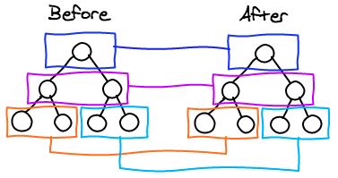

# 什么是移动App开发

1. 苹果App使用OC，或者swift开发
2. 安卓App使用Java和安卓控件开发
3. 混合移动App开发，使用前端的独有技术进行移动App开发

# 移动App的概念

## 原生开发

1. NativeApp，使用官方提供的工具和技术开发

## 混合开发

1. HybridApp，使用前端技术，搭配打包和编译技术，开发一个手机APP，安装后在手机上使用

## 什么是App

1. Application，可安装应用程序

## App的分类

1. 平台分类
   - 移动端：手机QQ、微信
   - PC端：浏览器、代码编辑器、PC端游戏、视频和聊天
   - TV端：
2. 功能分类
   - 游戏类：植物大战僵尸、愤怒的小鸟
   - 应用类：手机QQ，微信，支付宝，京东

## App和Web的区别

1. APP: Application应用程序

   - 优点：流畅稳定、离线运行
   - 缺点：不能跨平台

2. Web：特指基于浏览器的Web网站

   - 优点：可以跨平台
   - 缺点：不稳定，受限于网路，不如App的流畅稳定

# 混合App开发

1. React全部使用ES6语法

2. 常见开发方式

   - WebApp
     - 百度脑图
     - 优点是跨平台
     - 缺点是依赖网络，有白屏效果，相对来说，用户体验差；不能调用硬件底层的设备，例如摄像头；
   - NativeApp
     - 优点是体验好，使用流畅；非常适合做游戏；可以直接调用硬件底层的API；
     - 缺点是不能跨平台
   - HybirdApp
     - 优点是可以跨平台，用户体验不差
     - 缺点是：相对于原生体验略弱；不适合做游戏

3. 三种开发方式

   

   - 对比

     HybridApp开发方式在早期内部是一个网页。

     RN内部是一个原生的APP，和原生差别不大。缺点是组件不够丰富，需要提前封装。

     

   - **webapp和hybridApp是解析执行**；nativeapp是编译执行

4. 三种技术

   - Vue.js和weex
   - React.js 和React-Native
   - Angular.js和Ionic

5. 移动开发框架

   - H5+
   - React-Native
   - Weex
   - Ionic

6. 使用HBuilder可以在线打包生成App，不需要本地配置开发化境。

7. 移动App根据打包特点，分为

   - H5+和Ionic
     - 先有一个完整的网站页面，然后使用H5+或Ionic打包技术，制作一个可安装的应用
     - 目的：为了安装在手机上，并且可以调用硬件底层的API
     - 内部运行的其实是一个网站，外层有一个容器的壳
     - 开发效率高，但是运行效率和性能不算好
   - React-Native和Weex
     - 先开发一个模板项目（不能运行在浏览器和手机中，是半成品）
     - 使用RN或Weex打包技术，源代码翻译成原生的Java或OC代码，制作完成一个可安装的应用
     - 应用内部是原生的代码，没有了前端代码，是一个真正原生性质的APP
     - 内部运行的是一个原生容器的壳
     - 性能好，体验流畅，但是可用的组件不算多

8. 配置环境变量和开发环境

   - java jdk

     - 添加系统变量 ：JAVA_HOME  值：jdk的安装路径
     - 修改PATH：%JAVA_HOME%\bin; %JAVA_HOME%\jre\bin;
     - 添加系统变量：CLASSPATH        值：  .;%JAVA_HOME%\lib\dt.jar;%JAVA_HOME%\lib\tools.jar
     - javac 命令验证

   - Node

     - node -v 检查版本

   - C++

     - 大多数系统带有C++环境

   - Git

     - git --version 检测版本

   - Python

     - 只能安装python 2.X版本。注意勾选add path to path选项
     - python 命令检查

   - 配置安卓

     - Android Studio

   - 配置开发环境

     - npm 设置镜像源

       ``````java
       npm config set registry https://registry.npm.taobao.org --global
       npm config set disturl https://npm.taobao.org/dist --global
       ``````

       

     - yarn和React-Native命令行工具

       安装

       ``````java
       npm install -g yarn react-native-cli
       ``````

       

       设置镜像源

       ``````java
       yarn config get registry
       yarn config set registry https://registry.npm.taobao.org --global
       yarn config set disturl https://npm.taobao.org/dist --global
       ``````

9. 切换进项目根目录，运行adb devices 命令查看是否有设备连接

   

# React

## React和Vue

1. 模块化
   - 分割模块，提高代码重用
2. 组件化
   - 从UI角度分析，拆分成互不相关的小组件，随着项目开发，组件越来越多，现有的组件可以直接使用，提高组件重用率
3. 组件化的好处
4. vue实现组件
   - template、script、style组件模板的三部分
5. React实现组件
   - 不存在.vue的模板文件，也没有拆分组件成三部分，直接使用JS代码的形式，创建组件
6. React：Fackbook前端团队维护和更新；Vue：第一版作者尤鱼溪，第二版后有团队维护。

## 核心概念

### 虚拟DOM

1. virtual document object model
2. 本质：**使用JS表示的UI元素**
3. DOM和虚拟DOM
   - DOM是浏览器的JS提供的，可以使用固定的API来操作DOM对象
4. 实现虚拟DOM
- 由代码模拟实现，类似于浏览器中的DOM，但是有这本质的区别
5. 虚拟DOM实现的目的

### DIff算法

1. 按需更新页面上的元素
2. 编程模拟新旧DOM
   - 
   - tree diff:  **每次新旧DOM树逐层对比的方式**
   - component diff:**对比每一层组件，组件类型不同会替换更新**
   - element diff：**对比每个组件的元素，元素类型不同会替换更新**
   - key：**key属性，把 新旧DOM中的对象做一层关联关系**
3. DIff算法对比找到需要更新的部分，完成更新

### JSX语法

1. React项目创建

   - **cnpm i react react-dom -S**

   - 项目中**导入react和react-dom包**

   - 使用**JS创建虚拟DOM节点**

     - ``````javascript
       React.createElement()创建虚拟DOM对象，接受三个以上的参数
       参数1，字符串类型的参数，表示创建的元素类型
       参数2，属性对象，表示该元素的属性
       参数3，虚拟DOM对象，表示该元素的子节点
       ``````

       

   - 使用**ReactDOM渲染到指定元素中**

     - ``````
       ReactDOM.render(虚拟DOM元素，指定DOM元素容器)
       ``````

2. 语法转换工具：**cnpm i babel-preset-react -D   然后配置参数.babelrc文件**

3. JSX本质：**最终用React.createElement的形式来实现**

4. JSX语法内部，**在{}内部书写JS代码**

5. 为元素添加class属性，**必须书写为：className**；**label标签的for属性书写为：htmlFor**

6. 注释

   ``````javascript
   {/*注释内容*/}
   {// 单行注释}
   ``````

7. 组件

   - **一个构造函数就是一个最基本的组件，函数需要return返回**

   - 把**构造函数的名称当作组件的名称**，**以标签形式放入组件中**

   - react解析标签时，**首字母是小写按照普通标签解析，首字母大写按照组件形式解析**

   - **function类型组件**中使用外部传递的数据，**必须在构造函数内定义并使用props属性来接收（只读属性，不能修改）**

   - class类型的组件，书写时不带有小括号。class内部有一个默认存在的constructor构造函数接收参数，通过constructor构造器来创建实例

   - class类型的组件，内部必须有一个render函数（函数中需要返回return虚拟DOM元素）。render函数中使用**this.props.数据**，可以调用外部的数据；**数据依然是只读的，不能修改**；

   - class类型的组件，constructor函数和super函数需要先定义形参props才可以使用**props.属性**

   - **class类内部只能写静态属性和方法**

   - **通过打印实例看到，静态属性和静态方法挂载到constructor构造函数上，实例方法挂载到原型对象上**

   - **apply/call改变this指向并 立即调用，bind(this,参数1，参数2,...)改变this指向并返回该函数。**

     ``````javascript
     onClick={this.changeMsg}与内部函数changeMsg=()=>{} //适用于无参数的情况
     onClick={this.changeMsg.bind(this,参数1，参数2,...)}与内部函数changeMsg(arg1,arg2){}
     onClick={this.changeMsg}与在constractor构造函数中，        this.changeMsg=this.changeMsg.bind(this,参数1，参数2，...)和内部函数    changeMsg(arg1,arg2){}
     onClick={()=>{this.changeMsg(参数1，参数2)}}与内部函数changeMsg(arg1,arg2){}//适用于有参数的形式
     ``````

     

     

     

     

   - **this.state={}** 表示**当前组件的私有数据对象**类似vue中的data函数

     - state对象使用**this.state.属性**来访问

     - **绑定事件使用onClick**（不同于传统的onclick）

     - this.事件名称（**不加括号，这里是事件的引用**）

     - React中，事件的this默认指向undefined。**箭头函数形式的事件的this指向当前组件的实例**

     - **state私有数据可以被修改（this.state形式），但是界面数据不会被更新**

     - **this.setState({})**可以修改，且界面会更新，不覆盖state对象中其他的值。

       ``````jsx
       this.setState((prevState,props)=>{
           return{
               msg:'123'
           }
       },()=>{
           //this.setState是异步执行的，想要拿到更新后的新数据需要在回调函数中拿。
           console.log(this.state.msg)
       })
       //prevState是原数据，props属性是外部传递的数据
       //
       ``````

       

     - **无状态组件**：使用function关键字创建的组件内部，**内部没有state私用属性**，只有一个props来接收外界传递过来的数据，**无自己的生命周期**，运行速度相对快

     - **有状态组件**：使用class关键字的组件内部，除了this.props只读属性外，还有一个**state来存储私有属性。**state可读可写，**有自己的生命周期**；**render函数是必须的，用于渲染列表**

   - 组件的CSS样式：

     - style属性的形式，需要JS语法来写：style={**{border:'1px solid #ccc'，margin:'10px 0',paddLeft:15}**}

     - style属性值的单位是px，px可以省略，写一个数值即可。

     - **vue的scoped指令在react中没有指令的概念，react使用css模块化**

       ``````javascript
       //修改webpack.config.js
       //module对象中的rules数组,启用css模块化
       {test:/\.css$/,use:['style-loader','css-loader?modules&localIdentName=[name]_[local]-[hash:8]']}
       ``````

     - 启用css模块化后，模块内的类名是私用的，如果要全局使用，需要用 **:global(类名)**包裹类名

     - **:global(类名）**全局的类名不会被重命名，私有的类名才会被重命名一个复杂的类名

8. 组件的生命周期

   - 创建阶段：只执行一次
     - **componentWillMount**:将要挂载组件
     - **render**：渲染虚拟DOM
     - **componentDidMount**:组件挂载完成
   - 运行阶段：根据state状态和props数据对象的改变，会触发零次或多次
     - **componentWillReceiveProps**:组件接收新属性props
     - **shouldComponentUpdate**:组件尚未更新，state和props已经是最新的值
     - **render**:根据最新的state和props重新渲染新DOM树
     - **componentDidUpdate**: 新组件挂载完成
   - 销毁阶段：只执行一次
     - **componentWillUnmount**:组件依然可以使用，即将卸载

   

   - 组件内部的默认值：static defaultState={} 静态属性对象defaultState

   - react生命周期的回调函数总结

     | 生命周期                      | 调用次数          | 能否使用setState()                     |
     | ----------------------------- | ----------------- | -------------------------------------- |
     | static defaultState={}        | 1次且全局调用一次 | 否                                     |
     | this.state={}                 | 1                 | 否                                     |
     | **componentWillMount**        | **1**             | **是**                                 |
     | render                        | >=1               | 否。<span style='color:red'>render函数中修改值会陷入死循环</span> |
     | **componentDidMount**         | **1**             | **是**                                 |
     | **componentWillReceiveProps** | **>=0**           | **是**                                 |
     | shouldComponentUpdate         | >=0               | 否                                     |
     | componentWillUpdate           | >=0               | 否                                     |
     | componentDidUpdate            | >=0               | 否                                     |
     | componentWillUnmount          | 1                 | 否                                     |

   

   - 组件类型校验

     - static propTypes={} 静态属性对象propTypes,对**外部数据做类型校验**

       ``````javascript
       static propTypes={
       	initcount:ReactTypes.number
       }
       ``````

       

     - 安装prop-types（v15.X开始抽离了React）：

       **yarn add  prop-types**,导入**import ReactTypes from 'prop-types'**

     - 

   - 组件生命周期执行顺序

     - 创建阶段

       constructor()构造函数

       componentWillMount()挂载前

       ​	(**等同于vue中的created函数，可以访问this.state和this.props，调用内部函数**)

       render()   渲染DOM

       componentDidMount() 挂载完成 （

       ​	**等同于mounted函数**）

     - 运行阶段

       **componentReceiveProps(nextProps)**:

       ​	当子组件第一次渲染时，不会触发componentReceiveProps函数；

       ​    **props数据对象的修改会触发**；**this.props获取的是旧数据，nextProps是最新的属性值**

       **shouldComponentUpdate(nextProps,nextState)**：

       ​	**必须返回一个Boolean值，返回false只会修state和props值，不会刷新页面；**

       ​    **nextProps是最新的props值，nextState是最新的状态state;**

       ​    **this.state拿到的是上一次的值**

       **componentWillUpdate(nextProps,nextState)**：
     
       ​    **此时页面上的DOM节点是旧的，值也是旧的。**
     
       ​    **this.refs.属性名可以获取到DOM元素同vue中的this.$refs**
     
       render()   ：
     
       ​    渲染新DOM。此时访问到的DOM也是旧的（**this.refs.属性名&&this.refs.属性.innerHTML**）
     
       **componentDidUpdate(prevProps,prevState)：**
     
       ​	prevProps是旧的props数据对象；prevState是旧的State数据对象
     
       ​	this.props是新的props;this.State是新的State
     
       ​    **可以访问到最新的DOM**
     
     - 销毁阶段
     
       **componentWillUnmount**
     
       

9. 数据绑定

   - React默认不支持双向数据绑定，仅支持把数据传输到页面。
   - readonly属性可以取消控制台错误警告并指定只读，onChange={}可以绑定修改值。
   - 获取input的值
     - 添加属性ref='属性名'，this.refs.属性.value
     - 事件对象e:**e.target,表示事件源DOM对象。e.target.value表示DOM的对象值**
   - 子组件调用父组件的方法：**通过props数据对象来调用**
   
10. context特性

    - getChildContext函数需要return对象
    - static childContextTypes对象
    - 接收context传递来的共享数据，必须先属性校验contextTypes静态对象
    - 
    - get 和Child和Context和Types
      - 前三个，getChildContext函数
      - 后三个，childContextTypes静态属性对象
      - 后两个，contextTypes静态属性
      - 一个方法，两个静态属性

### 路由react-router

#### 安装

**yarn add  react-router-dom或npm i react-router-dom** -S

``````
import {HashRouter,Route,Link} from 'react-router-dom'
//HashRouter表示一个路由的根容器，一个网站只需要一个HashRouter就好了。
//Route，表示一个路由规则，两个属性：path,conponent。同时也是占位符，表示组件的放置位置
//Link，表示一个路由的链接

<Link to='/home'>首页</Link>
<Route path='/home' component={Home}</Route>
``````

默认情况下，路由规则Route是模糊匹配的。部分匹配成功，就会展示路由对应的组件;Route匹配规则中，；提取匹配的参数，使用**this.props.match.params.XXX**来访问

### 传参数

`````javascript

`````

# Ant design(蚂蚁金服)

## 安装

cnpm i antd -S

## 导入

``````javascript
import {DatePicker} from 'antd'//按需导入
ReactDOM.render(<DatePicker/>,mountNode);
//引入样式.一般的第三方UI组件库的样式表为.css结尾。推荐手写scss和less文件，为scss和less文件启用模块化
import ‘antd/dist/antd.css' ;//or 'antd/dist/antd.less'
``````

## 按需加载

``````javascript
cnpm i babel-plugin-import -D
//.babelrc文件
"plugins":["transform-runtime",["import",{libraryName:"antd",style:"css"}]]//'style:true'会加载less文件
//然后按需导入，不用单独引入样式
import {DatePicker} from 'antd';
``````


