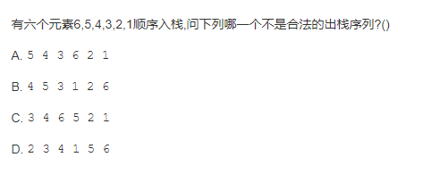

# **数据结构**

**数据结构，计算机中，存储和组织数据的方式**

# 算法

- 一个有限指令集，每条指令的描述不依赖于语言
- 接收一些输入或不需要输入
- 产生输出
- 在有限步骤之后终止
- **解决问题的方法/步骤逻辑**

# 线性结构

## 数组

数组API

```javascript

```


## 栈


- 栈（stack），它是一种受限的线性表，后进先出（LIFO）

- 其限制是，仅允许在表的一端进行插入和删除运算。这一端被称为栈顶，相对地，把另一端称为栈底。

- LIFO（last in first out）表示就是后进入的元素，第一个弹出栈空间.类似于自动餐托盘，最后放上的托盘，往往先把拿出去使用.

- 向一个栈插入新元素又称作进栈、入栈或压栈，它是把新元素放到栈顶元素的上面，使之成为新的栈顶元素；

- 从一个栈删除元素又称作出栈或退栈，它是把栈顶元素删除掉，使其相邻的元素成为新的栈顶元素。

- **函数调用栈**

  - 

  

- 

  

  

  

自定义栈

- push(element),添加到栈顶
- pop(),移除栈顶，并返回该元素
- peek(),返回栈顶元素
- isEmpty()，栈中没有元素时返回true
- size()，栈里的元素个数
- toString()，栈里的结构以字符串的形式返回

```javascript

//基于数组
function  Stack(){
    //空数组
    this.items=[];
  
}
  //
    Stack.prototype.push=function(element){
        this.items.push(element);
    }
    //
    Stack.prototype.pop=function(){
       return  this.items.pop();
    }
    //
    Stack.prototype.peek=function(){
        return this.items[this.items.length-1]
    }
	//
	Stack.prototype.isEmpty=function(){
        return this.items.length==0
    }
	//
	Stack.prototype.size=function(){
        return this.items.length
    }
//
	Stack.prototype.toString=function(){
        var resultString=''
        for(var i=0;i<this.items.length;i++){
            resultString+=this.items[i]+ ' '
        }
        return resultString;
    }
var stack=new Stack();
stack.push(10);
stack.push(100);
stack.push(1000);
stack.push(10000);
alert(stack);

stack.pop();
stack.pop();
alert(stack);

alert(stack.peek());
alert(stack.size())
alert(stack.isEmpty());
//基于链表，JS中没有自带链表结构
```

栈的应用

```javascript
//十进制转二进制
//将十进制数字和2整除，直到结果为0
function dec2bin(decNumber){
    var stack=new Stack()
    //循环
    while(decNumber>0){
        //获取余数存入栈中
        stack.push(decNumber %2 );
        
    }
    var binaryString=''
    //取出栈中的0和1
    while(!stack.isEmpty()){
        binaryString+=stack.pop();
    }
    return binaryString; 
    
}
//test
alert(dec2bin(100))
alert(dec2bin(10))
alert(dec2bin(1000))


```


## 队列

- 队列（Queue），它是一种受限的线性表，先进先出（FIFO First In First Out）
- 受限之处在于它只允许在表的前端（front）进行删除操作
- 而在表的后端（rear）进行插入操作

自定义队列

```javascript
//基于数组

//击鼓传花

//基于链表

//enqueue(element),队尾添加一个或多个元素

//dequeue()，移除最前面的第一项，并返回该元素

//front()，返回最前面的第一项。类似Stack的peek()

//isEmpty(),队列不包含任何元素，返回true

//size()，队列包含的元素个数

//toString()，将队列的内容，转换为字符串形式

```

优先级队列

```javascript

```

队列的应用

```javascript

```


## 链表

链表原理

自定义链表

双向链表


# 哈希表

# 树结构

# 图结构

# 排序&搜索

