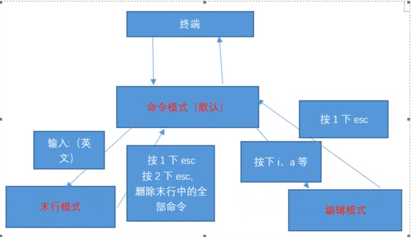
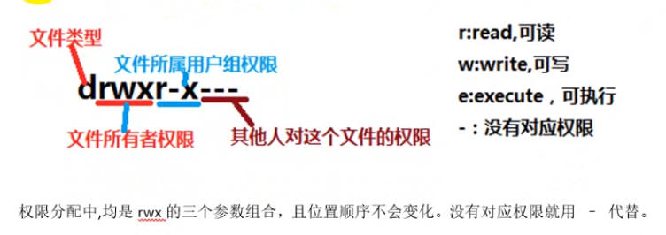
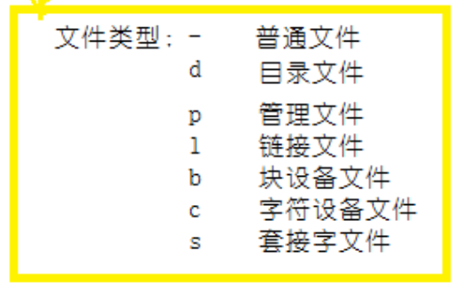
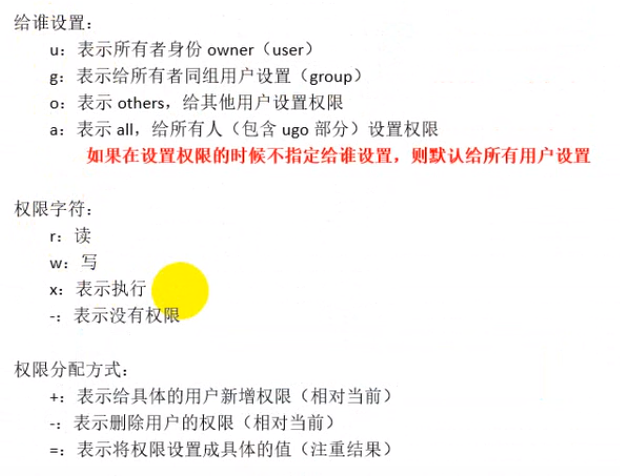
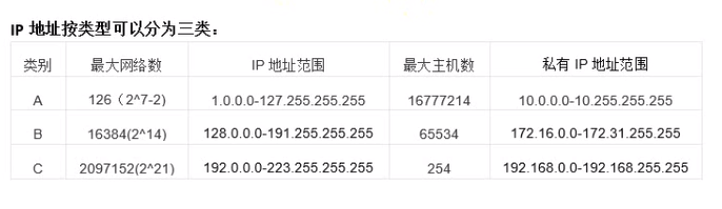
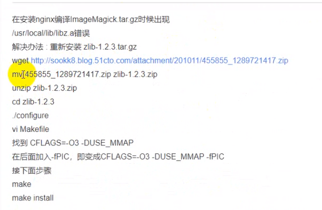

# 终端terminal

1. 关机
   - 正常关机   shutdown -h now 
   - 关闭内存  halt
   - init  0    (有局限性)

# 文件和文件夹

- bin，全称binary，存储二进制文件，可运行
- dev，存放外接设备
- etc，存放配置文件，
- home，存放除root用户以外的账户信息
- proc，存放系统运行的进程
- root，root用户的信息
- sbin，全程super binary,存放有super权限的二进制文件
- tmp，存放临时文件
- usr，存放用户安装的软件
- var，存放系统/软件的日志文件
- mtn，外接设备的挂载目录

# 基础指令

1. 命令通用格式：  指令 【选项】 【对象】

   - 一个指令包含多个选项和多个对象

2. ls

   

   - -l 路径，列表形式
   - -la 路径，列表形式包含隐藏文件
   - -lh 路径， 列表形式可读性好

3. cd  切换命令

   - cd ~  切换到当前用户的home目录
   - cd - 切换到之前的目录

4. pwd :打印当前路径

5. mkdir 路径或文件夹

   - 不允许同名文件夹。蓝色，文件夹；绿色，权限可执行文件
   - 创建目录
   - -p 选项，依次创建文件夹
   - 路径1 路径2  创建多个文件夹

6. touch

   - touch 不能创建文件夹
   - 创建文件
   - 路径1 路径2  创建多个文件

7. mv 需要移动的路径  新路径

   - 源文件已经不存在了

8. rm 删除文件或文件夹

   - -f  强制删除
   - -r 删除文件 

9. vim 文件路径

   - :q 退出
   - :q! 强制退出

10. cp  复制的路径   保存的路径

   - -r 复制文件夹

11. 输出重定向

    - 覆盖输出 >
    - 追加输出 >>

12. cat 打开文件路径

    - 路径1 路径2 ...  > 合并到新文件

# 进阶指令

1. df 查看磁盘空间
   - df
   - df-h  可读性高
2. free 查看内存使用情况
   - free
   - free -m,free -g, 可读性高
3. head，默认显示前十行内容
   - head -n  文件路径 显示文件的前n行内容
4. tail，默认显示后十行内容
   - tail  -n  文件路径 显示文件的后n行内容
   - tail -F    查看文件的动态变化
   - ls -l  > 文件路径，通过管道来实现。
5. less，较少内容输出，辅助键查看内容
   - less  文件路径
6. wc 统计文件内容信息
   - wc -lwc 文件路径
   - l,行数；w,单词数;c,字节大小
7. date , 操作时间和日期，shell指令
   - date,当前时间
   - utc,当地时间;cst,
   - date +%F  年月日
   - date  '+%Y-%M-%D'
   - date  '+%F  %T'
   - date '+%Y-%m-%d %H:%M:%S'
   - date -d '-1 day' '+%Y-%m-%d %H:%M:%S'
   - 可选，day,month,year等
8. cal  操作日历
   - cal  日历
   - cal -1
   - cal -3 
   - cal -y 年份
   - cal -s
   - cal -m
9. clear/ctrl+l  清屏，包括命令
10. 管道
    - 管道符 |  ，用于过滤，扩展处理
    - ls  /|grep y   
    - cat 文件路径| less
    - ls / | wc -l

# 高级指令

1. hostname  操作主机名

   - hostname
   - hostname -f  FQDN全限定域名

2. id   查看用户的基本信息

   - id
   - id 指定用户名
   - /etc/passwd
   - /etc/group

3. whoami

   - 当前登陆的用户名

4. ps -ef   查看进程信息

   - -e 等价于-A ,列出全部进程
   - -f,显示全部的列
     - UID，用户ID
     - PID，进程ID
     - PPID，父级进程
     - STIME，启动时间
     - TTY，发起该进程的终端设备
     - TIME，进程执行时间
     - CMD，进程的路径或名称
   - ps -ef |grep 进程名称

5. top  查看服务器的进程占用资源

   - 按下M可以按照内存排序
   - 按下P按照cpu使用率排序
   - 按下1按照cpu个数展开

   - 按下q退出
   - PID，进程ID
   - USER，进程对应的用户
   - PR，进程优先级
   - VIRT, 虚拟内存
   - RES，常驻内存
   - SHR，共享内存
   - COMMAND，进程的名称

6. du -sh 查看目录的真实大小

   - du -s  路径 显示汇总的大小
   - du -h  路径 可读性高
   - du -sh /etc

7. find 查找文件

   - -name    选项的值  路径范围
   - -type   选项的值  路径范围
     - -表示文件需要使用f来替换
     - d表示文件夹
   - find / -name httpd.conf 
   - find /etc -name *.conf
   - find /etc -name *.conf |wc -l
   - find /etc  -type f 
   - find /etc -type d
   - find /etc -name ".*" -ls
   - find /etc  -type f -iname ".*" -ls

8. service 服务操作

   - sevice 服务名  start/stop/restart
   - ps -ef |grep httpd

9. kill 

   - ps -ef|grep 进程名称

     kill 进程ID

   - killall 进程名称

10. ipconfig或 ip addr 

    -  获取网卡信息

11. reboot 重新启动计算机

    - reboot -w  模拟重启但不重启（写入开关机的日志信息）

12. shutdown  关机

    - shutdown -h now
    - shudown -h 定时时间  '关机提示'
    - ctrl+c 在centos7之前 可以退出关机
    - shutdown -c 在cenos7之后可以使用退出关机

13. uname 获取操作系统信息

    - uname -a  获取全部系统信息

14. netstat-tnlp 网络连接状态

    - -t 只列出tcp协议的连接
    - -n 列出IP地址和端口
    - -l  仅显示state中值为LISTEN的链接
    - -p 显示进程PID和进程名称

15. man 手册（manual)

    - man 命令名  
    - 退出按下Q
    - man cp

16. uptime 输入持续在线时间

    - load average 表示负载

# 练习

```javascript
//重启系统
reboot
//快速删除光标前后的内容
ctrl+u ctrl+k
//删除/tmp下的所有A开头的文件
rm -f /tmp/A*
///etc/passwd备份到/tmp目录下
cp /etc/passwd/ /tmp/
//查看最后创建的3个用户
tail -3 /etc/passwd
//统计当前系统中的账户
wc -l /etc/passwd
//创建/tmp/test.conf文件
mkdir tmp
cd tmp/
touch test.conf
//查看/etc/passwd的头3行和尾3行
head -3 /etc/passwd
tail -3 /etc/passwd
//一次性创建目录/text/1/2/3/4
mkdir -p /text/1/2/3/4
//回到家目录
cd ~ 或cd
//查看/etc目录下的磁盘空间
du -sh /etc
//删除/tmp下的所有文件
rm -rf /tem/*
//启动apache服务，并验证是否成功
service httpd start
ps -ef|grep httpd
//杀死apache进程
killall httpd


```

# VIM

1. 模式切换

   

   ``````javascript
   //保存
   :w
   //另存为
   :w  路径
   //退出
   :q 
   //保存退出
   ;wq
   //强制退出
   :q!
   //调用外部命令
    :! ls或其他命令
   ``````

   

2. 命令模式（默认）不能编辑文件

   ```javascript
   //vim +数字 文件    打开文件并定位指定行
   //vim +/关键字 文件  打开文件并高亮关键字
   
   //visudo 打开sudo配置文件，输入/关键字 可以定位关键字所在行
   
   //行首 shift+6 （^)
   //行尾 shift+4 ($)
   //首行 gg
   //尾行 G
   //翻屏上 ctrl+b (before向前)
   //翻屏下 ctrl+f （after 向后）
   //复制行包含当前行  数字连接上yy
   //粘贴行  p   (paste 粘贴)
   //可视化复制 ctrl+v 按下箭头可以选中，按下yy复制，按下p 粘贴
   //删除或剪切   dd
   //指定删除  数字dd
   //删除并且下一行不上移 D
   //撤销   输入:u或者u  (undo 撤销)
   //取消撤销    ctrl+r
   //快速移动  数字G
   //快速移动n行  数字 使用方向键
   //快速左右移动 数字 使用左右方向键
   //末行模式快速移动  按下冒号进入  数字 按下回车
   
   ```

   

3. 编辑模式，可以编辑

   ```javascript
   //进入方式
   //i，insert，光标所在字符前开始插入
   //a,after,光标所在字符后开始插入
   //S,删除光标所在的行并插入
   //退出方式 esc按键
   
   ```

   

4. 末行模式，搜索，替换，保存，退出，撤销，高亮等

   ```javascript
   //搜搜
   /关键词
   //切换搜索结果
   N/n
   //取消高亮
   :nohl  (no highlight)或  :noh
   //替换光标处第一次搜索的结果
   :s/搜索关键词/替换内容  (string replace)
   //全行替换
   :s/搜索关键词/替换内容/g
   //替换全局每行第一个符合的结果
   :%s/搜索关键词/替换内容/
   //全局替换
   :%s/搜索关键词/替换内容/g
   //显示行号
   :set nu
   //取消行号
   :set nonu
   //打开多个文件并切换.%a(active)表示当前打开的文件，# 表示上一个打开的文件
   :files  然后 :open 文件名称 或  :bn (切换下一个back next) :bp(切换上一个 back prev)
   ```

   

5. 代码着色

   ``````javascript
   //关闭
   ：syntax off
   ``````

   

6. 计算器

   ``````javascript
   //进入编辑模式，并按下ctrl+r.输入=号，输入计算内容并回车
   ``````

   

7. 其他

   ``````javascript
   //vim配置文件
   //个人配置文件可以创建
   ~/.vimrc
   //全局配置文件
   /etc/vimrc
   //设置行号和着色
   set nu
   syntax on
   //异常退出
   删除交换文件
   //别名机制，~/.bashrc
   alias cl='clear'
   //然后重新登陆后生效 source restart 或source .bashrc
   
   //保存退出，：x在没有修改的时候，文件修改时间不变
   :x
   //：X 表示加密文件
   ``````

# linux自有服务

## 运行级别

1. init（initialize）进程，进程号ID是1

2. 对应的配置文件  inittab(系统运行级别配置文件) ，/etc/inittab

   ```javascript
   //
   0 关机级别
   1 单用户模式
   2 多用户模式，不联网
   3 多用户模式，可联网
   4 保留模式
   5 X11 图形化模式
   6 重启级别
   //命令，临时修改
   init 0 关机
   init 3 切换到命令行模式
   init 5 图形界面
   init 6 重启电脑
   
   
   
   ```

## 用户和用户组

1. /etc//passwd,用户的关键信息；/etc/group,用户组的关键信息；/etc/shadow, 用户密码信息

   ```javascript
   //passwd文件
   用户名：密码占位：用户ID：用户组ID：注释：对应的home目录 ：解释器shell
   //用户的主组/etc/passwd文件，附加组在/etc/group文件
   用户组名：密码占位：用户组ID：组内用户名
   ```

   

2. 用户管理

   ``````javascript
   //添加用户
   useradd 选项 用户名
   -g，指定用户的用户主组,用户组ID或用户组名
   -G，用户的附加组，
   -u,用户的ID
   -c,添加注释
   //useradd zhangsan ;useradd -g 501 -G 500 -u 666 list;
   //修改
   usermod 选项 用户名
   -g，指定用户的用户主组,用户组ID或用户组名
   -G，用户的附加组，
   -u, 用户的ID
   -l，修改用户名
   //usermod -g 500 -G 501 zhangsan; usermod -l   newwangerma zhangsan
   
   //设置密码
   passwd 用户名
   //passwd wangerma
   //切换用户,switch user。默认切换到root用户
   su [用户名]
   
   //删除用户
   userdel 选项  用户
   -r,删除用户的同时删除home目录
   //userdel -r wangerma
   //删除正在登陆的用户
   ps -ef|grep 用户名
   kill 删除其父进程的进程ID
   userdel -r 用户名
   ``````

   

3. 用户组管理

   - /etc/group文件

   ``````javascript
   //用户的主组/etc/passwd文件，附加组在/etc/group文件
   用户组名：密码占位：用户组ID：组内用户名
   //添加
   groupadd 选项 用户组名
   -g ,设置用户组ID
   //groupadd  Administrators
   //编辑
   groupmod 选项 用户组名
   -g ,设置用户组ID
   -n ,设置新的用户组名称
   //groupmod -g 502 -n admins Administrators
   //删除
   groupdel 用户组名
   //删除的组属于某个用户的主组时，需要先移除组内，再删除
   
   ``````

## 网络设置

1. /etc/sysconfig/network-scripts/   文件中，**ifcfg-网卡名称**

   ``````javascript
   //onboot,是否开机启动；bootproto,ip分配方式，hwaddr,硬件地址
   
   //重启网卡
   /etc/init.d/目录，服务的快捷方式
   
   /etc/init.d/network restart
   //停止网卡
   ifdown 网卡名
   //开启网卡
   ifup 网卡名
   
   //创建软连接
   ln -s 深目录  快捷方式
   
   ``````

## SSH（secure shell）

1. /etc/ssh/ssh_config 文件

   ``````javascript
   //服务启动/停止/重启
   service sshd start /stop/restart
   ``````

2. pscp.exe

   ``````javascript
   //xshell工具自带文件传输
   ``````

   

## 设置主机名

``````javascript
//临时主机名。切换用户之后生效
hostname 新主机名
su  之后生效
//永久设置，需要重启
/etc/sysconfig/network 文件
 修改hostname字段
 //ect/hosts文件 是Linux的hosts文件

``````

## chkconfig

``````javascript
//开机启动服务查询 ,各个模式下的开启状态
chkconfig --list 
//删除服务
chkconfig --del 服务名

//添加开机启动服务
chkconfig --add 服务名

//指定开机启动再3，5模式下
chkconfig --level 35  服务名 on或off
//chkconfig --level 35  httpd on 
//chkconfig --level 5 httpd off 

``````

## ntp 时间同步

```javascript
//同步时间
ntpdate 时间服务器的域名或IP地址
//设置时间同步服务
service ntpd start  或/etc/init.d/ntpd start
//设置开机启动
chkconfig --list |grep ntpd
chkconfig --level 35 ntpd on 
//systemctl list-dependencies

```

防火墙

``````javascript
//centos 6 iptables
//centos 7 firewalld

///etc/init.d/iptables  start/restart/stop

//chkconfig --list | grep iptables

//查看iptables的状态 centos7.x是 systemctl status firewalld.service
service iptables status

//查看规则 centos7 :systemctl --list-all
iptables -L -n
-L,列出规则
-n,单词表达形式改成数字形式显示

//设置防火墙规则

//保存规则
/etc/init.d/iptables save

``````

rpm管理

``````javascript
//查找己安装软件包的命令
rpm -qa|grep 关键字
-a,全部
-q,查询

//卸载
rpm -e 软件名

//强制卸载
rpm -e 软件名 --nodeps

//安装
rpm -ivh 软件包完整名称
-i ,安装
-v ,显示进度条
-h ,显示#进度条

//查看块状设备 （list block devices ):MountPoint 挂载点
lsblk
//解挂载
umount 挂载点
//挂载
mount 设备原始地址（统一在/dev下，依据name确定）  目标挂载点（/mnt下边）
``````

## cron/crontab计划任务

- 任何用户可以创建自己的计划任务

- 禁用 配置文件： /etc/cron.deny 文件

  ``````javascript
  //一行一个被禁用计划任务的用户名
  
  ``````

- （优先级高）允许配置文件 /etc/cron.allow 文件，需要自行创建

  - 一行一个允许执行计划任务的用户名

``````javascript
//列出
crontab 选项
-l,list,列出指定用户的计划列表
-e,edit,编辑计划列表
-u,user，当前用户或指定用户
//编辑
//一行一个计划，分 时 日 月 周  执行的命令
0 0 * * * reboot
//取值范围
分：0~59，
小时：0~23，
日：1~31
月：1~12
周：0~6，0表示周日
//四个符号
* 表示取值范围中的每一个数字
- 区间表达式
/ 表示每多少个
, 表示多个取值
//每月1，10，22号的4：45 重启服务
45 4 1，10，22， * * service network restart
//每周六，周日的1：10重启服务
10 1 * * 6，0 service network restart
//每天18：00到23：00，每隔30分钟重启service
*/30 18-23 * * * service network restart
//每隔两天的上午8点到11点的第3和第15分钟执行一次重启
3，15 8-12 */2 * * reboot
//每1分钟 向home目录的RT.txt中输入时间信息
*/1 * * * * date +'%F %T'>> /root/RT.txt
*/1 * * * * ls ~>> /root/RT.txt


``````

# 权限管理

1. 权限
   - read ，列出目录机构和查看文件内容
   - write，删除，移动，创建，移动文件夹和编辑文件
   - execute，执行权限
2. 身份
   - owner，默认文件的创建者
   - group，同文件所有者的同组用户
   - others，撇除了文件所有者和同组用户的其他用户
   - root，最高权限

## 权限指令









``````javascript
// 查看权限
ls -l 等价于ll

//设置权限，文件所有者或者root才能设置权限
chmod 选项 权限模式 文档
-R 表示递归设置权限

//字幕形式设置权限
//给文件设置权限：所有者有全部权限，同组有读和执行，其他有只读
chmod u+x，g+rx,o+r 文件名
或 chmod u=rwx,g=rx,o=r 文件名
//给所有人设置
chmod a=rwx 文件名
//尝试一下命令
chmod +x 文档名
chmod a=x 文档名
chmod a+x 文档名
//数字模式设置权限
//所有者可读可写可执行7，同组可读可执行5，其他可读4
chmod 754 文件
//不合理的权限设置，可写可执行但不可读；2和3的出现往往不合理（可写可执行，可写不可执行）
chmod 731 文件

//755 的文件夹下，有777的文件。该文件可读可写但是不能删除该文件

``````

- 属主和属组

```javascript

//修改属主
chown 指定的属主名 文档路径
-R 修改文件夹需要加-R

//修改所属用户组
chgrp 指定的用户组 文档路径
-R 修改文件夹需要加-R

//同时修改用户和用户组
chown 用户名：用户组 文档路径
-R 修改文件夹需要加-R

```

- 其他

```javascript
//sudo  (switch user do)
//配置sudo文件 /etc/sudoers 文件

//打开sudo文件
visudo 
 
//配置  如 root  All=(All)  All   用户组的表示  %user  All=(All)  All
用户名 允许登陆的主机=(以某某的身份执行)  当前用户可以执行的命令

//sudo规则，写命令的完整路径（which 命令）
test All=(All)   which查出的命令1路径,which查出的命令2路径,which查出的命令3路径,!/usr/bin/passwd root

//设置sudo规则后，执行命令，输入当前用户的密码
sudo  执行的命令 

//sudo之后，修改了root的密码
test All=(All) !/usr/bin/passwd, /usr/bin/passwd [A-Za-z]*,!/usr/bin/passwd root

//查看特殊权限
sudo -l

```

# 网络管理

- IP是32位，MAC是48位（十六进制）
- 网络寻址地址，IP是第三层网络层，MAC是第二层数据链路层




``````javascript
//ping命令
ping 主机名或域名或IP
//netstat 连接信息
netstat -tnlp 

netstat -an 


//traceroute 查找目标主机所有网关
traceroute 域名或IP
//window下，tracert 敏玲


//arp地址解析，根据IP获取物理地址的协议
//查看本机缓存的mac地址
arp -a 
//删除
arp -d 指定删除的mac地址

//tcpdump 抓包
tcpdump 协议 port 端口号
tcpdump 协议 port 端口  host 地址
tcpdump -i 网卡设备名


``````

# Shell

```javascript
// 更改shell解释器，可以指定用户不能登陆
usermod -s /sbin/nologin 用户名 

//#!/bin/bash ,指定解释器，#代表注释,sh为后缀； ;可加不可加，

//添加执行权限 
chmod +x 文件名.sh
//执行
./文件名.sh或绝对路径或/bin/bash 脚本路径

//创建test2.sh文件，实现一个shelltest用户，再家目录创建文件

#！/bin/bash
useradd shelltest;
touch /home/shelltest/try.html


```


1. 变量

```javascript
//使用 变量名=变量值 定义，$变量名来使用
//等号左右不能有空格
//双引号可以解析变量，实现转义；单引号不解析变量
//数字和字符一起输出，需要使用引号引起来

//``反引号使用外部命令
#!/bin/bash
dt=`date +'%F %T'`
echo $dt

//readonly 只读变量
#！/bin/bash
a=10
readonly a
a=20
echo $a


//接收用户输入 read -p 提示信息 变量名
#!/bin/bash

read -p '请输入文件路径：'  filepath

touch $filepath
echo '创建成功：'
ls -l $filepath

//删除变量 unset 变量名

#！/bin/bash
a=30
echo $a
unset a
echo '删除变量后'
echo $a
echo '输出删除变量后'


```

条件判断

```javascript
//多行
if [condition]

then command1
	 command2
     ……
else
    command
fi
//单行
if[condition];then command; fi
//多条件
if [condition1]
then
	command1
elif [condition2]
then
	command2
else
    commandN
fi
```

运算符

```javascript
//条件表达式放在方括号之间，并且有空格。
+，-，*，/，%，=，==，！=
//表达式和运算符之间有有空格
`expr 2 + 2`
`expr 5 - 3`
//*需要转义
`expr 2 \* 25`
`expr 3 / 2`
`expr 5 % 2`
`[expr 5 == 2]`
`[expr 5 != 2`

//shell 计算器

//关系运算符只支持数字或值为数字的字符串
//-eq 相等，-ne不相等，-gt,左边大于右边，-lt,右边大于左边，-ge,大于等于右边，-le小于等于右边
//equal,not equal,great than,less than,great than or equal,less than or equal
#!/bin/bash
a=10,
    b=20,
    echo "a=$a"
	echo "b=$b"
if [$a -eq $b]
then
	echo 'a=b'
elif [$a -ne $b]
then
	echo 'a -ne b'
elif [$a -gt  $b]
then
	echo 'a -gt b'
else
    echo 'a 不等于 b'
if
```

逻辑运算符

```javascript
//非运算 !
[! false]

//或运算-o
[10 -lt 20 -o 10 gt 100]

//与运算 -a
[ 10 -lt 20  -a 10 gt 1000]
```

字符串运算符

```javascript
// = 相等
[ '10' = '20' ]

// != 不相等
[ '10' != '20']
 
// -z 长度是否为0
[ -z '10' ]
// -n 长度不为0 返回true
[ -n '10']
// str 是否为空
[ '10']
```

文件测试符

```
// -b file 是否块设备
[ -b file]

//-c file 是否字符设备
[ -c file]

// -d file 是否是目录
[ -d file ]

// -f file  是否是普通文件（）
[ -f file ]
// -r file 是否可读
[ -r file]
//-w file  是否可写
[ -w file ]
//-x file 是否可执行
[ -x file]
// -s file 是否为空，文件大小为0，不为空返回true
[ -s file]
// -e file 目录或文件是否存在
[ -e file ]
```

附带参数

```javascript
//$数字，表示传入的参数  数字从0开始
```

# 数据库mysql

```javascript
//确保时间准确


//源码包
tar -zxvf *.tar.gz
tar -jxvf *.tar.bz2
-z或--gzip或--ungzip:通过gzip指令处理文件
-x或--extract或--get ：从文件中还原文件
-v：显示操作过程
-f或--file，指定一个文件
-j：支持bzip2解压文件
//cd 源码目录，配置，编译，安装
cd  源码目录

//配置 配置命令有config或configure或bootstrap
./configure --prefix=/usr/local/ncurses
//编译安装 make或 bootstrap  make install 或bootstrap install
make && make install

--prefix= 指定安装目录
--with-PACKAGE 报名=需要的依赖的目录
--without-PACKAGE 包名


//二进制包rpm
//查找己安装软件包的命令
rpm -qa|grep 关键词
//卸载软件/强制卸载
rpm -e 关键字 [--nodeps]
//安装软件
rpm -ivh 完整名称
//更新软件
rpm -uvh 完整名称
//查找文件属于哪个包
rpm -qf 文件路径

//lynx 命令行浏览器
lynx --dump 网址


//yum安装
//列出已安装和可安装软件列表，需要联网
yum list
//搜索软件包
yum search 软件包
yum [-y] install 包名
yum [-y] update 包名
yum [-y] remove 包名
-y, 默认全部同意，不建议加该选项
//
yum install firefox 


//mysql服务端 3306端口号
yum install mysql-server

//mysql初始化
service mysqld start
mysql_se  然后按下tab案件
//执行
mysql_setpermission

//数据库目录： /var/lib/mysql
//配置文件：/etc/my.cnf
//登陆
mysql -u 用户名 -p 密码
//退出
exit
```

## 数据库操作

- msyql 不区分大小写
- 行尾加分号

```javascript
//列出所有数据库
show databases;
//创建数据库
crete database 库名;
//删除数据库
drop database 库名;
//切换到数据库
use 库名;


//表操作
use 数据库名

//列出所在数据库的所有表
show tables;
create table 表名称
（
	列1 数据类型 ，
    	列1 数据类型 ，
        	列1 数据类型 
            ...
            primary key(列名)
）
//数据类型
int,char(定长),varchar(不定长)等
//列的特性
not null,auto_increment
//查看表结构
desc 表名;
//删除表
drop table [if exists] 表名;
//创建表
create table xg(
	id int(11) not null auto_increment,
    username varchar(20) ,
        password char(32),
            primary key(id)

);

//字段操作
//插入字段

insert into 表名 values (值1，值2);
insert into 表名（列1，列2，列3） values (值1，值2，值3);
//

insert into xg(`username`,`password`) values ('zhangsan','123456');

//查询记录
select 列名称 from 表名 where 条件;

//更新记录
update 表名 set 列1=值1，列2=值2 where 列名称=值;
update xg set password=666666,username=666666 where id>=1
//删除记录
delete from 表名 where 列名=值;
delete from xg where id=2;
 

```

备份和还原:

``````javascript
//命令行下进行
//全量备份
mysqldump -uroot -p明文密码 -A >备份文件路径.sql

//指定库备份
mysqldump -uroot -p明文密码 库名 > 备份文件路径.sql

//多个库备份
mysqldump -uroot -p明文密码 --databases 库1 库2 >备份文件路径.sql
//每一分钟自动备份一次
#!/bin/bash
filename='test_'`data`+'%Y%m%d%H%M%S''.sql'
mysqldump -uroot -p密码 test>/root/$filename
//计划任务执行脚本
#分 时 日 月 周
* * * * * /root/test.sh


//还原

//mysql命令行下的source，需要指定数据库use 库名或create database 库名;
srouce < 备份文件路径

//系统命令行
mysql -uroot -p密码 库名 <备份文件路径\

//设置mysql连接字符集,mysql命令行
set names utf8;


//远程连接mysql
//B/C管理工具，PMA
//C/S管理工具，navicat,mysql workbrach

//允许mysql远程登陆
use mysql
select host,user,password from user;
//修改其中一条记录的host为%
update user set host='%' where host='某某';
//刷新权限表,mysql命令行
flush privileges;


``````

# Nginx



```javascript
//默认下载到当前目录 /usr/local/src
wget 地址 
//解压
tar -zxvf 地址
cd 目录
//编译
 ./configure --prefix=/usr/local/nginx
//安装 pcre模块
yum install pcre-devel
.configure --prefix=/usr/local/nginx --with-pcre=pcre包路径或者不写让系统自己找
//安装 zlib模块
yum install zlib-devel
//zlib源码包
wget zlib源码包
.configure --prefix=/usr/local/nginx --with-pcre --with-zlib=zlib源码包路径

//nginx启动命令
/usr/local/nginx/sbin/nginx 

//重启nginx配置文件
/usr/local/nginx/sbin/nginx -s reload 
//停止nginx服务
netstat -tunlp |grep 80
ps -ef|grep nginx
kill 进程号 
//卸载编译软件，必须先停止其服务
rm -rf 软件安装目录


//查找是否安装gcc
yum list installed |grep cc


//端口占用
netstat -tunlp |grep 80


```


# LAMP

- LAMP:  linux + Apache +mysql+PHP
- LNMP:  linux+nginx+mysql+php-fpm
- LNMPA: linux+nginx+mysql+php+apache 

```javascript
//php+apache
yun install php
service httpd start
//无法确定FQDN的错误，修改apache文件
find / -name httpd.conf
//搜索ServerName 去掉注释

//默认的站点目录/var/www/html
<?php
phpinfo();


//查看最大进程数 sysctl kernel.pid_max
//ps -eLf | wc -l查看进程数
//修改最大进程数后系统恢复
//echo 1000000 > /proc/sys/kernel/pid_max

//永久生效
//echo "kernel.pid_max=1000000 " >> /etc/sysctl.conf
//sysctl -p

//mysql
yum install mysql-server
service mysqld start
mysql_se 按下tab补全，回车
//修改127的host
update user set host='%' where host='127.0.0.1';
//刷新权限
flush privileges;
//赋予权限
chmod 777 -R  /var/www/html

//安装mysqli_connectR
yum install php-mysqli

//重启apache
service httpd restart

```


vps

```javascript
yum install -y wget && wget https://www.gzj2001.com/shell/Gbench.sh && bash Gbench.sh

```

