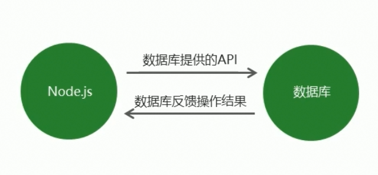
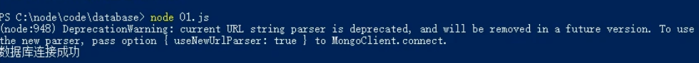
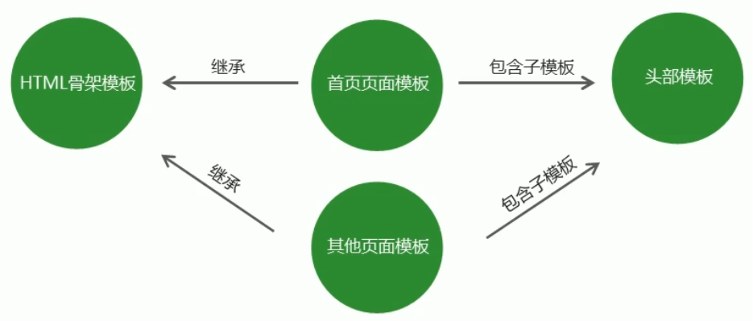

# 数据库



# MongoDB

 MongoDB compass 图形化界面

# 相关概念

## database

mongoDB可以建立**多个数据库**

## collection []

**集合，一组数据的集合，理解为JS中的数组**

## document {}

**文档，一条具体的数据，理解为JS中的对象**

## field 

**字段，文档中属性的名称，理解为JS中的对象的属性**

## Mongoose第三方包

1. 安装 ：**npm i mongoose** 
2. 启动mongoDB,**net start mongoDB**

## 数据库连接

1. **27017是mongoDB的默认端口**

2. 不用显式的创建数据库，会自动创建

   - mongoose.connect('**mongodb://localhost/playground**')

   ```javascript
   const mongoose=require('mongoose');
   mongoose.connect('mongodb://localhost/playground',{useNewUrlParser:true})
   		.then(()=>{console.log('success')})
   		.catch((err)=>{console.log('field：'+err)})
   //现有版本
   const mongoose=require('mongoose');
   mongoose.connect('mongodb://localhost/playground',{useNewUrlParser:true, useUnifiedTopology: true })
   		.then(()=>{console.log('success')})
   		.catch((err)=>{console.log('field：'+err)})
   
   
   ```



​	错误提示的解决

```javascript
mongoose.connect('mongodb://localhost/playground',{useNewUrlParser:true})//补充新的解析器
```

​	


## 创建集合

1. **对集合设定规则,Schema函数**

   - **String首字母大写**

   ``````javascript
   const courseSchema=new mongoose.Schema({
   	name:String,
       author:String,
       isPublished:Boolean
   })
   ``````

   

2. **创建集合，将mongoose.Schema构造函数的实例即可创建集合。**

   - model函数
   - **集合首字母大写（数据库里的名称式小写+S形式）**
   - **没有创建文档的情况下，默认不会创建数据库和集合**

   ``````javascript
   const Course=mongoose.model('Course',courseSchema)
   ``````

## 创建文档

1. 实际上是向集合中插入数据

   - **mongoose.model(集合名称，集合规则schema)**

   - 创建集合实例，实例本身是构造函数用来插入数据对象

   - 调用实例对象下的save方法将数据保存到数据库中

   - **_id 是数据库的默认创建的唯一标识**

     ```javascript
     const Coure=mongoose.model('Course',courseSchema)// 创建集合
     //按照Schema函数的规则插入数据对象
     const course=new Course({
         name:'node.js基础',
         author:'teacherNo1',
         isPublished:true
     });
     //保存到集合
   course.save();
     ```
     
   - **hobbies:[String]形式的规则表示数组的元素都是字符串**

2. 创建文档的另一种方式集合对象的create函数，**create(配置对象，callback)**

   ``````javascript
   //创建集合，Course集合在数据库中显示为小写形式+s
   const Course=mongoose.model('Course',courseSchema)
   //配置对象和回调函数
   Course.create({name:'javascript base',author:'teacherNo2',isPublish:true},(err,doc)=>{
   	//错误对象
   	console.log(err);
   	//插入的文档
   	console.log(doc);
   })
   ``````

   

3. MongoDB中，两种接收异步API:

   - **create函数返回promise对象；**
   - 回调函数实现异步API

   ``````javascript
   Course.create({name:'javascript advanced',author:'teacherNo3',isPublish:true})
   		.then(doc=>console.log(doc))
   		.catch(err=>console.log(err))
   ``````

   

## 数据库导入数据

1. 命令    **mongoimport  -d  数据库名称  -c  集合名称  --file  要导入的数据文件**
   - **配置系统变量Path**     C:\Program Files\MongoDB\Server\4.2\bin

## 查询文档

1. 根据条件查找文档，

   - **条件对象为空则查找所有文档.**find()返回文档的集合，**即返回数组**

   - **find({条件对象}),返回数组或空数组**
   - **findOne(条件对象)，默认返回当前文档的第一条文档**。**返回一个对象**

   ``````javascript
   User.find().then(result=>console.log(result));
   ``````

   

2. 匹配大于 小于

   - $gt表示大于

     ```javascript
     User.find({age:{$gt:20,$lt:40}}).then(result=>{console.log(result)})
     ```

   - $lt表示小于,less than

   - $gte表示大于等于,greater than  equal

   - $lte表示小于等于,less that equal

   - $eq表示等于 equal

   - **$in表示包含,数组对象**

     ```javascript
    User.find({hobbies:{$in:['敲代码']}}).then(result=>{console.log(result)}
     ```
   
   - $ne  (不等于)
    
   - $nin  (not in)，**数组对象**
   
     
    
     
    
   - **select（'条件字段1   条件字段2'）**
   
     ``````javascript
    User.find().select('name email').then(result=>{console.log(result)})
     ``````
    
     
   
   - select(**'条件字段1  条件字段2   -字段名称'**)   **-短杠前缀的字段会被忽略**

     ``````javascript
    User.find().select('name email -_id').then(result=>{console.log(result)});
     ``````
    
     
   
   - sourt(**' 排序字段'**)排序，sort(**'-排序字段'**) **-短杆前缀的字段会倒序排列**

     ``````javascript
    User.find().sort('age').then(result=>{console.log(result)})
     //降序排列
    User.find().sort('-age').then(result=>{console.log(result)})
     ``````
   
   - skip(指定跳过的数据数量）limit(指定限制查询的数量) 
   
     ```javascript
    User.find().skip(2).limit(2).then(result=>{console.log(result)})
     ```
    
     

## 删除文档

1. 删除单个**findOneAndDelete({条件字段对象})**，**返回删除的文档对象**

   - 如果匹配了多个文档**，将会删除第一个匹配的文档**

   ``````javascript
   User.findOneAddDelete({_id:'XXXXXXXX'}).then(result=>{console.log(result)})
   ``````

   

2. 删除多个deleteMany({条件对象})

   - <font color='red' >deleteMany()条件对象为空时，默认会删除当前集合下的所有文档。</font>
   - 返回值是对象：**{n:删除文档的数量，ok:删除状态码}**

   ``````javascript
   User.deleteMany({}).then(result=>{console.log(result)})
   ``````

   


## 更新文档

1. 更新单个  **updateOne({条件对象}，{要修改成的对象}）**

   - 返回值对象：**{n:影响的数量，nModified:更新的文档数量, ok:更新状态码}**

     ``````javascript
     User.updateOne({name:'李四'},{name:'王五'}).then(result=>{console.lgo(result)})
     ``````

     

2. 更新多个  **updateMany({条件对象}，{要修改成的对象}）**

   - **条件对象为{},表示更新所有的文档**
   - 返回值对象：**{n:影响的数量，nModified:更新的文档数量, ok:更新状态码}**

   ```javascript
   User.updateMany({}，{name:'王五'}).then(result=>{console.log(result)})
   ```

## mongoose验证

1. 创建集合规则时，可以设置当前字段的验证规则，验证失败则输入插入失败

2. **required:true** 必传字段

   - **required:[true,'自定义错误消息]**

3. **（字符串）minlength**:[数字,'自定义错误消息']

4. **（字符串）maxlength**：[数字，‘自定义错误消息’]

5. **trim：true**  , 去两端空格

6. **min**：[数字，‘自定义错误消息’]

7. **max**: [数字，‘自定义错误消息’]

8. **default**字段，表示默认值

9. **enum**:**[列举值]**，表示列举值

   - 另一种形式

     ``````javascript
       enum: {
                 values: ['html', 'javascript', 'css', 'node.js'],
                 message: '不符合列举值'
             }
     ``````

     

10. **自定义验证规则validate**

    - **message**,表示自定义错误信息。

    - catch函数中，参数err可以捕获自定义错误信息

    - **循环遍历参数err对象的errors属性，可以捕获所有错误信息**

      ``````javascript
       author: {
              type: String,
              validate: {
                    validater: v => {
                        return v && v.length > 4
                    },
                    message: '传入的值不符合验证规则'
              }
       }
      ``````
      
      ```````javascript
      //集合规则创建集合构造函数
      const Post = mongoose.model('Post', postSchema)
      Post.create({
              title: 'aa',
              age: 60,
              category: 'java',
              author: 'bd'
          })
          .then(result => {
              console.log(result);
          })
          .catch(error => {
          // erros.errors中包含了若干错误信息
              const err = error.errors;
              for (var attr in err) {
                  console.log(err[attr]['message']);
              }
          })
      ```````
      
      

## 集合关联

1. **使用id对集合进行关联**

   - **mongose.Schema.Types.objectId**是固定写法，表示ID类型
   - ref属性表示关联的第二张表

   ``````javascript
   //创建集合规则
   //用户规则
   const userSchema = new mongoose.Schema({
      name:{
          type:String,
          required:true
      }
   });
   //文章规则
   const postSchema = new mongoose.Schema({
      title:{
          type:String
      },
      author:{
          type:mongoose.Schema.Types.ObjectId,
          ref:'User'
      }
   });
   //集合规则创建集合构造函数
   //文章集合
   const Post = mongoose.model('Post', postSchema)
   //用户集合
   const User = mongoose.model('User', userSchema)
   User.create({name:'it'}).then(result=>{console.log(result)})
   Post.create({title:'123',author:'5e7ed737e07248379c96e969'}).then(result=>{console.log(result)})
   ``````

   

2. **使用populate方法进行关联集合查询**(**populate('外键字段')**)

   ```javascript
   Post.find().then(result=>{console.log(result)})
   Post.find().populate('author').then(result=>{console.log(result)})
   ```

   

3. 增删改查

   app.js

   ``````javascript
   //搭建网站服务器，实现客户端与服务区的同行
   //连接数据库，创建用户集合，向集合中插入文档
   //访问/list时候，查询所有信息
     //实现路由功能，呈现列表页面
     //查询数据库，展示数据
   //访问/add时候，呈现表单页面，并实现添加用户信息功能
   //访问/modify时候，呈现修改页面，并实现修改功能
     //增加路由，呈现页面：传递ID，查询信息并展示
     //实现修改功能: post请求，指定提交地址和请求方式；接收ID，查找数据库并修改.
   //访问/remove，呈现用户删除功能
     
   //将用户信息和表格HTML进行拼接，将拼接结果相应回客户端
   const http=require('http');
   const url=require('url');
   const querystring=require('querystring');
   const mongoose=require('mongoose')
   //数据库连接：27017是默认的端口
   mongoose.connect('mongodb://localhost:27017/playground',{useNewUrlParser:true})
   	.then(()=>{console.log('mongoDB success')})
   	.catch(()=>{console.log('mongoDB failed')})
   //创建集合规则
   const userSchema=new mongoose.Schema({
       username: {
   		type: String,
   		required: true,
   		minlength: 2,
   		maxlength: 20
   	},
   	email: {
   		type: String,
   		// 保证邮箱地址在插入数据库时不重复
   		unique: true,
   		required: true
   	},
   	password: {
   		type: String,
   		required: true
   	},
   	// admin 超级管理员
   	// normal 普通用户
   	role: {
   		type: String,
   		required: true
   	},
   	// 0 启用状态
   	// 1 禁用状态
   	state: {
   		type: Number,
   		default: 0
   	}
   });
   //创建集合，返回集合构造函数。User集合在数据库中显示为：Users
   const User=mongoose.model('User',userSchema);
   
   //创建服务器
   const app=http.createServer();
   //为服务器对象添加请求事件
   app.on('request', async (req,res)=>{
       const method=req.method;
       const {pathname,query}=url.parse(req.url,true);
       if(method=='GET'){
           if(pathname=='/list'){
               //查询数据保存在users变量中
              let users= await User.find();
               
               let list=` 
   					此处是页面上半部的HTML代码
   					
   					`;
               users.forEach((item)=>{
                   list+=`
   					tr代码的上半部
   					`;
                   item.hobbies.forEach(itemChild=>{
                       list+=`<span>${itemChild}</span>`
                   })
                   list+=`
   					tr代码的下半部
   					`;
               })
               list+=`
   					此处是页面下半部的HTML代码
   					`;
               res.end(list);
           }else if(pathname=='/add'){
               let add=`此处是/add的页面代码`;
               res.end(add)
           }else if(pathname=='/modify'){
            //findone()查找一个对象   
               await User.findOne({_id:query.id})
               let hobbies=['爱好1','爱好2']
               
               
               let modify=`此处是/modify页面代码的上半部分`;
               hobbies.forEach(item=>{
                   //includes()返回Boolean值
                  let isHobby= user.hobbies.includes(item);
                   if(isHobby){
                       modify+=`
   							<label class="checkout-inline">
   								<input type='checkbox' value='${item}' name='hobbies'                                   checked > 
   								${item}
   							</label>
   							`;
                   }else{
                       modify+=`
   	                       <label class="checkout-inline">
   								<input type='checkbox' value='${item}' name='hobbies'                                    > 
   								${item}
   							</label>
   							`;
                       
                   }
                  
                   
               })
               modify+=`此处是/modify页面代码的下半部分`
               res.end(modify);
           } else if(pathname=='/remove'){
              await User.findOneAndDelete({_id:query._id})
               res.writeHead(301,{
                   Location:'/list'
               })
               res.end();
                       
           }
       }else if(method=='POST'){
           if(pathname=='/add'){
               //接收提交信息
               let formData='';
               req.on('data',param=>{
                   formData+=param;
               })
               req.on('end', async ()=>{
                   let user=querystring.parse(formData)
                    //接收信息添加到数据库
                   await User.create(user);
                   //页面重定向
                   res.writeHead(301,{
                       Location:'/list'
                   });
                   // 响应客户端
                   res.end();
                   
               })
           }else if(pathname=='/modify'){
               //既有get,又有post请求
               //html中嵌入代码：method=/modify?id=${item._id}
               let formData='';
               req.on('data',param=>{
                   formData+=param;
               })
               req.on('end',async()=>{
                   let user=querystring.parse(formDat)
                   await User.updateOne({_id:query.id},user);
                   res.writeHead(301,{
                       Location:'/list'
                   });
                   res.end();
               })
           }
       }
       
       
   })
   
   ``````

   

   - 命令：**mongoimport -d playground -c users --file ./user.json**   导入数据

   - res.writeHead()可以重定向到指定页面 **状态码：301**

     ``````javascript
     res.writeHead(301,{
     	Location:'/list'
     })
     ``````

     


#  模板引擎

1. **模板引擎是node第三方模块**

2. **art-template模板引擎**，腾讯出品

   - **npm i art-template**

   - **const  template=require('art-template');**

   - **const html=template('模板文件路径',数据);**

   - **返回值是拼接完成的html**

     ``````javascript
     const path=require('path');
     const template=require('art-template')
     const views=path.join(__dirname,'views','index.art');
     const html=template(views,{
         name:'张三',
         age:'20'
     })
     console.log(html);
     ``````

     

## 模板语法

1. 支持 标准语法和原始语法

   - 标准语法，让模板**更容易读写**。**{{数据}}**
   - 原始语法，具有**强大的逻辑处理能力** **<%=数据%>**

2. 输出

   **标准输出 {{ 数据}} ，原始输出，<%= 数据%>**

   ```javascript
   //标准语法
   <h2>{{value}}</h2>
   <h2>{{a?b:c}}</h2>
   <h2>{{a+b}}</h2>
   
   //原始语法
   <h2><%= value%></h2>
   <h2><%= a?b:c%></h2>
   <h2><%=a+b%></h2>
   ```

   **开启解析html代码：**

   ​	**标准语法，加上@前缀  ； 原始语法,等号=改为-短杠**

   ```html
   //标准语法，加上@前缀
   <h2>{{@ content}}</h2>
   //原始语法,等号=改为-短杠
   <h2>
       <%- content%>
   </h2>
   ```

   

3. 条件判断

   ``````javascript
   //标准语法
   {{if 判断条件}}  ...显示内容...{{/if}}
   {{if 判断条件1}} 显示内容1  {{else if 判断条件2}}  显示内容2{{/if}}
   
   
   //原始语法,支持更多的js语法
   <%if(value){%> 
       显示内容 
   <% }%>
       
   <%if(value1) else if(value2){%> 
       显示内容2 
   <% }else %>
   ``````

   

   标准语法，

   ```javascript
   {{if age>20 }}
    年龄大于20
   {{else if age<15 }}
    年龄小于15
   {{else }}
     年龄不符合要求
   {{/if}}
   
   
   ```

   原始语法

   ```javascript
   <% if( age>18)  else if(age <15){%>
       年龄小于15
   <% } else {%>
       年龄不符合要求
   <% }%>
       
   ```

   

4. 循环

   **标准语法，{{each 数据}}  {{/each}}**

   - ​	**$index是当前索引，$value是当前值**

   ```html
   <ul>
       {{each users}}
       	<li>
               {{$value.name}}
               {{$value.age}}
               {{$value.sex}}
       	</li>
       {{/each}}
   </ul>
   
   ```

   **原始语法，<% for ()%>**

   ```html
   <ul>
       <% for(var i=0;i<users.length;i++){ %>
           <li>
               <%=users[i].name %>
               <%=users[i].age%>
                <%=users[i].sex%>
       	</li>
       <% } %>
   </ul>
   ```

   

5. 子模版

   - 将**公共区块抽离到单独的文件中**

   - 标准语法 :  **{{include '模板路径'}}，单标记;include后有空格**

     `````html
     {{include './header.art'}}
     `````

     

   - 原始语法 ：**<%include('模板路径')%>,include 是一个函数**

     ``````html
     <% include('./header.art') %>
     ``````

     

6. 模板继承

   

   - **模板继承可以将网站HTML骨架抽离到单独的文件中，其他页面模板可以继承骨架文件**

   - **block标记，预留位置。根据名称来区分不同的block标记。是一个双标签**

   - **extend 标记来继承模板**

     layout.art文件

     ``````html
     <head>
         {{block 'link'}} {{/block}}
     </head>
     <body>
         {{block 'content'}} {{/block}}
     </body>
     ``````

     继承的文件

     ```html
     //继承骨架
     {{extend './common/layout.art'}}
     
     //填充content的block标记
     {{block 'content'}}
     <p>
         {{msg}}
     </p>
     {{/block}}
     
     //填充link的block标记
     {{block 'link'}}
     <link rel='stylesheet' type='text/css' href='./main.css'/>
     {{/block}}
     ```

     

7. 模板配置

   - 导入变量

     **template.defaults.imports.变量名=变量值;**

     ```javascript
     //安装时间模块   npm i dateformat ,导入const dateFormat=require('dateformat')
     //dateFormat(时间,'时间的格式')
     const template=require('art-template')
     const path=require('path');
     const dateFormat=require('dateformat');
     
     const views=path.join(__dirname,'views','index.art');
     //导入模板变量
     template.defaults.imports.dateFormat=dateFormat
     const html=template(views,{
         time:new Date()
     })
     console.log(html);
     
     ```

     ```javascript
     //模板中调用变量
     {{dateFormat(time,'yyyy-mm-dd')}}// 显示 ‘2019-10-10’
     ```

     

   - 配置根目录

     **template.defaults.root=模板目录**

     配置模板后缀:     **template.defaults.extname='.art';**

     ``````javascript
     //安装时间模块   npm i dateformat ,导入const dateFormat=require('dateformat')
     //dateFormat(时间,'时间的格式')
     const template=require('art-template')
     const path=require('path');
     const dateFormat=require('dateformat');
     //设置模板的根目录
     template.defaults.root=path.join(__dirname,'views');
     //导入模板变量
     template.defaults.imports.dateFormat=dateFormat
     //设置模板后缀
     template.defaults.extname='.art';
     //设置模板后缀以后，模板的名称可以省略.art或指定为其他后缀
     const html=template('模板的名称',{
         time:new Date()
     })
     console.log(html);
     
     ``````

     

8. 档案管理

   - app.js

     router第三方模块

     - npm i router
     - 获取路由对象

     - 调用路由对象提供的方法创建路由

     - 启用路由，使路由生效

     - callback函数是必填参数

       ``````javascript
       // 引入http模块
       const http = require('http');
     // 引入模板引擎
       const template = require('art-template');
       // 引入path模块
       const path = require('path');
       // 引入静态资源访问模块
       const serveStatic = require('serve-static');
       // 引入处理日期的第三方模块
       const dateformat = require('dateformat');
       
       const router = require('./route/index');
       // 实现静态资源访问服务
       const serve = serveStatic(path.join(__dirname, 'public'))
       
       // 配置模板的根目录
       template.defaults.root = path.join(__dirname, 'views');
       // 处理日期格式的方法
       template.defaults.imports.dateformat = dateformat;
       
       // 数据库连接
       require('./model/connect');
       
       // 创建网站服务器
       const app = http.createServer();
       // 当客户端访问服务器端的时候
       app.on('request', (req, res) => {
       	// 启用路由功能，callback在请求结束后执行
       	router(req, res, () => {})
       	// 启用静态资源访问服务功能
       	serve(req, res, () => {})
       });
       // 端口监听
       app.listen(80);
       console.log('服务器启动成功');
       ``````
       

     

   - model/connect.js

     ``````javascript
     const mongoose = require('mongoose');
     // 连接数据库
     mongoose.connect('mongodb://localhost/playground', { useNewUrlParser: true })
     	.then(() => console.log('数据库连接成功'))
     	.catch(() => console.log('数据库连接失败'))
     ``````

     

   - model/user.js

     ``````javascript
     const mongoose = require('mongoose');
     // 创建学生集合规则
     const studentsSchema = new mongoose.Schema({
     	name: {
     		type: String,
     		required: true,
     		minlength: 2,
     		maxlength: 10
     	},
     	age: {
     		type: Number,
     		min: 10,
     		max: 25
     	},
     	sex: {
     		type: String
     	},
     	email: String,
     	hobbies: [ String ],
     	collage: String,
     	enterDate: {
     		type: Date,
     		default: Date.now
     	}
     });
     // 创建学生信息集合
     const Student = mongoose.model('Student', studentsSchema);
     // 将学生信息集合进行导出
     module.exports = Student;
     ``````

     

   - views/index.art

     - **serve-static 第三方模块，实现静态资源访问服务**
     - 引入serve-static模块创建服务功能
     - 调用服务并指定服务目录
     - 启用静态资源访服务功能
     - **serve(req,res,callback) ，回调函数是必填参数**

     ``````javascript
     const serveStatic=require('serve-static')
     //调用服务，指定服务目录public
     const serve=serveStatic('public')
     //服务器对象的on函数中
     server.on('request',()=>{
         //判断是否是静态资源
       serve(req,res);  
     })
     server.listen(3000);
     ``````

     

   - route/index.js

     ``````javascript
     // 引入router模块
     const getRouter = require('router');
     // 获取路由对象
     const router = getRouter();
     // 学生信息集合
     const Student = require('../model/user');
     // 引入模板引擎
     const template = require('art-template');
     // 引入querystring模块
     const querystring = require('querystring');
     
     // 呈递学生档案信息页面
     router.get('/add', (req, res) => {
     	let html = template('index.art', {});
     	res.end(html);
     })
     
     // 呈递学生档案信息列表页面
     router.get('/list', async (req, res) =>{
     	// 查询学生信息
     	let students = await Student.find();
     	console.log(students);
     	let html = template('list.art', {
     		students: students
     	})
     	res.end(html)
     })
     // 实现学生信息添加功能路由
     router.post('/add', (req, res) => {
     	// 接收post请求参数
     	let formData = '';
     	req.on('data', param => {
     		formData += param;
     	});
     	req.on('end', async () => {
     		await Student.create(querystring.parse(formData))
     		res.writeHead(301, {
     			Location: '/list'
     		});
     		res.end()
     	})
     });
     
     module.exports = router;
     ``````


   


