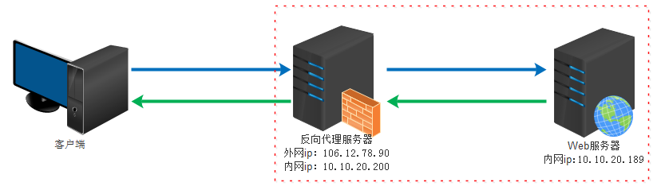

# 特点

1. 占用内存少，高并发能力

# 反向代理

1. 用作正向代理

   - 正向代理类似一个跳板机，代理访问外部资源。

   - **客户端必须设置正向代理服务器，当然前提是要知道正向代理服务器的IP地址，还有代理程序的端口。**
   - 正向代理 是一个位于客户端和原始服务器(origin server)之间的服务器，为了从原始服务器取得内容，客户端向代理发送一个请求并指定目标(原始服务器)，然后代理向原始服务器转交请求并将获得的内容返回给客户端。客户端必须要进行一些特别的设置才能使用正向代理。
   - **正向代理的用途：**
     - 访问原来无法访问的资源，如google
     - 可以做缓存，加速访问资源
     - 对客户端访问授权，上网进行认证
     - 代理可以记录用户访问记录（上网行为管理），对外隐藏用户信息

   

2. 反向代理

   初次接触方向代理的感觉是，客户端是无感知代理的存在的，反向代理对外都是透明的，访问者者并不知道自己访问的是一个代理。因为客户端不需要任何配置就可以访问。

   反向代理（Reverse Proxy）实际运行方式是指以代理服务器来接受internet上的连接请求，然后将请求转发给内部网络上的服务器，并将从服务器上得到的结果返回给internet上请求连接的客户端，此时代理服务器对外就表现为一个服务器。

3. 反向代理的作用：

   - 保证内网的安全，可以使用反向代理提供WAF功能，阻止web攻击
   - 负载均衡，通过反向代理服务器来优化网站的负载

4. 

5. 配置

   ```javascript
   // www.123.com 跳转到 linux中的tomcat主页
   // 配置window的host文件
   IP地址  www.123.com
   // 配置nginx的转发 /usr/local/nginx/conf
   ...
    server {
           listen       80;
           server_name  ip地址;
   
           #charset koi8-r;
   
           #access_log  logs/host.access.log  main;
   
           location / {
               root   html;
               proxy_pass http://127.0.0.1:8080;
               index  index.html index.htm;
           }
    ...
    
    // 启动nginx /usr/local/nginx/sbin/
    ./nginx
   
   ```

   ```javascript
   //访问http:ip地址：9001/edu/直接跳转到127.0.0.1：8080
   //访问http:IP地址：9001/vod/直接跳转到127.0.0.1：8081
   
   // 两个tomcat服务器 /usr/src/下
   mkdir tomcat8081
   mkdir tomcat8080
   
   // conf文件下，server.xml文件
   
   
   // 测试页面 webapps下的edu文件
   a.html(8080)
   // 具体配置 /usr/local/nginx/conf 文件下
   
   ...
    server {
           listen       9001;
           server_name  ip地址;
   
           #charset koi8-r;
   
           #access_log  logs/host.access.log  main;
   
           location ~ /edu/ {
               proxy_pass http://127.0.0.1:8080;
           }
         	location ~ /vod/ {
               proxy_pass http://127.0.0.1:8081;
           }
    ...
    // 开发端口
    firewall-cmd --list-all
               
    firewall-cmd --add-port=8081/tcp --permanent
    firewall-cmd --add-port=9001/tcp --permanent
    
    firewall-cmd --reload
               
   
   ```

   1、=：用于不含正则表达式的uri前，要求请求字符串与uri严格匹配，如果匹配成功，就停止继续向下搜索并立即处理该请求。
   2、~：用于表示uri包含正则表达式，并且区分大小写。
   3、~*：用于表示uri包含正则表达式，并且不区分大小写。
   4、^~：用于不含正则表达式的uri前，要求Nginx服务器找到标识uri和请求字符串匹配度最高的location后，立即使用此location处理请求，而不再使用location块中的正则uri和请求字符串做匹配。
   注意：如果uri包含正则表达式，则必须要有~或者~和星号标识。

# 负载均衡

1. 通过反向代理服务器来优化网站的负载

   大型网站，通常将反向代理作为公网访问地址，Web服务器是内网。

   

2. 配置

   ```javascript
   // 输入地址http://ip地址/edu/a.html,负载均衡，平均分担到8080和8081
   
   // 两台tomcat服务器8081，8080
   
   //配置
   
   #gzip on; 
   upstream myserver {
       server ip地址:8080;
       server IP地址:8081;
   }
   server{
           listen       9001;
           server_name  ip地址;
   
           #charset koi8-r;
   
           #access_log  logs/host.access.log  main;
   
           location /  {
               root   html;
               proxy_pass http://myserver;
               index  index.html index.htm;
           }
         
   }
   // 重启nginx 
   ./nginx -s stop
   ./nginx
   
   
   ```

3. 轮询（默认），weight（权重），ip_hash,fair第三方

   ```javascript
   
   upstream myserver {
       server ip地址:8080 weight=5;
       server IP地址:8081 weight=10;
   }
   
   // 根据ip的hash结果分配，固定访问一台服务器，解决session的问题
   upstream myserver {
       ip_hash;
       server ip地址:8080;
       server IP地址:8081;
   }
   // 根据服务器的响应时间来分配请求，时间短优先分配
   upstream myserver {
       fair;
       server ip地址:8080;
       server IP地址:8081;
   }
   ```

   

# 动静分离

1. 动态请求和静态请求由不同的服务器来解析，加快解析速度，降低单个服务器的压力

   

2. 配置

   ```javascript
   // 准备静态资源
   mkdir data&&cd data
   mkdir image  //图片
   mkdir www  //html页面
   
   // 配置 /usr/local/nginx/conf
   ...
    server {
           listen       80;
           server_name  ip地址;
   
           #charset koi8-r;
   
           #access_log  logs/host.access.log  main;
   
           location /www/ {
               root  /data/;
               index  index.html index.htm;
           }
         	location /image/ {
               root  /data/;
               autoindex on;
           }
    ...
    
    //cd /usr/local/nginx/sbin/
    ./nginx 
    // 输入ip地址 http://ip/image
    //autoindex 列入文件内容
    // 输入ip地址 http://ip/www/a.html
   ```

   

# 高可用集群

1. master，backup

   ```javascript
   //keepalived安装，提供对外的虚拟ip
   //两台机器，同时安装nginx和keepalived
   // yum安装keepalived
   yum install keepalived -y
   rpm -q -a keepalived
   ```

   

2. 

# 原理

# 安装

```xml
yum -y install make zlib zlib-devel gcc-c++ libtool  openssl openssl-devel

```


# 命令


```javascript

```


# 配置

1. 全局块
   - 从配置文件开始到events 块之间的内容，主要会设置一些影响 nginx 服务器整体运行的配置指令，主要包括配置运行Nginx服务器的用户（组）、允许生成的worker process数，进程PID存放路径、日志存放路径和类型以及配置文件的引入等。
   - worker_processes  1;   并发处理服务的关键配置，受到硬件制约
2. events块
   - events块涉及的指令主要影响 Nginx服务器与用户的网络连接，常用的设置包括是否开启对多work process下的网络连接进行序列化，是否允许同时接收多个网络连接，选取哪种事件驱动模型来处理连接请求，每个 word process 可以同时支持的最大连接数等。
   - worker_connections  1024;  上述例子就表示每个 work process支持的最大连接数为1024.
3. HTTP块
   - http全局块
     - http全局块配置的指令包括文件引入、MIME-TYPE定义、日志自定义、连接超时时间、单链接请求数上限等。
   - server块
     - 这块和虚拟主机有密切关系，虚拟主机从用户角度看，和一台独立的硬件主机是完全一样的，该技术的产生是为了节省互联网服务器硬件成本。
       每个http块可以包括多个server块，而每个server 块就相当于一个虚拟主机。而每个 server 块也分为全局server块，以及可以同时包含多个locaton块。
     - 全局server块
       - 最常见的配置是本虚拟机主机的监听配置和本虚拟主机的名称或IP配置。
     - location块
       - 一个server 块可以配置多个location块。
       - 这块的主要作用是基于Nginx 服务器接收到的请求字符串（例如server_name/uri-string），对虚拟主机名称（也可以是IP别名）之外的字符串（例如前面的/uri-string）进行匹配，对特定的请求进行处理。地址定向、数据缓存和应答控制等功能，还有许多第三方模块的配置也在这里进行。

```javascript
// /usr/local/nginx/conf
#user  nobody;
worker_processes  1;  

#error_log  logs/error.log;
#error_log  logs/error.log  notice;
#error_log  logs/error.log  info;

#pid        logs/nginx.pid;


events {
    worker_connections  1024;
}


http {
    include       mime.types;
    default_type  application/octet-stream;

    #log_format  main  '$remote_addr - $remote_user [$time_local] "$request" '
    #                  '$status $body_bytes_sent "$http_referer" '
    #                  '"$http_user_agent" "$http_x_forwarded_for"';

    #access_log  logs/access.log  main;

    sendfile        on;
    #tcp_nopush     on;

    #keepalive_timeout  0;
    keepalive_timeout  65;

    #gzip  on;

    server {
        listen       80;
        server_name  localhost;

        #charset koi8-r;

        #access_log  logs/host.access.log  main;

        location / {
            root   html;
            index  index.html index.htm;
        }

        #error_page  404              /404.html;

        # redirect server error pages to the static page /50x.html
        #
        error_page   500 502 503 504  /50x.html;
        location = /50x.html {
            root   html;
        }

        # proxy the PHP scripts to Apache listening on 127.0.0.1:80
        #
        #location ~ \.php$ {
        #    proxy_pass   http://127.0.0.1;
        #}

        # pass the PHP scripts to FastCGI server listening on 127.0.0.1:9000
        #
        #location ~ \.php$ {
        #    root           html;
        #    fastcgi_pass   127.0.0.1:9000;
        #    fastcgi_index  index.php;
        #    fastcgi_param  SCRIPT_FILENAME  /scripts$fastcgi_script_name;
        #    include        fastcgi_params;
        #}

        # deny access to .htaccess files, if Apache's document root
        # concurs with nginx's one
        #
        #location ~ /\.ht {
        #    deny  all;
        #}
    }


    # another virtual host using mix of IP-, name-, and port-based configuration
    #
    #server {
    #    listen       8000;
    #    listen       somename:8080;
    #    server_name  somename  alias  another.alias;

    #    location / {
    #        root   html;
    #        index  index.html index.htm;
    #    }
    #}


    # HTTPS server
    #
    #server {
    #    listen       443 ssl;
    #    server_name  localhost;

    #    ssl_certificate      cert.pem;
    #    ssl_certificate_key  cert.key;

    #    ssl_session_cache    shared:SSL:1m;
    #    ssl_session_timeout  5m;

    #    ssl_ciphers  HIGH:!aNULL:!MD5;
    #    ssl_prefer_server_ciphers  on;

    #    location / {
    #        root   html;
    #        index  index.html index.htm;
    #    }
    #}

}

```

