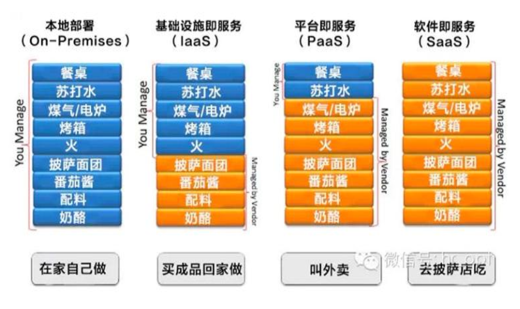
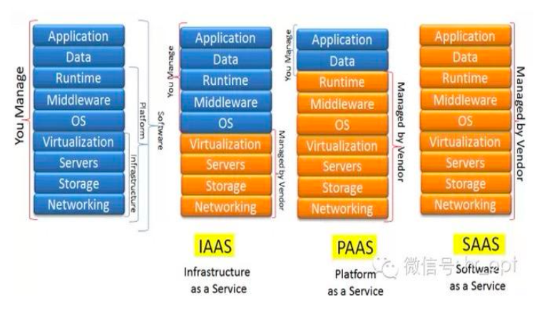
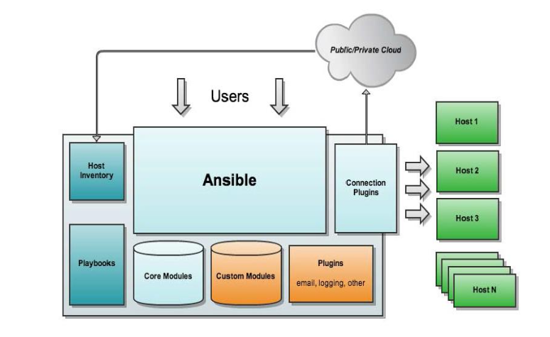
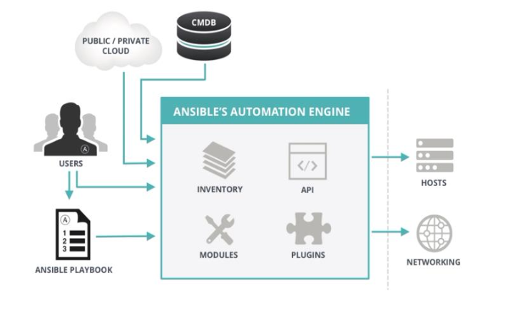

# 运维自动化






## 常用自动化运维工具

- Ansible:python,Agentless,中小型应用环境
- Saltstack:python，一般需部署agent，执行效率更高
- Puppet:ruby, 功能强大,配置复杂，重型,适合大型环境
- Fabric：python，agentless
- Chef: ruby,国内应用少
- Cfengine
- func

## 企业实际应用场景分析

```javascript
1 Dev开发环境
    使用者：程序员
    功能：程序员开发软件，测试BUG的环境
    管理者：程序员
2 测试环境
    使用者：QA测试工程师
    功能：测试经过Dev环境测试通过的软件的功能
    管理者：运维
    说明：测试环境往往有多套,测试环境满足测试功能即可，不宜过多
    （1）测试人员希望测试环境有多套,公司的产品多产品线并发，即多个版本，意味着多个版本同步测试
    （2）通常测试环境有多少套和产品线数量保持一样
3 发布环境：代码发布机，有些公司为堡垒机（安全屏障）
    使用者：运维
    功能：发布代码至生产环境
    管理者：运维（有经验）
    发布机：往往需要有2台（主备）
4 生产环境
    使用者：运维，少数情况开放权限给核心开发人员，极少数公司将权限完全开放给开发人员并其维护
    功能：对用户提供公司产品的服务
    管理者：只能是运维
    生产环境服务器数量：一般比较多，且应用非常重要。往往需要自动工具协助部署配置应用。
5 灰度环境（生产环境的一部分）
    使用者：运维
    功能：在全量发布代码前将代码的功能面向少量精准用户发布的环境,可基于主机或用户执行灰度发布
    案例：共100台生产服务器，先发布其中的10台服务器，这10台服务器就是灰度服务器
    管理者：运维
    灰度环境：往往该版本功能变更较大，为保险起见特意先让一部分用户优化体验该功能，待这部分用户使用没有重大问题的时候，再全量发布至所有服务器
预发布验证：
    新版本的代码先发布到服务器（跟线上环境配置完全相同，只是未接入到调度器）
程序发布：
    不能导致系统故障或造成系统完全不可用
    不能影响用户体验
灰度发布：
    发布路径：/webapp/tuangou-1.1
    /webapp/tuangou
    /webapp/tuangou-1.2
发布过程：在调度器上下线一批主机(标记为maintanance状态) --> 关闭服务--> 部署新版本的应用程序--> 启动服务--> 在调度器上启用这一批服务器
自动化灰度发布：脚本、发布平台
```

## 特性

- 模块化：调用特定的模块，完成特定任务
- 有Paramiko，PyYAML，Jinja2（模板语言）三个关键模块
- 支持自定义模块
- 基于Python语言实现
- 部署简单，基于python和SSH(默认已安装)，agentless
- 安全，基于OpenSSH
- 支持playbook编排任务
- **幂等性**：一个任务执行1遍和执行n遍效果一样，不因重复执行带来意外情况
- 无需代理不依赖PKI（无需ssl）
- 可使用任何编程语言写模块
- YAML格式，编排任务，支持丰富的数据结构
- 较强大的多层解决方案

## ansible架构



## Ansible工作原理



**ansible主要组成部分**

- ANSIBLE PLAYBOOKS：任务剧本（任务集），编排定义Ansible任务集的配置文件，由Ansible顺序依次执行，通常是JSON格式的YML文件

- INVENTORY：Ansible管理主机的清单/etc/anaible/hosts

- MODULES：Ansible执行命令的功能模块，多数为内置的核心模块，也可自定义

- PLUGINS：模块功能的补充，如连接类型插件、循环插件、变量插件、过滤插件等，该功能不常用

- API：供第三方程序调用的应用程序编程接口

- ANSIBLE：组合INVENTORY、API、MODULES、PLUGINS的绿框，可以理解为是ansible命令工具，其为核心执行工具

- Ansible命令执行来源：

  USER，普通用户，即SYSTEM ADMINISTRATOR

  CMDB（配置管理数据库）API 调用

  PUBLIC/PRIVATE CLOUD API调用

  USER-> Ansible Playbook -> Ansibile

- 利用ansible实现管理的方式：

  Ad-Hoc 即ansible命令，主要用于临时命令使用场景

  Ansible-playbook 主要用于长期规划好的，大型项目的场景，需要有前提的规划

- Ansible-playbook（剧本）执行过程：

  将已有编排好的任务集写入Ansible-Playbook

  通过ansible-playbook命令分拆任务集至逐条ansible命令，按预定规则逐条执行

- Ansible主要操作对象：

  HOSTS主机

  NETWORKING网络设备

- 注意事项

  执行ansible的主机一般称为主控端，中控，master或堡垒机

  主控端Python版本需要2.6或以上

  被控端Python版本小于2.4需要安装python-simplejson

  被控端如开启SELinux需要安装libselinux-python

  windows不能做为主控端

## ansible安装(四种方式)

- rpm包安装: EPEL源
  `yum install ansible`
- 编译安装:

```
yum -y install python-jinja2 PyYAML python-paramiko 
python-babel python-crypto
tar xf ansible-1.5.4.tar.gz
cd ansible-1.5.4
python setup.py build
python setup.py install
mkdir /etc/ansible
cp -r examples/* /etc/ansible
```

- Git方式安装

```
git clone git://github.com/ansible/ansible.git --recursive
cd ./ansible
source ./hacking/env-setup
```

- pip安装：pip是安装Python包的管理器，类似yum

```
yum install python-pip python-devel
yum install gcc glibc-devel zibl-devel rpm-bulid openssl-devel
pip install  --upgrade pip
pip install ansible--upgrade
```

- 确认安装：`ansible --version`
- 文件列表：rpm -ql ansible |less
- 程序信息：yum info ansible
- 查看文件：rpm -ql ansible |grep file.py
- 加快ssh访问：

### 相关文件

**配置文件**
`/etc/ansible/ansible.cfg` 主配置文件，配置ansible工作特性
`/etc/ansible/hosts` 主机清单
`/etc/ansible/roles/` 存放角色的目录

**程序**
`/usr/bin/ansible` 主程序，临时命令执行工具
`/usr/bin/ansible-doc` 查看配置文档，模块功能查看工具
`/usr/bin/ansible-galaxy` 下载/上传优秀代码或Roles模块的官网平台
`/usr/bin/ansible-playbook` 定制自动化任务，编排剧本工具
`/usr/bin/ansible-pull` 远程执行命令的工具
`/usr/bin/ansible-vault` 文件加密工具
`/usr/bin/ansible-console` 基于Console界面与用户交互的执行工具

### 主机清单inventory

- ansible的主要功用在于批量主机操作，为了便捷地使用其中的部分主机，可以在inventory file中将其分组命名
- 默认的inventory file为`/etc/ansible/hosts`
- inventory file可以有多个，且也可以通过Dynamic Inventory来动态生成

`/etc/ansible/hosts`文件格式
inventory文件遵循INI文件风格，中括号中的字符为组名。可以将同一个主机同时归并到多个不同的组中；此外，当如若目标主机使用了非默认的SSH端口，还可以在主机名称之后使用冒号加端口号来标明

# ansible命令

# ansible常用模块详解

# yaml语法

# ansible playbook

# playbook变量、tags、handlers

# playbook模板templates

# playbook条件判断when

# playbook字典 with_items

# ansible roles