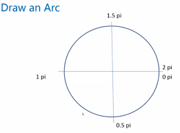

# canvas标签

默认宽高300*150。

canvas的宽高应该写在标签属性中为数值形式，样式中的宽高是按照canvas默认宽高进行等比例缩放的。

# 绘制环境

getContext('2d')：目前仅支持2D场景

# 绘制方块

fillRect(L,T,W,H):默认颜色是黑色

strokeRect(L,T,W,H)：带边框的方块-默认为1像素黑色边框（截图在PS上显示为2像素的原因是，因为设备显示上不能显示0.5像素，所以只能显示为2像素）

# 设置绘图

fillStyle:填充颜色，绘制canvas是有顺序的

lineWidth:线宽度，是一个数值

strokeStyle:边线颜色

# 边界绘制

lineJoin：边界连接点样式。miter默认、round圆角、bevel斜角

lineCap：端点样式。butt默认、round圆角、square(高度多出的部分是宽一半的值)

# 绘制路径

beginPath（）：开始绘制路径

moveTo（X，Y）：移动到绘制的新目标点

lineTo(X，Y)：新的目标点

stroke()：画线，默认黑色

fill()：填充，默认黑色

rect(L,T,W,H)：矩形区域

clearRect(L,T,W,H):删除一个画布的矩形区域

save()：保持路径

restore()：恢复路径。和save()前后搭配可以划分一个独立的区域。

closePath（）：结束绘制路径

# 绘制圆



**arc(X，Y，半径，起始弧度，结束弧度，旋转方向)：**

- 弧度和角度的关系：**弧度=角度*Math.PI/180**

- 旋转方向：顺时针为false、逆时针true

- 钟表

  ``````javascript
  
  ``````

  

# 绘制其他曲线

arcTo(x1,y1,x2,y2 r)：

- 第一组坐标、
- 第二组坐标、
- 半径

quadraticCurveTo(dx,dy,x1,y1)：

- 贝塞尔曲线，第一组控制点、第三组结束坐标

bezierCurveTo(dx1,dy1,dx2,dy2,x1,y1)：

- 贝塞尔曲线，第一组控制点、第二组控制点、第三组结束坐标

# 变换

translate(X,Y)：

- 偏移，从起始点为基准点，移动当前坐标位置

rotate(角度*Math.PI/180)：

- 旋转，参数为弧度

scale(X轴缩放比例,Y轴缩放比例)：

- 缩放

旋转的方块

`````javascript

`````

# 插入图片

等图片加载完成，再执行canvas操作：图片预加载，再onload中调用方法

drawImage(oImg,x,y,w,h)：

- oImg是当前图片
- x,y坐标，
- w,h：宽高

图片旋转效果

``````javascript
	
``````


# 设置背景

createPattern(oImg,平铺方式)：

- 参数有repeat、repeat-x、repeat-y、no-repeat

# 渐变

createLinearGradient(x1,y1,x2,y2)线性渐变：

- 第一组参数：起始点坐标
- 第二组参数：结束点坐标
- **addColorStop**(位置，颜色)添加渐变点。位置是从0到1之间的小数。

createRadialGradient(x1,y1,r1,x2,y2,r2)放射性渐变

- 第一个圆的坐标和半径，
- 第二个元的坐标和半径
- **addColorStop**(位置，颜色)添加渐变点。位置是从0到1之间的小数。

# 文本

strokeText(文字,x,y)

- 文字边框

fillText(文字,x,y)

- 文字填充

font

- 文字大小和字体，‘80px impact'

textAlign文字左右居中方式

- 默认是start和left一样的效果。其他参数end right center

textBaseline文字上下居中方式

- 文字上下的位置的方式默认：alphabetic。其他参数top,bottom,middle

measureText()

- measureText(str).width：只有宽度，没有高度。str是文字

# 阴影

shadowOffsetX、shadowOffsetY X轴偏移，Y轴偏移

- 使用一个数值

shadowBlur 高斯模糊值

- 使用一个数值

shadowColor 阴影颜色。默认为黑色透明

# 像素

**getImageData(x,y,w,h)**

- 获取图像数据

- 属性：

  **width**：一行的像素的个数   

  **height**：一列的像素的个数

  **data**：一个数组，包含每个像素的rgba四个值，每个值都在0~255之间的整数

**putImageData**(获取图像，x，y)

- 设置新的图像数据

createImageData(w,h)

- 生成新的像素矩阵，初始值是全透明的黑色。（0，0，0，0）

- 像素显字

  ``````javascript
  
  ``````

  

  

获取和设置指定坐标

- 封装 getXY、setXY

  ``````javascript
  js
  ``````

  

图片的像素操作

- **必须是同源下**

  ``````javascript
  
  ``````

# 合成

全局阿尔法值globalAlpha

- 0~1之间的一个小数

覆盖合成

- 源：新的图形

- 目标：已经绘制过的图形

- globalCompositeOpeartion属性

  source-over默认     destination-over 目标在上   source-atop 源被截了已部分

  destination-atop  source-in   destination-in

  source-out   destination-out   lighter

  copy   xor重叠部分被掏空了

# 将画布导出为图像

toDataURL()

- 

# 事件操作

isPointInPath(x,y)

- 表示，是否在点击范围内

  ``````javascript
  
  ``````

  

- jCanvaScript(canvas中的jQuery) 


 


