# 元素状态改变的监控方法

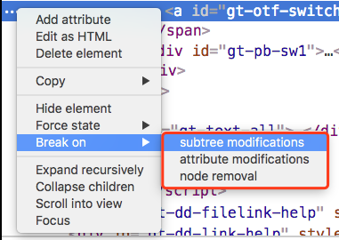

选项一：监听当前元素的子元素的添加、删除和修改的状态，常用于子元素的状态变化的监控上。

选项二：监听当前元素属性的变化，比如一个轮播图常常会修改当前元素的一个定位或者位置属性我们可以用它来监听。

选项三：监听当前元素的移除变化，当某个特殊阶段触发了元素的移除可以通过它进行监听。

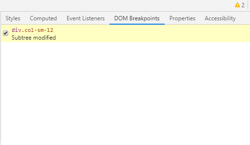

# 查看元素的最终样式

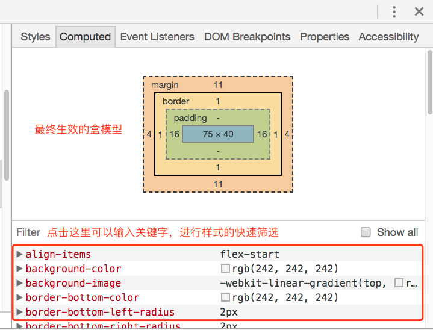

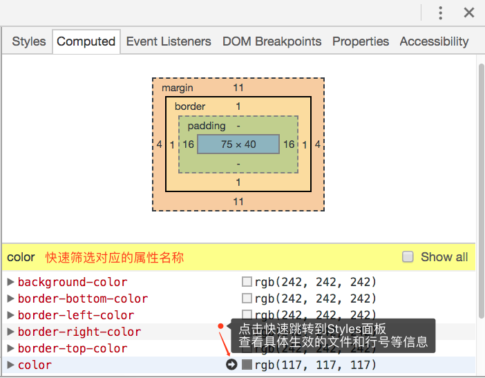

# Console控制台

支持一些简单的快捷键:

- `Ctrl + u` 删除当前行

- `Ctrl + l` 清空控制台所有输出，不包含当前行

- `Ctrl + a` 光标移动到行首

- `Ctrl + e` 光标移动到行尾

  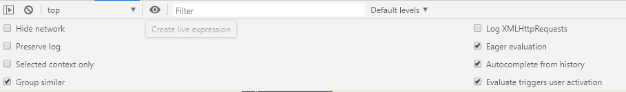

# 查看JS和CSS的压缩代码

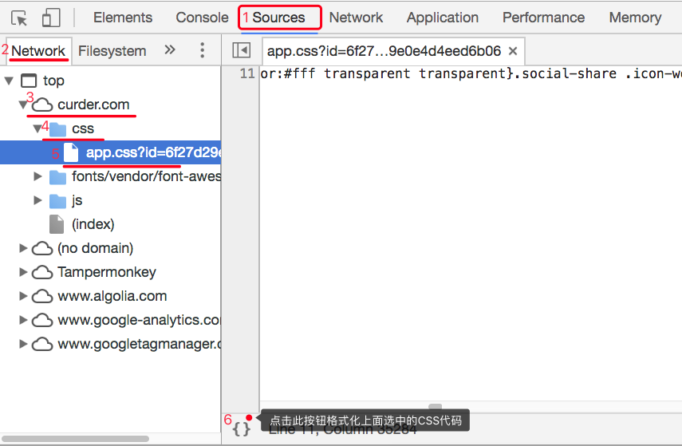

# JS反混淆

http://jsnice.org/

https://github.com/mindedsecurity/JStillery

https://beautifier.io/

# 页面重绘

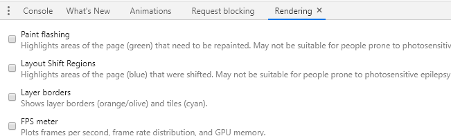

# 统计没有使用到的脚本

# 全局资源搜索

通过过滤条件过滤出自己想要搜索的内容所包含的资源文件以及资源文件所在行。

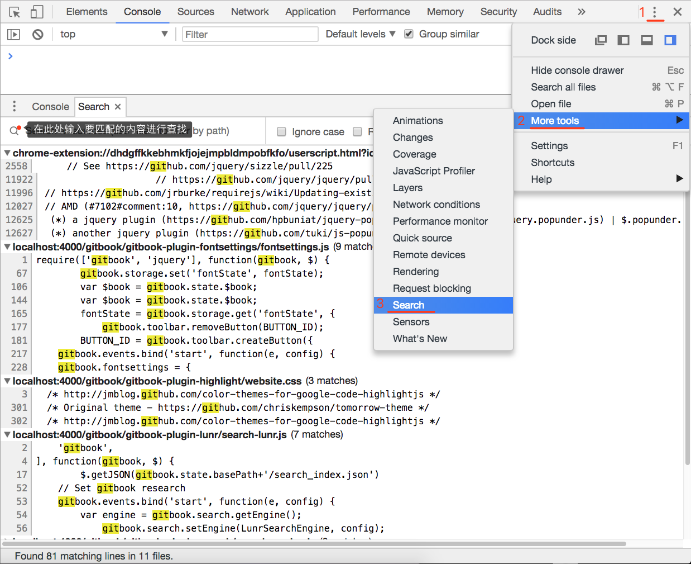

# 性能分析

https://googlechrome.github.io/devtools-samples/jank/ 

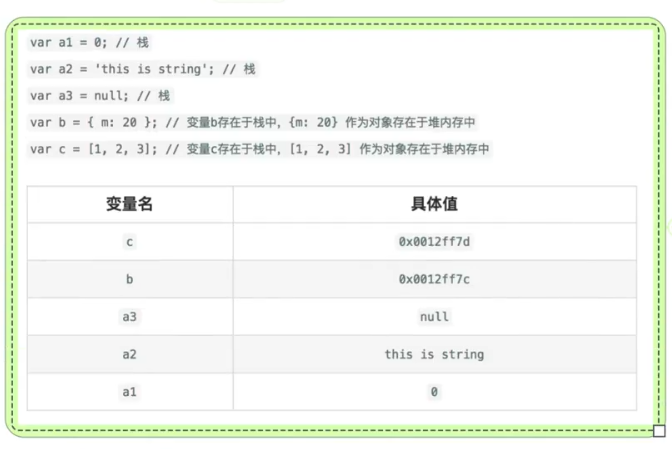

# Animations

http://f2ex.cn/inspecting-animations-in-devtools/

# 内存监控

https://googlechrome.github.io/devtools-samples/jank/

https://developers.google.com/web/tools/chrome-devtools#top_of_page

# Manifest

**application的选项卡下**

# Service Workers

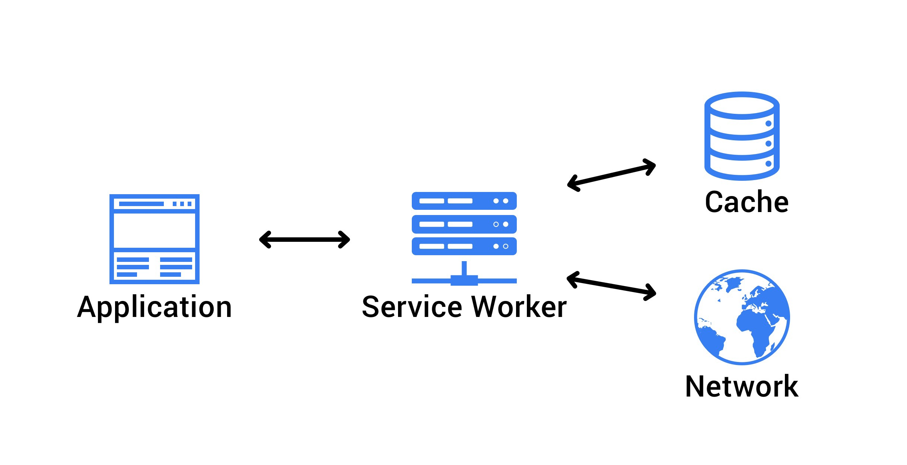

1. PWA

   - HTTPS环境部署
   - 响应式设计，一次部署，可在移动设备和PC设备上运行，在不同浏览器下可正常访问
   - 浏览器离线和弱网下可极速访问
   - 把App Icon入口添加到桌面
   - 点击Icon入口，由Native App的动画效果
   - 热更新

2. Service Workers

   - Web worker

   - Service Worker
     - 后台消息传递
     - 网络代理，转发请求，伪造响应
     - 离线缓存
     - 消息推送

   

# IndexedDB

1. 持久化存储数据的方法
2. 详见示例

# Cache原理

# 快速转存站点资源

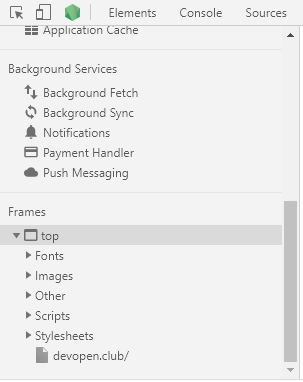

# Security 

TLS-SSL检查工具

http://ssl-checker.online-domain-tools.com/

# Audit

使用

社区分享的YSlow