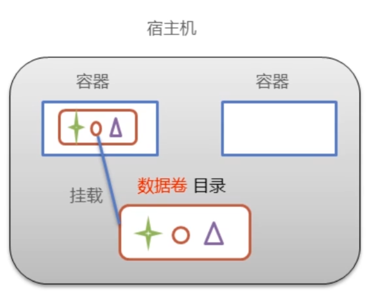
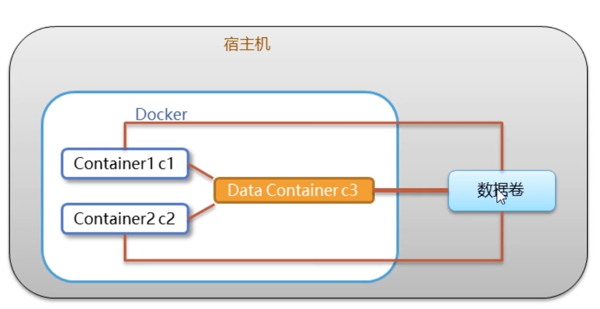
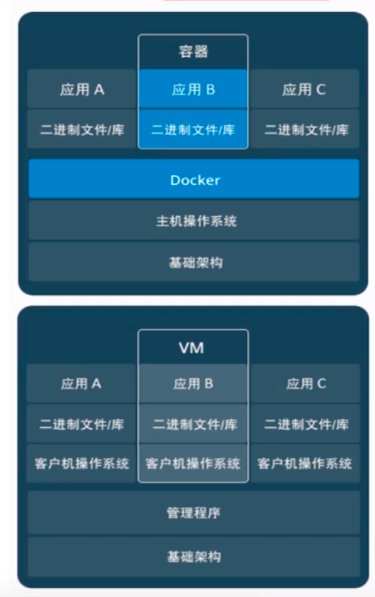

# docker命令


- image镜像
- container容器
- 仓库repository

```javascript
//yum包更新到最新
yum update
//yum-util提供了yum-config-manager功能，另两个是devicemapper驱动所依赖的
yum install -y yum-utils device-mapper-persistent-data lvm2
//设置yum源
yum-config-manager --add-repo http://mirrors.aliyun.com/docker-ce/linux/centos/docker-ce.repo
//安装
yum install -y docker-ce
//验证
docker -v
```

```javascript
//启动
systemctl start docker
//查看状态
systemctl status docker
//停止
systemctl stop docker
//重启
systemctl restart docker
//开机启动
systemctl enable docker
```

镜像命令

```javascript
//查看
docker images
//查看所有ID
docker images -q
//搜索
docker search 镜像文件名称
//拉取
docker pull 镜像文件名称:版本号
//删除
docker rmi 镜像文件名称或ID
//全部删除
docker rmi `docker images -q`
```

容器命令

- docker run 参数

  -i 保持容器运行；

  -t 重新分配一个伪输入终端

  -it 创建并进入容器中，退出则关闭容器

  -d 守护模式运行容器，创建容器并后台运行

  -it是交互式容器，-id是守护式容器

  --name 为容器命名

  

```javascript
//查看当前运行的容器
docker ps
//查看历史的容器
docker ps -a
//创建并立即进入容器，退出则容器关闭
docker run -it --name=c1 centos:7 /bin/bash
//创建并后台运行容器
docker run -id --name=c1 centos:7 /bin/bash
//进入容器
docker exec -it 容器名称 /bin/bash
//退出容器
 exit
//启动
docker start 容器名称
//停止
docker stop 容器名称 
//删除
docker rm  容器名称或iD
//删除
docker rm  `docker ps -aq`
//查看容器ID
docker ps -aq
//查看容器信息
docker inspect 容器名称
```


# docker容器数据卷



1. **数据卷是宿主机中的一个目录或文件**

2. **容器目录和数据卷目录绑定后，对方的修改会立即同步**

3. 一个数据卷可以被多个容器同时挂载

4. 一个容器也可以被挂载多个数据卷

5. **数据卷的作用**

   - **容器数据持久化**
   - **外部机器和容器间接通信**
   - **容器之间数据交换**

6. 配置数据卷

   - **目录必须是绝对路径**
   - **不存在的目录会自动创建**
   - 可以挂载多个数据卷
   - **宿主机目录可以使用~，容器目录不允许**

   ``````javascript
   docker run -it --name=容器名称  -v 宿主目录：容器目录 镜像名称 /bin/bash
   
   //一个容器被挂载多个数据卷
   docker run -it --name=c2 \
    -v ~/data2:/root/data2 \
    -v ~/data3:/root/data3 \
    centos:7
   //一个数据卷可以被多个容器同时挂载
   docker run -it --name=c3 -v ~/data:/root/data centos:7
   docker run -it --name=c4 -v ~/data:/root/data centos:7
   
   ``````

   

7. 数据卷容器

   

   - 创建一个容器，挂载一个目录，让其他容器继承自该容器（--volume-from)
   
   - 解决多容器进行数据交换
  - 多个容器挂载同一个数据卷
     - 使用数据卷容器
   
   `````javascript
   //创建数据卷容器，使用-v设置数据卷（容器目录）
   docker run -it --name=c3 -v /volume centos:7 /bin/bash
   //创建启动c1 c2容器，使用--volume-from 参数设置数据卷
   docker run -it --name=c1 --volumes-from c3 centos:7 /bin/bash
   docker run -it --name=c2 --volumes-from c3 centos:7 /bin/bash

   `````

   
   
   

# docker应用部署

## mysql

1. **容器内的网络服务和外部机器不能直接通信**
2. 外部机器和宿主机器可以直接通信
3. 宿主机和容器可以通信
4. **外部机器访问容器和宿主机的映射端口，从而简洁访问容器的服务**

- -p 3307：3306 ：将容器的3306端口映射到宿主机的3307端口
- -v $PWD/conf:/etc/mysql/conf.d :将主机当前目录下的conf/my.cnf 挂载到容器的/etc/mysql/my.cnf 配置目录
- -v $PWD/logs:/logs  :将主机当前目录下的logs目录挂载到容器的/logs，日志目录
- -v $PWD/data:/var/lib/mysql：将主机当前目录下的data目录挂载到容器的/var/lib/mysql，数据目录
- -e MYSQL_ROOT_PASSWORD=123456：初始化root用户的密码

``````javascript
//搜索镜像
docker search mysql
//拉取镜像
docker pull mysql:5.6
//在/root目录下创建mysql目录用于存储mysql数据信息
mkdir ~/mysql
cd ~/mysql
//
docker run -id \
-p 3307:3306   \
--name=c_mysql  \
-v $PWD/conf:/etc/mysql/conf.d \
-v $PWD/logs:/logs \
-v $PWD/data:/var/lib/mysql  \
-e MYSQL_ROOT_PASSWORD=123456 \
mysql:5.6
//进入容器 操作MySQL
docker exec -it c_mysql /bin/bash
``````

- mysql -uroot -p123456
- show databases;
- create database db1;

## tomcat

- -p 8080:8080  ：将容器的8080端口映射到主机的8080端口
- -v $PWD:/usr/local/tomcat/webapps：将主机中当前目录挂载到容器的webapps目录

```javascript
//搜索
docker search tomcat
//拉取
docker pull tomcat
//创建容器，设置端口映射，目录映射
mkdir ~/tomcat
cd ~/tomcat
//
docker run -id --name=c_tomcat  \
-p 8080:8080  \
-v $PWD:/usr/local/tomcat/webapps  \
tomcat

```


## nginx


```javascript
//
docker search nginx
//
docker pull nginx

//端口映射，目录映射，nginx目录存储nginx数据信息
mkdir ~/nginx
cd ~/nginx
mkdir conf
cd conf/
//创建nginx.conf文件
vim nginx.conf


```

```javascript
user  root;
worker_processes  1;
 
error_log  /var/log/nginx/error.log warn;
pid        /var/run/nginx.pid;
 
 
events {
    worker_connections  1024;
}
 
 
http {
    include       /etc/nginx/mime.types;
    default_type  application/octet-stream;
 
    log_format  main  '$remote_addr - $remote_user [$time_local] "$request" '
                      '$status $body_bytes_sent "$http_referer" '
                      '"$http_user_agent" "$http_x_forwarded_for"';
 
    access_log  /var/log/nginx/access.log  main;
 
    sendfile        on;
    #tcp_nopush     on;
 
    keepalive_timeout  65;
 
	autoindex  on;
	
    #gzip  on;
 
    include /etc/nginx/conf.d/*.conf;
 
    client_max_body_size 100M;
 
    client_header_buffer_size    128k;
    large_client_header_buffers  4  128k;
}

```


```javascript
docker run -id --name=c_nginx  \
-p 80:80 \
-v $PWD/conf/nginx.conf:/etc/nginx/nginx.conf  \
-v $PWD/logs:/var/log/nginx  \
-v $PWD/html:/usr/share/nginx/html  \
nginx
```

- -p 80:80 容器的80端口映射到宿主机的80端口
- -v $PWD/conf/nginx.conf:/etc/nginx/nginx.conf  \  将主机当前目录下的/conf/nginx.conf挂载到当前目录

## redis

```javascript
//搜索
docker search redis
//
docker pull redis:5.0
//创建容器，设置端口映射
docker run -id --name=c_redis -p 6379:6379 redis:5.0
//使用外部机器连接redis
./redis-cli.exe -h ip地址 -p 6379
```


# dockerfile


1. 镜像制作

   - **数据卷形式的挂载文件不会保留**

   ```javascript
   //创建新镜像
   docker commit 容器ID 镜像名称：版本号
   //转为压缩文件
   docker save -o 压缩文件名称.tar  镜像名称：版本号
   //测试人员还原，另一个镜像
   docker load -i 压缩文件名称
   ```

   

2. dockerfile,制作镜像

   - **dockerfile是一个文本文件**
   - 包含了一条条的指令
   - **每一条指令构建一层，基于基础镜像，最后构建出一个新的镜像**
   - 对于开发：为开发团队提供了一个**完全一致的开发环境**
   - 对于测试：可以直接**拿开发时所构建的镜像或者通过Dockerfile文件创建一个新的镜像**开始工作了
   - 对于运维：**在部署时，可以实现应用的无缝移植**

   ``````javascript
   //dockerfile关键字
   FROM
   指定基础镜像，当前新镜像是基于哪个镜像的。其中，scratch是个空镜像，这个镜像是虚拟的概念,并不实际存在,它表示一个空白的镜像，当前镜像没有依赖于其他镜像
   FROM scratch
   
   MAINTAINER
   镜像维护者的姓名和邮箱地址
   MAINTAINER Sixah <sixah@163.com>
       
   RUN
   容器构建时需要运行的命令
   RUN echo 'Hello, Docker!'
   
   EXPOSE
   当前容器对外暴露出的端口
   EXPOSE 8080
   
   WORKDIR
   指定在创建容器后，终端默认登陆进来的工作目录，一个落脚点
   WORKDIR /go/src/app
   
   ENV
   用来在构建镜像过程中设置环境变量
   例如，ENV MY_PATH /usr/mytest
   这个环境变量可以在后续的任何RUN指令中使用，这就如同在命令前面指定了环境变量前缀一样;当然，也可以在其他指令中直接使用这些环境变量，比如：WORKDIR $MY_PATH
   
   ADD
   将宿主机目录下的文件拷贝进镜像且ADD命令会自动处理URL和解压tar压缩包
   ADD Linux_amd64.tar.gz
   
   COPY
   类似于ADD，拷贝文件和目录到镜像中，将从构建上下文目录中<源路径>的文件/目录复制到新的一层镜像内的<目标路径>位置
   COPY . /go/src/app
   
   VOLUME
   容器数据卷，用于数据保存和持久化工作
   VOLUME /data
   
   CMD
   指定一个容器启动时要运行的命令。Dockerfile中可以有多个CMD指令，但只有最后一个生效，CMD会被docker run之后的参数替换
   CMD ["/bin/bash"]
   
   ENTRYPOINT
   指定一个容器启动是要运行的命令。ENTRYPOINT的目的和CMD一样，都是在指定容器启动程序及参数
   
   ONBUILD
   当构建一个被继承的Dockerfile时运行的命令，父镜像在被子镜像继承后，父镜像的ONBUILD指令被触发
   
   
   ``````

   

3. 自定义centos7镜像

   - 定义父镜像： FROM centos:7

   - 定义作者信息：MAINTAINER 作者信息

   - 执行安装vim命令：RUN yum install -y  vim

   - 定义默认的工作目录：WORKDIR  /usr

   - 定义容器启动执行的命令：CMD  /bin/bash

     ```javascript
     FROM centos:7
     MAINTAINER it <it@gmail.com>
     RUN yum install -y vim
     WORKDIR /usr
     cmd /bin/bash
     
     ```

     - **docker build -f  dockerfile文件目录  -t   新镜像的名称:版本号  .（寻址路径）**

4. 部署 springboot项目

   ``````javascript
   定义父镜像：FROM  java:8
   定义作者信息：MAINTAINER it <it@gmail.com>
   将jar包添加到容器并改名：Add springboot.jar app.jar
   定义容器启动执行的命令：CMD java -jar app.jar
   通过dockersfile构建镜像：docker build -f dockerfile的文件路径 -t 镜像名称：版本 . (寻址路径)
   ``````

   - 映射端口：**docker run -id -p 9000:8080 app**

# docker 服务编排

1. **使用场景：**

   - **从dockerfile build image或者dockerhub拉取image**
   - **创建多个container**
   - **管理container（启动停止删除）**

2. 服务编排：**按照一定的业务规则批量管理容器**

3. Docker Compose工具

   - 编排多容器分布式部署的工具
   - 提供命令集管理容器化应用的完整开发周期，
   - 包括服务构建，启动和停止
   - 步骤
     - 利用dockerfile定义运行环境镜像
     - 使用**docker-compose.yml**定义组成应用的各服务
     - 运行**docker-compose up** 启动应用

4. 使用docker compose

   ``````javascript
   curl -L "https://github.com/docker/compose/releases/download/1.24.1/docker-compose-$(uname -s)-$(uname -m)" -o /usr/local/bin/docker-compose
   
   //将可执行权限应用于二进制文件：
   sudo chmod +x /usr/local/bin/docker-compose
   
   //创建软链
   sudo ln -s /usr/local/bin/docker-compose /usr/bin/docker-compose
   //测试
   docker-compose --version
   //删除二进制文件
   rm /usr/local/bin/docker-compose
   ``````

   

   - 创建docker-compose目录
     - mkdir ~/docker-compose
     - cd ~/docker-compose
     - 编写 docker-compose.yml文件

   ``````javascript
   # yaml 配置实例
   version: '3'
   services:
     nginx:
      image: nginx
      ports:
   	- 80:80
      links:
   	 -app
      volumes:
   	- ./nginx/conf.d:/etc/nginx/conf.d
     app:
   	image: app
       expose:
   	  - "8080"
   
   ``````

   - 创建./nginx/conf.d/it.conf文件,mkdir -p ./nginx/conf.d

     ``````javascript
     
     
     server{
         listen 80;
         access_log off;
         
         location / {
             proxy_pass http://app:8080;
         }
     }
     
     ``````

   - ~/docker-compose目录下，docker-compose up 启动容器（docker-compose up -d 是后台启动）

     

   

# docker 私有仓库

1. 搭建私有仓库

   ``````javascript
   //拉取私有仓库镜像
   docker pull registry
   //启动私有仓库容器
   docker run -id --name=registry -p 5000:5000 registry
   //http://私有仓库ip:5000/v2/_catalog,有{"repositories"：[]}表示私有仓库搭建成功
   //修改daemon.json文件
   vim /etc/docker/daemon.json
   //添加一个key保存退出。让docker信任私有仓库地址
   //将私有仓库地址修改为自己私有仓库真实的IP {"insecure-registries":["私有仓库IP:5000"]}
   //重启docker服务
   systemctl restart docker
   
   docker start registry
   
   ``````

   

2. 上传镜像

   ```javascript
   //标记镜像为私有仓库的镜像
   docker tag centos:7 私有仓库的IP:5000/centos:7
   //上传标记的镜像
   docker push 私有仓库的IP：5000/centos:7
   ```

   

3. 拉取镜像

   ```javascript
   
   //上传标记的镜像
   docker pull 私有仓库IP:5000/centos:7
   ```
   


# docker 相关概念

1. 容器就是将软件打包成标准化单元，以用于开发、交付和部署。

   - 容器镜像是轻量的、可执行的独立软件包，包含软件运行所需的所有内容：代码、运行时环境、系统工具、系统库和设置。
   - 容器化软件在任何环境中都能够始终如一地运行。
   - 容器赋予了软件独立性，使其免受外在环境差异的影响，从而有助于减少团队间在相同基础设施上运行不同软件时的冲突。

2. 对比虚拟机

   - 相同：具有相似的资源隔离和分配优势
   - 不同：容器虚拟化的是操作系统，虚拟机虚拟的是硬件
     - 容器只能运行同一种类型操作系统

   

   