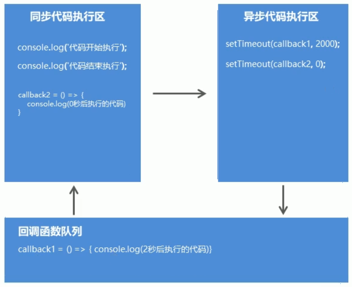

# Gulp

1. 基于Node平台开发的前端构建工具
   - 将机械化操作编写成任务，执行命令自动执行任务
2. 作用
   - 项目上线时，HTML，CSS，JS文件压缩合并
   - 语法转换（es6,less...)
   - 公共文件抽离
   - 修改文件浏览器自动刷新

# 使用Gulp

1. 安装到本地   npm i gulp 下载库文件
2. 在根目录建立**gulpfile.js文件**
3. **重构项目的文件夹结构，src目录放置源代码文件，dist目录放置构建后文件**
4. 在**gulpfile.js**文件中编写任务
5. 在**命令行中执行gulp任务**

# Gulp方法

## gulp.src(文件路径)

获取任务要处理的文件

## gulp.dest(文件路径)

1. 输出文件
2. **.pipe(将要处理的代码)**

## gulp.task(任务的名称,callback)

1. 建立gulp任务

## gulp.watch()

监控文件的变化

## gulp-cli命令行工具

1. 安装  npm i gulp-cli -G

2. 执行  gulp 任务名称

   ``````javascript
   const gulp=require('gulp')
   //使用gulp.task()建立任务
   gulp.task('first',()=>{
       //获取要处理的文件
       gulp.src('./index.css')
       //处理后的文件输出到dist目录
       .pipe(gulp.dest('./dist/css'));
   })
   ``````

   

## Gulp插件

**gulp-htmlmin html**文件压缩

``````javascript
npm i --save gulp-htmlmin
const htmlmin=require('gulp-htmlmin')
gulp.task('htmlmin',()=>{
    gulp.src('./src/*.html')
    .pipe('htmlmin({collapseWhitespace:true})')
    .pipe(gulp.dest('dist'));
})
``````


**gulp-csso** 压缩css

``````javascript
npm i gulp-csso
const csso=require('gulp-csso')
``````


**gulp-babel** js语法转换

``````javascript
npm i gulp-babel @babel/core @babel/preset-env  --save-dev  //babel 7
npm i gulp-babel@7 babel-core babel-preset-env  --save-dev   //babel 6
const babel=require('gulp-babel');
npm i gulp-uglify 
const uglify=require('gulp-uglify');
gulp.task('jsmin',()=>{
    gulp.src('./src/js/*.js')
    .pipe(babel({
        //由它判断代码的运行环境，转换为环境所支持的代码
        presets:['@babel/env']
    }))
    .pipe(uglify())
    .pipe(gulp.dest('dist/js'))
    
})
``````


**gulp-less**  less语法转换

``````javascript
npm i gulp-less
npm i gulp-csso
const csso=require('gulp-csso')
const less=require('gulp-less')
gulp.task('cssmin',()=>{
   // gulp.src('./src/css/*.less')
    //选择css和less文件
    gulp.src(['./src/css/*.less','./src/css/*.css'])
    //先转换再压缩
    .pipe(less())
    .pipe(csso())
    .pipe(gulp.dest('dist/css'))
    
})
``````


**gulp-uglify**  压缩混淆JS

```javascript
npm i gulp-uglify 
const uglify=require('gulp-uglify');
```


**gulp-file-include**  公共文件包含

```javascript
npm i gulp-file-include

const fileinclude=require('gulp-file-include')
const htmlmin=require('gulp-htmlmin')
gulp.task('htmlmin',()=>{
    gulp.src('./src/*.html')
    .pipe(fileinclude())
    .pipe('htmlmin({collapseWhitespace:true})')
    .pipe(gulp.dest('dist'));
})

//页面中使用特殊语法引入公共部分
@@include('./common/header.html')//
```

**browsersync** 浏览器实时同步

```

```

复制文件夹

```javascript
gulp.task('copy',()=>{
	gulp.src('./src/images/*')
		.pipe(gulp.dest('dist/images'));
    gulp.src('./src/lib/*')
    	.pipe(gulp.dest('dist/lib'))
})
```

build构建任务

``````javascript
gulp.task('default',['htmlmin','cssmin','jsmin','copy']);
``````

- default名称的任务，默认执行

# package.json文件

1. package.json文件，项目描述文件。

   **npm init -y ** 生成

2. **项目依赖**，记录在**dependencies**中。服务器环境下，**npm i  --production**

3. **开发依赖**，使用**--save-dev**参数，并记录在**devDependencies**字段中

4. **package-lock.json**文件,记录模块的依赖关系，**锁定包的版本同时加速包的下载速度**

5. scripts字段，为长命令起别名

# Node模块加载机制

1. **require方法根据路径查找模块**
   - 完整路径下，直接引用
   - 后缀省略，**先找同名JS文件再找同名JS文件夹**
   - **在同名文件夹下找index.js**
   - 没有index.js，**在当前文件夹中的package.js文件中查找main字段中的入口文件**
   - 入口文件不存在或没有指定，报错
2. **没有路径且没有后缀的模块**
   - node假设它是系统模块
     - 不是系统模块，会去node_modules文件中，
     - 查看同名的JS文件
     - 再看同名的JS文件夹
     - 看文件夹中是否有index.js
     - 没有index.js文件，查看该文件夹中的package.json文件的main字段的入口文件
     - 否则报错

# 服务器基础

## IP 域名 端口

1. IP，internet protocol address简称
2. 端口，计算机和外界通讯交流的出口，区分服务器电脑中提供的不同的服务

## url

1. 统一资源定位符，unifrom resource locator

   ``````javascript
   传输协议://服务器IP或域名:端口/资源所在位置标识
   ``````

2. http，超文本传输协议，一种发布和接收HTML页面的方法

3. 本地域名和ip:**localhost;127.0.0.1**

## 创建web服务器

1.  

   ``````javascript
   //
   const http=require('http')
   const app=http.createServer()
   //事件驱动
   app.on('request',(req,res)=>{
       res.end('<h2>hello user</h2>')
   })
   app.listen(3000);//监听端口
   console.log('web服务器启动成功,localhost:3000访问')
   
   
   ``````

## http协议

1. 报文

2. **req.method属性**是请求方式（GET/POST）

3. **req.headers对象**   //获取请求报文

4. **req.url**属性   //获取请求地址

5. 响应报文

   - 200请求成功
   - 404 请求资源未找到
   - 500 服务器端错误
   - 400 客户端请求语法有错误
   - **res.writeHead(状态吗) 指定状态码**

6. 响应内容类型

   - text/plain   默认是纯文本

   - text/html

   - text/css

   - applicatiin/javascript

   - image/jpeg

   - application/json

     ``````javascript
     res.writeHead(200,{
     	'content-type':'text/html;charset=utf8',
     })
     //指定响应内容类型和编码格式
     ``````

     

## 请求和响应处理

1. Get请求参数：?和&组成

2. 获取Get参数：

   ``````javascript
   const url=require('url')
   //将查询参数解析成对象形式
   console.log(url.parse(req.url,true))//开启第二个参数，解析参数为对象形式
   ``````

   

3. POST请求参数

   - 浏览器工具的form data字段可以看到
   - 参数放置在请求体种传输
   - 获取post参数需要data事件和end事件
   - 使用querystring系统模块将参数转换为对象格式

4. 通过事件的方式接收post参数

   - 分段接收完数据：请求参数传递时发出data事件，传递完成时发出end事件

   - 将post参数解析成对象

     ``````javascript
     const querystring=require('querystring');
     app.on('request',(req,res)=>{
         let postData='';
         req.on('data',(chunk)=>{
             postData+=chunk;
         })
         req.on('end',()=>{
             console.log(querystring.parse(postData));
         })
         
     })
     ``````

## 路由

**请求什么响应什么**，**客户端请求地址和服务器程序代码的对应关系**。

``````javascript
const http=require('http');
const app=http.createServer();
const url=require('url');
app.on('request',(req,res)=>{
    const method=req.method.toLowerCase();
    const pathname=url.parse(req.url).pathname;
    res.writeHead(200,{
        'content-type':'text/html;charset=utf8'
    })
    if(method=='get'){
        if(pathname=='/'||pathname=='/index'){
            res.end('<h1>welcome index</h1>');
        }else if(pathname=='/list'){
            res.end('<h1>welcome list</h1>')
        }else{
            res.end('<h1>page not found</h1>');
        }
    }else if(method=='post'){
        
    }
})
app.listen(3000);
console.log('web start up success')
//当客户端发来请求时

//获取客户端请求的路径
``````

## 静态资源

1. 服务器端不需要处理的，可以直接响应给客户端的资源就是静态资源。如css、js、image文件

   ``````javascript
   const http=require('http')
   const url=require('url')
   const fs=require('fs');
   const path=require('path');
   //第三方模块mime
   const mime=require('mime');
   
   const app=http.createServe();
   
   app.on('request',(req,res)=>{
       let pathname=url.parse(req.url).pathname;
       pathname=pathname=='/'?'/default.html':pathname;
       //将用户的请求路径转换为实际的服务器资源路径
       let realPath=path.join(__dirname,'public'+pathname);
       //根据路径确定类型
       let type=mime.getType(realPath);
       
       fs.readFile(realPath,(error,result)=>{
           if(error!=null){
               res.writeHead(404,{
                   'content-type':'text/html;charset=utf8'
               })
               res.end('读取失败');
               return;
           }
           //使用第三发模块确定请求资源的文件类型mime包（npm i mime）
           res.writeHead(200,{
               'content-type':type
           })
           res.end(result);
       })
   })
   
   ``````

   

2. 

## 动态资源

1. 相同的请求地址不同的响应资源，这种资源就是动态资源

## 同步API和异步API




1. 同步：只有当前API执行完成才能继续执行下一个API

2. 异步：当前API不会阻塞后续代码的执行

3. **区别**

   - **同步API可以从返回值种拿到API执行的结果，异步API不可以。**
   - **代码执行顺序不一样：同步会从上到下执行会等待API再执行，异步不等待API执行完成再执行**

4. 异步API的返回值需要回调函数来接收：自己定义的函数让别人来调用。

   ```javascript
   
   ```

   

5. Node种的异步API

   - **fs.readFile('文件路径',(err,result)=>{});**
   - **server.on('request',(req,res)=>{});**
   - 后续代码的执行依赖当前异步API的结果，此时，promise解决回调地狱的问题

## promise

``````javascript
const fs=require('fs');
let promise=new Promise((resolve,reject)=>{
    fs.readFile('./1.txt','utf8',(err,result)=>{
        if(err!=null){
            reject(err);
        }else{
            resolve(result);
        }
    })
});
promise.then((result)=>{
    console.log(result);
})
.catch((err)=>{
    console.log(err);
})
``````

依次调用3个文件

``````javascript

``````


## 异步函数

1. 异步编程的终极解决方案，让异步代码写成同步的形式，代码结构清晰明了。

2. 被async关键字修饰的普通函数就是异步函数

3. 异步函数内部，await关键字只能出现在异步函数中，后面跟promise对象，可以暂停异步函数的执行，等待promise对象有返回结果后再继续执行

4. 异步函数的默认返回值是promise对象

5. 异步函数内部，**throw关键字抛出异常并结束代码执行**

6. 异步函数内部，使用return关键字，返回的结果包裹在promise对象中，return代替了resolve方法。

7. 调用异步函数再**链式操作调用then()获取执行结果，调用catch()获取执行的错误信息**

8. promisify方法，改造现有异步API，返回promise对象

   ```javascript
   const fs=require('fs')
   
   const promisify=require('util').promisify;
   //调用promisify方法改造现有异步API，让其返回promise对象
   const asyncReadFile=promisify(fs.readFile);
   
   async function run(){
       let r1=await asyncReadFile('./1.txt','utf8')
       let r2=await asyncReadFile('./2.txt','utf8')
       let r3=await asyncReadFile('./3.txt','utf8')
       console.log(r1)
       console.log(r2)
       console.log(r3)
   }
   run();
   ```

## node全局对象global

1. **在浏览器中全局对象是window**，**在Nodejs中全局对象是global**
2. global有以下方法，**可以用在任何地方，global可以省略**
   - console.log()  	控制台输出
   - setTimeout()      超时定时器
   - clearTimeout()   清除超时定时器
   - setInterval()       间歇定时器
   - clearInterval()   清除间歇定时器