[#](#canvas) Canvas
===================

[#](#一、canvas介绍) 一、Canvas介绍
---------------------------

> 什么是 Canvas？Canvas 是为了解决 Web 页面中只能显示静态图片这个问题而提出的，一个可以使用 JavaScript 等脚本语言向其中绘制图像的 HTML 标签。

### [#](#canvas-解决了什么问题) Canvas 解决了什么问题

*   我在 MSDN（《Microsoft Developer Network》是微软一个期刊产品，专门介绍各种编程技巧）上找到了 Canvas 出现的背景，来给大家简单介绍一下。
*   在互联网出现的早期，Web 只不过是静态文本和链接的集合。1993 年，有人提出了 `img` 标签，它可以用来嵌入图像。
*   由于互联网的发展越来越迅猛，Web 应用已经从 Web 文档发展到 Web 应用程序。但是图像一直是静态的，人们越来越希望在其网站和应用程序中使用动态媒体（如音频、视频和交互式动画等），于是 Flash 就出现了。
*   但是随着 Web 应用的发展，出现了 HTML5，在 HTML5 中，浏览器中的媒体元素大受青睐。包括出现新的 `Audio` 和 `Video` 标签，可以直接将音频和视频资源放在 Web 上，而不需要其他第三方。
*   其次就是为了解决只能在 Web 页面中显示静态图片的问题，出现了 `Canvas` 标签。它是一个绘图表面，包含一组丰富的 JavaScript API，这些 API 使你能够动态创建和操作图像及动画。`img` 对静态图形内容起到了哪些作用，`Canvas` 就可能对可编写脚本的动态内容起到哪

**浏览器支持情况**

> Canvas 已经受到了主流浏览器的支持，并且支持情况良好

### [#](#怎么在网页上画一个圆) 怎么在网页上画一个圆

*   直接使用图片，如果需求只是显示一个圆形，那么可以直接使用图片。
*   使用 `div + CSS3` 的 `border` \+ `border-radius` 模拟一个圆。
*   使用 svg。可能对于很多前端来说，svg 和 png、jpg 等其他图片格式是一样的，但其实还是有一定的差别。下面我们会详细介绍 svg。
*   `Canvas + JavaScript` 动态画一个圆

> 那么我们来分析一下以上几种方式的优劣性：

*   **使用图片**可以说是以上几种方式中排名倒数第一的了，因为直接使用图片首先会增加一次请求（制作成精灵图另说），其次是不易更改，如果想换一种颜色就需要更换图片，代价太大。
*   **使用 div + CSS3** 的方式适用于单个的圆，实现起来比较简单，代价也比较小，但增加了一个没有意义的 `DOM` 节点，不符合语义化编程规范。
*   **使用 svg 和 Canvas** 都可以使用脚本语言来动态写入一个圆。

### [#](#svg-和-canvas-的区别) svg 和 Canvas 的区别

**什么是 svg**

刚刚我们介绍了 Canvas，那么什么是 svg 呢？

> svg（Scalable Vector Graphics，可缩放矢量图形）是基于 XML（可扩展标记语言，标准通用标记语言的子集），用于描述二维矢量图形的一种图形格式。它由 W3C（万维网联盟）制定，是一个开放标准。

简单的说就是，**svg 可以用来定义 XML 格式的矢量图形**。

因为其本质是 XML 文件，所以 svg 是使用 XML 文档描述来绘图的。和 HTML 一样，如果我们需要修改 svg 文件，可以直接使用记事本打开修改。

**Canvas 和 svg 的区别**

> `Canvas` 和 `svg`都允许你在浏览器中创建图形，但是它们在根本上是不同的，那么 Canvas 和 svg 有什么根本区别呢？

> 就如刚刚介绍的那样，**svg 本质上是一种使用 XML 描述 2D 图形的语言**。

*   svg 创建的每一个元素都是一个独立的 DOM 元素，既然是独立的 DOM 元素，那么我们就可以通过 css 和 JavaScript 来操控 dom。可以对每一个 DOM 元素进行监听。
*   并且因为每一个元素都是一个 DOM 元素，所以修改 svg 中的 DOM 元素，系统会自动进行 DOM 重绘。

**Canvas 通过 JavaScript 来绘制 2D 图形**，Canvas 只是一个 HTML 元素，其中的图形不会单独创建 DOM 元素。因此我们不能通过 JavaScript 操控 Canvas 内单独的图形，不能对其中的具体图形进行监控。

在 Canvas 中，一旦图形被绘制完成，它就不会继续得到浏览器的关注。如果其位置发生变化，那么整个场景也需要重新绘制，包括任何或许已被图形覆盖的对象。

> 实际上 Canvas 是基于像素的即时模式图形系统，绘制完对象后不保存对象到内存中，当再次需要这个对象时，需要重新绘制；svg 是基于形状的保留模式图形系统，绘制完对象后会将其保存在内存中，当需要修改这个对象信息时，直接修改就可以了。这种根本的区别导致了很多应用场景的不同。

[#](#二、canvas应用场景) 二、Canvas应用场景
-------------------------------

### [#](#绘制图表) 绘制图表

因为 Canvas 通过 JavaScript 可以动态传入参数绘制图形，所以我们可以使用 Canvas 作为容器，通过 JavaScript 动态传入的参数将数据以图表的形式显示出来。

不仅显示更为方便，而且修改数据也同样的简单。同时也可以有一些简单的动画和交互效果，对于可视化的数据展示更为友好。

这些都是传统的 `png/jpg` 静态显示图片所不能比拟的。

现在的一些数据可视化的 js 库（如 ECharts）大部分都是使用 `Canvas` 实现的。

### [#](#小游戏) 小游戏

*   如今人们使用手机的频率越来越高，因此用浏览器打开网址就可以玩的游戏越来越受到开发者和用户的喜爱。
*   而 Canvas 因其独特的性质可以说是 Web 游戏的不二之选，基本上所有的 HTML5 游戏引擎都是基于 Canvas 开发的。那么为什么会使用 Canvas 来开发游戏呢？
*   首先是因为 Canvas 不需要借助任何插件就可以在网页中绘图。并且其强大的绘图 API 可以操纵页面上的每一个元素。

下面我们来欣赏一下用 Canvas 制作的几款简单的小游戏~

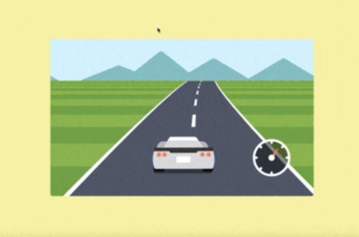

这是一款小型的赛车游戏，可以使用键盘的方向键来控制赛车的行驶方向，没有按键操作，速度就会变成 0。

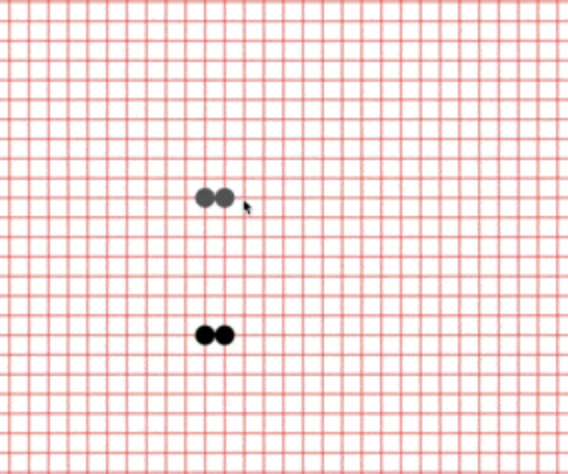

这是一款五子棋的小游戏，模拟五子棋游戏规则，游戏开始时一方先走，然后另一方再走，依次循环，直至一方有连成一条线的五个棋子，会自动判断输赢。

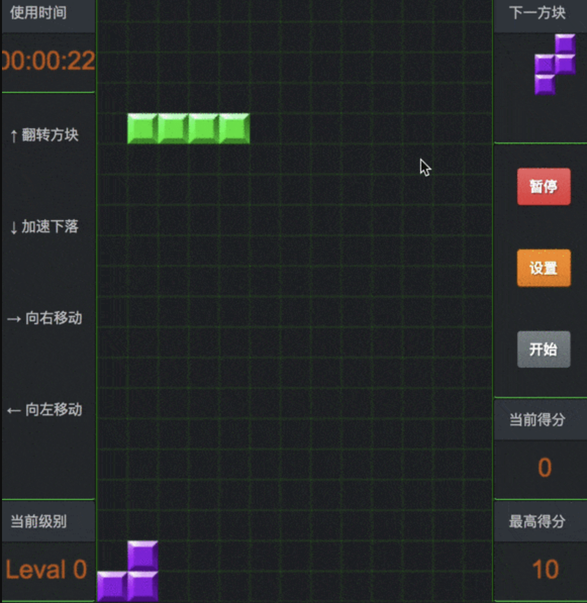

就连经典的俄罗斯方块游戏也可以使用 Canvas 来制作。也是需要通过键盘的方向键来控制方块，左右方向键是控制方块移动的方向，下键是加速下落，上键是翻转方块，直至某一行完全被填满就被消除。

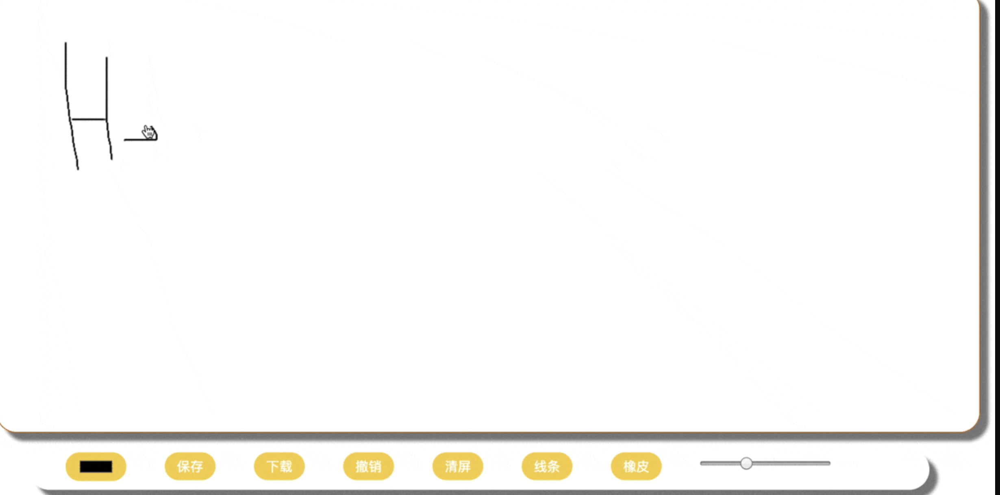

还有前一段挺火的你画我猜小游戏也可以通过 Canvas 来实现。保存了鼠标的轨迹，还有清除屏幕和橡皮擦等功能。也可以将其保存为一张图片。

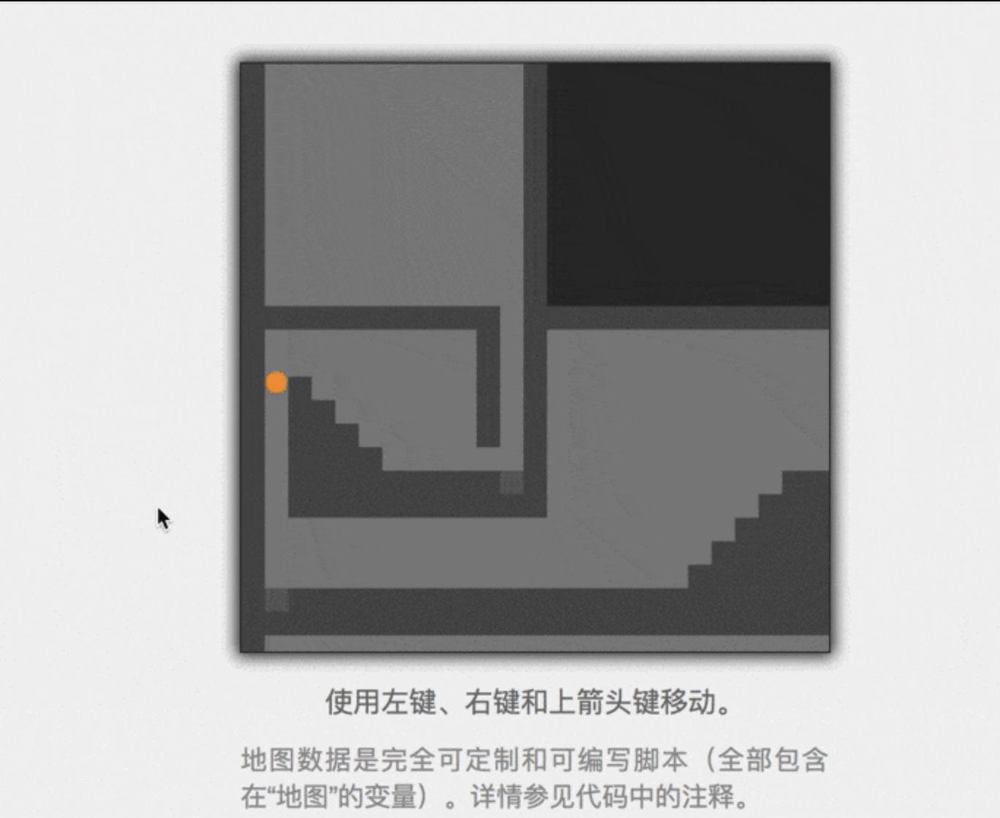

这是一款迷宫类的小游戏，同样是通过键盘的方向键来控制小球的移动，最终到达某个地点就会判定通过游戏。

### [#](#活动页面) 活动页面

相信很多的营销活动大家都做过，Canvas 也可以写活动页面哦~(๑•̀ㅂ•́)و，✧这是很多公司的营销策略~

例如：


很常见的活动页面，某宝店铺的常见套路，模拟转盘抽奖。点击按钮，转盘转动，然后转盘停止，指针落在哪个区域就提示中奖的奖品。

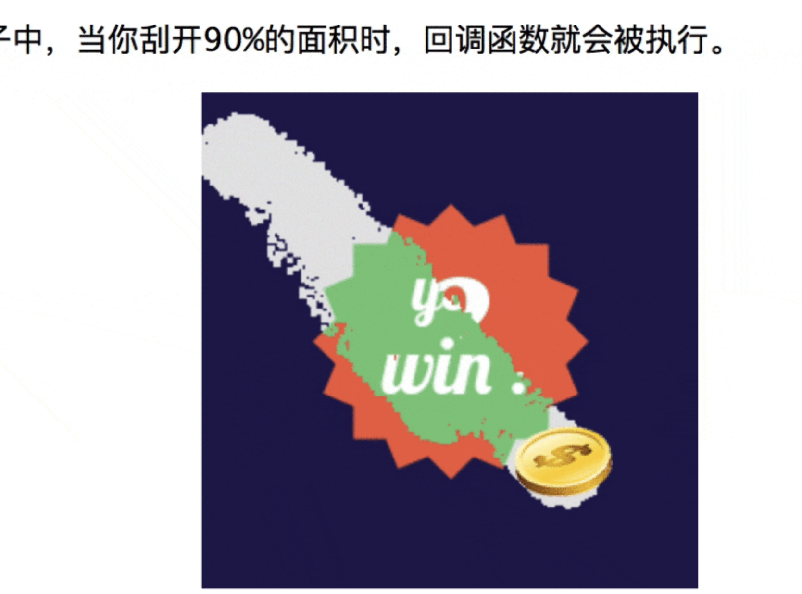

另一个比较常见的活动页面是刮刮乐的页面，在刮刮乐的区域，鼠标会显示为硬币的形状，然后按住鼠标并拖动，经过区域就会显示出最底层的图片，同时上层图片消失。模拟刮刮乐效果，刮开一定比例面积之后“刮奖”完成，返回回调函数。

### [#](#小特效) 小特效

Canvas 还可以做一些小特效哦，这些小特效可以装饰你 的网站，使它变得更加精致~

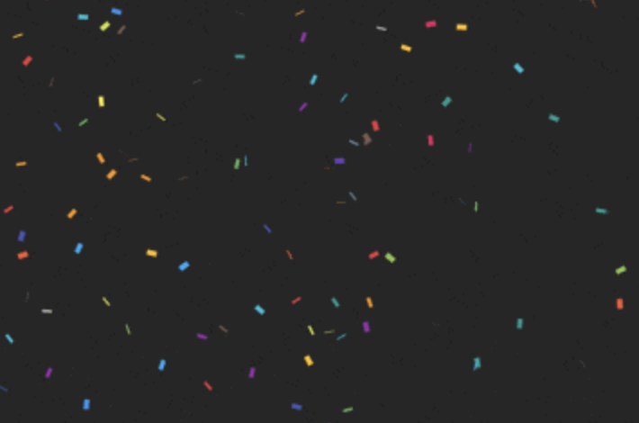

这个特效也可以在活动页面中用到。逼真的模拟了纸片下落的过程，随机出现的纸片有随机生成的颜色，然后模拟重力下落过程。

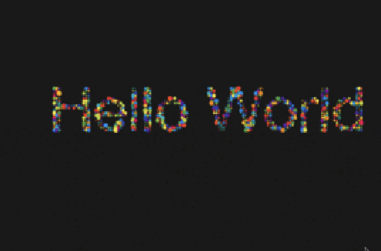

这个其实是很不错的，只不过 gif 图片看得不是特别清楚。随机生成的大小随机的圆形或方形粒子组成指定的文字，粒子会自动缩放，给人闪烁的感觉。

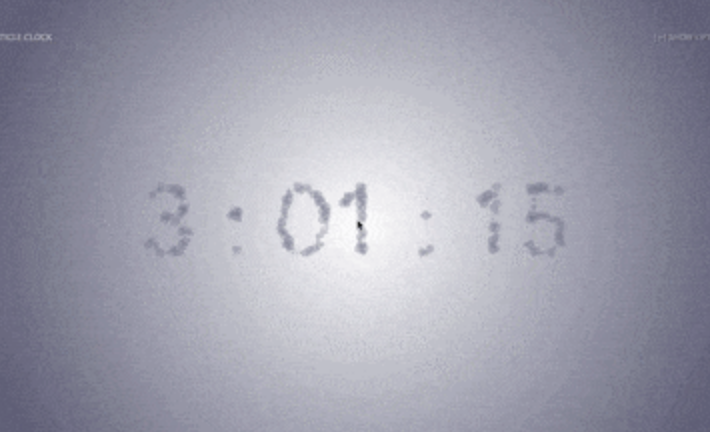

这个特效也是由粒子组合成文字的特效，只不过文字的内容是当前的时间，因为是 gif 图，所以大家看不到和鼠标的交互，这里粒子散开是因为我鼠标进行了点击，就是点击屏幕，粒子就会散开，点击的时间越长，粒子就越分散。当松开鼠标之后，所有的粒子就又全部回到原位~

试想一下，如果你的个人网站中的当前时间使用了这样一个小特效，是不是会让访客觉得很有趣呢~٩(๑>◡<๑)۶

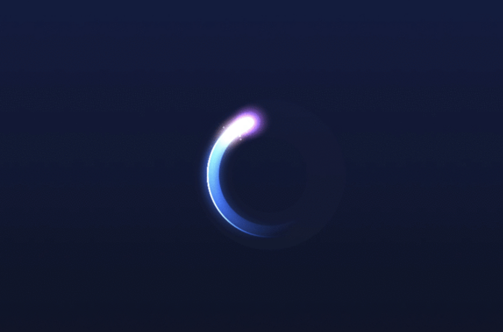

同样的小特效还有这个 loading，使用 canvas 制作一个这样的 loading，也会给你的网站增添亮点。

### [#](#炫酷背景) 炫酷背景

上述几种应用场景都只是带大家了解一下，不做过多的介绍，当然也还有其他的应用场景

> 因为 Canvas 的特性，所以如果你的网站想要一个炫酷的背景，那么 Canvas 无疑是最好的选择，让我们一起来欣赏一下 canvas 可以做出哪些炫酷的背景。

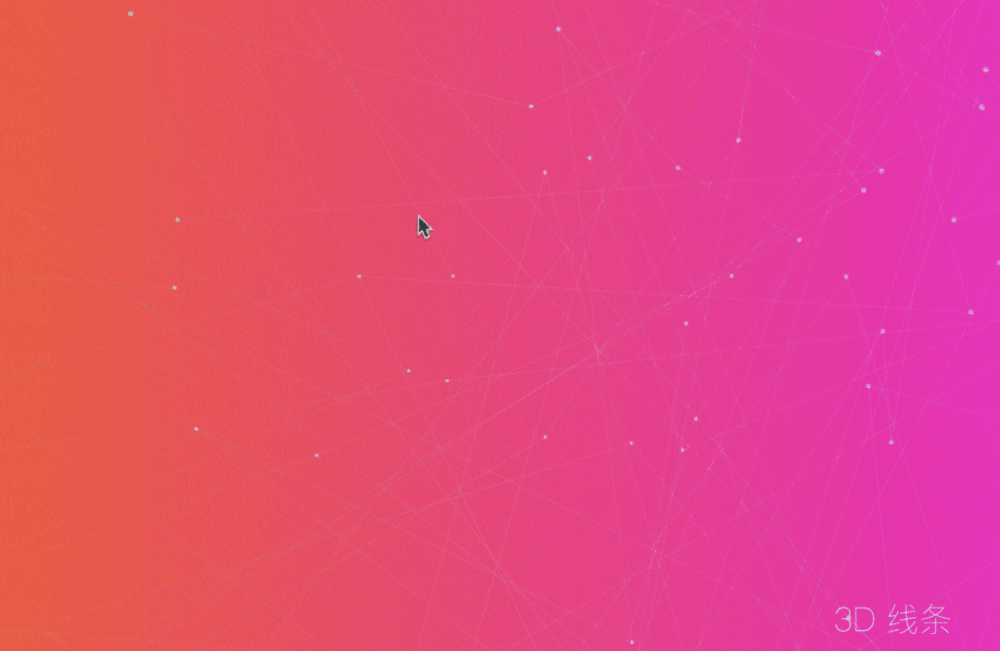

> 这个特效是使用 three.js 和 Canvas 制作出的 3D 线条，随机生成的线条构建成 3D 的立体空间，还有和鼠标的交互，鼠标的移动会使得 3D 空间移动。

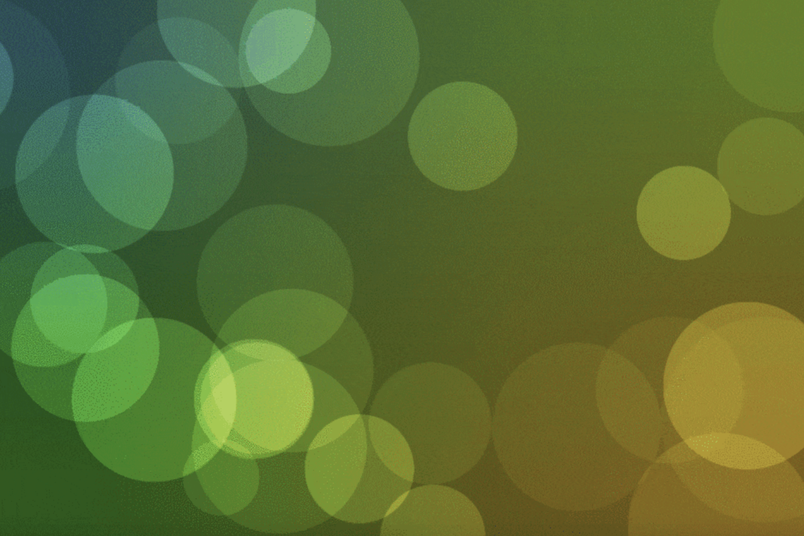

这个气泡背景也是很赞的，随机生成透明度不同的气泡，气泡不断移动，渐变色的背景也在不断变换，给人以梦幻的感觉。

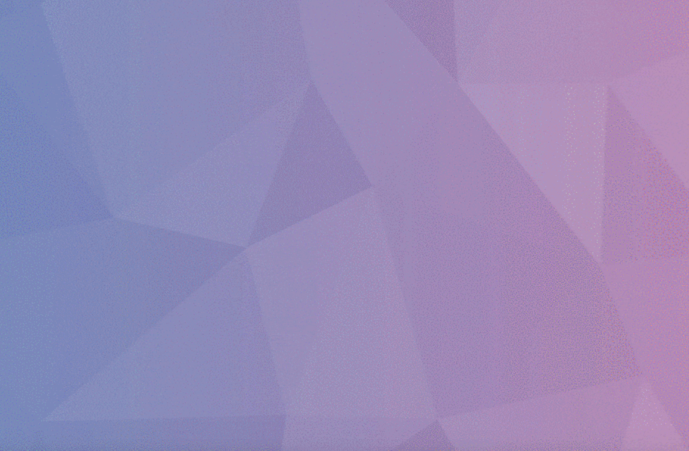

这个的变换频率其实没有这么快，两次变换中间是有几秒钟的停留时间的，因为制作的 gif 大小有要求，所以中间的给截掉了，只保留变换的部分。

这个特效给人的感觉是和钻石表面类似的菱角感觉，然后背景也是使用的渐变的颜色。一定时间就会变换一次。QQ 的登录框就是和这个类似的特效。

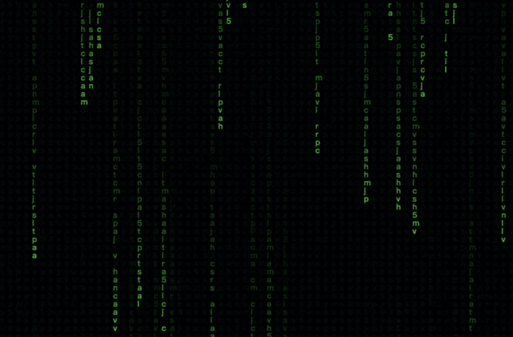

这个背景是黑客帝国的代码雨特效，可能男程序员会比较喜欢，代码从上向下下落的效果。

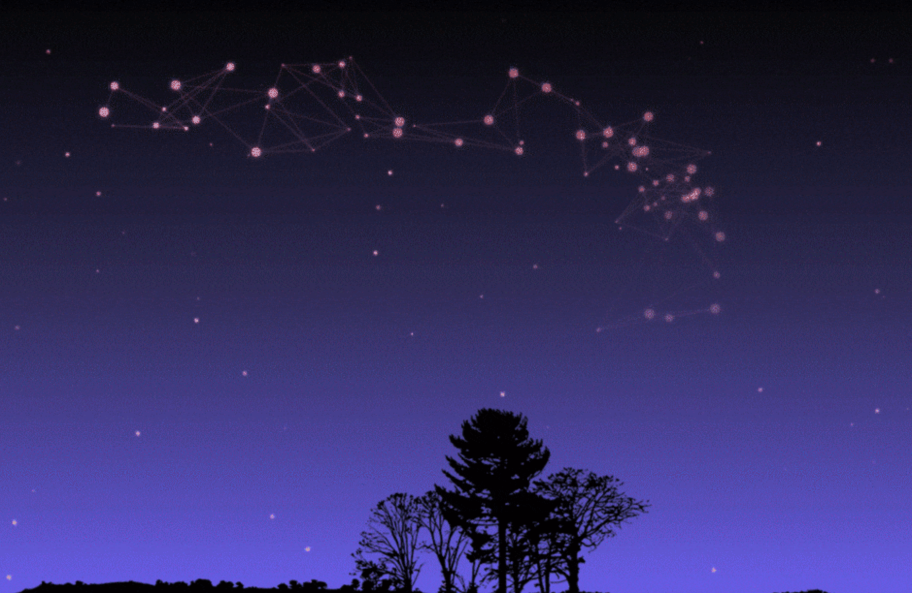

我个人是很喜欢这个特效的，前一段时间也将其作为我的个人博客的背景，该特效的背景是一个渐变色，随机生成的“小星星”会从下向上移动，最重要的是和鼠标有互动。鼠标经过的地方会产生“星星”并自动和其他的星星连成线。

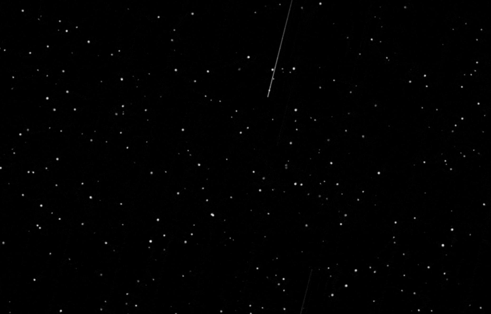

这个特效也是很不错的，模拟星空，随机生成的 “星星” 会有位移，透明度也在不断变化，会有 “流星” 随机从上向下掉落，并会有小尾巴的效果~

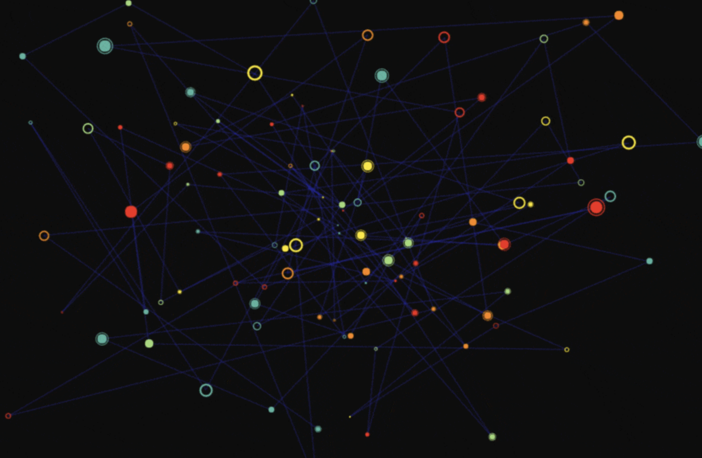

这个特效是以黑色为背景，彩色的随机实心 \+ 空心圆圈构成，所有的圈圈用直线相连，并且一直移动。

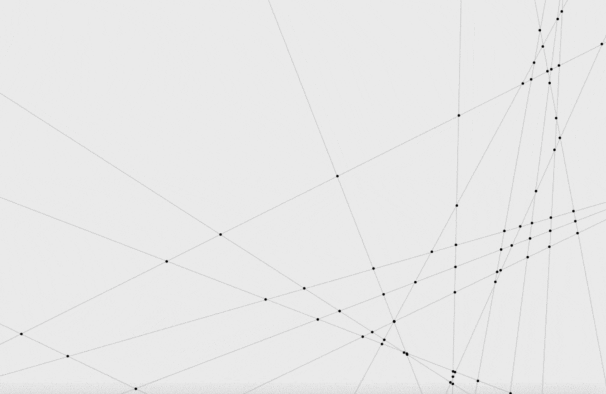

这个相交线特效其实也很简单，随机生成的线条在移动，相交的地方为小圆点。

带大家欣赏完这么多的特效之后，你是不是已经想使用 Canvas 来装饰你的个人网站了呢？心动不如行动，下面来带大家一起从零开始，一点一点分析怎么制作属于你自己的炫酷网页背景特效~ε==(づ′▽`)づ

[#](#三、入门-canvas) 三、入门 Canvas
-----------------------------

### [#](#创建-canvas-画布) 创建 Canvas 画布

> 当我只在页面上写一个 `Canvas` 标签时，将其背景颜色设置为黑色，会是什么效果呢？

    <!DOCTYPE html>
    <html lang="en">
    <head>
        <meta charset="UTF-8">
        <title>Title</title>
        <style>
            #canvas {
                background: #000;
            }
        </style>
    </head>
    <body>
        <canvas id="canvas"></canvas>
    </body>
    </html>


我们打开浏览器来看一下：

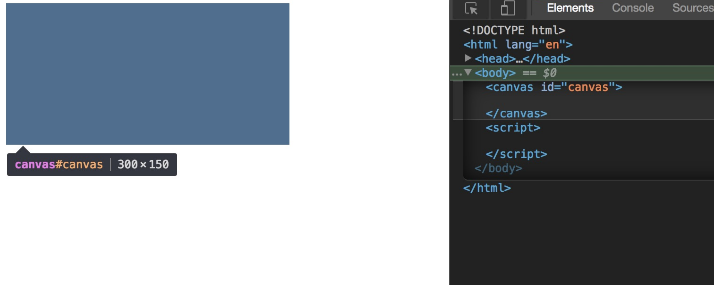

> 在上面的例子中页面上只有一个 Canvas，没有设置宽高，那么会自动创建一个 `300 \* 150` 的画布（单位默认为 `px`）

**那么我们怎么改变画布的大小呢，有三种方式**

*   `HTML` 设置 `width`、`height`；
*   `CSS` 设置 `width`、`height`；
*   `JS` 动态设置 `width`、`height`。

> 我们来试一下这三种方式。有的人会问了，这不是很简单的么，还有介绍的必要吗？这就和我们听数学课是一样的，那些很简单的知识点你就不注意听，然后 10 分钟过后，一脸懵逼的不知道老师在讲什么，或者说是遇到问题了不知道错在哪，往往也都是基础的问题没有仔细听~

**1\. HTML 属性设置 `width`、`height`**

> 我们先来看一下直接使用 `HTML` 属性来设置 `width`、`height`：

    <!DOCTYPE html>
    <html lang="en">
    <head>
        <meta charset="UTF-8">
        <title>Title</title>
        <style>
          #canvas {
              background: #000;
          }
        </style>
    </head>
    <body>
    <canvas id="canvas" width="400" height="400">
    
    </canvas>
    <script>
        var canvas = document.getElementById("canvas");
        var context = canvas.getContext("2d");
    
        context.beginPath();
        context.arc(100, 100, 50, 0, Math.PI * 2, true);
        context.closePath();
        context.fillStyle = 'rgb(255,255,255)';
        context.fill();
    </script>
    </body>
    </html>


​    

> 我们设置 Canvas 画布的宽度为 400，高度为 400，背景颜色为黑色（在 HTML 属性中直接设置宽度和高度是可以不加单位的，默认单位是 `px`）。在 Canvas 上画了一个圆心坐标为 100px、100px，半径为 50px 的白色的圆。来看一下浏览器中的显示效果：

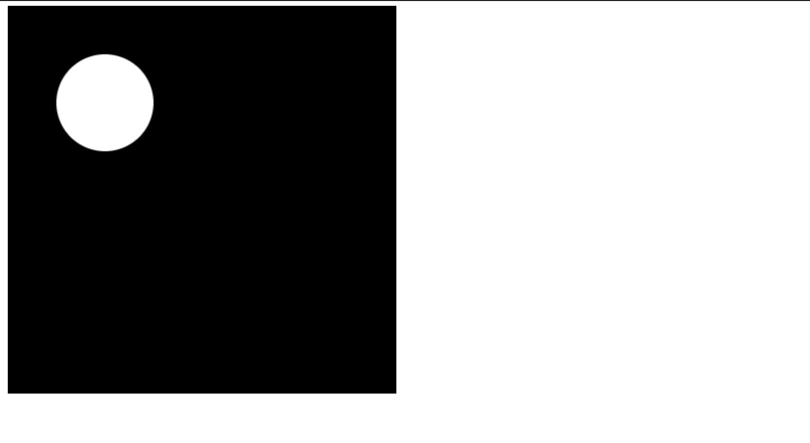

**2\. CSS 属性设置 `width`、`height`**

还是上面那个例子，这次我们将宽度和高度使用 CSS 来设置：

    <!DOCTYPE html>
    <html lang="en">
    <head>
        <meta charset="UTF-8">
        <title>Title</title>
        <style>
            #canvas {
                background: #000;
                width: 400px;
                height: 400px;
            }
        </style>
    </head>
    <body>
    <canvas id="canvas">
    
    </canvas>
    <script>
        var canvas = document.getElementById("canvas");
        var context = canvas.getContext("2d");
    
        context.beginPath();
        context.arc(100, 100, 50, 0, Math.PI * 2, true);
        context.closePath();
        context.fillStyle = 'rgb(255,255,255)';
        context.fill();
    </script>
    </body>
    </html>


​    

我们来看下浏览器中的显示效果：

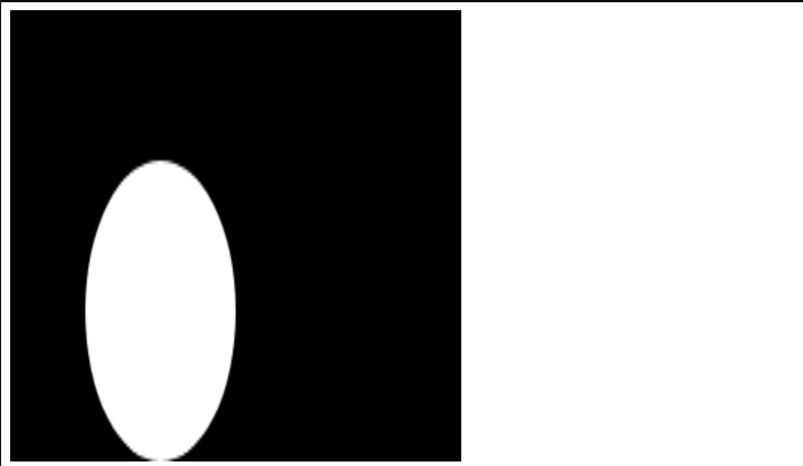

OMG ヽ(；´Д｀)ﾉ，怎么会是这个样子，我明明是要画一个圆啊，怎么变成椭圆了，是不是我代码写的有问题？

检查下代码，没问题呀o((⊙﹏⊙))o.那么为什么会显示成这个样子呢？

> 原来是因为如果使用 CSS 来设置宽高的话，画布就会按照 `300 * 150` 的比例进行缩放，也就是将 `300 * 150` 的页面显示在 `400 * 400` 的容器中。

**3\. JS 属性设置 `width`、`height`**

> 那我们再来看一下如果使用 JS 来设置宽高会是神马效果呢~

    <!DOCTYPE html>
    <html lang="en">
    <head>
        <meta charset="UTF-8">
        <title>Title</title>
        <style>
            #canvas {
                background: #000;
            }
        </style>
    </head>
    <body>
    <canvas id="canvas">
    
    </canvas>
    <script>
        var canvas = document.getElementById("canvas");
        var context = canvas.getContext("2d");
        var cx = canvas.width = 400;
        var cy = canvas.height = 400;
    
        context.beginPath();
        context.arc(100, 100, 50, 0, Math.PI * 2, true);
        context.closePath();
        context.fillStyle = 'rgb(255,255,255)';
        context.fill();
    </script>
    </body>
    </html>


在浏览器中的效果如下：

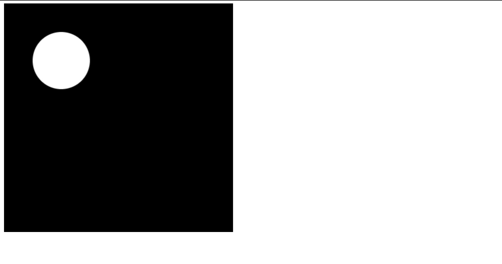

这样就是正常的嘛~

> 所以我们尽量使用 HTML 的`width` 和 `height` 属性或者直接使用 JS 动态来设置宽高，不要使用 CSS 设置。

### [#](#获取-canvas-对象) 获取 Canvas 对象

> 在前面的例子中，我们已经创建了一个 Canvas 画布，那么第二步要做的就是获取到 Canvas 的上下文环境，对应的语法为： `canvas.getContext(contextType, contextAttributes);`

*   上下文类型（contextType）：
    *   2d（本小册所有的示例都是 2d 的）：代表一个二维渲染上下文
    *   webgl（或"experimental-webgl"）：代表一个三维渲染上下文
    *   webgl2（或"experimental-webgl2"）：代表一个三维渲染上下文；这种情况下只能在浏览器中实现 WebGL 版本2 (OpenGL ES 3.0)。

第二个参数并不是经常用到，所以这里就不给大家介绍了，有兴趣的可以查阅 MDN 文档~

> 通常在创建好一个 Canvas 标签的时候，我们要做的第一步就是要先获取到这个 Canvas 的上下文对象：

    var canvas = document.getElementById("canvas");
    var context = canvas.getContext("2d");


### [#](#绘制路径) 绘制路径

> 使用过 PS 的应该都会知道在 PS 中有路径的概念，在 Canvas 中也有路径的概念。只不过和 PS 中的路径不同的是，PS 中的路径是矢量的，而 Canvas 中的路径不是。下面我们来看一下有哪些创建路径的方法：

*   `fill()` 填充路径
*   `stroke()` 描边
*   `arc()` 创建圆弧
*   `rect()` 创建矩形
*   `fillRect()` 绘制矩形路径区域
*   `strokeRect()` 绘制矩形路径描边
*   `clearRect()` 在给定的矩形内清除指定的像素
*   `arcTo()` 创建两切线之间的弧/曲线
*   `beginPath()` 起始一条路径，或重置当前路径
*   `moveTo()` 把路径移动到画布中的指定点，不创建线条
*   `lineTo()` 添加一个新点，然后在画布中创建从该点到最后指定点的线条
*   `closePath()` 创建从当前点回到起始点的路径
*   `clip()` 从原始画布剪切任意形状和尺寸的区域
*   `quadraticCurveTo()` 创建二次方贝塞尔曲线
*   `bezierCurveTo()` 创建三次方贝塞尔曲线
*   `isPointInPath()` 如果指定的点位于当前路径中，则返回 true，否则返回 false

看完了上述方法你是不是有点不知所措，一下子这么多方法(╬￣皿￣)=○

你可以把上面的表格作为一个“字典”，在下面的代码中如果遇到不认识的方法可以查找一下，一回生，二回熟。

下面我将上面的方法分为以下几部分来给大家介绍下。

**1\. 使用 Canvas 画一个点**

> 我们先从最基本的开始，使用 Canvas 画一个点。其实画一个点也就相当于画一个半径为 1 的圆，那我们就可以改造这一节开始的例子，将半径由 50 变为 1。

    <!DOCTYPE html>
    <html lang="en">
    <head>
        <meta charset="UTF-8">
        <title>Title</title>
        <style>
            #canvas {
                background: #000;
            }
        </style>
    </head>
    <body>
    <canvas id="canvas">
    
    </canvas>
    <script>
        var canvas = document.getElementById("canvas");
        var context = canvas.getContext("2d");
        var cx = canvas.width = 400;
        var cy = canvas.height = 400;
    
        context.beginPath();
        context.arc(100, 100, 1, 0, Math.PI * 2, true);
        context.closePath();
        context.fillStyle = 'rgb(255,255,255)';
        context.fill();
    </script>
    </body>
    </html>


​    

让我们来看一下效果：

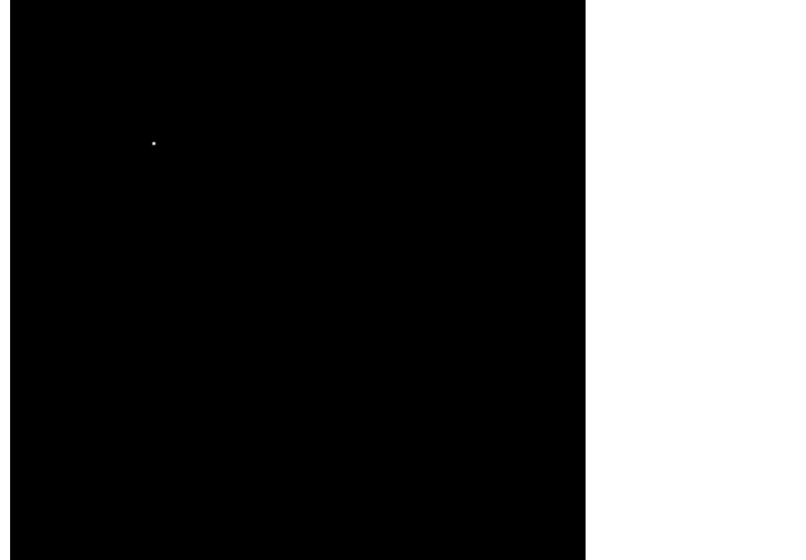

有没有看到左上部分有一个白色的点，没有看到？没有看到的同学点开大图看一下(／_＼)

细心的小伙伴可能会发现我们改动了哪里：

    context.arc(100, 100, 1, 0, Math.PI * 2, true);


> 将第三个参数由 50 改为了 1，聪明的你一定可以猜出来 `arc()` 这个方法的作用了。\\（￣︶￣）/，稍后我们再介绍 `arc()` 函数。

先来看一下在获取完 Canvas 的上下文环境之后，我们又做了哪些操作：

    context.beginPath();       // 起始一条路径，或重置当前路径
    context.arc(100, 100, 1, 0, Math.PI * 2, true);  // 创建弧/曲线
    context.closePath();       // 创建从当前点回到起始点的路径
    context.fillStyle = 'rgb(255,255,255)'; // 设置或返回用于填充绘画的颜色、渐变或模式
    context.fill();            // 填充当前绘图（路径）


​    

我们可以总结出，使用 `Canvas` 绘制图像的步骤：

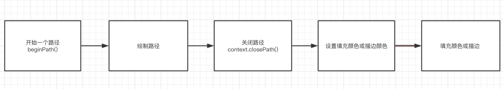

通过使用 Canvas 绘制一个点，我们了解了在 Canvas 中绘图的大致步骤，下面我们来看一下刚刚提到的 `arc()` 方法。

**2\. 绘制弧/曲线**

`arc()` 方法创建弧/曲线（用于创建圆或部分圆）。

    context.arc(x,y,r,sAngle,eAngle,counterclockwise);


*   `x`：圆心的 `x` 坐标
*   `y`：圆心的 `y` 坐标
*   `r`：圆的半径
*   `sAngle`：起始角，以弧度计（弧的圆形的三点钟位置是 0 度）
*   `eAngle`：结束角，以弧度计
*   `counterclockwise`：可选。规定应该逆时针还是顺时针绘图。`false` 为顺时针，`true` 为逆时针

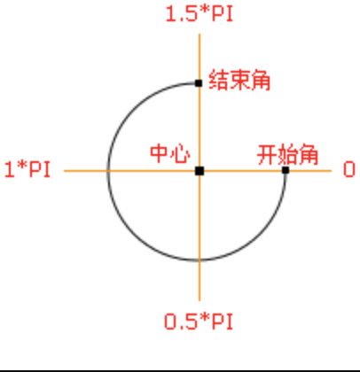

比如我们想画一个顺时针的四分之一圆，应该怎么写呢？

    var canvas = document.getElementById("canvas");
    var context = canvas.getContext("2d");
    var cx = canvas.width = 400;
    var cy = canvas.height = 400;
    
    context.beginPath();
    context.arc(100, 100, 50, 0, Math.PI * 0.5, false);
    context.strokeStyle="white";
    context.stroke();


我们先来看一下浏览器中的效果：

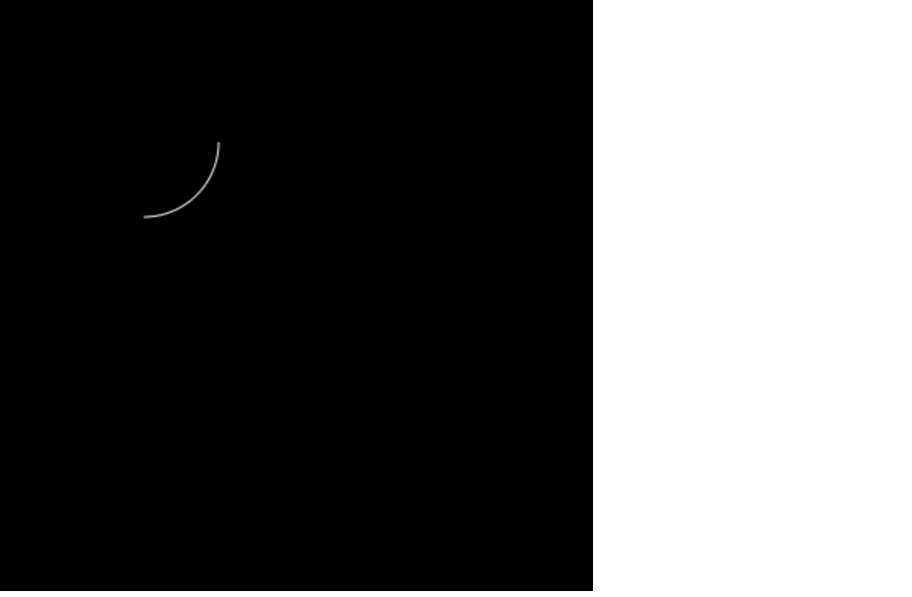

是不是你想要的效果呢(๑´ㅂ`๑)

其实只要找好起始角和结束角就成功一半了呢。

*   因为我们设置的起始角是 0，对照 w3cschool 上的截图可知弧度的 0 的位置是 3 点钟方向，然后结束角我们设置为 0.5 PI，也就是 6 点钟方向，然后我们再设置描边颜色并且进行描边，就得出上图的效果。
*   这里你可能会问，为什么这个不是闭合的图形呢？因为我只设置了 `beginPath` 并没有设置 `closePath`，所以这就不是一条闭合的路径。我们加上 `cloasePath` 看一下效果。

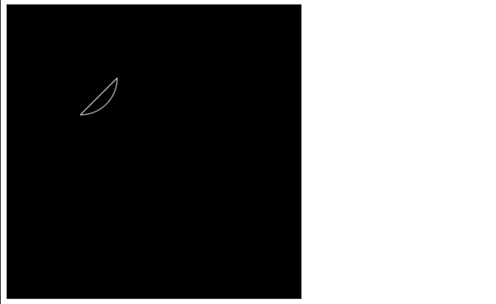

如果跟着我一起写代码的话你就会发现，这个是空心的，并没有整个路径都被填充，这是怎么回事呢？

> 这是因为 `stroke()` 和 `fill()` 的区别，根据上面的两个例子，我们很容易看出这两个函数的区别：一个是描边，一个是填充。

*   `stroke()` ：描边
*   `fill()` ：填充

> 我们可以通过 `strokeStyle`属性 和 `fillStyle`属性来设置描边和填充的颜色。这里不仅可以设置单一的颜色，还可以设置渐变。

**3\. 绘制直线**

下面我们来绘制一条线。

    var canvas = document.getElementById("canvas");
    var context = canvas.getContext("2d");
    var cx = canvas.width = 400;
    var cy = canvas.height = 400;
    
    context.beginPath();
    context.moveTo(50,50);
    context.lineTo(100,100);
    context.strokeStyle = '#fff';
    context.stroke();


我们来看一下浏览器中的效果：

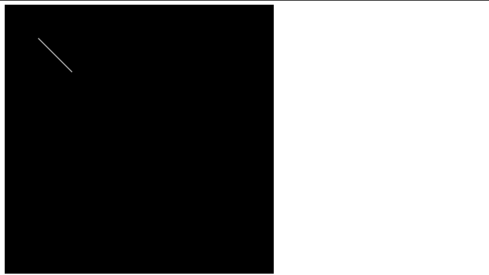

在绘制直线的例子中，我们使用了

*   `moveTo(x,y)`：把路径移动到画布中的指定点，不创建线条
*   `lineTo(x,y)`：添加一个新点，然后在画布中创建从该点到最后指定点的线条

这里需要注意以下几点：

*   如果没有 `moveTo`，那么第一次 `lineTo` 的就视为 `moveTo`
*   每次 `lineTo` 后如果没有 `moveTo`，那么下次 `lineTo` 的开始点为前一次 `lineTo` 的结束点。

也就是这种情况：

    var canvas = document.getElementById("canvas");
    var context = canvas.getContext("2d");
    var cx = canvas.width = 400;
    var cy = canvas.height = 400;
    
    context.beginPath();
    context.lineTo(200, 200);
    context.lineTo(200, 100);
    context.lineTo(100,50);
    context.strokeStyle = '#fff';
    context.stroke();


> 我们没有设置 `moveTo`，而是设置了三个 `lineTo`，这也是可以的，将三个 `lineTo` 设置的点依次连接就好~

效果如下：

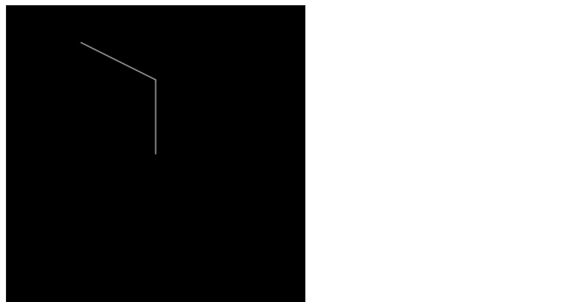

在绘制了直线之后，我们来看一下怎么给绘制的直线添加样式：

*   `lineCap` 设置或返回线条的结束端点样式
*   `lineJoin` 设置或返回两条线相交时，所创建的拐角类型
*   `lineWidth` 设置或返回当前的线条宽度
*   `miterLimit` 设置或返回最大斜接长度

我们来看下这些 **属性** 是怎么使用的。

    var canvas = document.getElementById("canvas");
    var context = canvas.getContext("2d");
    var cx = canvas.width = 400;
    var cy = canvas.height = 400;
    
    context.beginPath();
    
    context.moveTo(10,10);
    context.lineTo(100,100);
    context.lineWidth = 10;
    context.lineCap = 'round';
    context.strokeStyle = '#fff';
    context.stroke()


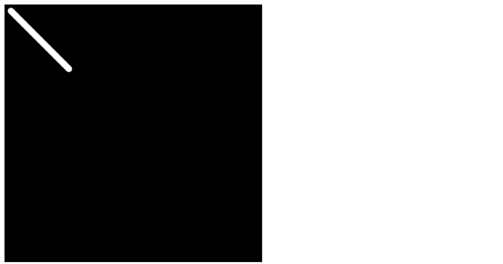

> 我绘制了一条由点 (10,10) 到点 (100,100) 的直线，然后将其宽度设置为 10，并且加上“圆角”的效果。

这里我们要注意区分哪些是方法哪些是属性，如果是方法，只需要在括号中传入参数就可以；如果是属性，那么我们就要使用等号给其赋值。有的时候你会奇怪，为什么我这么设置了但是却没有效果呢？很有可能是你将方法和属性搞混了哦 (●ﾟωﾟ●)

**4\. 绘制矩形**

在了解了最基本的绘制点、线的方法之后，我们来看一下如何绘制一个矩形。

    var canvas = document.getElementById("canvas");
    var context = canvas.getContext("2d");
    var cx = canvas.width = 400;
    var cy = canvas.height = 400;
    
    context.beginPath();
    context.fillStyle = '#fff';
    context.fillRect(10, 10, 100, 100);
    context.strokeStyle = '#fff';
    context.strokeRect(130, 10, 100, 100);


这里我们使用下面的方法：

*   `fillRect(x,y,width,height)`：绘制一个实心矩形
*   `strokeRect(x,y,width,height)`：绘制一个空心矩形

> 同样的，我们可以通过 `fillStyle()` 和 `strokeStyle()` 来设置填充的颜色和描边的颜色。

### [#](#颜色、样式和阴影) 颜色、样式和阴影

> 上面几个函数教大家怎么绘制点、线、以及圆形和矩形，都是通过先创建路径，然后再使用 `fill()` 或 `stroke()` 进行填充或者描边。

下面我们再具体看一下都可以给路径设置哪些属性来改变其样式。

*   `fillStyle` 设置或返回用于填充绘画的颜色、渐变或模式
*   `strokeStyle` 设置或返回用于笔触的颜色、渐变或模式
*   `shadowColor` 设置或返回用于阴影的颜色
*   `shadowBlur` 设置或返回用于阴影的模糊级别
*   `shadowOffsetX` 设置或返回阴影距形状的水平距离
*   `shadowOffsetY` 设置或返回阴影距形状的垂直距离
*   `fillStyle` 和 `strokeStyle` 这两个属性我们一直在使用，所以对于它们我们不再作过多的介绍。

**1\. 设置阴影**

> 设置阴影我们用到的是 `shadowBlur` 这个属性。

    var canvas = document.getElementById("canvas");
    var context = canvas.getContext("2d");
    var cx = canvas.width = 400;
    var cy = canvas.height = 400;
    
    context.beginPath();
    context.arc(100,100,50,0,2*Math.PI,false);
    context.fillStyle = '#fff';
    context.shadowBlur = 20;
    context.shadowColor = '#fff';
    context.fill()


> 同样的方（tao）法（lu），我们只要在 `fill()` 方法之前设置模糊指数（`shadowBlur`）和颜色（`shadowColor`）就可以了。让我们来看一下浏览器中的效果：

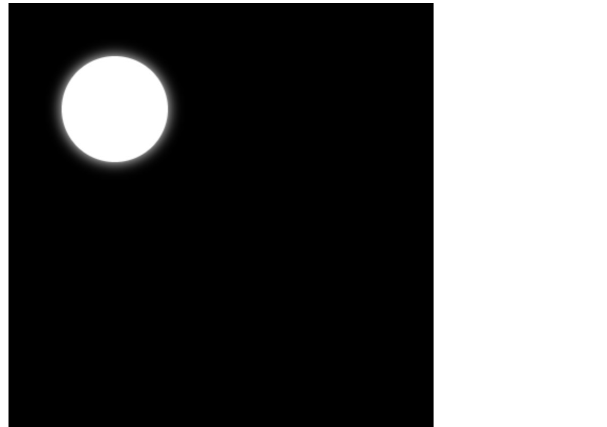

在暗色背景中有一个亮色的圆并且加了阴影效果，是不是很像发光的月亮呢(●´∀｀●)ﾉ

**2\. 设置渐变**

我们先来看一下怎么设置渐变：

*   `createLinearGradient()` 创建线性渐变（用在画布内容上）
*   `createPattern()` 在指定的方向上重复指定的元素
*   `createRadialGradient()` 创建放射状/环形的渐变（用在画布内容上）
*   `addColorStop()` 规定渐变对象中的颜色和停止位置

> 其中绘制渐变主要用到了 `createLinearGradient()` 方法，我们来看一下这个方法： `context.createLinearGradient(x0,y0,x1,y1);`

*   `x0`：开始渐变的 `x` 坐标
*   `y0`：开始渐变的 `y` 坐标
*   `x1`：结束渐变的 `x` 坐标
*   `y1`：结束渐变的 `y` 坐标

这是设置比如说我们下一个粉色到白色的由上向下的渐变：

    var canvas = document.getElementById("canvas");
    var context = canvas.getContext("2d");
    var cx = canvas.width = 400;
    var cy = canvas.height = 400;
    
    var grd = context.createLinearGradient(100,100,100,200);
    grd.addColorStop(0,'pink');
    grd.addColorStop(1,'white');
    
    context.fillStyle = grd;
    context.fillRect(100,100,200,200);


我们看一下浏览器中的效果：

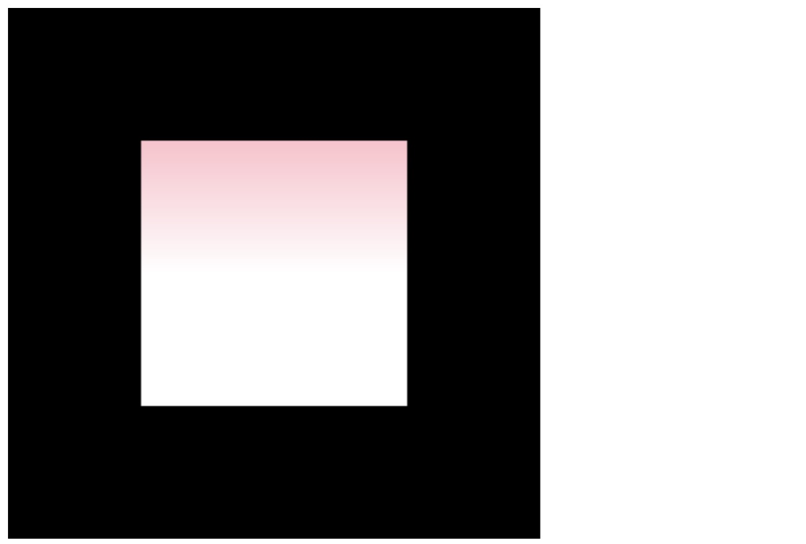

> 可以看出，`createLinearGradient()` 的参数是两个点的坐标，这两个点的连线实际上就是渐变的方向。我们可以使用 `addColorStop()` 方法来设置渐变的颜色。

> `gradient.addColorStop(stop,color);`:

*   `stop`：介于 0.0 与 1.0 之间的值，表示渐变中开始与结束之间的位置
*   `color`：在结束位置显示的 CSS 颜色值

我们可以设置多个颜色断点，比如，要实现一个彩虹的效果，只需要多增加几个颜色断点就可以了~

    var canvas = document.getElementById("canvas");
    var context = canvas.getContext("2d");
    var cx = canvas.width = 400;
    var cy = canvas.height = 400;
    
    var grd = context.createLinearGradient(0,0,0,400);
    grd.addColorStop(0,'rgb(255, 0, 0)');
    grd.addColorStop(0.2,'rgb(255, 165, 0)');
    grd.addColorStop(0.3,'rgb(255, 255, 0)');
    grd.addColorStop(0.5,'rgb(0, 255, 0)');
    grd.addColorStop(0.7,'rgb(0, 127, 255)');
    grd.addColorStop(0.9,'rgb(0, 0, 255)');
    grd.addColorStop(1,'rgb(139, 0, 255)');
    
    context.fillStyle = grd;
    context.fillRect(0,0,400,400);


​    

效果如下：

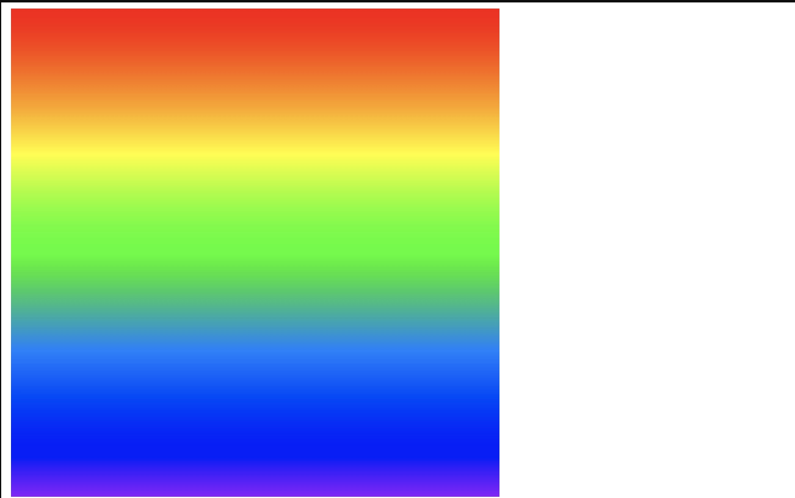

### [#](#图形转换) 图形转换

在了解完了最基本的绘制路径和设置样式之后，我们来看一下怎么来进行图形的变换。

**我们先来看一下图形转换都有哪些方法：**

*   `scale()` 缩放当前绘图至更大或更小
*   `rotate()` 旋转当前绘图
*   `translate()` 重新映射画布上的 `(0,0)` 位置
*   `transform()` 替换绘图的当前转换矩阵
*   `setTransform()` 将当前转换重置为单位矩阵，然后运行 `transform()`

**1\. 缩放**

> 我们来看一下怎么使用 Canvas 实现缩放的功能，绘制一个矩形；放大到 200%，再次绘制矩形；放大到 200%，然后再次绘制矩形；放大到 200%，再次绘制矩形：

    var canvas = document.getElementById("canvas");
    var context = canvas.getContext("2d");
    var cx = canvas.width = 400;
    var cy = canvas.height = 400;
    
    context.strokeStyle = 'white';
    context.strokeRect(5,5,50,25);
    context.scale(2,2);
    context.strokeRect(5,5,50,25);
    context.scale(2,2);
    context.strokeRect(5,5,50,25);


只是使用 `scale()` 方法就可以实现缩放的效果，我们再来看一下浏览器中的显示情况：

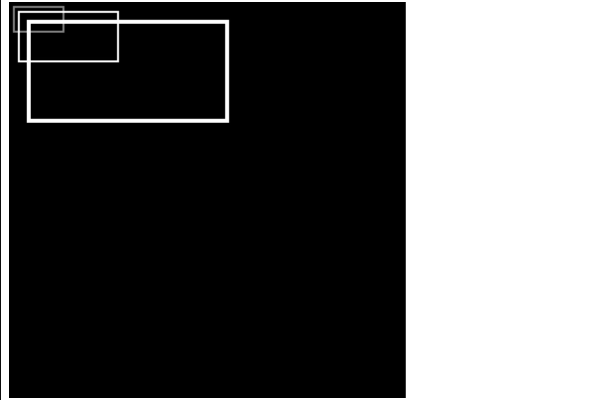

> 可以看到，在设置 `scale()` 方法之后再设置的矩形，无论是线条的宽度还是坐标的位置，都被放大了。并且 `scale()` 的效果是可以叠加的，也就是说，我们在上面的例子中使用了两次 `scale(2,2)` 那么，最后一个矩形相对于第一个矩形长和宽，以及坐标的位置就放大了 4 倍。

**2\. 旋转**

其实在图形变换中，只要掌握了一种，其他的图形变换方式就会迎刃而解了。我们再来看一下旋转的例子吧。

    var canvas = document.getElementById("canvas");
    var context = canvas.getContext("2d");
    var cx = canvas.width = 400;
    var cy = canvas.height = 400;
    
    context.fillStyle = 'white';
    context.rotate(20*Math.PI/180);
    context.fillRect(70,30,200,100);


我们使用的是 `rotate()` 方法 `context.rotate(angle);`

*   `angle` : 旋转角度，以弧度计。 如需将角度转换为弧度，请使用 `degrees*Math.PI/180` 公式进行计算。 举例：如需旋转 5 度，可规定下面的公式：`5*Math.PI/180`。

在刚刚的例子中，我们将画布旋转了 20°，然后再画了一个矩形。

通过上述两个例子，我们会发现一个特点，在进行图形变换的时候，我们需要画布旋转，然后再绘制图形。

这样的结果是，我们使用的图形变换的方法都是作用在画布上的，既然对画布进行了变换，那么在接下来绘制的图形都会变换。这点是需要注意的。

比如我对画布使用了 `rotate(20*Math.PI/180)` 方法，就是将画布旋转了 20°，然后之后绘制的图形都会旋转 20°。

### [#](#图像绘制) 图像绘制

> `Canvas` 还有一个经常用的方法是`drawImage()`。

*   `drawImage()`

向画布上绘制图像、画布或视频

> `context.drawImage(img,sx,sy,swidth,sheight,x,y,width,height);`

*   `img`：规定要使用的图像、画布或视频
*   `sx`：可选。开始剪切的 x 坐标位置
*   `sy`：可选。开始剪切的 y 坐标位置
*   `swidth`：可选。被剪切图像的宽度
*   `sheight`：可选。被剪切图像的高度
*   `x`：在画布上放置图像的 x 坐标位置
*   `y`：在画布上放置图像的 y 坐标位置
*   `width`：可选。要使用的图像的宽度（伸展或缩小图像）
*   `height`：可选。要使用的图像的高度（伸展或缩小图像）

> 经过上面对 Canvas 常见方法的介绍，相信你也可以绘制一些基本的图形了，你看到的那些炫酷的效果都是由这些简单的图形构成的。在下一节我将会带大家分析怎么使用这些最基本的元素来组成炫酷的特效~~

### [#](#源码) 源码

各种特效的源码地址：[poetries/canvas](https://github.com/poetries/canvas)

[#](#四、炫酷背景特效的通性) 四、炫酷背景特效的通性
-----------------------------

> 接下来，我们来分析下本小册的主题：“制作炫酷的网页背景特效”，我们可以从中提取出以下关键词：

*   背景
*   炫酷
*   效果

我们分别从这三个方面来分析，一个炫酷的网页背景都有哪些通性。

### [#](#背景) 背景

> 我们要制作的是一个可以作为背景的特效，那么首要的条件就是这是一个背景，我们这里所说的背景是一个全屏的背景，充满你整个屏幕，我们来分析下 “全屏” 背景应该是怎样的。

在普通的页面制作中，我们观察设计稿，可以看出，背景往往是纯色的或者是渐变的，再或者就是有规律的可以平铺的图形。

**为什么要将背景设置为纯色、渐变或可平铺的图形呢？**

首先是因为用户使用的显示屏的尺寸我们是不知道的，甚至不知道是移动设备还是 PC，综合起来，能够显示我们网站的设备就太多了。

为了适配所有的设备，尽可能让所有的设备都能够显示出相同的效果，不能相差太远，这种情况我们就只能将背景设置为单一的颜色，或者两种颜色（渐变），再或者一些可平铺的图案，让其在各个终端下都有相同的显示效果。

说到渐变，我个人是比较喜欢将背景设置为渐变的，关注我的朋友可能都知道，我文章的封面图一般都是一个渐变的背景 \+ 文字。简洁却不简单，因为每一个渐变图案都是我自己精挑细选的。

也有人问我我的渐变颜色的取值都是从哪里去的呢？是我有独特的审美吗，(/□＼*)

我也希望是我自己做出来的啦，但是，答案，当然不是的啦，都是在网站上 down 的。网址可以分享给大家：[uigradients](https://uigradients.com/#MangoPulp) 。

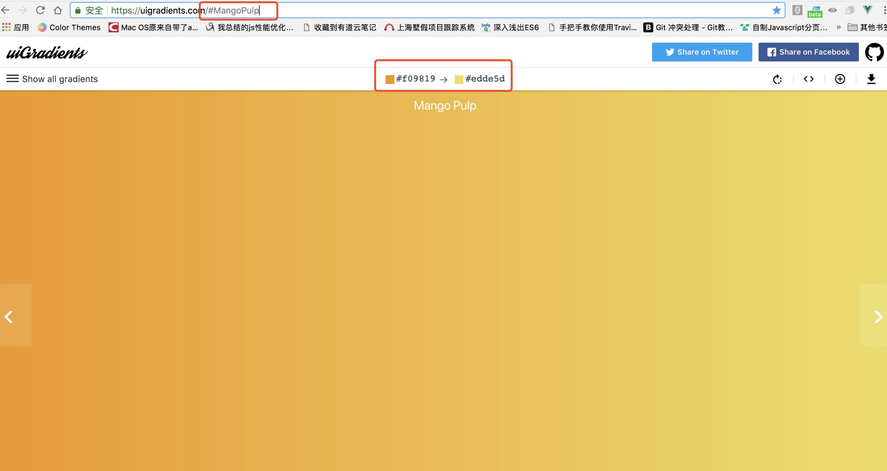

这个网站可以自己生成渐变色，你的配色也可以跟大家分享，可以保存为图片，也可以导出为 CSS 样式。

我们可以从这个网站上找到喜欢的配色，然后导出为 CSS 样式使用。

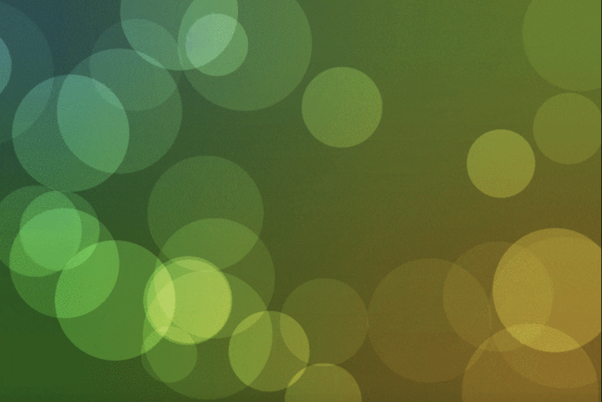

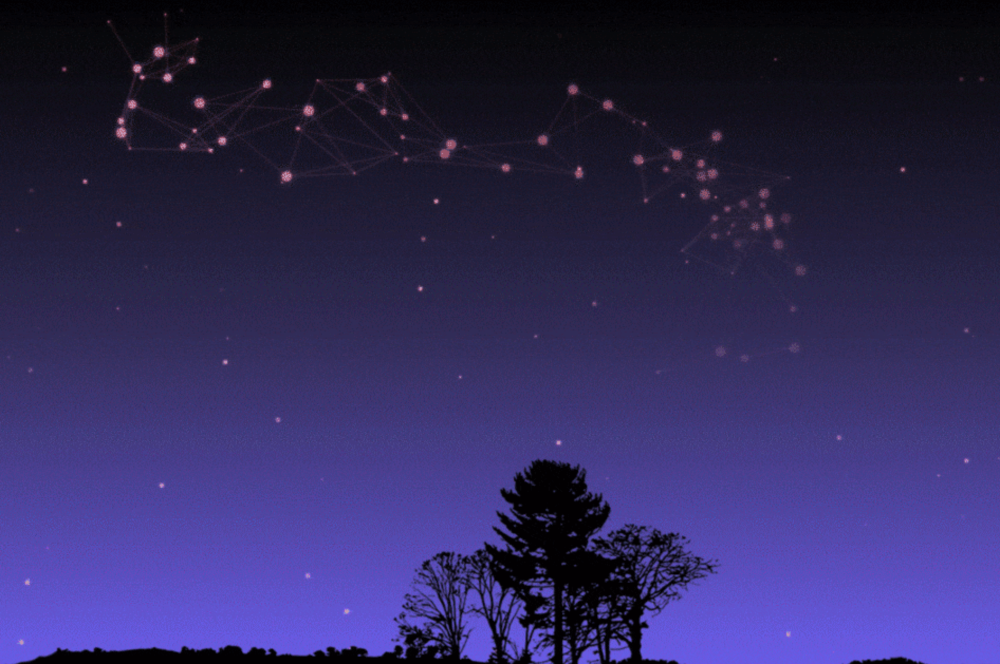

我们看上面的两个例子，背景都是使用了渐变元素。第一个例子是一个气泡的效果。背景使用的是随机生成的颜色，使用我们上节介绍的 Canvas 设置渐变的方式。

下面的星空背景的渐变实际上不是使用 Canvas 写的，只是使用 CSS 写出的效果。实现的方式是：

下面的树是一个 png 的背景

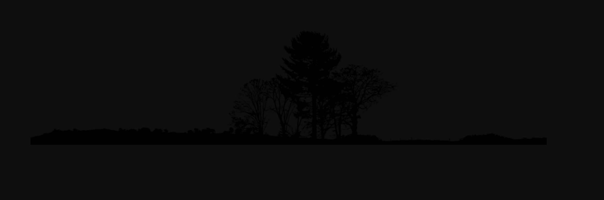

然后我们将 `body` 的颜色设置为黑色到蓝色的由上向下的渐变：

    background: linear-gradient(to bottom,#000000 0%,#5788fe 100%);


效果如下：

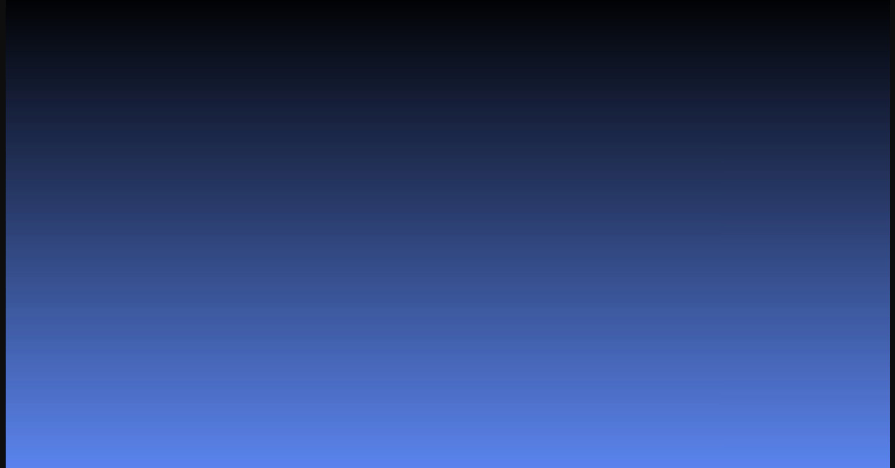

> 接下来我们要设置一个全屏的遮罩，将这个遮罩的背景色设置为红色，然后使用 CSS3 的 `animation` 属性，使用 `animation` 改变其透明度，由 0 变为 0.9。

    .filter {
        width: 100%;
        height: 100%;
        position: absolute;
        top: 0;
        left: 0;
        background: #fe5757;
        animation: colorChange 30s ease-in-out infinite;
        animation-fill-mode: both;
        mix-blend-mode: overlay;
    }
    
    @keyframes colorChange {
        0%, 100% {
            opacity: 0;
        }
        50% {
            opacity: .9;
        }
    }


​    

效果就和上面动态的效果一样。

### [#](#炫酷) 炫酷

> 第二个关键词是“炫酷”，我们要做到炫酷的特点，就是要让别人看到你的博客背景之后，发出 “哎呦，不错哦” 的感叹！

那么你的博客背景有怎样的特点才会让用户眼前一亮呢？我分析主要是因为以下两个原因：

*   动
*   随机

> 因为网页技术的发展，最先开始只能显示单一的文字，然后慢慢开始支持图片资源，直到 HTML5 才支持音频和视频等媒体资源，并且现在大部分我们看到的资源都是图片 —— 也就是静态资源。

所以，页面上有元素在“动”，都将会吸引我们的眼球。

怎么能让页面上的元素动起来呢？我们有以下几种方式：

*   `gif` 图
*   `CSS3` 动画
*   `js` 控制
*   `svg`
*   `Canvas`

以上几种方式都可以创建动画，但是怎样的动画更能引人入胜呢？

这就需要符合另一个特点：“随机”。设置为“随机” 的动画有什么好处呢？

人都有一种心理，一旦找到事物发展的规律，便对其失去了兴趣。

也就是说，如果你的动画是一个规律的，并且规律是简单可寻的，那么用户在看过一次之后，找到了其中的规律，第二次再看的时候便不会再对其感兴趣。

相反，我们就可以写出让用户每一次打开都不一样的特效，这样用户会感觉到“新奇”，便会对你的网站感兴趣。

使用 gif 图大家都知道，只能是有规律的“动”，并且 gif 图片的尺寸不宜过大，在我们的网页背景中，基本上是不会用到的。

CSS3 实现的动画效果，也是只能做有规律的“动”，并且 CSS 只能操纵单个的 DOM 元素，一旦元素到达一定的数量，代价是比较大的。

所以我们选择 `js + Canvas` 来实现“随机”的“动”。

具体的写法我们将会在后面的章节介绍。我们先来接着看第三个特点：**效果**。

### [#](#效果) 效果

这里我们说的效果主要是与鼠标之间的交互效果。

与鼠标之间有互动的效果主要是产生用户行为的反馈，比如在网页制作中，我们经常使用 hover 变色表示用户的鼠标在元素上方悬停。这就是用户行为的一种反馈。

我们经常使用的与鼠标之间的交互效果主要有两种：

*   鼠标跟随
*   视觉差

记得当年 QQ 空间盛行的时候，就有很多这种鼠标跟随的效果，鼠标滑过的路径，能够生产一个长长的尾巴，甚是招人喜欢。同样的，如果我们能实现鼠标跟随的效果，也是极好的。

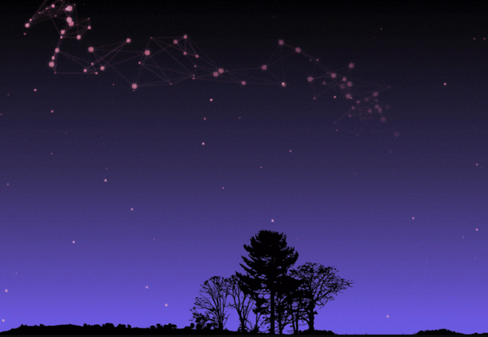

我们又拿出了这个特效 (ಥ_ಥ)

在这个例子中，我们可以看出，在鼠标经过的地方会出现 “星星” 连成线的效果。

用户很喜欢这种鼠标跟随的效果，个人觉得就是因为它使得网站的显示效果和用户的行为产生了联系，使用户的行为得到了反馈。

还有一种经常见到的效果是数据差的效果，比如：


这是锤子官网的一个特效，鼠标移动到哪哪就会下沉，并且如果你仔细看的话就会发现，上面的月份数字和底部的图片不是在一个层级上的，更加有立体的感觉，这就是视觉差的特效。

这种特效不需要用 Canvas，只需要 CSS 就可以实现，实现方式也不是本节重点，有需要的可以私聊。

> 我们来总结一下，炫酷的网页背景特效有哪些特点：

*   背景
    *   单一颜色
    *   渐变
    *   平铺
*   炫酷
    *   动
    *   随机
*   特效（与用户交互）
    *   鼠标跟随
    *   视觉差

[#](#五、怎么实现随机粒子) 五、怎么实现随机粒子
---------------------------

### [#](#随机粒子特效分析) 随机粒子特效分析

> 如果只是一个纯色或者渐变的背景，肯定会显得有点单调，我们还需要在渐变的基础上加一点 “料”，而这些 “料”通常都是粒子特效。 那么“粒子特效” 都有什么特点呢？

*   粒子
*   规则图形
*   随机
*   数量多

粒子特效这些年还是比较流行的，好多地方都可以看出使用了粒子特效。那么粒子特效是什么呢？

百度百科中对粒子特效定义如下：

> 将无数的单个粒子组合使其呈现出固定形态，借由控制器，脚本来控制其整体或单个的运动，模拟出现真实的效果。

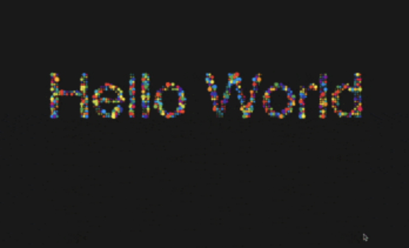

上面的例子是一种常见的粒子特效，使用若干粒子构成文字 “Hello World”，并且每一个粒子都在运动，和物理学的 “粒子” 概念类似。

粒子特效的首要特点是数量多，在物理学中，粒子是能够以自由状态存在的最小物质组成部分，所以粒子的第一个特点就是数量多。

粒子特效的第二个特点是运动，正是因为组成物体的粒子在不断运动，我们才能看到物体在不断运动。

粒子特效第三个特点是随机，排列有整齐排列之美，凌乱有凌乱之美，整齐排列的可以直接平铺背景实现，直接使用 img 图片就可以。

但是要想有随机效果使用 img 图片就不可以了，所以我们主要使用 Canvas 实现随机粒子效果。各项参数都是随机生成的。

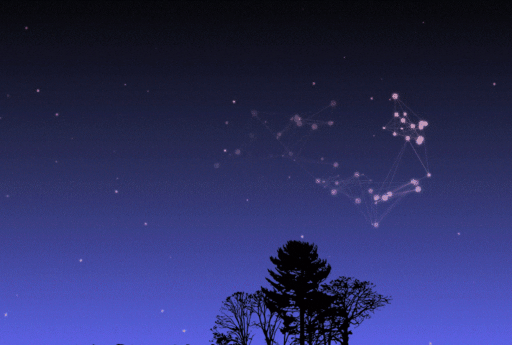

这个例子已经引用好多遍了╥﹏╥...但是它真的是很有特点啊，炫酷特效的通性全部都占有 o(_////▽////_)q

在这个例子中，我们可以将背景上的小 “星星” 看成粒子。粒子的数量是可以自己设置的，位置是随机出现的，大小也是随机生成的，包括透明度也是随机的，这样基本上每一个粒子都是独一无二的。

然后给粒子设置阴影以营造发光的特效，粒子在不断地“动”，做上升运动。

为什么设置随机粒子特效会受欢迎呢？我们来分析一下。首先是我们生成的每一个粒子都是独一无二的，并且每一次刷新位置都是随机的。这种效果是使用其他方式绘制图形都实现不了的（使用 svg 也是可以的，但是本小册不对 svg 绘图做过多的介绍ﾍ(;´Д｀ﾍ)）。

### [#](#实现随机粒子特效) 实现随机粒子特效

现在我们来一起实现一个随机粒子特效。

效果如下：

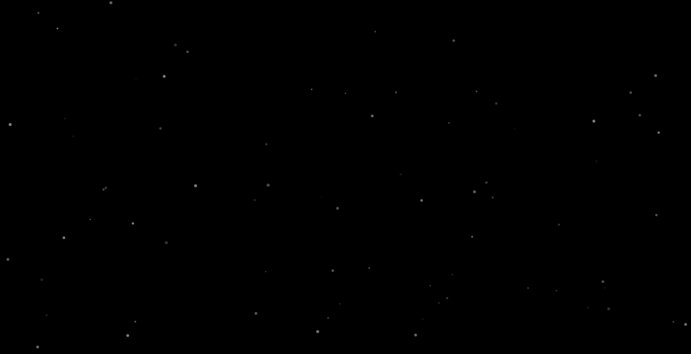

**1\. 创建全屏 Canvas**

首先，我们需要一个全屏的 Canvas 画布。

    <!DOCTYPE html>
    <html lang="en">
    <head>
        <meta charset="UTF-8">
        <title>Title</title>
        <style>
            html,body {
                margin:0;
                overflow:hidden;
                width:100%;
                height:100%;
                cursor:none;
                background:black;
            }
        </style>
    </head>
    <body>
    <canvas id="canvas"></canvas>
    
    <script>
        var ctx = document.getElementById('canvas'),
            content = ctx.getContext('2d'),
            WIDTH,
            HEIGHT;
    
        WIDTH = document.documentElement.clientWidth;
        HEIGHT = document.documentElement.clientHeight;
    
        ctx.width = WIDTH;
        ctx.height = HEIGHT;
    
    </script>
    </body>
    </html>


​    

> 我们使用 `WIDTH`、`HEIGHT` 两个常量储存屏幕宽度和高度信息，我们习惯使用大写来表示改变量为常量，不可变，将屏幕宽度和高度信息储存在常量中是因为我们在稍后还会用到。

这时，你应该得到一个全屏的并且为黑色的 Canvas。

**2\. 设置 `Round_item` 类**

在创建了一个全屏的 Canvas 之后，我们来创建单个的 `Round_item` 类。

> 首先我们 `Round_item` 类需要有什么参数呢？我们要设置的是位置随机、透明度随机、半径随机的圆。为了区分不同的圆，我们还应该设置一个唯一的 `index` 参数。

所以我们需要的参数有：

*   x 坐标
*   y 坐标
*   半径
*   透明度
*   index

> 根据上面这些可以得出我们的 `Round_item` 类：

    function Round_item(index,x,y) {
        this.index = index;
        this.x = x;
        this.y = y;
        this.r = Math.random() * 2 + 1;
        var alpha = (Math.floor(Math.random() * 10) + 1) / 10 / 2;
        this.color = "rgba(255,255,255," + alpha + ")";
    }


> 这里我们使用了构造函数的方式来创建单个的圆，我们还需要一个变量 `initRoundPopulation` 来设置 round 的个数，然后我们便可以通过 `for` 循环创建出 `initRoundPopulation` 个圆。

**3\. 设置 `draw()` 方法**

> 在设置了单个的 `Round_item` 类之后，我们还要给每一个 round 设置 `draw()` 方法，所以我们需要将 `draw()` 方法设置在 `Round_item` 的原型中，这样我们创建出来的每一个 `Round_item` 实例对象都拥有了 `draw()` 方法。

> `draw()` 方法的内容就是我们第 3 节讲到的画圆的方式，这里也就不再过多的说明了，忘记的快去第 3 节补习补习ヽ(；´Д｀)ﾉ

    Round_item.prototype.draw = function () {
      content.fillStyle = this.color;
      content.shadowBlur = this.r * 2;
      content.beginPath();
      content.arc(this.x, this.y, this.r, 0, 2 * Math.PI, false);
      content.closePath();
      content.fill();
    };


**4\. 设置初始化 `init()` 函数**

> 然后我们就需要设置初始化 `init()` 函数了，在 `init()` 函数中，我们的主要任务是创建单个的 round，然后使用其 `draw()` 方法。

    function init() {
        for(var i = 0; i < initRoundPopulation; i++ ){
            round[i] = new Round_item(i,Math.random() * WIDTH,Math.random() * HEIGHT);
            round[i].draw();
        }
    
    }


至此，我们已经完成了随机粒子的实现，完整的代码如下：

    <!DOCTYPE html>
    <html lang="en">
    <head>
        <meta charset="UTF-8">
        <title>Title</title>
        <style>
            html,body {
                margin:0;
                overflow:hidden;
                width:100%;
                height:100%;
                cursor:none;
                background:black;
            }
        </style>
    </head>
    <body>
    <canvas id="canvas"></canvas>
    
    <script>
        var ctx = document.getElementById('canvas'),
            content = ctx.getContext('2d'),
            round = [],
            WIDTH,
            HEIGHT,
            initRoundPopulation = 80;
            WIDTH = document.documentElement.clientWidth;
            HEIGHT = document.documentElement.clientHeight;
    
            ctx.width = WIDTH;
            ctx.height = HEIGHT;
    
        function Round_item(index,x,y) {
            this.index = index;
            this.x = x;
            this.y = y;
            this.r = Math.random() * 2 + 1;
            var alpha = (Math.floor(Math.random() * 10) + 1) / 10 / 2;
            this.color = "rgba(255,255,255," + alpha + ")";
        }
    
        Round_item.prototype.draw = function () {
            content.fillStyle = this.color;
            content.shadowBlur = this.r * 2;
            content.beginPath();
            content.arc(this.x, this.y, this.r, 0, 2 * Math.PI, false);
            content.closePath();
            content.fill();
        };
    
        function init() {
            for(var i = 0; i < initRoundPopulation; i++ ){
                round[i] = new Round_item(i,Math.random() * WIDTH,Math.random() * HEIGHT);
                round[i].draw();
            }
    
        }
       
       init();
    </script>
    </body>
    </html>


[#](#六、使你的随机粒子动起来) 六、使你的随机粒子动起来
-------------------------------

### [#](#animate-函数) `animate()` 函数

其实，Canvas 制作动画是一个不断擦除再重绘的过程，跟最原始实现动画的方式类似。在纸片上画每一帧，然后以很快的速度翻动小本本，就会有动画的效果。

现在我们实现动画需要在很短的时间内不断的清除内容再重新绘制，新的图形和原先清除的图形之间有某种位置关系，速度足够快的话，我们就会看到动画的效果。

> 所以我们需要一个 `animate()` 函数，这个函数的作用是帮助我们形成动画，我们在这个函数中首先需要清除当前屏幕，这里的清除函数用到的是 `content.clearRect()` 方法。

我们先来看一下 canvas 的 `content.clearRect()` 方法：

> `context.clearRect(x,y,width,height);`

*   `x`：要清除的矩形左上角的 x 坐标
*   `y`：要清除的矩形左上角的 y 坐标
*   `width`：要清除的矩形的宽度，以像素计
*   `height`：要清除的矩形的高度，以像素计

> 在刚刚的分析中可以得出，我们需要清除的区域是整个屏幕，所以 `content.clearRect()` 的参数就是 `content.clearRect(0, 0, WIDTH, HEIGHT);`，这里我们就用到了之前获取的屏幕宽度和高度的常量：`WIDTH` 和 `HEIGHT`。这样我们就将屏幕上的所有内容都清除了。

清除了屏幕内容之后我们就要重新绘制图形，重新绘制的图形是需要和原图形之间有一定的关系，我们先制作一个简单的效果 —— 粒子匀速上升。粒子匀速上升，也就是 y 坐标在不断地变化，既然是匀速的，那么也就是在相同的时间位移是相同的。

我们将粒子位移的变化函数 `move()` 写在 `Round_item` 的原型上。稍后我们再实现。

重新绘制完图形之后，我们就完成了清除屏幕内容再重新绘制新的图形的任务。那么还需要有一个步骤 —— “ 不断”，要想实现动画的效果，就需要 “不断” 地进行清除再重绘，并且中间间隔的时间还不能过长。

> 这时你可能会想到使用 js 的 `setTimeout()` 方法，但是 `setTimeout` 和 `setInterval` 的问题是，它们都不精确。它们的内在运行机制决定了时间间隔参数实际上只是指定了把动画代码添加到浏览器 UI 线程队列中以等待执行的时间。如果队列前面已经加入了其他任务，那动画代码就要等前面的任务完成后再执行。

我们需要使用另外一个函数 —— `requestAnimationFrame()` 。

> `window.requestAnimationFrame()` 方法告诉浏览器，你希望执行动画，并请求浏览器调用指定的函数在下一次重绘之前更新动画。该方法使用一个回调函数作为参数，这个回调函数会在浏览器重绘之前调用。

`requestAnimationFrame()` 函数可以说是专门用来写动画的。那么 `requestAnimationFrame()` 有什么优点呢？

> 编写动画循环的关键是要知道延迟时间多长合适。一方面，循环间隔必须足够短，这样才能让不同的动画效果显得平滑流畅；另一方面，循环间隔还要足够长，这样才能确保浏览器有能力渲染产生的变化。
>
> 大多数电脑显示器的刷新频率是 60Hz，大概相当于每秒钟重绘 60 次。大多数浏览器都会对重绘操作加以限制，不超过显示器的重绘频率，因为即使超过那个频率用户体验也不会有提升。因此，最平滑动画的最佳循环间隔是 1000ms/60，约等于 16.6ms。
>
> `requestAnimationFrame` 采用系统时间间隔，保持最佳绘制效率，不会因为间隔时间过短，造成过度绘制，增加开销；也不会因为间隔时间太长，使动画卡顿不流畅，让各种网页动画效果能够有一个统一的刷新机制，从而节省系统资源，提高系统性能，改善视觉效果。

所以我们就使用 `requestAnimationFrame()` 函数递归的调用 `animate()` 函数来实现动画的效果。

    function animate() {
        content.clearRect(0, 0, WIDTH, HEIGHT);
    
        for (var i in round) {
            round[i].move();
        }
        requestAnimationFrame(animate);
    }


### [#](#创建-move-函数) 创建 `move()` 函数

> 使用 `move()` 函数来改变 round 的 y 坐标。那么我们就来实现一下。

*   将 `move()` 方法写在 `Round_item` 的原型上，这样我们创建的每一个 round 都具有了 `move()` 方法。
*   在 `move()` 方法中，我们只需要改变 round 的 y 坐标即可，并且设置边界条件，当 y 坐标的值小于 `-10`（也可以是其他负值），代表该 round 已经超出了屏幕，这个时候我们要将其移动到屏幕的最底端，这样才能保证我们创建的粒子数不变，一直是 `initRoundPopulation` 的值。
*   这样就是一个粒子在不断地上升，上升到了最顶端再移动到最底端的循环过程，看起来像是有源源不断的粒子，但其实总数是不变的。
*   在 y 坐标的变化之后，我们还需要使用新的 y 坐标再来重新绘制一下该 round。

经过上面的分析，`move()` 写起来是不是很简单呢？

    Round_item.prototype.move = function () {
        this.y -= 0.15;
        if (this.y <= -10) {
            this.y = HEIGHT + 10;
        }
        this.draw();
    };


### [#](#在-init-中加入-animate) 在 `init()` 中加入 `animate()`

*   我们想要实现动画的效果，还需要在 `init()` 中加入 `animate()` 函数。
*   最后，我们来看一下动画完整的实现代码吧:

 

```html
   <!DOCTYPE html>
    <html lang="en">
    <head>
        <meta charset="UTF-8">
        <title>Title</title>
        <style>
            html, body {
                margin: 0;
                overflow: hidden;
                width: 100%;
                height: 100%;
                cursor: none;
                background: black;
            }
        </style>
    </head>
    <body>
    <canvas id="canvas"></canvas>
    
    <script>
        var ctx = document.getElementById('canvas'),
            content = ctx.getContext('2d'),
            round = [],
            WIDTH,
            HEIGHT,
            initRoundPopulation = 80;
    
    
        WIDTH = document.documentElement.clientWidth;
        HEIGHT = document.documentElement.clientHeight;
        
        ctx.width = WIDTH;
        ctx.height = HEIGHT;
        
        function Round_item(index, x, y) {
            this.index = index;
            this.x = x;
            this.y = y;
            this.r = Math.random() * 2 + 1;
            var alpha = (Math.floor(Math.random() * 10) + 1) / 10 / 2;
            this.color = "rgba(255,255,255," + alpha + ")";
        }
        
        Round_item.prototype.draw = function () {
            content.fillStyle = this.color;
            content.shadowBlur = this.r * 2;
            content.beginPath();
            content.arc(this.x, this.y, this.r, 0, 2 * Math.PI, false);
            content.closePath();
            content.fill();
        };
        
        function animate() {
            content.clearRect(0, 0, WIDTH, HEIGHT);
        
            for (var i in round) {
                round[i].move();
            }
            requestAnimationFrame(animate)
        }
        
        Round_item.prototype.move = function () {
            this.y -= 0.15;
            if (this.y <= -10) {
                this.y = HEIGHT + 10;
            }
            this.draw();
        };
    
    
        function init() {
            for (var i = 0; i < initRoundPopulation; i++) {
                round[i] = new Round_item(i, Math.random() * WIDTH, Math.random() * HEIGHT);
                round[i].draw();
            }
            animate();
        
        }
        
        init();
    </script>
    </body>
    </html>
```


效果如下：

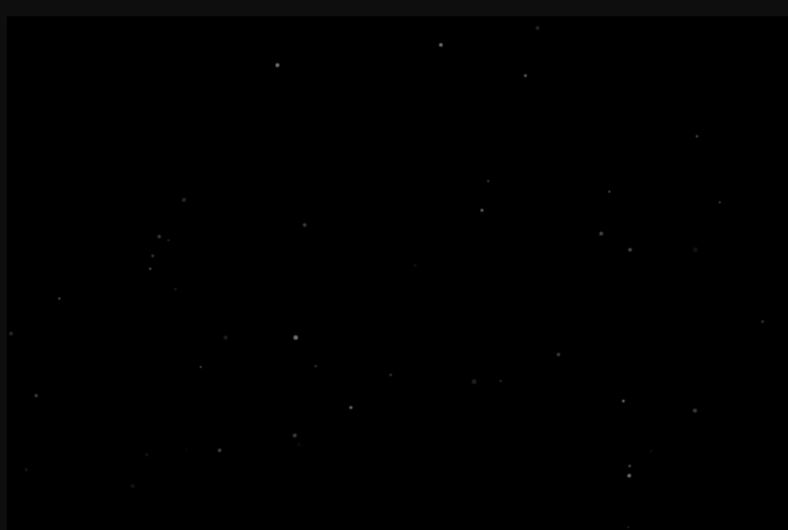

[#](#七、使你的鼠标和屏幕互动) 七、使你的鼠标和屏幕互动
-------------------------------

本节我们一起来看一下 Canvas 是怎么和我们的鼠标互动的。

我们先来看一下这个效果。

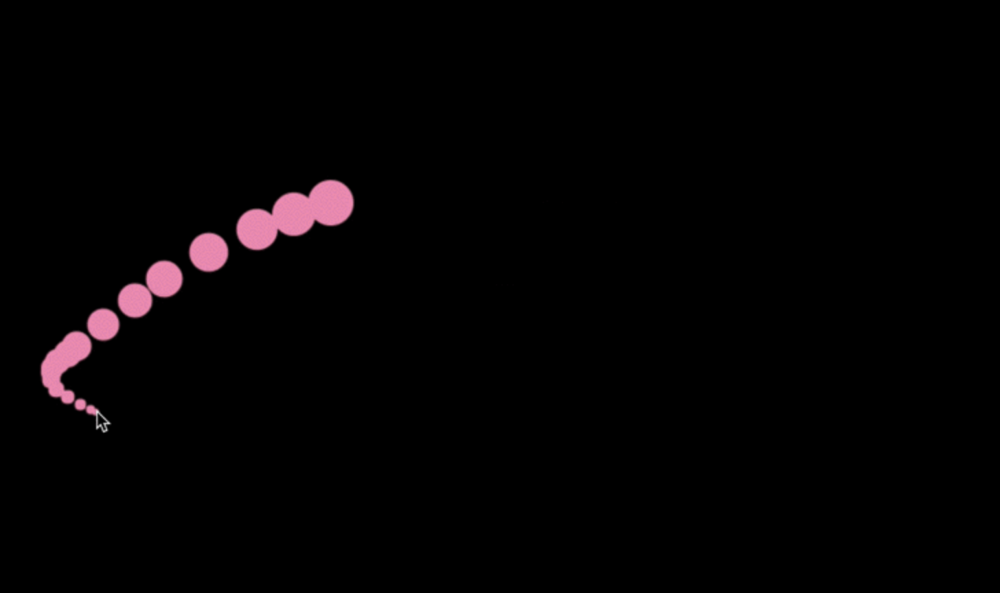

> 然后我们分析一下这个效果：鼠标移动，会在经过的地方创建一个圆，圆的半径由小变大，达到某个固定大小时该圆消失。圆的颜色也是在随机变化的（gif 图片时间较短，效果不明显）。

### [#](#创建-canvas-元素) 创建 Canvas 元素

首先我们还是要创建并获取 Canvas 元素，相信大家对此步骤应该很熟悉了吧。

这里也顺带将需要的参数直接写好了，我们将一些可以控制的变量直接写在参数中，这样在后面就可以获取参数直接使用。设置参数主要是为了更改方便。

    <!DOCTYPE html>
    <html lang="en">
    <head>
        <meta charset="UTF-8">
        <title>Title</title>
        <style>
            * {
                padding: 0;
                margin: 0;
            }
    
            #canvas {
                background: #000;
            }
        </style>
    </head>
    <body>
    <canvas id="canvas"></canvas>
    <script>
            var canvas = document.getElementById('canvas'),
                ctx = canvas.getContext('2d'),
                WIDTH = canvas.width = document.documentElement.clientWidth,
                HEIGHT = canvas.height = document.documentElement.clientHeight,
                para = {
                    num: 100,
                    color: false,    //  颜色  如果是false 则是随机渐变颜色
                    r: 0.9,          //   圆每次增加的半径 
                    o: 0.09,         //      判断圆消失的条件，数值越大，消失的越快
                    a: 1
                },
                color,
                color2,
                round_arr = [];     // 存放圆的数组 
    </script>
    </body>
    </html>


​    

我们就创建一个黑色的全屏 Canvas 元素。

### [#](#onmousemove-事件) `onmousemove` 事件

*   在创建完了 Canvas 元素之后，我们要写鼠标移动的事件了，我们要考虑一下鼠标事件怎么写。
*   观察一下刚刚的 gif 图片，可以看出，在鼠标移动的过程中，不断地在鼠标滑过的位置产生一个逐渐变大的圆。
*   那么怎么让效果动起来呢？这就用到第 6 节讲到的知识了，我们在 Canvas 中创建动画的方式就是不断地清除屏幕内容然后重绘。
*   我们可以看出来，移动的轨迹是由一个一个的圆构成的，如果移动的速度过快的话，那么就可以明显看出一个一个的圆。
*   既然轨迹是由很多圆构成，那么我们就应该使用数组储存圆的信息（坐标、半径），然后在鼠标移动的时候将鼠标的位置信息储存在数组中。

所以在鼠标移动的过程我们首先要获得鼠标的坐标，然后将鼠标的坐标以及其他信息 push 到数组中去：


    window.onmousemove = function (event) {
    
        mouseX = event.clientX;
        mouseY = event.clientY;
    
        round_arr.push({
            mouseX: mouseX,
            mouseY: mouseY,
            r: para.r,  // 设置半径每次增大的数值        
            o: 1,    //  判断圆消失的条件，数值越大，消失得越快
        })
    };


​    

### [#](#设置-color) 设置 `color`

> 我们已经将圆的相关信息储存在 `round_arr` 数组中了，现在要在 `animate()` 函数中将圆显示出来。`animate()` 函数我们稍后再介绍。

创建圆需要的坐标信息以及半径，我们在鼠标移动的事件中都已经将其 push 到 `round_arr` 数组中了，还有一个条件是需要设置的，那就是颜色。

> 怎么对颜色进行处理呢？在 `para` 参数中，我们可以看出，其中有设置 `color` 值。如果 `color` 值不为 `false`，那么设置的圆的颜色就是设置的 `color` 值；如果设置的 `color` 值为 `false`，那么圆的颜色就是随机的。

    if (para.color) {
        color2 = para.color;
    } else {
        color = Math.random() * 360;
    }


那么怎么设置颜色的渐变呢？我们将 `color` 的颜色值依次增加一个增量。

    if (!para.color) {
        color += .1;
        color2 = 'hsl(' + color + ',100%,80%)';
    }


> 要让颜色一直改变，我们要将上面颜色改变的代码放在一个一直执行的函数。我们将上面改变颜色的代码放在下面我们要介绍的 `animate()` 函数中。

### [#](#animate-函数-2) `animate()` 函数

> 我们需要一个一直在执行的函数，这个函数主要负责动画的 `animate()` 函数。从函数名就可以看出这个函数的作用，的确，我们需要在该函数中写动画。

写动画的主要思想是 —— 清除屏幕再重新绘制，这里的 `animate()` 函数也是这样的。

我们先来清除屏幕。

    ctx.clearRect(0, 0, WIDTH, HEIGHT);


​    
​    

接着使用 `round_arr` 数组中的数据将一个一个的圆绘制出来。

    for (var i = 0; i < round_arr.length; i++) {
    
        ctx.fillStyle = color2;
        ctx.beginPath();
        ctx.arc( round_arr[i].mouseX ,round_arr[i].mouseY,round_arr[i].r,0, Math.PI * 2);
        ctx.closePath();
        ctx.fill();
        round_arr[i].r += para.r;
        round_arr[i].o -= para.o;
    
        if( round_arr[i].o <= 0){
            round_arr.splice(i,1);
            i--;
        }
        
    }


​    

然后我们还需要一直执行这个函数：

    window.requestAnimationFrame(animate);


​    

我们来看下完整的 `animate()` 函数：

    function animate() {
    
        if (!para.color) {
            color += .1;
            color2 = 'hsl(' + color + ',100%,80%)';
        }
    
        ctx.clearRect(0, 0, WIDTH, HEIGHT);
    
        for (var i = 0; i < round_arr.length; i++) {
    
            ctx.fillStyle = color2;
            ctx.beginPath();
             ctx.arc( round_arr[i].mouseX ,round_arr[i].mouseY,round_arr[i].r,0, Math.PI * 2);
            ctx.closePath();
            ctx.fill();
            round_arr[i].r += para.r;
            round_arr[i].o -= para.o;
    
            if( round_arr[i].o <= 0){
                round_arr.splice(i,1);
                i--;
            }
        }
    
        window.requestAnimationFrame(animate);
    };


​    
​    

### [#](#小结) 小结

以上，我们就写完了一个完整的鼠标跟随效果的例子，让我们来看一下主要的有哪些步骤：

1.  创建 Canvas 元素，设置参数
2.  鼠标移动事件，将坐标信息 `push` 到数组
3.  设置颜色
4.  设置动画 `animate()` 函数

我们来看一下这个例子的完整代码：

    <!DOCTYPE html>
    <html lang="en">
    <head>
        <meta charset="UTF-8">
        <title>Title</title>
        <style>
            * {
                padding: 0;
                margin: 0;
            }
    
            #canvas {
                background: #000;
            }
        </style>
    </head>
    <body>
    <canvas id="canvas"></canvas>
    <script>


​    
            var canvas = document.getElementById('canvas'),
                ctx = canvas.getContext('2d'),
                WIDTH = canvas.width = document.documentElement.clientWidth,
                HEIGHT = canvas.height = document.documentElement.clientHeight,
                para = {
                    num: 100,
                    color: false,    //  颜色  如果是false 则是随机渐变颜色
                    r: 0.9,
                    o: 0.09,         //  判断圆消失的条件，数值越大，消失的越快
                    a: 1,
    
                },
                color,
                color2,
                round_arr = [];


​    
​    
​    
​    
            window.onmousemove = function (event) {
    
                mouseX = event.clientX;
                mouseY = event.clientY;
    
                round_arr.push({
                    mouseX: mouseX,
                    mouseY: mouseY,
                    r: para.r,
                    o: 1
                })
            };


​    
            // 判断参数中是否设置了 color，如果设置了 color，就使用该值、
            // 如果参数中的 color 为 false，那么就使用随机的颜色
            if (para.color) {
                color2 = para.color;
            } else {
                color = Math.random() * 360;
            }
    
            function animate() {
    
                if (!para.color) {
                    color += .1;
                    color2 = 'hsl(' + color + ',100%,80%)';
                }
    
                ctx.clearRect(0, 0, WIDTH, HEIGHT);
    
                for (var i = 0; i < round_arr.length; i++) {
    
                    ctx.fillStyle = color2;
                    ctx.beginPath();
                    ctx.arc( round_arr[i].mouseX ,round_arr[i].mouseY,round_arr[i].r,0, Math.PI * 2);
                    ctx.closePath();
                    ctx.fill();
                    round_arr[i].r += para.r;
                    round_arr[i].o -= para.o;
    
                    if( round_arr[i].o <= 0){
                        round_arr.splice(i,1);
                        i--;
                    }
                }
    
                window.requestAnimationFrame(animate);
            };
    
            animate();
    </script>
    </body>
    </html>


[#](#八、制作属于你自己的特效) 八、制作属于你自己的特效
-------------------------------

### [#](#用户喜欢哪些效果) 用户喜欢哪些效果

作为一个网站的用户，在浏览网页的时候，你会喜欢怎样的网页背景呢？

*   背景颜色不宜过多
*   粒子数量多
*   粒子在动
*   能和鼠标进行交互

### [#](#背景颜色) 背景颜色

因为网站还是以阅读为主，所以网站的背景颜色要适合阅读，最好还是设置为传统的 “白纸黑字”，使用浅色颜色作为背景，同时饱和度不宜过高，最好设置透明度。

并且背景颜色最好是 1~2 种颜色，不要设置过多的颜色，不然会影响阅读。

背景颜色可以直接使用 CSS 样式设置，不需要使用 Canvas。

### [#](#粒子特效) 粒子特效

为什么大家都喜欢粒子特效呢？首先是因为粒子的颗粒度可以设置得比较小，不会影响阅读，如果你将一张很大的图片设置为背景，那么网页上还有其他的部分，背景肯定是会被遮挡的，这样用户就看不到图片的全部内容。

所以设置为粒子特效，用户可以看到粒子的形状颜色，这样即使其他的粒子被遮挡，用户也会知道被遮挡的部分是什么内容。

其次是因为粒子的随机性，可以设置随机的透明度、随机的坐标、随机的颜色以及随机的大小，可以使得设置的每一个粒子都不同，并且每一次刷新页面，就会又重新生成新的不同的例子。用户永远不知道在哪一个位置有一个怎样的粒子。

### [#](#粒子在动) 粒子在动

大多数用户比较喜欢动效，但是对于网页的背景来说，动作的幅度又不能太大，动作也不要过于复杂，只是一些简单的位移并且动作的幅度也要小一点，让用户的潜意识里面知道这些粒子在动就可以，不能使用户的全部注意力都在粒子上面而忽视了网页的内容。

### [#](#和鼠标进行交互) 和鼠标进行交互

用户一般还喜欢自己的操作能够得到网页的响应，所以我们可以设置鼠标跟随的效果或者视觉差的效果，加上和鼠标交互的特效，会使用户感到你的网站与众不同。

### [#](#小结-2) 小结

*   上述的几个特点都是用户比较喜欢的，但是你要根据你的情况来选择使用哪一种或者哪几种特效。
*   也不建议将所有的特效都来一遍，这样会使得你的网站过于花哨，而使用户忽视了网站的内容。
*   其实，制作炫酷的网页背景特效最难的不是你需要写多么难的 Canvas 代码，而是你的想象，你的想法。
*   Canvas 的 API 也就那么几个，好的创意可以让你仅仅使用有限的 API 排列组合出无限种可能。
*   好的创意个人认为是可遇不可求的，需要你的空间想象能力和审美能力。那你会问了， 实在没有好的创意那该怎么办呢？
*   果你自己没有想到好的创意的话，那就跟着我的套路走吧，最起码可以拿 60 分。

[#](#九、使你的-canvas-更加优雅) 九、使你的 Canvas 更加优雅
-----------------------------------------

### [#](#常见的-canvas-优化方法) 常见的 Canvas 优化方法

**1\. 避免浮点数的坐标点**

*   绘制图形时，长度与坐标应选取整数而不是浮点数，原因在于 Canvas 支持半个像素绘制。
*   会根据小数位实现插值算法实现绘制图像的反锯齿效果，如果没有必要请不要选择浮点数值。

**2\. 使用多层画布去画一个复杂的场景**

一般在游戏中这个优化方式会经常使用，但是在我们的背景特效中不经常使用，这个优化方式是将经常移动的元素和不经常移动的元素分层，避免不必要的重绘。

比如在游戏中，背景不经常变换和人物这些经常变换的元素分成不同的层，这样需要重绘的资源就会少很多。

**3\. 用 CSS `transform` 特性缩放画布**

*   如果你使用 `left`、`top` 这些 CSS 属性来写动画的话，那么会触发整个像素渲染流程 —— `paint`、`layout` 和 `composition`。
*   但是使用 `transform` 中的 `translateX/Y` 来切换动画，你将会发现，这并不会触发 `paint` 和 `layout`，仅仅会触发 `composition` 的阶段。
*   这是因为 `transform` 调用的是 GPU 而不是 CPU。

**4\. 离屏渲染**

*   名字听起来很复杂，什么离屏渲染，其实就是设置缓存，绘制图像的时候在屏幕之外的地方绘制好，然后再直接拿过来用，这不就是缓存的概念吗?!︿(￣︶￣)︿.
*   建立两个 Canvas 标签，大小一致，一个正常显示，一个隐藏（缓存用的，不插入 DOM 中）。先将结果 draw 到缓存用的 canvas 上下文中，因为游离 Canvas 不会造成 UI 的渲染，所以它不会展现出来；再把缓存的内容整个裁剪再 draw 到正常显示用的 Canvas 上，这样能优化不少。

### [#](#离屏渲染) 离屏渲染

> 离屏渲染的主要过程就是将一个一个的粒子先在屏幕之外创建出来，然后再使用 `drawImage()` 方法将其“放入”到我们的主屏幕中。

在了解了思想之后，我们就来实现一下吧！ｂ（￣▽￣）ｄ

我们首先要在全局设置一个变量 `useCache` 来存放我们是否使用离屏渲染这种优化方式。

    var useCache = true;


​    

### [#](#round-item-方法) `Round_item` 方法

> 然后我们在 `Round_item` 原型的 `draw()` 方法中创建每一个离屏的小的 `canvas`。

        function Round_item(index, x, y) {
            this.index = index;
            this.x = x;
            this.y = y;
            this.useCache = useChache;
            
            this.cacheCanvas = document.createElement("canvas");
            this.cacheCtx = this.cacheCanvas.getContext("2d");
    
            this.r = Math.random() * 2 + 1;
            
            this.cacheCtx.width = 6 * this.r;
            this.cacheCtx.height = 6 * this.r;
            
            var alpha = (Math.floor(Math.random() * 10) + 1) / 10 / 2;
            this.color = "rgba(255,255,255," + alpha + ")";
    
            if(useChache){
                this.cache();
            }
        }


​    

> 有人会产生疑问，为什么这里的 `cacheCanvas` 画布的宽度要设置为 6 倍的半径？那是因为，我们创建的 `cacheCanvas` 不仅仅是有圆，还包括圆的阴影，所以我们要将 `cacheCanvas` 的面积设置得稍微大一些，这样才能将圆带阴影一起剪切到我们的主 Canvas 中。

在 `draw()` 方法中，我们新创建了 `cacheCanvas`，并获取到了 `cacheCanvas` 的上下文环境，然后设置其宽高。

然后我们判断了 `useChache` 变量的值，也就是说，如果我们将 `useChache` 设置为 `true`，也就是使用缓存，我们就调用 `this.cache()` 方法。接下来，我们来看一下 `this.cache()` 方法。

### [#](#this-cache-方法) `this.cache()` 方法

*   同样的，我们也是在 `Round_item` 的原型中设置 `this.cache()` 方法。
*   在 `this.cache()` 方法中，我们的主要任务是在每一个 `cacheCanvas` 中都绘制一个圆。

        Round_item.prototype.cache = function () {
            this.cacheCtx.save();
            this.cacheCtx.fillStyle = this.color;
            this.cacheCtx.shadowColor = "white";
            this.cacheCtx.shadowBlur = this.r * 2;
            this.cacheCtx.beginPath();
            this.cacheCtx.arc(this.r * 3, this.r * 3, this.r, 0, 2 * Math.PI);
            this.cacheCtx.closePath();
            this.cacheCtx.fill();
            this.cacheCtx.restore();
        };
    
    

这里需要注意的是，和在 `draw()` 方法中画的圆不同之处是，要注意这里设置的圆心坐标，是 `this.r * 3`，因为我们创建的 `cacheCanvas` 的宽度和高度都是 `6 * this.r`，我们的圆是要显示在 `cacheCanvas` 的正中心，所以设置圆心的坐标应该是 `this.r * 3,this.r * 3`。

### [#](#draw-方法) `draw()` 方法

> 既然设置了 `cacheCanvas`，那么我们在 `draw()` 中，就需要使用 Canvas 的 `drawImage` 方法将 `cacheCanvas` 中的内容显示在屏幕上。

        Round_item.prototype.draw = function () {
    
            if( !useChache){
                content.fillStyle = this.color;
                content.shadowBlur = this.r * 2;
                content.beginPath();
                content.arc(this.x, this.y, this.r, 0, 2 * Math.PI, false);
                content.closePath();
                content.fill();
            }else{
                content.drawImage(this.cacheCanvas, this.x - this.r, this.y - this.r);
            }
    
        };


​    

这里也是要判断下，如果没有使用缓存的话，还是使用最原始的创建圆的方式。

这样，我们就完成了离屏渲染的优化，我们来一起看一下完整的代码：

```
<!DOCTYPE html>
<html lang="en">
<head>
    <meta charset="UTF-8">
    <title>Title</title>
    <style>
        html, body {
            margin: 0;
            overflow: hidden;
            width: 100%;
            height: 100%;
            cursor: none;
            background: black;
        }
    </style>
</head>
<body>
<canvas id="canvas"></canvas>

<script>
    var ctx = document.getElementById('canvas'),
        content = ctx.getContext('2d'),
        round = [],
        WIDTH,
        HEIGHT,
        initRoundPopulation = 80,
        useChache = true;


    


    WIDTH = document.documentElement.clientWidth;
    HEIGHT = document.documentElement.clientHeight;

    ctx.width = WIDTH;
    ctx.height = HEIGHT;

    function Round_item(index, x, y) {
        this.index = index;
        this.x = x;
        this.y = y;
        this.useCache = useChache;
        this.cacheCanvas = document.createElement("canvas");
        this.cacheCtx = this.cacheCanvas.getContext("2d");

        this.cacheCtx.width = 6 * this.r;
        this.cacheCtx.height = 6 * this.r;
        this.r = Math.random() * 2 + 1;
        var alpha = (Math.floor(Math.random() * 10) + 1) / 10 / 2;
        this.color = "rgba(255,255,255," + alpha + ")";

        if(useChache){
            this.cache();
        }
    }

    Round_item.prototype.draw = function () {

        if( !useChache){
            content.fillStyle = this.color;
            content.shadowBlur = this.r * 2;
            content.beginPath();
            content.arc(this.x, this.y, this.r, 0, 2 * Math.PI, false);
            content.closePath();
            content.fill();
        }else{
            content.drawImage(this.cacheCanvas, this.x - this.r, this.y - this.r);
        }

    };

    Round_item.prototype.cache = function () {
        this.cacheCtx.save();
        this.cacheCtx.fillStyle = this.color;
        this.cacheCtx.shadowColor = "white";
        this.cacheCtx.shadowBlur = this.r * 2;
        this.cacheCtx.beginPath();
        this.cacheCtx.arc(this.r * 3, this.r * 3, this.r, 0, 2 * Math.PI);
        this.cacheCtx.closePath();
        this.cacheCtx.fill();
        this.cacheCtx.restore();
    };
    function animate() {
        content.clearRect(0, 0, WIDTH, HEIGHT);

        for (var i in round) {
            round[i].move();
        }
        requestAnimationFrame(animate)
    }

    Round_item.prototype.move = function () {
        this.y -= 0.15;
        if (this.y <= -10) {
            this.y = HEIGHT + 10;
        }
        this.draw();
    };


    

    function init() {
        for (var i = 0; i < initRoundPopulation; i++) {
            round[i] = new Round_item(i, Math.random() * WIDTH, Math.random() * HEIGHT);
            round[i].draw();
        }
        animate();

    }

    init();
</script>
</body>
</html>
```

