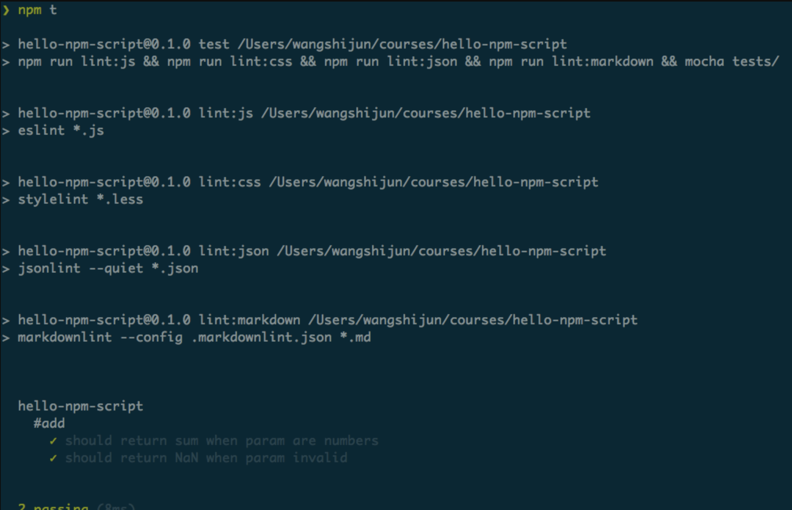
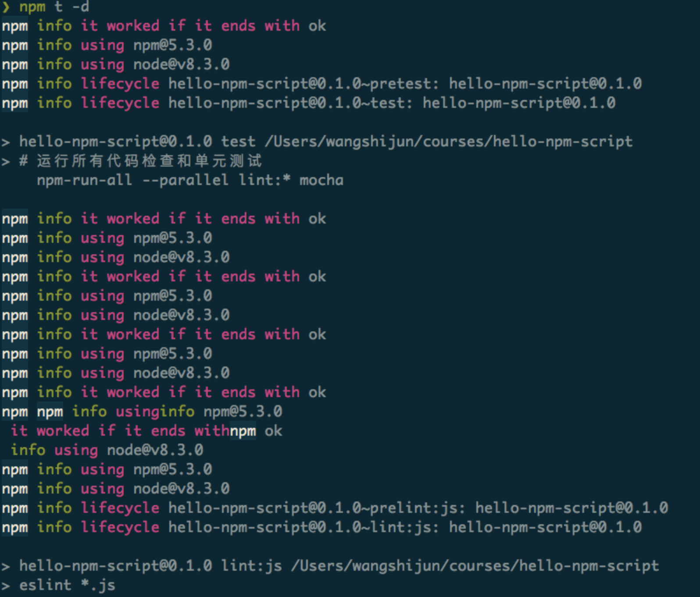
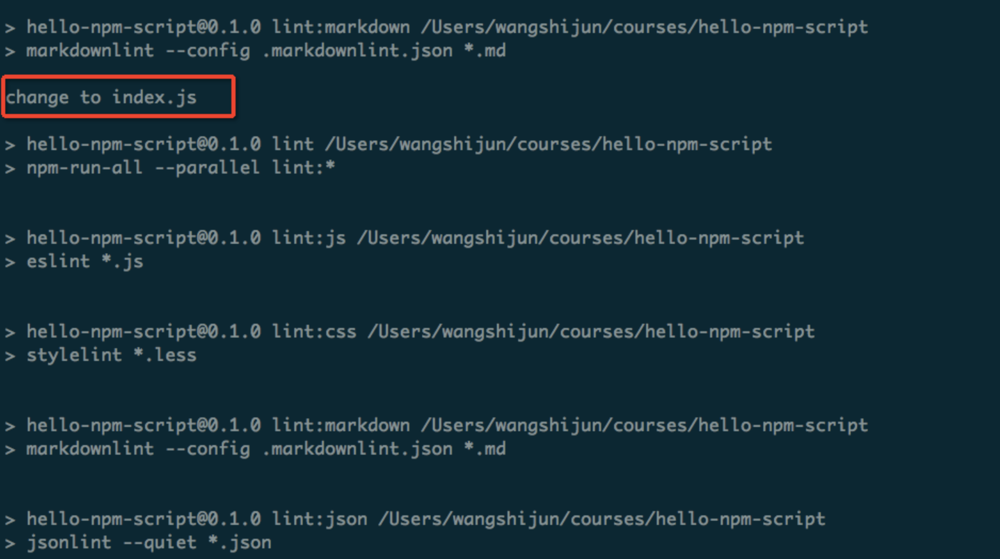

[#](#_1-初识-npm-script) 1 初识 npm script
--------------------------------------

> 首先介绍创建 `package.json` 文件的科学方法，目标是掌握 `npm init` 命令。然后，通过在终端中运行自动生成的 `test` 命令，详细讲解 `npm` 脚本基本执行流程。 然后，动手给项目增加 `eslint` 命令，熟悉创建自定义命令的基本流程。

### [#](#用-npm-init-快速创建项目) 用 npm init 快速创建项目

> 开始探索 `npm script` 之前，我们先聊聊这些 `scripts` 所依赖的文件 `package.json`，以它为基础的 `npm` 则是 `node.js` 社区蓬勃发展的顶梁柱。

`npm` 为我们提供了快速创建 `package.json` 文件的命令 `npm init`，执行该命令会问几个基本问题，如包名称、版本号、作者信息、入口文件、仓库地址、许可协议等，多数问题已经提供了默认值，你可以在问题后敲回车接受默认值：

    package name: (hello-npm-script)
    version: (0.1.0)
    description: hello npm script
    entry point: (index.js)
    test command:
    git repository:
    keywords: npm, script
    license: (MIT)

> 上面的例子指定了描述（description）和关键字（keywords）两个字段，基本问题问完之后 `npm` 会把 `package.json` 文件内容打出来供你确认：

    {
      "name": "hello-npm-script",
      "version": "0.1.0",
      "description": "hello npm script",
      "main": "index.js",
      "scripts": {
        "test": "echo \"Error: no test specified\" && exit 1"
      },
      "keywords": [
        "npm",
        "script"
      ],
      "author": "wangshijun <wangshijun2010@gmail.com> (https://github.com/wangshijun)",
      "license": "MIT"
    }

​    

> 按回车确认就能把`package.json` 的内容写到文件系统，如果要修改 `package.json`，可以直接用编辑器编辑，或者再次运行 `npm init`，`npm` 默认不会覆盖修改里面已经存在的信息。

> **TIP#1**: 嫌上面的初始化方式太啰嗦？你可以使用 `npm init -f`（意指 `--force`，或者使用 `--yes`）告诉 `npm` 直接跳过参数问答环节，快速生成 `package.json`。

初始化 `package.json` 时的字段默认值是可以自己配置的，细心的同学可能已经发现，我上面的默认版本号是 0.1.0，而 npm 默认的版本号是 0.0.1，可以用下面的命令去修改默认配置：

    npm config set init.author.email "wangshijun2010@gmail.com"
    npm config set init.author.name "wangshijun"
    npm config set init.author.url "http://github.com/wangshijun"
    npm config set init.license "MIT"
    npm config set init.version "0.1.0"

> **TIP#2**: 将默认配置和 -f 参数结合使用，能让你用最短的时间创建 package.json，快去自己试试吧。

严肃的工程师都会使用 Git 对源代码进行版本管理，在 `npm init` 的基础上，你可以使用 git init 来初始化 git 仓库，不再展开。

纸上得来终觉浅，想掌握 `npm script`，请打开终端，执行下列命令：

    cd ~
    mkdir hello-npm-script && cd $_
    npm init
    npm init -f

**执行上面第 3、4 行命令时结果是否符合预期？如果不符合预期，请在下面留言，或者在读者群里反馈。**

### [#](#用-npm-run-执行任意命令) 用 npm run 执行任意命令

使用 `npm init` 创建的 `package.json` 文件中包含了 `scripts` 字段：

    "scripts": {
      "test": "echo \"Error: no test specified\" && exit 1"
    },

​    

*   在终端中运行 `npm run test`，能看到 `Error: no test specified` 的输出。`npm run test` 可以简写为 `npm test`，或更简单的 `npm t`，得到的结果是几乎相同的。`npm test` 顾名思义，就是运行项目测试，实际用法在实战环节会有介绍。
*   和 `test` 类似，`start` 也是 `npm` 内置支持的命令，但是需要先在 `scripts` 字段中声明该脚本的实际内容，如果没声明就执行 `npm start`，会直接报错。如下图所示：

> 那么，`npm` 是如何管理和执行各种 `scripts` 的呢？作为 `npm` 内置的核心功能之一，`npm run` 实际上是 `npm run-script` 命令的简写。当我们运行 `npm run xxx` 时，基本步骤如下：

1.  从 `package.json` 文件中读取 `scripts` 对象里面的全部配置；
2.  以传给 `npm run` 的第一个参数作为键，本例中为 `xxx`，在 `scripts` 对象里面获取对应的值作为接下来要执行的命令，如果没找到直接报错；
3.  在系统默认的 `shell` 中执行上述命令，系统默认 `shell` 通常是 `bash`，`windows` 环境下可能略有不同，稍后再讲。

注意，上面这是简化的流程，更复杂的钩子机制后面章节单独介绍。

举例来说，如果 `package.json` 文件内容如下：

    {
      "name": "hello-npm-script",
      "devDependencies": {
        "eslint": "latest"
      },
      "scripts": {
        "eslint": "eslint **.js"
      }
    }

​    

如果不带任何参数执行 `npm run`，它会列出可执行的所有命令，比如下面这样：

    Available scripts in the myproject package:
      eslint
        eslint **.js

​    

如果运行 `npm run eslint`，`npm` 会在 `shell` 中运行 `eslint \*\*.js`。

> 有没有好奇过上面的 eslint 命令是从哪里来的？其实，npm 在执行指定 `script` 之前会把 `node\_modules/.bin` 加到环境变量 `$PATH` 的前面，这意味着任何内含可执行文件的 `npm` 依赖都可以在 `npm script` 中直接调用，换句话说，你不需要在 `npm script` 中加上可执行文件的完整路径，比如 `./node_modules/.bin/eslint **.js`。

### [#](#创建自定义-npm-script) 创建自定义 npm script

> 知道如何运行 `npm script` 之后，接下来我们在 `hello-npm-script` 项目中添加有实际用途的 `eslint` 脚本，[eslint](https://eslint.org) 是社区中接受度比较高的 javascript 风格检查工具，有大把现成的规则集可供你选择，比如 [google](https://github.com/google/eslint-config-google) 、 [airbnb](https://www.npmjs.com/package/eslint-config-airbnb) 。

在新项目或者任何现有项目中添加 eslint 自定义脚本的步骤如下：

**1\. 准备被检查的代码**

要做代码检查，我们必须有代码，创建 `index.js` 文件，输入如下内容：

    const str = 'some value';
    
    function fn(){
        console.log('some log');
    }

​    

**2\. 添加 eslint 依赖**

执行如下命令将 `eslint` 添加为 `devDependencies`：

    npm install eslint -D

​    

**3\. 初始化 eslint 配置**

用 `eslint` 做检查需要配置规则集，存放规则集的文件就是配置文件，使用如下文件生成配置文件：

    ./node_modules/.bin/eslint --init

> **TIP#3**: 把 eslint 安装为项目依赖而非全局命令，项目可移植性更高。

在命令行提示中选择 `Answer questions about your style`，如下图回答几个问题，答案可以根据自己的偏好：

回车后根目录下就有了 `.eslintrc.js` 配置文件：

    module.exports = {
      env: {
        es6: true,
        node: true,
      },
      extends: 'eslint:recommended',
      rules: {
        indent: ['error', 4],
        'linebreak-style': ['error', 'unix'],
        quotes: ['error', 'single'],
        semi: ['error', 'always'],
      },
    };

​    

**4\. 添加 eslint 命令**

> 在 `package.json` 的 `scripts` 字段中新增命令 `eslint`：

    {
      "scripts": {
        "eslint": "eslint *.js",
        "test": "echo \"Error: no test specified\" && exit 1"
      },
    }

​    

**手动修改 package.json 时一定要注意语法正确。**

**5\. 运行 eslint 命令**

> 执行 `npm run eslint`，可以看到，按照官方推荐规则代码里有 3 处不符合规范的地方：

如果读到这里，相信你已经完成 `npm script` 上手，接下来我们去探索更高级的话题。

**6\. eslint 完成 react、vue.js 代码的检查**

> 如果需要结合 `eslint` 检查主流前端框架 react、vue.js，下面提供两条线索，因为官方仓库的 README 就可以作为入门文档，仔细读读相信绝大多数同学都能配置好。

*   使用 [eslint-plugin-react](https://github.com/yannickcr/eslint-plugin-react) 检查 react 代码
*   使用 [react-plugin-react-native](https://github.com/Intellicode/eslint-plugin-react-native) 检查 react-native 代码，如果你比较懒，可以直接使用 [eslint-config-airbnb](https://www.npmjs.com/package/eslint-config-airbnb) ，里面内置了 eslint-plugin-react，新人常遇到 peerDependencies 安装失败问题可参照 npmjs 主页上的如下方法解决：

    (
      export PKG=eslint-config-airbnb;
      npm info "$PKG@latest" peerDependencies --json | command sed 's/[\{\},]//g ; s/: /@/g' | xargs npm install --save-dev "$PKG@latest"
    )
    
*   推荐使用 vue.js 官方的 eslint 插件：[eslint-plugin-vue](https://github.com/vuejs/eslint-plugin-vue) 来检查 vue.js 代码，具体的配置方法官方 README 写的清晰明了，这里就不赘述了。
*   上面的几种 eslint 规则集的官方仓库都列出了各自支持的规则，如果你需要关闭某些规则，可以直接在自己的 .eslintrc* 里面的 rules 中配置，比如我们仓库里面的：

    module.exports = {
      env: {
        es6: true,
        node: true,
      },
      extends: 'eslint:recommended',
      rules: {
        indent: ['error', 2],
        'linebreak-style': ['error', 'unix'],
        quotes: ['error', 'single'],
        semi: ['error', 'always'],
      },
    };
    

[#](#_2-运行多个-npm-script-的各种姿势) 2 运行多个 npm script 的各种姿势
------------------------------------------------------

> 前端项目通常会包括多个 `npm script`，对多个命令进行编排是很自然的需求，有时候需要将多个命令串行，即脚本遵循严格的执行顺序；有时候则需要让它们并行来提高速度，比如不相互阻塞的 `npm script`。社区中也有比 `npm` 内置的多命令运行机制更好用的解决方案：`npm-run-all`。

### [#](#哪来那么多命令？) 哪来那么多命令？

> 通常来说，前端项目会包含 `js`、`css`、`less`、`scss`、`json`、`markdown` 等格式的文件，为保障代码质量，给不同的代码添加检查是很有必要的，代码检查不仅保障代码没有低级的语法错误，还可确保代码都遵守社区的最佳实践和一致的编码风格，在团队协作中尤其有用，即使是个人项目，加上代码检查，也会提高你的效率和质量。

我通常会给前端项目加上下面 4 种代码检查：

*   [eslint](https://eslint.org) ，可定制的 js 代码检查
*   [stylelint](https://stylelint.io) ，可定制的样式文件检查，支持 `css`、`less`、`scss`；
*   [jsonlint](https://github.com/zaach/jsonlint) ，`json` 文件语法检查，踩过坑的同学会清楚，`json` 文件语法错误会知道导致各种失败；
*   [markdownlint-cli](https://github.com/igorshubovych/markdownlint-cli) ，Markdown 文件最佳实践检查，个人偏好；

需要注意的是，`html` 代码也应该检查，但是工具支持薄弱，就略过不表。此外，为代码添加必要的单元测试也是质量保障的重要手段，常用的单测技术栈是：

*   [mocha](https://mochajs.org) ，测试用例组织，测试用例运行和结果收集的框架；
*   [chai](http://chaijs.com) ，测试断言库，必要的时候可以结合 [sinon](http://sinonjs.org) 使用；

> **TIP#4**：测试工具如 [tap](http://www.node-tap.org) 、[ava](https://github.com/avajs/ava) 也都提供了命令行接口，能很好的集成到 `npm script` 中，原理是相通的。

包含了基本的代码检查、单元测试命令的 `package.json` 如下：

    {
      "name": "hello-npm-script",
      "version": "0.1.0",
      "main": "index.js",
      "scripts": {
        "lint:js": "eslint *.js",
        "lint:css": "stylelint *.less",
        "lint:json": "jsonlint --quiet *.json",
        "lint:markdown": "markdownlint --config .markdownlint.json *.md",
        "test": "mocha tests/"
      },
      "devDependencies": {
        "chai": "^4.1.2",
        "eslint": "^4.11.0",
        "jsonlint": "^1.6.2",
        "markdownlint-cli": "^0.5.0",
        "mocha": "^4.0.1",
        "stylelint": "^8.2.0",
        "stylelint-config-standard": "^17.0.0"
      }
    }

​    

### [#](#让多个-npm-script-串行？) 让多个 npm script 串行？

> 在我们运行测试之前确保我们的代码都通过代码检查会是比较不错的实践，这也是让多个 `npm script` 串行的典型用例，实现方式也比较简单，只需要用 `&&` 符号把多条 `npm script` 按先后顺序串起来即可，具体到我们的项目，修改如下图所示：

    diff --git a/package.json b/package.json
    index c904250..023d71e 100644
    --- a/package.json
    +++ b/package.json
    @@ -8,7 +8,7 @@
    -    "test": "mocha tests/"
    +    "test": "npm run lint:js && npm run lint:css && npm run lint:json && npm run lint:markdown && mocha tests/"
       },

​    

> 然后直接执行 `npm test` 或 `npm t`，从输出可以看到子命令的执行顺序是严格按照我们在 `scripts` 中声明的先后顺序来的：

> `eslint ==> stylelint ==> jsonlint ==> markdownlint ==> mocha`

需要注意的是，串行执行的时候如果前序命令失败（通常进程退出码非0），后续全部命令都会终止，我们可以尝试在 `index.js` 中引入错误（删掉行末的分号）：

    diff --git a/index.js b/index.js
    index ab8bd0e..b817ea4 100644
    --- a/index.js
    +++ b/index.js
    @@ -4,7 +4,7 @@ const add = (a, b) => {
       }
    
       return NaN;
    -};
    +}
    
     module.exports = { add  };

然后重新运行 `npm t`，结果如下，`npm run lint:js` 失败之后，后续命令都没有执行：

### [#](#让多个-npm-script-并行？) 让多个 npm script 并行？

> 在严格串行的情况下，我们必须要确保代码中没有编码规范问题才能运行测试，在某些时候可能并不是我们想要的，因为我们真正需要的是，代码变更时同时给出测试结果和测试运行结果。这就需要把子命令的运行从串行改成并行，实现方式更简单，把连接多条命令的 `&&` 符号替换成 `&` 即可。

代码变更如下：

    diff --git a/package.json b/package.json
    index 023d71e..2d9bd6f 100644
    --- a/package.json
    +++ b/package.json
    @@ -8,7 +8,7 @@
    -    "test": "npm run lint:js && npm run lint:css && npm run lint:json && npm run lint:markdown && mocha tests/"
    +    "test": "npm run lint:js & npm run lint:css & npm run lint:json & npm run lint:markdown & mocha tests/"
       },

​    

重新运行 `npm t`，我们得到如下结果：

> 细心的同学可能已经发现上图中哪里不对，`npm run lint:js` 的结果在进程退出之后才输出，如果你自己运行，不一定能稳定复现这个问题，但 `npm` 内置支持的多条命令并行跟 `js` 里面同时发起多个异步请求非常类似，它只负责触发多条命令，而不管结果的收集，如果并行的命令执行时间差异非常大，上面的问题就会稳定复现。怎么解决这个问题呢？

答案也很简单，在命令的增加 `& wait` 即可，这样我们的 test 命令长这样：

    npm run lint:js & npm run lint:css & npm run lint:json & npm run lint:markdown & mocha tests/ & wait

> 加上 `wait` 的额外好处是，如果我们在任何子命令中启动了长时间运行的进程，比如启用了 `mocha` 的 `--watch` 配置，可以使用 `ctrl + c` 来结束进程，如果没加的话，你就没办法直接结束启动到后台的进程。

### [#](#有没有更好的管理方式？) 有没有更好的管理方式？

*   有强迫症的同学可能会觉得像上面这样用原生方式来运行多条命令很臃肿，幸运的是，我们可以使用 `npm-run-all` 实现更轻量和简洁的多命令运行。
*   用如下命令将 `npm-run-all` 添加到项目依赖中：

    npm i npm-run-all -D
    

然后修改 `package.json` 实现多命令的串行执行：

    diff --git a/package.json b/package.json
    index b3b1272..83974d6 100644
    --- a/package.json
    +++ b/package.json
    @@ -8,7 +8,8 @@
    -    "test": "npm run lint:js & npm run lint:css & npm run lint:json & npm run lint:markdown & mocha tests/ & wait"
    +    "mocha": "mocha tests/",
    +    "test": "npm-run-all lint:js lint:css lint:json lint:markdown mocha"
       },

​    

> `npm-run-all` 还支持通配符匹配分组的 `npm script`，上面的脚本可以进一步简化成：

    diff --git a/package.json b/package.json
    index 83974d6..7b327cd 100644
    --- a/package.json
    +++ b/package.json
    @@ -9,7 +9,7 @@
    -    "test": "npm-run-all lint:js lint:css lint:json lint:markdown mocha"
    +    "test": "npm-run-all lint:* mocha"
       },

​    

> 如何让多个 `npm script` 并行执行？也很简单：

    diff --git a/package.json b/package.json
    index 7b327cd..c32da1c 100644
    --- a/package.json
    +++ b/package.json
    @@ -9,7 +9,7 @@
    -    "test": "npm-run-all lint:* mocha"
    +    "test": "npm-run-all --parallel lint:* mocha"
       },

​    

> 并行执行的时候，我们并不需要在后面增加 `& wait`，因为 npm-run-all 已经帮我们做了。

> **TIP#5**：npm-run-all 还提供了很多配置项支持更复杂的命令编排，比如多个命令并行之后接串行的命令，感兴趣的同学请阅读[文档](https://github.com/mysticatea/npm-run-all/blob/HEAD/docs/npm-run-all.md) ，自己玩儿。

[#](#_3-给-npm-script-传递参数和添加注释) 3 给 npm script 传递参数和添加注释
--------------------------------------------------------

本小节会介绍 3 个知识点：给 `npm script` 传递参数以减少重复的 `npm script`；增加注释提高 `npm script` 脚本的可读性；控制运行时日志输出能让你专注在重要信息上。

### [#](#给-npm-script-传递参数) 给 npm script 传递参数

> `eslint` 内置了代码风格自动修复模式，只需给它传入 `--fix` 参数即可，在 `scripts` 中声明检查代码命令的同时你可能也需要声明修复代码的命令，面对这种需求，大多数同学可能会忍不住复制粘贴，如下：

    diff --git a/package.json b/package.json
    index c32da1c..b6fb03e 100644
    --- a/package.json
    +++ b/package.json
    @@ -5,6 +5,7 @@
         "lint:js": "eslint *.js",
    +    "lint:js:fix": "eslint *.js --fix",

> 在 `lint:js` 命令比较短的时候复制粘贴的方法简单粗暴有效，但是当 `lint:js` 命令变的很长之后，难免后续会有人改了 `lint:js` 而忘记修改 `lint:js:fix`（**别问我为啥，我就是踩着坑过来的**），更健壮的做法是，在运行 `npm script` 时给定额外的参数，代码修改如下：

    diff --git a/package.json b/package.json
    --- a/package.json
    +++ b/package.json
    @@ -5,6 +5,7 @@
         "lint:js": "eslint *.js",
    +    "lint:js:fix": "npm run lint:js -- --fix",

> 要格外注意 `--fix` 参数前面的 `--` 分隔符，意指要给 `npm run lint:js` 实际指向的命令传递额外的参数。

运行效果如下图：

上图第2个红色框里面是实际执行的命令，可以看到 `--fix` 参数附加在了后面。

> **TIP#6**：如果你不想单独声明 `lint:js:fix` 命令，在需要的时候直接运行： `npm run lint:js -- --fix` 来实现同样的效果。

> 问题来了，如果我想为 mocha 命令增加 `--watch` 模式方便在开发时立即看到测试结果，该怎么做呢？相信读到这里你心中已经有了答案。

    :stuck\_out\_tongue:

### [#](#给-npm-script-添加注释) 给 npm script 添加注释

*   如果 `package.json` 中的 `scripts` 越来越多，或者出现复杂的编排命令，你可能需要给它们添加注释以保障代码可读性，但 `json` 天然是不支持添加注释的，下面是 2 种比较 `trick` 的方式。
*   第一种方式是，`package.json` 中可以增加 `//` 为键的值，注释就可以写在对应的值里面，npm 会忽略这种键，比如，我们想要给 `test` 命令添加注释，按如下方式添加：

    diff --git a/package.json b/package.json
    --- a/package.json
    +++ b/package.json
    @@ -10,6 +10,7 @@
    +    "//": "运行所有代码检查和单元测试",
         "test": "npm-run-all --parallel lint:* mocha"
    

这种方式的明显不足是，`npm run` 列出来的命令列表不能把注释和实际命令对应上，如果你声明了多个，`npm run` 只会列出最后那个，如下图：

> 另外一种方式是直接在 `script` 声明中做手脚，因为命令的本质是 `shell` 命令（适用于 linux 平台），我们可以在命令前面加上注释，具体做法如下：

    diff --git a/package.json b/package.json
    --- a/package.json
    +++ b/package.json
    @@ -10,8 +10,7 @@
    -    "//": "运行所有代码检查和单元测试",
    -    "test": "npm-run-all --parallel lint:* mocha"
    +    "test": "# 运行所有代码检查和单元测试 \n    npm-run-all --parallel lint:* mocha"

> 注意注释后面的换行符 `\n` 和多余的空格，换行符是用于将注释和命令分隔开，这样命令就相当于微型的 shell 脚本，多余的空格是为了控制缩进，也可以用制表符 `\t` 替代。这种做法能让 `npm run` 列出来的命令更美观，但是 `scripts` 声明阅读起来不那么整齐美观。

上面两种方式都有明显的缺陷，个人建议的更优方案还是把复杂的命令剥离到单独的文件中管理，在单独的文件中可以自由给它添加注释，详见后续章节。

### [#](#调整-npm-script-运行时日志输出) 调整 npm script 运行时日志输出

> 在运行 `npm script` 出现问题时你需要有能力去调试它，某些情况下你需要让 `npm script` 以静默的方式运行，这类需求可通过控制运行时日志输出级别来实现。

日志级别控制参数有好几个，简单举例如下：

**1\. 默认日志输出级别**

即不加任何日志控制参数得到的输出，可能是你最常用的，能看到执行的命令、命令执行的结果。

**2\. 显示尽可能少的有用信息**

> 结合其他工具调用 `npm script` 的时候比较有用，需要使用 `--loglevel silent`，或者 `--silent`，或者更简单的 `-s` 来控制，这个日志级别的输出实例如下（只有命令本身的输出，读起来非常的简洁）：

> 如果执行各种 `lint script` 的时候启用了 `-s` 配置，代码都符合规范的话，你不会看到任何输出，这就是**没有消息是最好的消息**的由来，哈哈！

**3\. 显示尽可能多的运行时状态**

> 排查脚本问题的时候比较有用，需要使用 `--loglevel verbose`，或者 `--verbose`，或者更简单的 `-d` 来控制，这个日志级别的输出实例如下（详细打印出了每个步骤的参数、返回值，下面的截图只是部分）：

[#](#_4-使用-npm-script-的钩子) 4 使用 npm script 的钩子
----------------------------------------------

> 为了方便开发者自定义，`npm script` 的设计者为命令的执行增加了类似生命周期的机制，具体来说就是 `pre` 和 `post` 钩子脚本。这种特性在某些操作前需要做检查、某些操作后需要做清理的情况下非常有用。

**举例来说，运行 npm run test 的时候，分 3 个阶段：**

1.  检查 `scripts` 对象中是否存在 `pretest` 命令，如果有，先执行该命令；
2.  检查是否有 `test` 命令，有的话运行 `test` 命令，没有的话报错；
3.  检查是否存在 `posttest` 命令，如果有，执行 `posttest` 命令；

> 到目前为止我们所覆盖的前端工作流包含了代码检查和测试自动化运行环节，**衡量测试效果的重要指标是测试覆盖率**，而收集覆盖率也非常的简单，**下面逐步讲解如何把代码检查、测试运行、覆盖率收集这些步骤串起来**。

### [#](#改造-test-命令) 改造 test 命令

首先，我们基于钩子机制对现有的 `scripts` 做以下 3 点重构，把代码检查和测试运行串起来：

*   增加简单的 `lint` 命令，并行运行所有的 `lint` 子命令；
*   增加 `pretest` 钩子，在其中运行 `lint` 命令；
*   把 `test` 替换为更简单的 `mocha tests/`；

代码 `diff` 如下：

    diff --git a/package.json b/package.json
    index 8f67810..d297f2e 100644
    --- a/package.json
    +++ b/package.json
    @@ -4,13 +4,17 @@
    +    "lint": "npm-run-all --parallel lint:*",
         "lint:js": "eslint *.js",
         "lint:js:fix": "npm run lint:js -- --fix",
         "lint:css": "stylelint *.less",
         "lint:json": "jsonlint --quiet *.json",
         "lint:markdown": "markdownlint --config .markdownlint.json *.md",
    -    "mocha": "mocha tests/",
    -    "test": "# 运行所有代码检查和单元测试 \n    npm-run-all --parallel lint:* mocha"
    +    "pretest": "npm run lint",
    +    "test": "mocha tests/",

> 当我们运行 `npm test` 的时候，会先自动执行 `pretest` 里面的 `lint`，实际输出如下：

### [#](#增加覆盖率收集) 增加覆盖率收集

> 接下来，我们把运行测试和覆盖率收集串起来，具体做法是：增加覆盖率收集的命令，并且覆盖率收集完毕之后自动打开 `html` 版本的覆盖率报告。要实现目标，我们需要引入两个新工具：

1.  覆盖率收集工具 [nyc](https://github.com/istanbuljs/nyc) ，是覆盖率收集工具 [istanbul](https://istanbul.js.org) 的命令行版本，`istanbul` 支持生成各种格式的覆盖率报告，我已经使用多年；
2.  打开 `html` 文件的工具 [opn-cli](https://github.com/sindresorhus/opn-cli) ，是能够打开任意程序的工具 [opn](https://github.com/sindresorhus/opn) 的命令行版本，作者是前端社区非常高产的 [Sindre Sorhus](https://github.com/sindresorhus) ，它在 npm 上发布了超过 1000 个包，并且质量都很不错。

使用如下命令安装依赖：

    npm i nyc opn-cli -D

> 然后在 `package.json` 增加 `nyc` 的配置，告诉 `nyc` 该忽略哪些文件。最后是在 `scripts` 中新增 3 条命令：

1.  `precover`，收集覆盖率之前把之前的覆盖率报告目录清理掉；
2.  `cover`，直接调用 `nyc`，让其生成 `html` 格式的覆盖率报告；
3.  `postcover`，清理掉临时文件，并且在浏览器中预览覆盖率报告；

具体 `diff` 如下：

    diff --git a/package.json b/package.json
    index 8f67810..d297f2e 100644
    --- a/package.json
    +++ b/package.json
    @@ -4,13 +4,17 @@
       scripts: {
    +    "precover": "rm -rf coverage",
    +    "cover": "nyc --reporter=html npm test",
    +    "postcover": "rm -rf .nyc_output && opn coverage/index.html"
       },
    @@ -22,7 +26,15 @@
       "devDependencies": {
         "npm-run-all": "^4.1.2",
    +    "nyc": "^11.3.0",
    +    "opn-cli": "^3.1.0",
         "stylelint": "^8.2.0",
         "stylelint-config-standard": "^17.0.0"
    +  },
    +  "nyc": {
    +    "exclude": [
    +      "**/*.spec.js",
    +      ".*.js"
    +    ]
       }
     }

> 改完之后，我们可以直接运行 `npm run cover`，运行的详细截图如下：

> **TIP#7**：到目前为止，我们的工作流中已经包含代码检查、测试运行、覆盖率收集、覆盖率查看等功能，你是不是可以用来改进下自己的工作流呢？

> 本节用到的代码见 [GitHub](https://github.com/wangshijun/automated-workflow-with-npm-script/tree/04-pre-and-post-hooks) ，想边看边动手练习的同学可以拉下来自己改，注意切换到正确的分支 `04-pre-and-post-hooks`。

[#](#_5-在-npm-script-中使用变量) 5 在 npm script 中使用变量
------------------------------------------------

> `npm` 为加高效的执行 `npm script` 做了大量的优化，[创建并运行 npm script 命令](https://juejin.im/book/5a1212bc51882531ea64df07/section/5a1213d4f265da4335625b4a) 里面讲到的环境变量特性能让我们在 npm script 中直接调用依赖包里的可执行文件，更强大的是，npm 还提供了 `$PATH` 之外的更多的变量，比如当前正在执行的命令、包的名称和版本号、日志输出的级别等。

DRY（Don't Repeat Yourself）是基本的编程原则，在 `npm script` 中使用预定义变量和自定义变量让我们更容易遵从 DRY 原则，因为使用这些变量之后，`npm script` 就具备了自适应的能力，我们可以直接把积累起来的 `npm script` 使用到其他项目里面，而不用做任何修改。

### [#](#使用预定义变量) 使用预定义变量

> 首先我们来看预定义变量，通过运行 `npm run env` 就能拿到完整的变量列表，这个列表非常长，这里我使用 `npm run env | grep npm_package | sort` 拿到部分排序后的预定义环境变量：

    // 作者信息...
    npm_package_author_email=wangshijun2010@gmail.com
    npm_package_author_name=wangshijun
    npm_package_author_url=http://github.com/wangshijun
    // 依赖信息...
    npm_package_devDependencies_markdownlint_cli=^0.5.0
    npm_package_devDependencies_mocha=^4.0.1
    npm_package_devDependencies_npm_run_all=^4.1.2
    // 各种 npm script
    npm_package_scripts_lint=npm-run-all --parallel lint:*
    npm_package_scripts_lint_css=stylelint *.less
    npm_package_scripts_lint_js=eslint *.js
    npm_package_scripts_lint_js_fix=npm run lint:js -- --fix
    npm_package_scripts_lint_json=jsonlint --quiet *.json
    // 基本信息
    npm_package_version=0.1.0
    npm_package_gitHead=3796e548cfe406ec33ab837ac00bcbd6ee8a38a0
    npm_package_license=MIT
    npm_package_main=index.js
    npm_package_name=hello-npm-script
    npm_package_readmeFilename=README.md
    // 依赖的配置
    npm_package_nyc_exclude_0=**/*.spec.js
    npm_package_nyc_exclude_1=.*.js

变量的使用方法遵循 `shell` 里面的语法，直接在 `npm script` 给想要引用的变量前面加上 `$` 符号即可。比如：

    {
      "dummy": "echo $npm_package_name"
    }

回到我们的项目，测试覆盖率归档是比较常见的需求，因为它方便我们追踪覆盖率的变化趋势，最彻底的做法是归档到 CI 系统里面，对于简单项目，则可以直接归档到文件系统中，即把收集到的覆盖率报告按版本号去存放。

比如，我们在根目录下新建 `coverage\_archive` 目录存储覆盖率归档，并利用变量机制把归档和版本号关联起来。具体的 `npm script` 修改如下：

    diff --git a/package.json b/package.json
    index d297f2e..d86f65c 100644
    --- a/package.json
    +++ b/package.json
    @@ -12,9 +12,10 @@
       "scripts": {
    -    "precover": "rm -rf coverage",
         "cover": "nyc --reporter=html npm test",
    -    "postcover": "rm -rf .nyc_output && opn coverage/index.html"
    +    "cover:cleanup": "rm -rf coverage && rm -rf .nyc_output",
    +    "cover:archive": "mkdir -p coverage_archive/$npm_package_version && cp -r coverage/* coverage_archive/$npm_package_version",
    +    "postcover": "npm run cover:archive && npm run cover:cleanup && opn coverage_archive/$npm_package_version/index.html"
       },

> 主要改动是：增加 `cover:cleanup` 和 `cover:archive`命令，并且修改 `postcover` 命令。下面对使用了环境变量的 `npm script` 稍作解释：

**cover:archive 做了 2 件事情：**

1.  `mkdir -p coverage_archive/$npm_package_version` 准备当前版本号的归档目录；
2.  `cp -r coverage/* coverage_archive/$npm_package_version`，直接复制文件来归档；

**而 postcover 做了 3 件事情：**

1.  `npm run cover:archive`，归档本次覆盖率报告；
2.  `npm run cover:cleanup`，清理本次覆盖率报告；
3.  `opn coverage_archive/$npm_package_version/index.html`，直接预览覆盖率报告；

配置好之后，我们直接运行 `npm run cover`，最后的目录结构如下：

### [#](#使用自定义变量) 使用自定义变量

*   除了预定义变量外，我们还可以在 `package.json` 中添加自定义变量，并且在 `npm script` 中使用这些变量。
*   为把测试覆盖率报告分享给其他同事浏览，我们就不能使用 `opn-cli` 打开文件了，需要启动简单的 `http` 服务，把网址发给别人浏览，比如我们约定网址 `http://IP:3000`，这里的 `IP` 需要替换成自己的实际 `IP`。

[http-server](https://www.npmjs.com/package/http-server) 提供了非常轻量的 http 服务，我们先把它加到 devDependencies 中：

    npm i http-server -D    # 等价命令 npm install http-server --save-dev

接下来，在 `package.json` 增加自定义端口配置和相应的 `npm script` 命令，完整的 `diff` 如下：

    diff --git a/package.json b/package.json
    index d86f65c..abc9d01 100644
    --- a/package.json
    +++ b/package.json
    @@ -3,6 +3,9 @@
       "version": "0.1.0",
    +  "config": {
    +    "port": 3000
    +  },
       "scripts": {
    @@ -15,7 +18,9 @@
         "cover": "nyc --reporter=html npm test",
    -    "postcover": "npm run cover:archive && npm run cover:cleanup && opn coverage_archive/$npm_package_version/index.html"
    +    "cover:serve": "http-server coverage_archive/$npm_package_version -p $npm_package_config_port",
    +    "cover:open": "opn http://localhost:$npm_package_config_port",
    +    "postcover": "npm-run-all cover:archive cover:cleanup --parallel cover:serve cover:open"
       },
    @@ -23,6 +28,7 @@
       "devDependencies": {
         "chai": "^4.1.2",
    +    "http-server": "^0.10.0",
         "mocha": "^4.0.1",

**关于改动做以下几点解释：**

*   新增的命令 `cover:serve` 中同时使用了预定义变量 `$npm_package_version` 和自定义变量 `$npm_package_config_port`；
*   预览覆盖率报告的方式从直接打开文件修改为打开网址： `http://localhost:$npm_package_config_port`；
*   `postcover` 命令要做的事情比较多，我们直接使用 `npm-run-all` 来编排子命令。

> **TIP#8**：注意这里给 `cover:serve` 和 `cover:open` 增加了并行参数 `--parallel`，因为 `cover:serve` 不会自动退出。
>
> **TIP#9**：可能有同学会好奇，是否可以在自定义变量的声明中使用预定义变量，笔者也有这种好奇，并且做过尝试，结果是不支持。

修改完之后，我们再次运行 `npm run cover`，终端会在 `cover:serve` 之后进入等待状态：

同时浏览器会打开覆盖率报告，如下图：

**好，关于 npm script 里面的变量使用就介绍到这里，留给你的问题是，在你的项目里面怎么用起来呢？如果想到了，什么时候落地？**

> 本节用到的代码见 [GitHub](https://github.com/wangshijun/automated-workflow-with-npm-script/tree/05-use-config-variables) ，想边看边动手练习的同学可以拉下来自己改，注意切换到正确的分支 `05-use-config-variables`。

[#](#_6-实现命令行自动补全) 6 实现命令行自动补全
------------------------------

> 当 `npm script` 里面积累的命令越来越多时，重度命令行用户肯定会好奇，能不能实现类似 `bash`、`zsh` 里面的命令自动补全？答案是肯定的，下面来逐一介绍。

### [#](#使用-npm-run-直接列出) 使用 npm run 直接列出

> 不带任何参数运行 `npm run` 能列出 `scripts` 对象中定义的所有命令，再结合管道操作符、`less` 命令（这里的 `less` 不是 `css` 领域的 `less`，而是 `linux` 里面的工具），即使 `scripts` 子命令很多我们也能移动自如。

> 比如，我们在项目中执行：`npm run | less`，得到如下结果，注意截图左下方的红框，按空格能翻页：

在这个结果里面，我们可以进行类似于 Vim 中的搜索，先按 `/` 进入搜索模式，然后输入 `markdown`，搜索结果如下图：

### [#](#把-npm-completion-集成到-shell-中) 把 npm completion 集成到 shell 中

npm 自身提供了自动完成工具 [completion](https://docs.npmjs.com/cli/completion) ，将其集成到 [bash](https://www.gnu.org/software/bash) 或者 [zsh](https://github.com/robbyrussell/oh-my-zsh) 里也非常容易（顺便说一句，早期我是 bash 的忠实用户，两年前切换到 zsh，就再也没回头）。

官方文档里面的集成方法如下：

    npm completion >> ~/.bashrc
    npm completion >> ~/.zshrc

> **TIP#10**：如果你好奇上面的命令究竟做了什么，尝试直接运行 `npm completion`，就能看到它其实在你的配置文件中追加了一大坨 shell。上面命令中的 `>>` 意思是把前面命令的输出追加到后面的文件中。

> 如果你也有代码洁癖，为了保持 .`zshrc` 或者 `.bashrc` 文件的整洁，可以用下面的方法：

**第 1 步，把 npm completion 产生的那坨命令放在单独的文件中：**

    npm completion >> ~/.npm-completion.bash

​    

**第 2 步，在 .bashrc 或者 .zshrc 中引入这个文件：**

    echo "[ -f ~/.npm-completion.bash ] && source ~/.npm-completion.bash;" >> ~/.bashrc
    echo "[ -f ~/.npm-completion.bash ] && source ~/.npm-completion.bash;" >> ~/.zshrc

​    

> **TIP#11**：执行完上面的命令一定要记得 `source ~/.zshrc` 或者 `source ~/.bashrc`，来让自动完成生效。

> 接下来我们就可以尽情享受自动完成带来的便利了，尝试在命令行中输入 `npm run`，**然后键入空格（空格很重要）**，然后键入 tab 键，发现命令行有什么反应了么？在列出备选项之后，继续按 tab，就能在不同的选项之间切换，找到自己想要的，直接回车就能完成命令补全。多练习几次，你的手指和大脑就能熟练掌握这个过程。

*   在我们的项目目录里面键入 `npm run cov` 再键入 tab 键，命令行又有什么反应？
*   需要单独说明的是，`npm completion` 能实现的自动完成不仅仅是 `scripts` 里面的子自命令，`npm` 的子命令也是可以的，可以依次输入 `npm`、空格、`tab`，看看命令行的反应。

### [#](#更高级的自动完成) 更高级的自动完成

*   人类对于效率的追求是永无止境的，工程师更是如此，npm 命令补全到目前为止显然还不够高效，能不能补全 `package.json` 里面的依赖名称？能不能在补全 `npm script` 的时候列出这个命令是干啥的？
*   有人已经帮我们解决了这个痛点，还写成了 `zsh` 插件（bash 的同学无福消受了）：[zsh-better-npm-completion](https://github.com/lukechilds/zsh-better-npm-completion) ，它有以下几个让人无法拒绝的便利：

**1\. 在 npm install 时自动根据历史安装过的包给出补全建议**

**2\. 在 npm uninstall 时候根据 package.json 里面的声明给出补全建议**

**3\. 在 npm run 时补全建议中列出命令细节**

 

看到这里，是不是心痒痒？具体的安装方法参照官方 [README.md](https://github.com/lukechilds/zsh-better-npm-completion) 文件就好，我就不在这里啰嗦了。

> **TIP#12**：如果你要使用 `zsh-better-npm-completion` 插件，需要把 `.bashrc`、`.zshrc` 文件里面 `npm completion` 部分的配置删掉，避免冲突。

### [#](#如何实现-yarn-的命令自动补全？) 如何实现 yarn 的命令自动补全？

> 已经有人帮我们做好了 [yarn-completions](https://github.com/mklabs/yarn-completions) ，能实现类似于 zsh-better-npm-completion 的命令补全，参照官方 README.md 安装即可。

[#](#_7-实现-npm-script-跨平台兼容) 7 实现 npm script 跨平台兼容
--------------------------------------------------

> 到目前为止，如果你在 Linux、Mac 平台做开发，所有的 npm script 都会顺利运行，但是 Windows 下面的同学可能就比较痛苦了，因为不是所有的 shell 命令都是跨平台兼容的，甚至各种常见的文件系统操作也是不兼容的。

可能有部分同学处理过 `npm script` 跨平台兼容的问题，比如粗暴的为两种平台各写一份 `npm script`，像下面这样：

    {
      "name": "hello-npm-script",
      "scripts": {
        "bash-script": "echo Hello $npm_package_name",
        "win-script": "echo Hello %npm_package_name%"
      }
    }

​    

有技术追求的工程师肯定不会满足上面的解决方案，实际上社区中已经有非常多的小工具可以帮我们优雅的实现跨平台的 npm script，下面我们探索下如何实现跨平台的文件系统操作、变量引用、环境变量设置。

**特别说明，windows 环境的同学建议使用 git bash 来运行 npm script，使用 windows 自带的 cmd 可能会遇到比较多的问题**

### [#](#文件系统操作的跨平台兼容) 文件系统操作的跨平台兼容

> `npm script` 中涉及到的文件系统操作包括文件和目录的创建、删除、移动、复制等操作，而社区为这些基本操作也提供了跨平台兼容的包，列举如下：

*   [rimraf](https://github.com/isaacs/rimraf) 或 [del-cli](https://www.npmjs.com/package/del-cli) ，用来删除文件和目录，实现类似于 `rm -rf` 的功能；
*   [cpr](https://www.npmjs.com/package/cpr) ，用于拷贝、复制文件和目录，实现类似于 `cp -r` 的功能；
*   [make-dir-cli](https://www.npmjs.com/package/make-dir-cli) ，用于创建目录，实现类似于 `mkdir -p` 的功能；

使用上面这几个小工具改造 npm script 的具体步骤如下：

**第 1 步，添加开发依赖：**

    npm i rimraf cpr make-dir-cli -D
    # npm install rimraf cpr make-dir-cli --save-dev
    # yarn add rimraf cpr make-dir-cli -D

​    

**第 2 步，改造涉及文件系统操作的 npm script：**

      "scripts": {
    -    "cover:cleanup": "rm -rf coverage && rm -rf .nyc_output",
    -    "cover:archive": "cross-var \"mkdir -p coverage_archive/$npm_package_version && cp -r coverage/* coverage_archive/$npm_package_version\"",
    +    "cover:cleanup": "rimraf coverage && rimraf .nyc_output",
    +    "cover:archive": "cross-var \"make-dir coverage_archive/$npm_package_version && cpr coverage/* coverage_archive/$npm_package_version -o\"",
         "cover:serve": "cross-var http-server coverage_archive/$npm_package_version -p $npm_package_config_port",
         "cover:open": "cross-var opn http://localhost:$npm_package_config_port",
    -    "postcover": "npm-run-all cover:archive cover:cleanup --parallel cover:serve cover:open"
    +    "precover": "npm run cover:cleanup",
    +    "postcover": "npm-run-all cover:archive --parallel cover:serve cover:open"
      },

​    

对改动的几点说明：

*   `rm -rf` 直接替换成 `rimraf`；
*   `mkdir -p` 直接替换成 `make-dir`；
*   `cp -r` 的替换需特别说明下，`cpr` 默认是不覆盖的，需要显示传入 `-o` 配置项，并且参数必须严格是 `cpr <source> <destination> [options]` 的格式，即配置项放在最后面；
*   把 `cover:cleanup` 从 `postcover` 挪到 `precover` 里面去执行，规避 `cpr` 没归档完毕覆盖率报告就被清空的问题；

> **TIP#13**：任何改动之后记得重新运行 `npm run cover`，确保所有的 `npm script` 还是按预期工作的

### [#](#用-cross-var-引用变量) 用 cross-var 引用变量

> [2.2 在 npm script 中使用变量](https://juejin.im/book/5a1212bc51882531ea64df07/section/5a12146951882531bb6c68fe) 介绍了如何使用内置和预定义变量减少代码重复的技巧，如本节开头的例子，Linux 和 Windows 下引用变量的方式是不同的，Linux 下直接可以用 `$npm_package_name`，而 Windows 下必须使用 `%npm_package_name%`，我们可以使用 [cross-var](https://www.npmjs.com/package/cross-var) 实现跨平台的变量引用，具体步骤如下：

**第1 步，安装 cross-var 为开发依赖：**

    npm i cross-var -D
    # npm install cross-var --save-dev
    # yarn add cross-var -D

​    

**第 2 步，改写引用变量 npm script，具体 diff 如下：**

      "scripts": {
         "cover:cleanup": "rm -rf coverage && rm -rf .nyc_output",
    -    "cover:archive": "mkdir -p coverage_archive/$npm_package_version && cp -r coverage/* coverage_archive/$npm_package_version",
    -    "cover:serve": "http-server coverage_archive/$npm_package_version -p $npm_package_config_port",
    -    "cover:open": "opn http://localhost:$npm_package_config_port",
    +    "cover:archive": "cross-var \"mkdir -p coverage_archive/$npm_package_version && cp -r coverage/* coverage_archive/$npm_package_version\"",
    +    "cover:serve": "cross-var http-server coverage_archive/$npm_package_version -p $npm_package_config_port",
    +    "cover:open": "cross-var opn http://localhost:$npm_package_config_port",
         "postcover": "npm-run-all cover:archive cover:cleanup --parallel cover:serve cover:open"
       },

​    

> 因为 `cover:serve` 和 `cover:open` 命令都比较简单，直接在原始命令前增加 `cross-var` 命令即可，而 `cover:archive` 内含了两条子命令，我们需要用引号把整个命令包起来（注意这里是用的双引号，且必须转义），然后在前面加上 `cross-var`。

此外，细心的同学可能发现引入 `cross-var` 之后，它竟然给我们安装了 `babel`，如果想保持依赖更轻量的话，可以考虑使用 [cross-var-no-babel](https://www.npmjs.com/package/cross-var-no-babel) 。

### [#](#用-cross-env-设置环境变量) 用 cross-env 设置环境变量

> 在 `node.js` 脚本和 `npm script` 使用环境变量也是比较常见的，比如我们在运行测试时，需要加上 `NODE_ENV=test`，或者在启动静态资源服务器时自定义端口号。因为不同平台的环境变量语法不同，我们可以使用 [cross-env](https://www.npmjs.com/package/cross-env) 来实现 `npm script` 的跨平台兼容，具体步骤如下：

**第 1 步，添加 cross-env 到开发依赖：**

    npm i cross-env -D
    # npm install cross-env --save-dev
    # yarn add cross-env -D

​    

**第 2 步，改写使用了环境变量的 npm script：**

      "scripts": {
    -    "test": "NODE_ENV=test mocha tests/",
    +    "test": "cross-env NODE_ENV=test mocha tests/",
      },

​    

> 上面的改动更简单，直接在设置了环境变量的命令前面加上 `cross-env` 即可。

### [#](#再多说几句) 再多说几句

**关于 `npm script` 的跨平台兼容，还有几点需要大家注意：**

*   所有使用引号的地方，建议使用双引号，并且加上转义；
*   没做特殊处理的命令比如 `eslint`、`stylelint`、`mocha`、`opn` 等工具本身都是跨平台兼容的；
*   还是强烈建议有能力的同学能使用 Linux 做开发，只要你入门并且熟练了，效率提升会惊人；
*   短时间内继续拥抱 Windows 的同学，可以考虑看看 Windows 10 里面引入的 [Subsystem](https://msdn.microsoft.com/en-us/commandline/wsl/about) ，让你不用虚拟机即可在 Windows 下使用大多数 Linux 命令。

> **TIP#14**：如果你在编写 `npm script` 过程中有更多的跨平台兼容需求，基本思路是去 [npmjs.com](https://www.npmjs.com/search?q=cross%20platform) 上找对应的包，关键词自然少不了 `cross platform`，你遇到的问题，肯定很多其他人遇到过，相信我，你并不孤独！

> 本节用到的代码见 [GitHub](https://github.com/wangshijun/automated-workflow-with-npm-script/tree/06-add-cross-platform-support) ，想边看边动手练习的同学可以拉下来自己改，注意切换到正确的分支 `06-add-cross-platform-support`。

[#](#_8-把庞大的-npm-script-拆到单独文件中) 8 把庞大的 npm script 拆到单独文件中
----------------------------------------------------------

> 当 `npm script` 不断累积、膨胀的时候，全部放在 `package.json` 里面可能并不是个好主意，因为这样会导致 package.json 糟乱，可读性降低。

> 借助 [scripty](https://github.com/testdouble/scripty) 我们可以将 `npm script` 剥离到单独的文件中，从而把复杂性隔到单独的模块里面，让代码整体看起来更加清晰。

示例项目中的覆盖率相关的 `npm script` 占据了很大的篇幅，如下：

      "scripts": {
        "cover": "nyc --reporter=html npm test",
        "cover:cleanup": "rimraf coverage && rimraf .nyc_output",
        "cover:archive": "cross-var \"make-dir coverage_archive/$npm_package_version && cpr coverage/* coverage_archive/$npm_package_version -o\"",
        "cover:serve": "cross-var http-server coverage_archive/$npm_package_version -p $npm_package_config_port",
        "cover:open": "cross-var opn http://localhost:$npm_package_config_port",
        "precover": "npm run cover:cleanup",
        "postcover": "npm-run-all cover:archive --parallel cover:serve cover:open"
      },

​    

如果要隔离复杂性，我们可以考虑从 `cover` 相关的 `script` 入手，具体操作步骤如下：

### [#](#安装依赖) 安装依赖

    npm i scripty -D
    # npm install scripty --save-dev
    # yarn add scripty -D

​    

### [#](#准备目录和文件) 准备目录和文件

    mkdir -p scripts/cover

​    

> 先创建两层的目录，因为我们计划把 `cover` 脚本写成多个，方便单独去执行，这里命名为 `scripts` 是 `scripty` 默认的，实际上是可以自定义的。

    touch scripts/cover.sh
    touch scripts/cover/serve.sh
    touch scripts/cover/open.sh

​    

> 然后创建空白的脚本文件，因为有了单独的脚本，我们可以把原来的 `precover`、`cover`、`postcover`、`cover:archive`、`cover:cleanup` 合并到一个文件中。

**特别注意的是，给所有脚本增加可执行权限是必须的，否则 scripty 执行时会报错**，我们可以给所有的脚本增加可执行权限：

    chmod -R a+x scripts/**/*.sh

### [#](#修改-scripty-脚本) 修改 scripty 脚本

> 准备好目录和文件之后，接下来需要给脚本填充内容，脚本内容如下（因为脚本使用的是 `bash`，所以直接忽略了跨平台兼容的处理，跨平台兼容脚本最好使用 `Node.js` 编写，下节会介绍）：

> `scripts/cover.sh` 内容如下（`cleanup` --\> `cover` --\> `archive` --\> `preview`）：

    #!/usr/bin/env bash
    
    # remove old coverage reports
    rimraf coverage && rimraf .nyc_output
    
    # run test and collect new coverage
    nyc --reporter=html npm run test
    
    # achive coverage report by version
    mkdir -p coverage_archive/$npm_package_version
    cp -r coverage/* coverage_archive/$npm_package_version
    
    # open coverage report for preview
    npm-run-all --parallel cover:serve cover:open

​    

> `scripts/cover/serve.sh` 内容如下：

    #!/usr/bin/env bash
    
    http-server coverage_archive/$npm_package_version -p $npm_package_config_port

​    

`scripts/cover/open.sh` 内容如下（这里有个 sleep，是为了确保文件系统写入完成）：

    #!/usr/bin/env bash
    
    sleep 1
    opn http://localhost:$npm_package_config_port

​    

细心的同学可能注意到了，在 `shell` 脚本里面是可以随意使用 `npm` 的内置变量和自定义变量的。

### [#](#修改-package-json) 修改 package.json

> 主要改动是清理 `cover:\*` 命令，接入 `scripty`，具体的 `diff` 如下：

       "scripts": {
         "test": "cross-env NODE_ENV=test mocha tests/",
    -    "cover": "nyc --reporter=html npm test",
    -    "cover:cleanup": "rimraf coverage && rimraf .nyc_output",
    -    "cover:archive": "cross-var \"make-dir coverage_archive/$npm_package_version && cpr coverage/* coverage_archive/$npm_package_version -o\"",
    -    "cover:serve": "cross-var http-server coverage_archive/$npm_package_version -p $npm_package_config_port",
    -    "cover:open": "cross-var opn http://localhost:$npm_package_config_port",
    -    "precover": "npm run cover:cleanup",
    -    "postcover": "npm-run-all cover:archive --parallel cover:serve cover:open"
    +    "cover": "scripty",
    +    "cover:serve": "scripty",
    +    "cover:open": "scripty"
       },

​    

这里我们只保留了 `cover`、`cover:serve`、`cover:open` 等 3 个命令，让它们都指向 `scripty`，调用哪个脚本都由 scripty 来处理。

### [#](#实际测试) 实际测试

修改完毕之后，重新运行 `npm run cover`，不出意外的话，我们能得到和原来完全相同的结果，仔细观察运行的日志，会发现在代码执行前有段额外的输出，如下图中红色框中的内容，`scripty` 在实际执行的时候会把执行的命令内容打印出来，方便调试：

### [#](#高级技巧) 高级技巧

> `scripty` 比上面演示的要更强大，也支持通配符运行、脚本并行等特性、静默模式，如果有需求可以阅读官方的 [README.md](https://github.com/testdouble/scripty#advanced-usage) ，毕竟咱们已经入门了，不是么？

> 本节用到的代码见 [GitHub](https://github.com/wangshijun/automated-workflow-with-npm-script/tree/07-manage-complexity-using-scripty) ，想边看边动手练习的同学可以拉下来自己改，注意切换到正确的分支 `07-manage-complexity-using-scripty`。

[#](#_9-用-node-js-脚本替代复杂的-npm-script) 9 用 node.js 脚本替代复杂的 npm script
--------------------------------------------------------------------

> [Node.js](https://nodejs.org/en/) 丰富的生态能赋予我们更强的能力，对于前端工程师来说，使用 Node.js 来编写复杂的 npm script 具有明显的 2 个优势：首先，编写简单的工具脚本对前端工程师来说额外的学习成本很低甚至可以忽略不计，其次，因为 Node.js 本身是跨平台的，用它编写的脚本出现跨平台兼容问题的概率很小。

下面我们就一起探索下，如何把上节中使用 shell 编写的 `cover` 脚本改写成 Node.js 脚本，在 `Node.js` 脚本中我们也能体味到 [shelljs](https://www.npmjs.com/package/shelljs) 这个工具包的强大。

### [#](#安装-shelljs-依赖) 安装 shelljs 依赖

使用如下命令安装 `shelljs` 到项目依赖中：

    npm i shelljs -D
    # npm install shelljs --save-dev
    # yarn add shelljs -D

​    

> 此外，我们计划使用 [chalk](https://www.npmjs.com/package/chalk) 来给输出加点颜色，让脚本变的更有趣，同样安装到 `devDependencies` 里面：

    npm i chalk -D
    # npm install chalk --save-dev
    # yarn add chalk -D

​    

### [#](#创建-node-js-脚本) 创建 Node.js 脚本

    touch scripts/cover.js

### [#](#用-node-js-实现同等功能) 用 Node.js 实现同等功能

> `shelljs` 为我们提供了各种常见命令的跨平台支持，比如 `cp`、`mkdir`、`rm`、`cd` 等命令，此外，理论上你可以在 Node.js 脚本中使用任何 [npmjs.com](https://www.npmjs.com) 上能找到的包。清理归档目录、运行测试、归档并预览覆盖率报告的完整 Node.js 代码如下：

    const { rm, cp, mkdir, exec, echo } = require('shelljs');
    const chalk = require('chalk');
    
    console.log(chalk.green('1. remove old coverage reports...'));
    rm('-rf', 'coverage');
    rm('-rf', '.nyc_output');
    
    console.log(chalk.green('2. run test and collect new coverage...'));
    exec('nyc --reporter=html npm run test');
    
    console.log(chalk.green('3. archive coverage report by version...'));
    mkdir('-p', 'coverage_archive/$npm_package_version');
    cp('-r', 'coverage/*', 'coverage_archive/$npm_package_version');
    
    console.log(chalk.green('4. open coverage report for preview...'));
    exec('npm-run-all --parallel cover:serve cover:open');

​    

关于改动的几点说明：

*   简单的文件系统操作，建议直接使用 shelljs 提供的 cp、rm 等替换；
*   部分稍复杂的命令，比如 nyc 可以使用 exec 来执行，也可以使用 istanbul 包来完成；
*   在 exec 中也可以大胆的使用 npm script 运行时的环境变量，比如 `$npm_package_version`；

### [#](#让-package-json-指向新脚本) 让 package.json 指向新脚本

准备好 Node.js 脚本之后，我们需要修改 `package.json` 里面的命令，使其运行该脚本：

       "scripts": {
         "test": "cross-env NODE_ENV=test mocha tests/",
    -    "cover": "scripty",
    +    "cover": "node scripts/cover.js",
         "cover:open": "scripty"
       },

​    

### [#](#测试-cover-命名) 测试 cover 命名

重新运行 `npm run cover` 命令，不出意外的话，基本功能是正常的，除了我们新加的绿色输出，如下图：

以上，本小节完，这里只是简单展示了如何组织 Node.js 脚本并且让其与 npm script 关联起来，至于具体在脚本中做什么事情，请你自由发挥吧。

> 本节用到的代码见 [GitHub](https://github.com/wangshijun/automated-workflow-with-npm-script/tree/08-using-nodejs-script-as-replacement) ，想边看边动手练习的同学可以拉下来自己改，注意切换到正确的分支 `08-using-nodejs-script-as-replacement`。

[#](#_10-实战1-文件变化时自动运行-npm-script) 10 实战1 文件变化时自动运行 npm script
--------------------------------------------------------------

软件工程师做的事情基本都是在实现自动化，比如各种业务系统是为了业务运转的自动化，部署系统是为了运维的自动化，对于开发者本身，自动化也是提升效率的关键环节，在实际开发过程中也有不少事情是可以自动化的。

拥抱现代前端工作流的同学都会有代码风格检查、单元测试等环节，这样就很需要在代码变更之后立即得到反馈，如代码改动导致了那个 Case 失败，哪块不符合团队的编码规范等。

使用 gulp、grunt 的同学，可能对这种功能非常熟悉，不就是 watch 么？确实是，使用 npm script 我们也可以实现类似的功能。下面详细介绍如何改造我们的项目实现单测、代码检查的自动化。

### [#](#单元测试自动化) 单元测试自动化

> 幸运的是，`mocha` 本身支持 `--watch` 参数，即在代码变化时自动重跑所有的测试，我们只需要在 scripts 对象中新增一条命令即可：

         "test": "cross-env NODE_ENV=test mocha tests/",
    +    "watch:test": "npm t -- --watch",
         "cover": "node scripts/cover.js",

​    

尝试运行 `npm run watch:test`，我们会发现进程并没有退出，接下来尝试去修改测试代码，测试是不是自动重跑了呢？自己试试看。

### [#](#代码检查自动化) 代码检查自动化

> 我们使用的代码检查工具 [stylelint](https://stylelint.io) 、[eslint](https://eslint.org) 、[jsonlint](https://github.com/zaach/jsonlint) 不全支持 watch 模式，这里我们需要借助 [onchange](https://github.com/Qard/onchange) 工具包来实现，onchange 可以方便的让我们在文件被修改、添加、删除时运行需要的命令。

**1\. 安装项目依赖**

使用如下命令安装 `onchange` 到项目依赖中：

    npm i onchange -D
    # npm install onchange --save-dev
    # yarn add onchange -D

​    

**2\. 添加 npm script**

按照如下提示添加 `watch:lint` 和 `watch` 两个子命令：

    +    "watch": "npm-run-all --parallel watch:*",
    +    "watch:lint": "onchange -i \"**/*.js\" \"**/*.less\" -- npm run lint",
         "watch:test": "npm t -- --watch",

**关于改动的几点说明：**

*   `watch:lint` 里面的文件匹配模式可以使用通配符，但是模式两边使用了转义的双引号，这样是跨平台兼容的；
*   `watch:lint` 里面的 `-i` 参数是让 `onchange` 在启动时就运行一次 `--` 之后的命令，即代码没变化的时候，变化前后的对比大多数时候还是有价值的；
*   `watch` 命令实际上是使用了 `npm-run-all` 来运行所有的 `watch` 子命令；

> **TIP#15**：有没有好奇过 onchange 是怎么实现文件系统监听的？所有的魔法都藏在它的源代码里面，实际上它使用了跨平台的文件系统监听包 [chokidar](https://github.com/paulmillr/chokidar) ，基于它，你能做点什么有意思的事情呢？

> `onchange` 有个不太醒目的特性是，文件系统发生变化之后，他在运行指定命令之前输出哪个文件发生了哪些变化，如下图红框中的内容：

读到这里，有没有觉得 `onchange` 可以和 `gulp`、`grunt` 的 `watch` 一样强大。

> 除了上面的单测重跑和代码检查之外，你还有什么需求需要放在 `onchange` 里面？欢迎留言讨论。

> 本节用到的代码见 [GitHub](https://github.com/wangshijun/automated-workflow-with-npm-script/tree/09-run-npm-script-with-onchange) ，想边看边动手练习的同学可以拉下来自己改，注意切换到正确的分支 `09-run-npm-script-with-onchange`。

[#](#_11-实战2-结合-live-reload-实现自动刷新) 11 实战2 结合 live-reload 实现自动刷新
----------------------------------------------------------------

前端工程师日常开发最频繁（实际上最浪费时间）的操作是什么？可能你已经想到了，就是刷新页面，要让变更生效，需要重新加载，刷新页面的操作就变成了重复低效的操作。

于是社区里出现了 [LiveReload](https://www.npmjs.com/package/livereload) 来把这个过程自动化，react 种子项目生成工具 [create-react-app](https://github.com/facebookincubator/create-react-app) 中就使用了这种技术。

但随着技术的演化，在单页应用中刷新页面意味着客户端状态的全部丢失，特别是复杂的单页应用刷新意味着更大量的重复工作才能回到刷新前的状态，于是社区又捣鼓出了 [Hot Module Replacement，简称为 HMR](https://webpack.js.org/concepts/hot-module-replacement/) ，比如使用 [vue-cli](https://github.com/vuejs/vue-cli) 创建的 [webpack](https://github.com/vuejs-templates/webpack) 种子项目中就包含这种特性，[react-native](https://facebook.github.io/react-native/blog/2016/03/24/introducing-hot-reloading.html) 也内置了这种特性，来帮助开发者提高效率。

读到这里，你可能会嘀咕，看起来 LiveReload 并不是最新的技术，还讨论它干啥，实际上它是自动刷新技术的鼻祖，后续的 HMR、HR 等都是它的改良版，动手配置下自动刷新，也能让你对这些技术的基本原理略知一二。

下面介绍如何在经典的前端项目中（引用了 css、js 的 html 页面）接入 LiveReload 的详细步骤：

### [#](#安装项目依赖) 安装项目依赖

使用如下命令安装 [livereload](https://www.npmjs.com/package/livereload) 和 [http-server](https://www.npmjs.com/package/http-server) 到项目依赖中：

    npm i livereload http-server -D
    # npm install livereload http-server --save-dev
    # yarn add livereload http-server -D

​    

### [#](#添加-npm-script) 添加 npm script

按如下提示添加命令，方便我们启动 `LiveReload` 服务器和通过 HTTP 的方式访问页面：

    -    "cover:open": "scripty"
    +    "cover:open": "scripty",
    +    "client": "npm-run-all --parallel client:*",
    +    "client:reload-server": "livereload client/",
    +    "client:static-server": "http-server client/"

​    

其中 `client` 命令能同时启动 `livereload` 服务、静态文件服务。

> **TIP#16**：可能有同学会问，为什么需要启动两个服务，其中 `http-server` 启动的是静态文件服务器，该服务启动后可以通过 http 的方式访问文件系统上的文件，而 `livereload` 是启动了自动刷新服务，该服务负责监听文件系统变化，并在文件系统变化时通知所有连接的客户端，在 `client/index.html` 中嵌入的那段 js 实际上是和 `livereload-server` 连接的一个 livereload-client。

### [#](#在页面中嵌入-livereload-脚本) 在页面中嵌入 livereload 脚本

> 修改 `client/index.html` 嵌入 livereload 脚本（能够连接我们的 livereload 服务），diff 如下：

     <body>
       <h2>LiveReload Demo</h2>
    +  
     </body>

​    

> **TIP#17**：livereload 是支持在启动时自定义端口的，如果你使用了自定义端口，在页面中嵌入的这段 js 里面的 `35729` 也需要替换成对应的端口。

### [#](#启动服务并测试) 启动服务并测试

最后，运行 `npm run client` 之后，截图如下，注意两个红框里面的输出表示服务启动成功：

然后，打开浏览器访问：`http://localhost:8080`，接着修改 `client/main.css` 并保存（**别忘了保存**），你会发现浏览器自动刷新了

> **TIP#18**：有代码洁癖的同学可能会问，在页面中嵌入的那段 js 在线上环境咋办？实际上在嵌入这段脚本的时候可以通过简单的手段（比如判断 `location.hostname`）去检查当前页面运行环境，如果是线上环境就不嵌入了，或者使用打包工具处理 html 文件，上线前直接去掉即可。

> 本节用到的代码见 [GitHub](https://github.com/wangshijun/automated-workflow-with-npm-script/tree/10-livereload-with-npm-script) ，想边看边动手练习的同学可以拉下来自己改，注意切换到正确的分支 `10-livereload-with-npm-script`。

[#](#_12-实战3-在-git-hooks-中运行-npm-script) 12 实战3 在 git hooks 中运行 npm script
--------------------------------------------------------------------------

严肃的研发团队都会使用 Git 之类的版本管理系统来管理代码，随着 GitHub 的广受欢迎，相信大家对 Git 并不陌生。Git 在代码版本管理之外，也提供了类似 `npm script` 里 `pre`、`post` 的钩子机制，叫做 [Git Hooks](https://git-scm.com/book/gr/v2/Customizing-Git-Git-Hooks) ，钩子机制能让我们在代码 commit、push 之前（后）做自己想做的事情。

> Git Hooks 能给我们的开发工作流带来哪些可能呢？我带的团队中，大部分项目通过 npm script 为本地仓库配置了 `pre-commit`、`pre-push` 钩子检查，且正计划为远程仓库（[Remotes](https://git-scm.com/book/en/v1/Git-Basics-Working-with-Remotes) ）配置 `pre-receive` 钩子检查。两种钩子的检查目的各不相同，本地检查是为了尽早给提交代码的同学反馈，哪些地方不符合规范，哪些地方需要注意；而远程检查是为了确保远程仓库收到的代码是符合团队约定的规范的，因为如果没有远程检查环节，熟悉 Git 的同学使用 `--no-verify`（简写为 `-n`） 参数跳过本地检查时，本地检查就形同虚设。

可能有同学会嘀咕，在 IDE 里面配置各种检查难道还不够么？对个人开发者来说足够了，但对于团队，如果对代码里面的坏味道听之任之，久而久之整个团队的代码质量标准都会被拉低，到最后坑的还是团队的每个成员，不是么？之前没想到这层的同学建议去看看破窗理论。

那么增加 `Git Hooks` 的必要性聊清楚了，我们应该在 `Git Hooks` 里面做哪些事情呢？通常来说：检查编码规范，把低级错误趁早挖出来修好；运行测试，用自动化的方法做功能回归，测试本身就包含很多话题，且按下不表。

> 前端社区里有多种结合 `npm script` 和 `git-hooks` 的方案，比如 [pre-commit](https://github.com/observing/pre-commit) 、[husky](https://github.com/typicode/husky) ，相比较而言 `husky` 更好用，它支持更多的 `Git Hooks` 种类，再结合 [lint-staged](https://github.com/okonet/lint-staged) 试用就更溜。

接下来我们逐步给示例项目配置本地的 `Git Hooks`，而在钩子中运行的是已有的 `npm script`，比如 `lint`、`test`：

### [#](#安装项目依赖-2) 安装项目依赖

使用如下命令安装 `husky`、`lint-staged` 到项目依赖中：

    npm i husky lint-staged -D
    # npm install husky lint-staged --save-dev
    # yarn add husky lint-staged -D

​    

> `husky` 的基本工作原理可以稍作解释下，翻看 `husky` 的 [package.json](https://github.com/typicode/husky/blob/master/package.json) ，注意其中的 `scripts` 声明：

      "scripts": {
        "test": "jest",
        "format": "prettier --single-quote --no-semi --write **/*.js",
        "install": "node ./bin/install.js",
        "uninstall": "node ./bin/uninstall.js"
      },

​    

这里面的 `install` 就是你在项目中安装 `husky` 时执行的脚本（所有的魔法都藏在在这里了，哈哈）。

然后再检查我们仓库的 `.git/hooks` 目录，会发现里面的钩子都被 `husky` 替换掉了，注意下图中三个红色框中的内容：

### [#](#添加-npm-script-2) 添加 npm script

接下来需要在 `scripts` 对象中增加 `husky` 能识别的 `Git Hooks` 脚本：

       "scripts": {
    +    "precommit": "npm run lint",
    +    "prepush": "npm run test",
         "lint": "npm-run-all --parallel lint:*",
         "lint:js": "eslint *.js",

​    

> 这两个命令的作用是在代码提交前运行所有的代码检查 `npm run lint`；在代码 `push` 到远程之前，运行 `lint` 和自动化测试（**言外之意，如果测试失败，push 就不会成功**），虽然运行的是 `npm run test`，但是 lint 也配置在了 `pretest` 里面。

然后尝试提交代码：`git commit -am 'add husky hooks'`，能看到 `pre-commit` 钩子已经生效：

### [#](#用-lint-staged-改进-pre-commit) 用 lint-staged 改进 pre-commit

如上的配置乍看起来没有任何问题，但是在大型项目、遗留项目中接入过 lint 工作流的同学可能深有体会，每次提交代码会检查所有的代码，可能比较慢就不说了，接入初期 lint 工具可能会报告几百上千个错误，这时候估计大多数人内心是崩溃的，尤其是当你是新规范的推进者，遇到的阻力会增大好几倍，毕竟大多数人不愿意背别人的锅，坏笑。

好在，我们有 `lint-staged` 来环节这个问题，每个团队成员提交的时候，只检查当次改动的文件，具体改动如下：

       "scripts": {
    -    "precommit": "npm run lint",
    +    "precommit": "lint-staged",
         "prepush": "npm run test",
         "lint": "npm-run-all --parallel lint:*",
       },
    +  "lint-staged": {
    +    "*.js": "eslint",
    +    "*.less": "stylelint",
    +    "*.css": "stylelint",
    +    "*.json": "jsonlint --quiet",
    +    "*.md": "markdownlint --config .markdownlint.json"
    +  },
       "keywords": [],

​    

接下来我们故意在 `index.js` 中引入错误：

    -  return NaN;
    +  return NaN

​    

然后尝试提交这个文件：`git commit -m 'try to add eslint error' index.js`，结果如下图：

上图中带有 `Running Tasks` 字样的列表就是 `lint-staged` 根据当前要提交的文件和 `package.json` 中配置的检查命令去执行的动态输出。红色框里面提示 `husky` 的 `pre-commit` 钩子执行失败，提交也就没有成功。

关于 `lint-staged` 还有些高级的用法，比如对单个文件执行多条命令，对单个文件动态自动修复，自动格式化等等，留待大家自己去探索好了。

撤销掉有错误的修改，提交之后，我们往远程 `push` 新分支，结果如下图：

> 读过我其他文章的同学可能已经想到，本小节的内容部分和我早期的文章[《用 husky 和 lint-staged 构建超溜的代码检查工作流》](https://juejin.im/post/592615580ce463006bf19aa0) 有部分内容是重叠的。

> 本节用到的代码见 [GitHub](https://github.com/wangshijun/automated-workflow-with-npm-script/tree/11-run-npm-script-in-git-hooks) ，想边看边动手练习的同学可以拉下来自己改（**记得安装 npm 依赖之后再运行脚本**），注意切换到正确的分支 `11-run-npm-script-in-git-hooks`。

[#](#_13-实战4-用-npm-script-实现构建流水线) 13 实战4 用 npm script 实现构建流水线
--------------------------------------------------------------

在现代前端项目的交付工作流中，部署前最关键的环节就是构建，构建环节要完成的事情通常包括：

*   源代码预编译：比如 `less`、`sass`、`typescript`；
*   图片优化、雪碧图生成；
*   JS、CSS 合并、压缩；
*   静态资源加版本号和引用替换；
*   静态资源传 CDN 等。

现在大多数同学所接触的项目构建过程可能都是别人配置好的，但是对于构建过程中的某些考量可能并不是很清楚。

接下来，我们将组合 npm script 和简单的命令行工具为实际项目添加构建过程，以加深对构建过程的理解，同时也会用到前面很多章节的知识点。

### [#](#项目目录结构) 项目目录结构

对之前的示例项目做简单改造，让目录结构包括典型的前端项目资源引用情况：

    client
    ├── images
    │   └── schedule.png
    ├── index.html
    ├── scripts
    │   └── main.js
    └── styles
        └── main.css

​    

可能的资源依赖关系如下：

*   `css`、`html` 文件中引用了图片；
*   `html` 文件中引用了 `css`、`js`；

显而易见，我们的构建过程必须遵循下面的步骤才能不出错：

1.  压缩图片；
2.  编译 less、压缩 css；
3.  编译、压缩 js；
4.  给图片加版本号并替换 js、css 中的引用；
5.  给 js、css 加版本号并替换 html 中的引用；

### [#](#添加构建过程) 添加构建过程

下面介绍如何结合 `npm script` 正确的给这样的项目结构加上构建过程。

**1\. 准备构建目录**

我们约定构建产生的结果代码，放在 `dist` 目录下，与 `client` 的结构完全相同，每次构建前，清空之前的构建目录，利用 npm 的钩子机制添加 `prebuild` 命令如下：

    -    "client:static-server": "http-server client/"
    +    "client:static-server": "http-server client/",
    +    "prebuild": "rm -rf dist && mkdir -p dist/{images,styles,scripts}",

​    

### [#](#准备脚本目录) 准备脚本目录

构建过程需要的命令稍长，我们可以使用 `scripty` 来把这些脚本剥离到单独的文件中，为此需要准备单独的目录，并且我们的构建过程分为：`images`、`styles`、`scripts`、`hash` 四个步骤，每个步骤准备单独的文件。

    mkdir scripts/build
    touch scripts/build.sh
    touch scripts/build/{images,styles,scripts}.sh
    chmod -R a+x scripts

​    

**脚本文件的可执行权限必须添加正确，否则 scripty 会直接报错**，上面命令执行完之后，`scripts` 目录包含如下内容：

    scripts
    ├── build
    │   ├── hash.sh
    │   ├── images.sh
    │   ├── scripts.sh
    │   └── styles.sh
    ├── build.sh

​    

### [#](#图片构建过程) 图片构建过程

图片构建的经典工具是 [imagemin](https://github.com/imagemin/imagemin) ，它也提供了命令行版本 [imagemin-cli](https://github.com/imagemin/imagemin-cli) ，首先安装依赖：

    npm i imagemin-cli -D
    # npm install imagemin-cli --save-dev
    # yarn add imagemin-cli -D

​    

然后在 scripts/build/images.sh 中添加如下内容：

    imagemin client/images/* --out-dir=dist/images

​    

然后在 `package.json` 中添加 `build:images` 命令：

    +    "build:images": "scripty",

​    

尝试运行 `npm run prebuild && npm run build:images`，然后观察 `dist` 目录的变化。

### [#](#样式构建过程) 样式构建过程

我们使用 [less](http://lesscss.org/usage/) 编写样式，所以需要预编译样式代码，可以使用 less 官方库自带的命令行工具 lessc，使用 sass 的同学可以直接使用 [node-sass](https://github.com/sass/node-sass) 。此外，样式预编译完成之后，我们需要使用 [cssmin](https://www.npmjs.com/package/cssmin) 来完成代码预压缩。首先安装依赖：

    npm i cssmin -D
    # npm install cssmin --save-dev
    # yarn add cssmin -D

​    

> 然后在 `scripts/build/styles.sh` 中添加如下内容，这里我们使用到了 `shell` 里面的管道操作符 `|` 和输出重定向 `>`：

    for file in client/styles/*.css
    do
      lessc $file | cssmin > dist/styles/$(basename $file)
    done

​    

然后在 `package.json` 中添加 `build:styles` 命令：

    +    "build:styles": "scripty",

​    

尝试运行 `npm run prebuild && npm run build:styles`，然后观察 `dist` 目录的变化，应该能看到 `less` 编译之后再被压缩的 `css` 代码。

### [#](#js-构建过程) JS 构建过程

我们使用 `ES6` 编写 `JS` 代码，所以需要 [uglify-es](https://github.com/mishoo/UglifyJS2/tree/harmony) 来进行代码压缩，如果你不使用 ES6，可以直接使用 [uglify-js](https://github.com/mishoo/UglifyJS2) 来压缩代码，首先安装依赖：

    npm i uglify-es -D
    # npm install uglify-es --save-dev
    # yarn add uglify-es -D

​    

> 然后在 `scripts/build/scripts.sh`中添加如下内容，**需要额外注意的是，这里我们需要手动指定 uglify-es 目录下的 bin 文件，否则识别不了 ES6 语法**，因为 `uglify-es` 在 `npm install` 过程自动创建的软链是错误的。

    for file in client/scripts/*.js
    do
      ./node_modules/uglify-es/bin/uglifyjs $file --mangle > dist/scripts/$(basename $file)
    done

​    

然后在 `package.json` 中添加 `build:scripts` 命令：

    +    "build:scripts": "scripty",

​    

> 尝试运行 `npm run prebuild && npm run build:scripts`，然后观察 `dist` 目录的变化，应该能看到被 `uglify-es` 压缩后的代码。

> **TIP#19**：uglify-es 支持很多其他的选项，以及 sourcemap，对 JS 代码做极致的优化，详细[参考](https://github.com/mishoo/UglifyJS2/tree/harmony#command-line-options)

### [#](#资源版本号和引用替换) 资源版本号和引用替换

给静态资源加版本号的原因是线上环境的静态资源通常都放在 CDN 上，或者设置了很长时间的缓存，或者两者兼有，如果资源更新了但没有更新版本号，浏览器端是拿不到最新内容的，手动加版本号的过程很繁琐并且容易出错，为此自动化这个过程就显得非常有价值，通常的做法是利用文件内容做哈希，比如 md5，然后以这个哈希值作为版本号，版本号附着在文件名里面，线上环境的资源引用全部是带版本号的。

为了实现这个过程，我们需要引入两个小工具：

*   [hashmark](https://github.com/keithamus/hashmark) ，自动添加版本号；
*   [replaceinfiles](https://github.com/songkick/replaceinfiles) ，自动完成引用替换，它需要将版本号过程的输出作为输入；

首先安装依赖：

    npm i hashmark replaceinfiles -D
    # npm install hashmark replaceinfiles --save-dev
    # yarn add hashmark replaceinfiles -D

​    

然后在 `scripts/build/hash.sh` 中添加如下内容：

    # 给图片资源加上版本号，并且替换引用
    hashmark -c dist -r -l 8 '**/*.{png,jpg}' '{dir}/{name}.{hash}{ext}' | replaceinfiles -S -s 'dist/**/*.css' -d '{dir}/{base}'
    
    # 给 js、css 资源加上版本号，并且替换引用
    hashmark -c dist -r -l 8 '**/*.{css,js}' '{dir}/{name}.{hash}{ext}' | replaceinfiles -S -s 'client/index.html' -d 'dist/index.html'

​    

然后在 `package.json` 中添加 `build:hash` 命令：

    +    "build:hash": "scripty",

​    

这个步骤需要依赖前几个步骤，不能单独运行，接下来我们需要增加完整的 `build` 命令把上面几个步骤串起来。

### [#](#完整的构建步骤) 完整的构建步骤

最后我们在 `package.json` 中添加 `build` 命令把所有的步骤串起来，完整的 `diff` 如下：

    -    "client:static-server": "http-server client/"
    +    "client:static-server": "http-server client/",
    +    "prebuild": "rm -rf dist && mkdir -p dist/{images,styles,scripts}",
    +    "build": "scripty",
    +    "build:images": "scripty",
    +    "build:scripts": "scripty",
    +    "build:styles": "scripty",
    +    "build:hash": "scripty"

​    

其中 `scripts/build.sh` 的内容如下：

    for step in 'images' 'scripts' 'styles' 'hash'
    do
      npm run build:$step
    done

​    

然后我们尝试运行 `npm run build`，完整的过程输出如下：

构建完成的 `dist` 目录内容如下：

可以看到，所有的静态资源都加上了版本号。

构建完成的 `dist/index.html` 内容如下：

> 可以看到，静态资源的版本号被正确替换了，为了验证构建出来的页面是否正常运行，可以运行 `./node_modules/.bin/http-server dist`，然后浏览器打开：`http://127.0.0.1:8080`

> 本节用到的代码见 [GitHub](https://github.com/wangshijun/automated-workflow-with-npm-script/tree/12-use-npm-script-as-build-pipeline) ，想边看边动手练习的同学可以拉下来自己改，注意切换到正确的分支 `12-use-npm-script-as-build-pipeline`。

[#](#_14-实战5-用-npm-script-实现服务自动化运维) 14 实战5 用 npm script 实现服务自动化运维
------------------------------------------------------------------

需要事先说明的是，本节部分内容涉及到非前端的话题，比如服务的部署、日志，但会从前端项目管理开始，比如依赖管理、版本管理等。即使对自己定位是纯粹前端开发的同学，也建议阅读下，因为技不压身，了解整个前端项目交付流程中需要考量的点能让我们更有大局观。

通常来说，项目构建完成之后，就成为待发布的版本，因此版本管理需要考虑，甚至做成自动化的，然后，最新的代码需要部署到线上机器才能让所有用户访问到，部署环节涉及到服务的启动、重启、日志管理等需要考虑。

下面我们介绍 npm script 在服务运维时的几个用途：

### [#](#使用-npm-script-进行版本管理) 使用 npm script 进行版本管理

每次构建完的代码都应该有新的版本号，修改版本号直接使用 npm 内置的 version 自命令即可，如果是简单粗暴的版本管理，可以在 `package.json` 中添加如下 `scripts`：

    +    "release:patch": "npm version patch && git push && git push --tags",
    +    "release:minor": "npm version minor && git push && git push --tags",
    +    "release:major": "npm version major && git push && git push --tags",
         "precommit": "lint-staged",

​    

这 3 条命令遵循 [semver](https://semver.org) 的版本号规范来方便你管理版本，`patch` 是更新补丁版本，`minor`是更新小版本，major 是更新大版本。在必要的时候，可以通过运行 `npm run version:patch` 来升补丁版本，运行输出如下：

> 如果要求所有的版本号不超过 `10`，即 `0.0.9` 的下个版本是 `0.1.0` 而不是 `0.0.10`，可以编写简单的 shell 脚本来实现（**注意这样会破坏 semver 的约定**），具体步骤如下：

首先，在 `scripts` 目录下新增 `bump.sh`（**别忘了文件的可执行权限**：`chmod a+x scripts/bump.sh`）：

    #!/usr/bin/env bash
    
    # get major/minor/patch version to change
    version=`cat package.json| grep version | grep -v release | awk -F\" '{print $4}'`
    components=($(echo $version | tr '.' '\n'))
    major=${components[0]}
    minor=${components[1]}
    patch=${components[2]}
    
    release='patch';
    
    # decide which version to increment
    if [ $patch -ge 9 ]; then
        if [ $minor -ge 9 ]; then
            release='major'
        else
            release='minor'
        fi
    else
        release='patch'
    fi
    
    echo "major=$major, minor=$minor, patch=$patch, release=$release"
    
    # upgrade version
    npm run release:$release

​    

然后，在 `package.json` 中新增 `bump` 子命令：

         "release:major": "npm version major && git push && git push --tags",
    +    "bump": "scripty",
         "precommit": "lint-staged",

​    

在必要的时候执行 `npm run bump`，输出示例如下：

### [#](#使用-npm-script-进行服务进程和日志管理) 使用 npm script 进行服务进程和日志管理

在生产环境的服务进程和日志管理领域，[pm2](http://pm2.keymetrics.io) 是当之无愧的首选，功能很强大，使用简单，开发环境常用的是 [nodemon](https://www.npmjs.com/package/nodemon) 。

在我们的项目中使用 `npm script` 进行服务进程和日志管理的基本步骤如下：

**1\. 准备 http 服务**

在使用 `npm script` 作为构建流水线的基础上，我们在项目中引入了 [express](https://www.npmjs.com/package/express) 和 [morgan](https://www.npmjs.com/package/morgan) ，并使用如下脚本启动 http 服务器方便用户访问我们的网页（morgan 使用来记录用户的访问日志的）：

先安装依赖：

    npm i express morgan -D
    # npm install express morgan --save-dev
    # yarn add express morgan -D

​    

然后在根目录下创建文件 server.js，内容如下：

    const express = require('express');
    const morgan = require('morgan');
    
    const app = express();
    const port = process.env.PORT || 8080;
    
    app.use(express.static('./dist'));
    app.use(morgan('combined'));
    
    app.listen(port, err => {
      if (err) {
        console.error('server start error', err); // eslint-disable-line
        process.exit(1);
      }
    
      console.log(`server started at port ${port}`);  // eslint-disable-line
    });

​    

**2\. 准备日志目录**

为简单起见，我们项目中创建日志存储目录 `logs`，有些公司可能不会把日志存在项目部署目录下：

    mkdir logs
    touch logs/.gitkeep
    git add logs/.gitkeep
    git commit -m 'add logs folder'

​    

并且设置该目录为 git 忽略的，再改动 .gitignore：

     dist
    +logs

​    

> **TIP#21**：这里加 `logs/.gitkeep` 空文件的目的是为了能把 `logs` 目录提交到 `git` 里面，但是我们故意忽略 `logs` 目录里面的内容，这是在 `git` 中提交目录结构而忽略其中内容的常见做法。

**3\. 安装和配置 pm2**

安装 `pm2` 作为依赖：

    npm i pm2 -D
    # npm install pm2 --save-dev
    # yarn add pm2 -D

​    

然后添加服务启动配置到项目根目录下 `pm2.json`，更多配置项可以参照[文档](http://pm2.keymetrics.io/docs/usage/application-declaration) ：

    {
      "apps": [
        {
          "name": "npm-script-workflow",
          "script": "./server.js",
          "out_file": "./logs/stdout.log",
          "error_file": "./logs/stderr.log",
          "log_date_format": "YYYY-MM-DD HH:mm:ss",
          "instances": 0,
          "exec_mode": "cluster",
          "max_memory_restart": "800M",
          "merge_logs": true,
          "env": {
            "NODE_ENV": "production",
            "PORT": 8080,
          }
        }
      ]
    }

​    

上面的配置指定了服务脚本为 `server.js`，日志输出文件路径，日志时间格式，进程数量 = CPU 核数，启动方式为 cluster，以及两个环境变量。

**4\. 配置服务部署命令**

在没有集成 CI 服务之前，我们的部署命令应该是下面这样的：

         "release:major": "npm version major && git push && git push --tags",
    +    "predeploy": "yarn && npm run build",
    +    "deploy": "pm2 restart pm2.json",
         "bump": "scripty",

​    

即在部署前需要安装最新的依赖，重新构建，然后使用 `pm2` 重新启动服务即可，如果你有多台机器跑通1个服务，建议有个集中的 CI 服务器专门负责构建，而部署时就不需要运行 `build` 了。

每次需要部署服务时只需要运行 `npm run deploy` 就行了，运行成功输出如下：

**5\. 配置日志查看命令**

至于日志，虽然 `pm2` 提供了内置的 `logs` 管理命令，如果某台服务器上启动了多个不同的服务进程，那么 `pm2 logs` 会展示所有服务的日志，个人建议使用如下命令查看当前服务的日志：

    +    "logs": "tail -f logs/*",
         "bump": "scripty",

​    

需要查看日志时，直接运行 `npm run logs`，运行输入如下：

当然如果你有更复杂的日志查看需求，直接用 `cat`、`grep` 之类的命令好了。

> 本节用到的代码见 [GitHub](https://github.com/wangshijun/automated-workflow-with-npm-script/tree/13-use-npm-script-for-devops) ，想边看边动手练习的同学可以拉下来自己改，注意切换到正确的分支 `13-use-npm-script-for-devops`。

