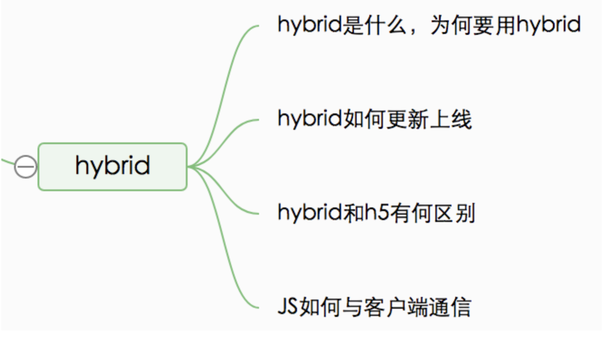

一、hybrid 是什么，为何会用 hybrid
--------------------------------------------------------------------------------

### 1.1 hybrid 文字解释

*   `hybrid` 即“混合”，即前端和客户端的混合开发
*   需前端开发人员和客户端开发人员配合完成
*   某些环节也可能涉及到 `server` 端
*   PS：不要以为自己的前端就可以不理会客户端的知识

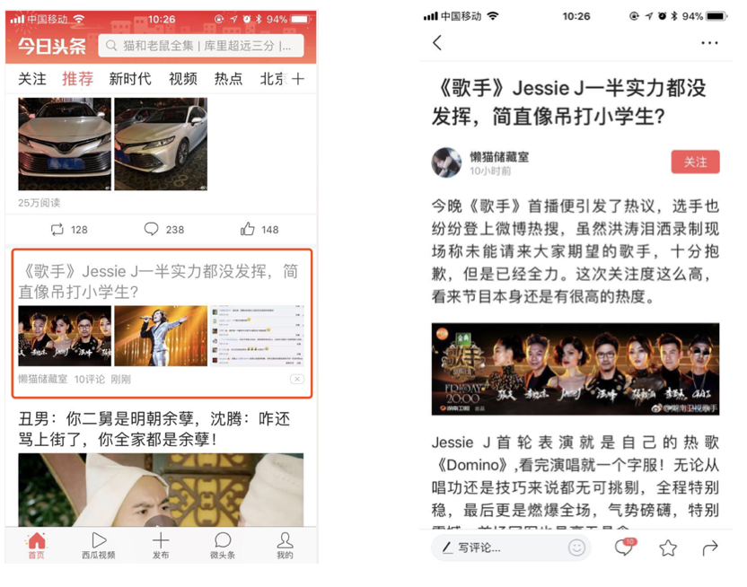

### 1.2 hybrid 存在价值

*   可以快速迭代更新【关键】（无需 app 审核，思考为何？）
*   体验流畅（和 NA 的体验基本类似）
*   减少开发和沟通成本，双端公用一套代码

### 1.3 webview

*   是 `app` 中的一个组件（ `app` 可以有 `webview` ，也可以没有）
*   于加载 `h5` 页面，即一个小型的浏览器内核

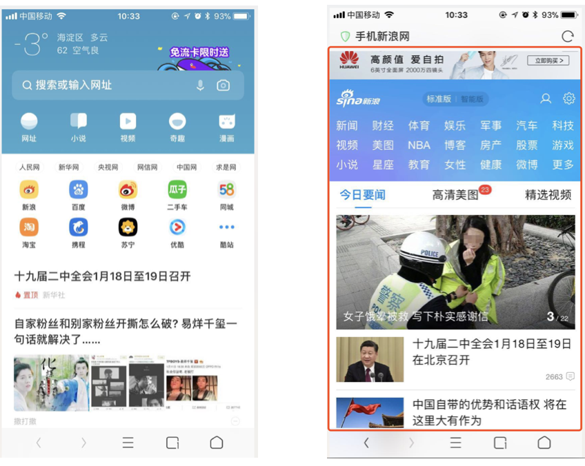

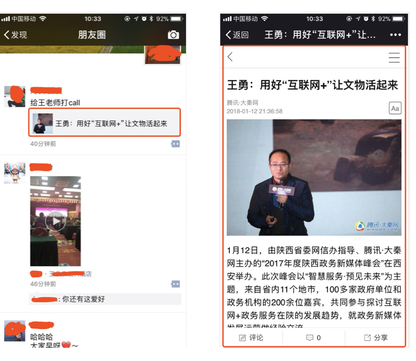

### 1.4 file 协议

*   其实在一开始接触 `html`开发，就已经使用了 `file` 协议
*   只不过你当时没有“协议”“标准”等这些概念

###  协议")1.5 http(s) 协议

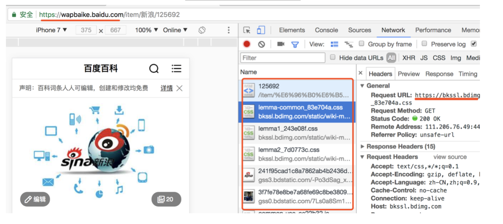

### 1.6 两者区别

*   `file` 协议：本地文件，快
*   `http(s)` 协议：网络加载，慢

### 1.7 具体实现

*   不是所有场景都适合使用 `hybrid`
*   使用 `NA` ：体验要求极致，变化不频繁（无头条的首页）
*   使用 `hybrid` ：体验要求高，变化频繁（如头条的新闻详情页）
*   使用 `h5` ：体验无要求，不常用（如举报、反馈等页面）

> 实现

*   前端做好静态页面（`html js css`），将文件交给客户端
*   客户端拿到前端静态页面，以文件形式存储在 `app` 中
*   客户端在一个 `webview` 中
*   使用 `file` 协议加载静态页面

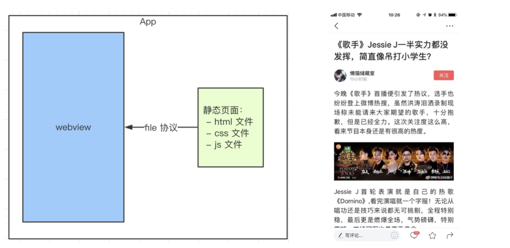

二、hybrid 更新上线流程
-----------------------------------------------------

### 2.1 具体流程图

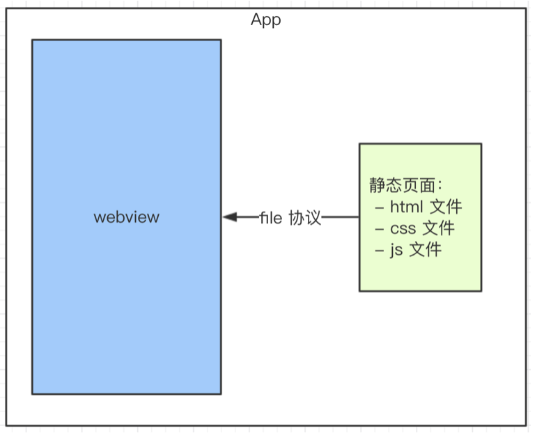

**思考（目的，可行途径）**

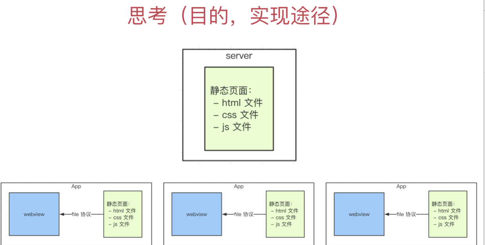

*   要替换每个客户端的静态文件
*   只能客户端来做（客户端是我们开发的）
*   客户端去 server 下载最新的静态文件
*   我们维护 server 的静态文件

### 2.2 完整流程

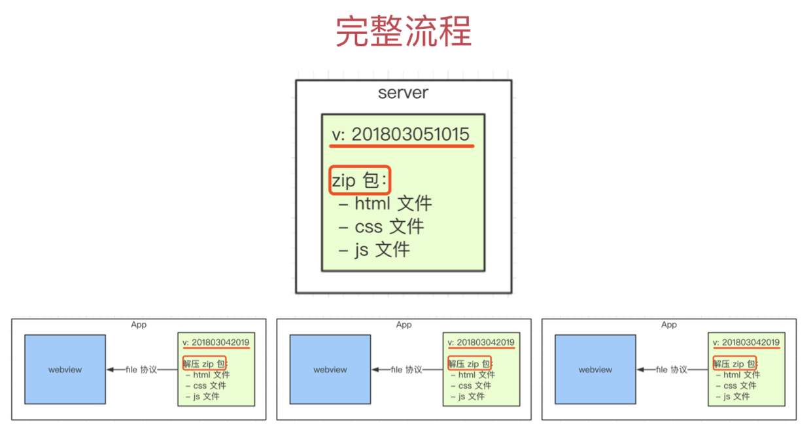

*   分版本，有版本号，如 `201803211015`
*   将静态文件压缩成 `zip`包，上传到服务端
*   客户端每次启动，都去服务端检查版本号
*   如果服务端版本号大于客户端版本号，就去下载最新的 `zip` 包
*   下载完之后解压包，然后将现有文件覆盖

**要点总结**

*   要点1：服务端的版本和`zip`包维护
*   要点2：更新`zip` 包之前，先对比版本号
*   要点3：`zip` 下载解压和覆盖

三、hybrid 和 h5 的区别
-----------------------------------------------------------

### 3.1 优点

*   体验更好，跟 `NA`体验基本一致
*   可快速迭代，无需 `app` 审核【关键】

### 3.2 缺点

*   开发成本高。联调、测试、查 `bug` 都比较麻烦
*   运维成本高。参考此前讲过的更新上线的流程

### 3.3 适用的场景

*   `hybrid` ： 产品的稳定功能，体验要求高，迭代频繁
*   `h5` ： 单词的运营活动（如 `xx` 红包）或不常用功能

四、前端和客户端通讯
--------------------------------------

### 4.1 JS 和客户端通讯的基本形式

*   `JS` 访问客户端能力，传递参数和回调函数
*   客户端通过回调函数返回内容

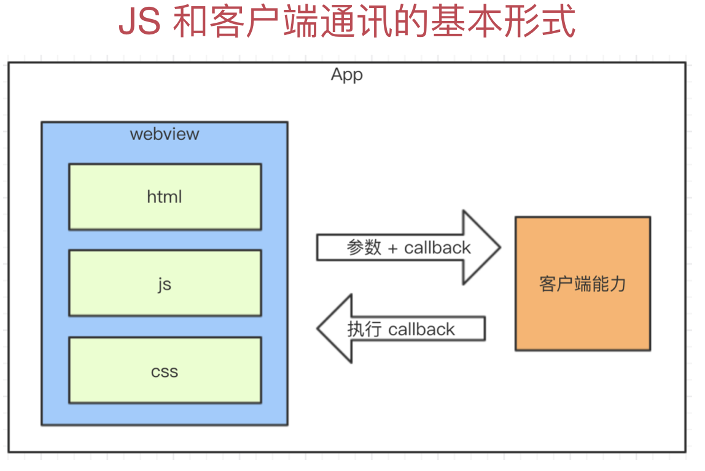

### 4.2 schema 协议简介和使用

*   之前介绍了 `http(s)` 和 `file` 协议
*   `schema` 协议 —— 前端和客户端通讯的约定

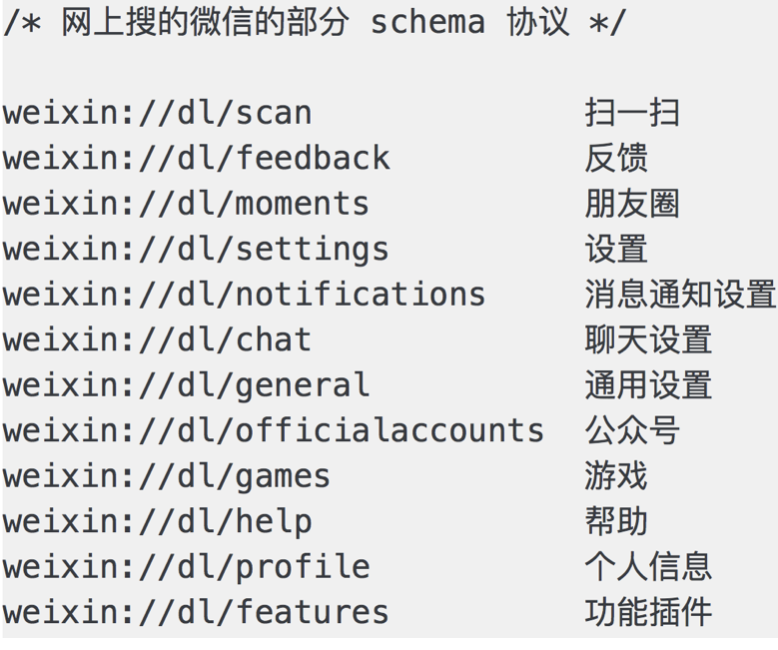

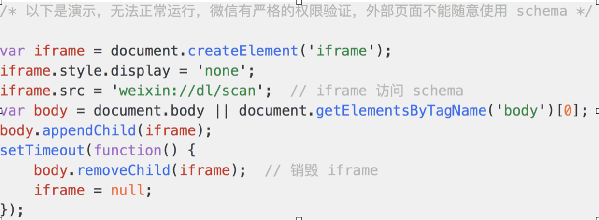

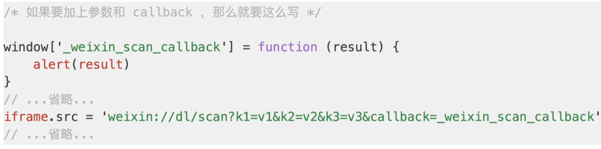

### 4.3 schema 使用的封装

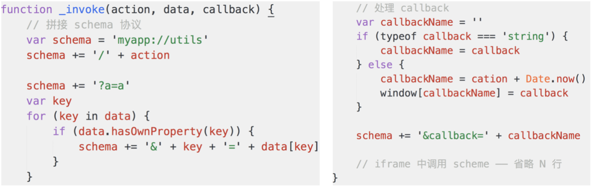

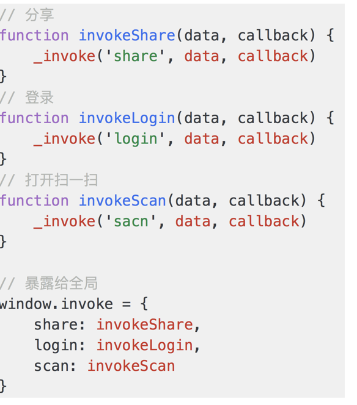

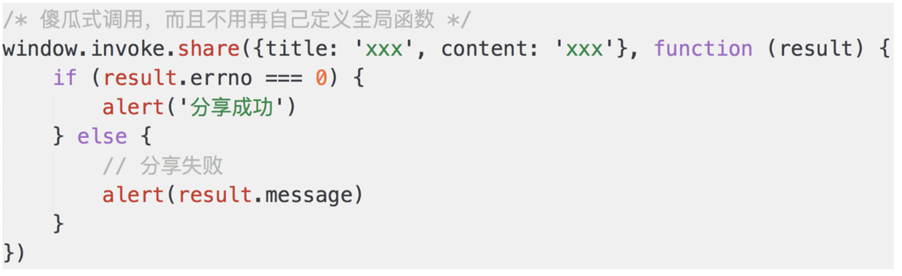

### 4.4 内置上线

*   将以上封装的代码打包，叫做 `invoke.js`，内置到客户端
*   客户端每次启动 `webview`，都默认执行 `invoke.js`
*   本地加载，免去网络加载的时间，更快
*   本地加载，没有网络请求，黑客看不到 `schema` 协议，更安全