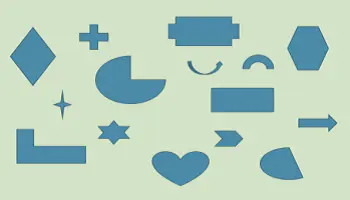
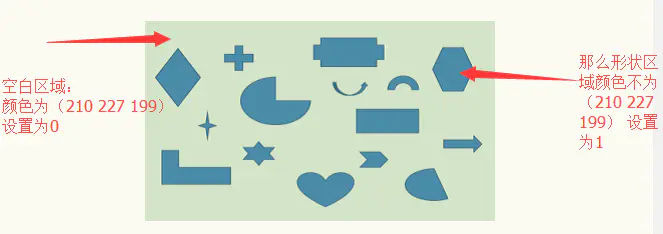
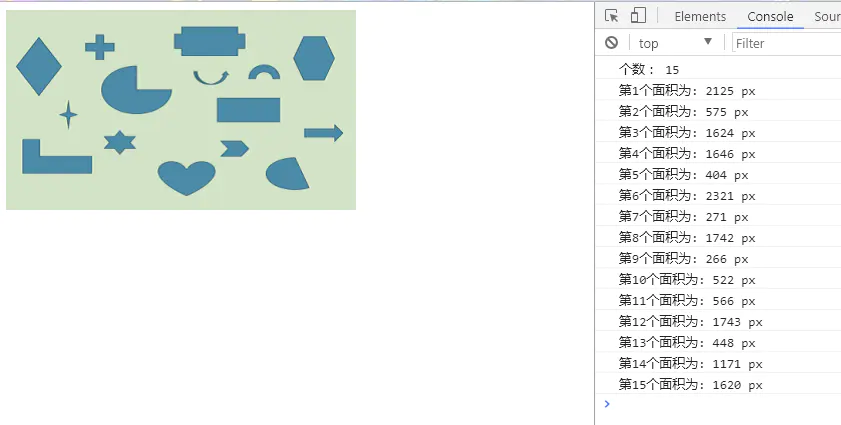

* * *

据了解，现在前端面试也喜欢考算法题了。前几天去面试，果不其然的，面试官给我四道算法题，让我自己回去做。下面说一个跟前端有点相关并且有点趣的一道算法题。

### 题目：

**平面上有若干个不特定的形状，如下图所示。请写程序求出物体的个数，以及每个不同物体的面积。**

### 分析

想要知道有多少个图形，想到的就是先获取图片中的每一个像素点然后判获取像素点的背景颜色（RGBA）。想要获得图片中的每一个像素点，那就可以联想到使用h5的canvas。  
**如下：**

[菜鸟教程中canvas的getimagedata方法](https://link.jianshu.com?t=http://www.runoob.com/tags/canvas-getimagedata.html)

*   书写html标签。

     <canvas id="canvas" height="200" width="350">对不你，你的浏览器不支持Canvas</canvas> 
    
*   js获取canvas对象

    let ctxt = canvas.getContext('2d');
    
*   js创建image对象

    let img = new Image;
    img.src = './image.png'; //图片路径
    img.onload = function(){}  //加载成功后的执行函数，之后的代码就写在其中
    
*   创建存储图片像素点的二维数组

    let coordinates = [];
    for(let i=0; i<200; i++){
           coordinates[i] = [];
    }
    
*   获取像素点，也就是使用getimagedata方法。

    ctxt.drawImage(img, 0, 0);  //将图片画如canvas
    let data = ctxt.getImageData(0, 0, 350, 200).data;//读取整张图片的像素。
    
*   将像素存入二维数组

    let x=0,y=0;  //二维数组的行和列， x：列  y：行
    for(let i =0,len = data.length; i<len;i+=4){
            let red = data[i],//红色色深
            green = data[i+1],//绿色色深
            blue = data[i+2],//蓝色色深
            alpha = data[i+3];//透明度
            //把每个像素点，以二位数组的形式展开
            if(`${red} ${green} ${blue}` === '210 227 199'){
                coordinates[y][x] = 0;
            }else{
                coordinates[y][x] = 1;
            }
            x++;
            if(x >= 350){
                x = 0;
                y++;
            }
    }
    
*   目前代码如下：

    (function(){
            let ctxt = canvas.getContext('2d');
            let img = new Image;
            let coordinates = [];
            let h = 200,
                w = 350;
            for(let i=0; i<200; i++){
                coordinates[i] = [];
            }
            img.src = './image.png'; //图片路径
            img.onload = function(){
                ctxt.drawImage(img, 0, 0);
                let data = ctxt.getImageData(0, 0, 350, 200).data;//读取整张图片的像素。
                let x=0,y=0;
                for(let i =0,len = data.length; i<len;i+=4){
                        let red = data[i],//红色色深
                        green = data[i+1],//绿色色深
                        blue = data[i+2],//蓝色色深
                        alpha = data[i+3];//透明度
                        //把每个像素点，以二位数组的形式展开
                        if(`${red} ${green} ${blue}` === '210 227 199'){
                            coordinates[y][x] = 0;
                        }else{
                            coordinates[y][x] = 1;
                        }
                        x++;
                        if(x >= 350){
                            x = 0;
                            y++;
                        }
                    }
                    console.log(coordinates);
            }
        })();
    
*   如图：

image.png

*   构成类似如下二维数组：
    
    0,0,0,0,0,0,0,0,0,0,0,0  
    0,0,1,1,1,0,0,0,0,0,0,0  
    0,1,1,1,1,0,0,0,0,0,0,0  
    0,1,1,1,0,0,0,1,1,1,1,0  
    0,0,0,0,0,0,1,1,1,0,0,0  
    0,0,0,0,0,0,1,1,1,0,0,0  
    0,0,0,0,0,0,0,0,0,0,0,0
    

**那么我们就只需要知道二维数组中这种连续为1的块有多少个就知道了图片中形状有多少个，并且块中有多少个1，那么这个块的面积就是1的个数。**

### 递归回溯算法

    //计算连续的面积和个数
    const linkSum = (i,j,num)=>{
            //走过的路就置0
          coordinates[i][j] = 0;
          num++;
          //向上
          if((i+1 < h) && coordinates[i+1][j] == 1){
            num = linkSum(i+1 , j , num);
          }
          //向下
          if((j+1 < w) && coordinates[i][j+1] == 1){
            num = linkSum(i , j+1 , num);
          }
          //向左
          if((i-1 >= 0) && coordinates[i-1][j] == 1){
            num = linkSum(i-1 , j , num);
          }
          //向右
        if((j-1 >= 0) && coordinates[i][j-1] == 1){
            num = linkSum(i , j-1 , num);
        }
    
        return num;
    }

不熟悉的，直接百度就好，这里就不多说了，其实代码就反应了很多信息。

### 使用算法，统计并计算出结果。

    const getCountAndArea = () =>{
        let sum = [];
        let count = 0;
        for(let i = 0; i < h; i++)  //遍历二维数组
        {
          for(let j = 0; j < w; j++)
          {
           //连续1的个数
           if(coordinates[i][j] == 1)
           {
            let buf = 0;  //连续1的个数
            buf = linkSum(i,j,buf);
            count++;  //形状的总数
            sum.push({
                index: count,   //第几个形状
                area: buf         //形状的面积
            });
           }
          }
        }
        return {
            count,
            sum
        };
    }

### 最后的代码

    (function(){
            let ctxt = canvas.getContext('2d');
            let img = new Image;
            let coordinates = [];
            let h = 200,
                w = 350;
            for(let i=0; i<200; i++){
                coordinates[i] = [];
            }
            img.src = './image.png'; //图片路径
            img.onload = function(){
                ctxt.drawImage(img, 0, 0);
                let data = ctxt.getImageData(0, 0, 350, 200).data;//读取整张图片的像素。
                let x=0,y=0;
                for(let i =0,len = data.length; i<len;i+=4){
                        let red = data[i],//红色色深
                        green = data[i+1],//绿色色深
                        blue = data[i+2],//蓝色色深
                        alpha = data[i+3];//透明度
                        //把每个像素点，以二位数组的形式展开
                        if(`${red} ${green} ${blue}` === '210 227 199'){
                            coordinates[y][x] = 0;
                        }else{
                            coordinates[y][x] = 1;
                        }
                        x++;
                        if(x >= 350){
                            x = 0;
                            y++;
                        }
                    }
                    // console.log(coordinates);
                    let rst = getCountAndArea();
                    // console.log(rst);
                    console.log('个数： ' + rst.count);
                    for(let i=0; i<rst.sum.length; i++){
                        console.log(`第${i+1}个面积为: ${rst.sum[i].area} px`);
                    }
            }
        
            const getCountAndArea = () =>{
                let sum = [];
                let count = 0;
                for(let i = 0; i < h; i++)
                {
                  for(let j = 0; j < w; j++)
                  {
                   //连续1的个数
                   if(coordinates[i][j] == 1)
                   {
                    let buf = 0;
                    buf = linkSum(i,j,buf);
                    count++;
                    sum.push({
                        index: count,
                        area: buf
                    });
                   }
                  }
                }
                return {
                    count,
                    sum
                };
            }
    
            //计算连续的面积和个数
            const linkSum = (i,j,num)=>{
                //走过的路就置0
              coordinates[i][j] = 0;
              num++;
              //向上
              if((i+1 < h) && coordinates[i+1][j] == 1){
                num = linkSum(i+1 , j , num);
              }
              //向下
              if((j+1 < w) && coordinates[i][j+1] == 1){
                num = linkSum(i , j+1 , num);
              }
              //向左
              if((i-1 >= 0) && coordinates[i-1][j] == 1){
                num = linkSum(i-1 , j , num);
              }
              //向右
            if((j-1 >= 0) && coordinates[i][j-1] == 1){
                num = linkSum(i , j-1 , num);
            }
    
            return num;
            }
        })();

​    

### 运行的结果：

