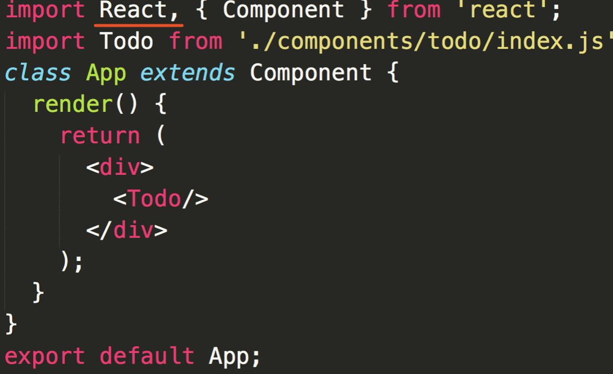

前端面试之组件化
========

一、说一下对组件化的理解
--------------------------------------------

### 1.1 组件的封装

*   视图
*   数据
*   变化逻辑

### 1.2 组件的复用

*   `props` 传递
*   复用

二、JSX 本质是什么
-----------------------------------------

### 2.1 JSX 语法

*   `html` 形式
*   引入 `JS` 变量和表达式
*   循环
*   `style` 和 `className`
*   事件

> *   JSX 语法根本无法被浏览器所解析
> *   那么它如何在浏览器运行？

### 2.2 JSX 解析

*   `JSX` 其实是语法糖
*   开发环境会将 `JSX` 编译成 `JS` 代码
*   `JSX` 的写法大大降低了学习成本和编码工作量
*   同时，`JSX` 也会增加 `debug`成本

### 2.3 JSX 独立的标准

*   `JSX` 是 `React` 引入的，但不是 `React` 独有的
*   `React`已经将它作为一个独立标准开放，其他项目也可用
*   `React.createElement` 是可以自定义修改的
*   说明：本身功能已经完备；和其他标准监控和扩展性没问题

三、JSX 和 vdom 的关系
--------------------------------------------------------

### 3.1 为何需要 vdom

*   `vdom` 是 `React`初次推广开来的，结合 `JSX`
*   `JSX` 就是模板，最终要渲染成 `html`
*   初次渲染 \+ 修改 `state` 后的 `re-render`
*   正好符合 `vdom` 的应用场景

### 3.2 React.createElement 和 h

### 3.3 何时 patch

*   初次渲染 \- `ReactDOM.render(<App/>, container)`
*   会触发 `patch(container, vnode)`
*   `re-render` \- `setState`
*   会触发 `patch(vnode, newVnode)`

### 3.4 自定义组件的解析

*   `‘div’` \- 直接渲染 `
` 即可，`vdom` 可以做到
*   `Input` 和 `List` ，是自定义组件（`class`），`vdom` 默认不认识
*   因此 `Input` 和 `List` 定义的时候必须声明 `render` 函数
*   根据 `props` 初始化实例，然后执行实例的 `render` 函数
*   `render` 函数返回的还是 `vnode`对象

四、说一下 React setState 的过程
--------------------------------------------------------------------------------

### 4.1 setState 的异步

**setState 为何需要异步？**

*   可能会一次执行多次 `setState`
*   你无法规定、限制用户如何使用 `setState`
*   没必要每次 `setState` 都重新渲染，考虑性能
*   即便是每次重新渲染，用户也看不到中间的效果
*   只看到最后的结果即可

### 4.2 vue 修改属性也是异步

*   效果、原因和 `setState` 一样

### 4.3 setState 的过程

*   每个组件实例，都有`renderComponent` 方法
*   执行 `renderComponent` 会重新执行实例的 `render`
*   `render` 函数返回 `newVnode` ，然后拿到 `preVnode`
*   执行 `patch(preVnode, newVnode)`

五、React vs vue
--------------------------------------------------

### 5.1 两者的本质区别

*   vue - 本质是 MVVM 框架，由 MVC 发展而来
*   React - 本质是前端组件化框架，由后端组件化发展而来
*   但这并不妨碍他们两者都能实现相同的功能

### 5.2 看模板和组件化的区别

*   `vue`\- 使用模板（最初由 `angular` 提出）
*   `React`\- 使用 `JSX`
*   模板语法上，我更加倾向于 `JSX`
*   模板分离上，我更加倾向于 `vue`

**模板的区别**

> 模板应该和 JS 逻辑分离

**组件化区别**

*   `React` 本身就是组件化，没有组件化就不是 `React`
*   `vue` 也支持组件化，不过是在 `MVVM` 上的扩展
*   对于组件化，我更加倾向于 `React` ，做的彻底而清晰

### 5.3 两者共同点

*   都支持组件化
*   都是数据驱动试图