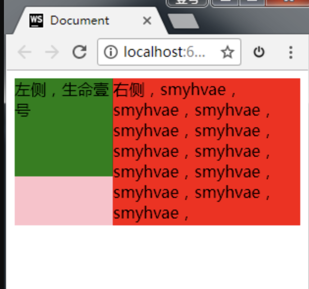
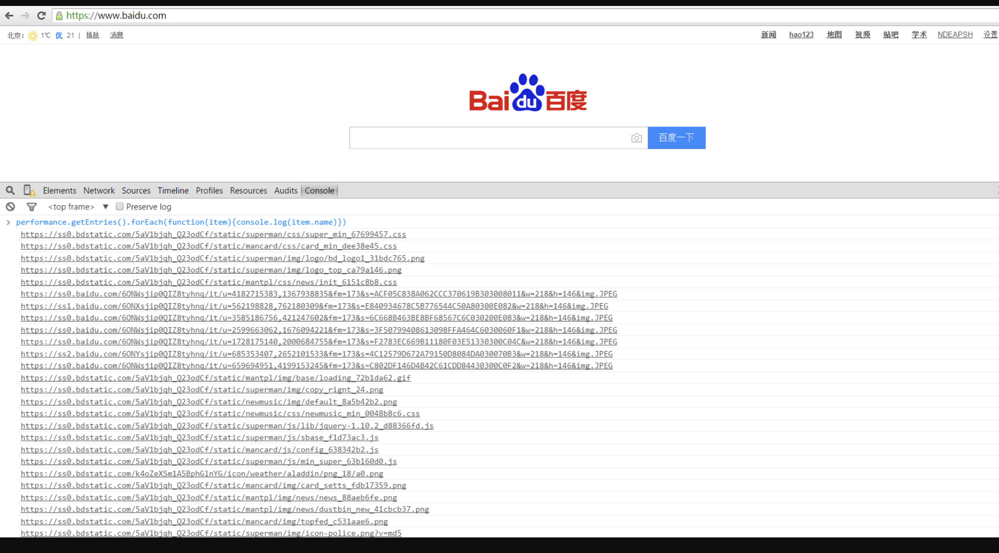

> 本篇对一些知识点查漏补缺

[#](#一、创建对象和原型链) 一、创建对象和原型链
---------------------------

### [#](#_1-面向对象的三大特性) 1 面向对象的三大特性

*   封装
*   继承
*   多态

#### [#](#_1-1-原型链的知识) 1.1 原型链的知识

> 原型链是面向对象的基础，是非常重要的部分。有以下几种知识：

*   创建对象有几种方法
*   原型、构造函数、实例、原型链
*   `instanceof`的原理
*   `new` 运算符

### [#](#_2-创建对象有几种方法) 2 创建对象有几种方法

#### [#](#_2-1-方式一：字面量) 2.1 方式一：字面量

        var obj11 = {name: 'smyh'};
        var obj12 = new Object(name: `smyh`); //内置对象（内置的构造函数）


> 上面的两种写法，效果是一样的。因为，第一种写法，`obj11`会指向`Object`。

*   第一种写法是：字面量的方式。
*   第二种写法是：内置的构造函数

#### [#](#_2-2-方式二：通过构造函数) 2.2 方式二：通过构造函数

        var M = function (name) {
            this.name = name;
        }
        var obj3 = new M('smyhvae');


#### [#](#_2-3-方法三：object-create) 2.3 方法三：Object.create

        var p = {name:'smyhvae'};
        var obj3 = Object.create(p);  //此方法创建的对象，是用原型链连接的


> 第三种方法，很少有人能说出来。这种方式里，`obj3`是实例，`p`是`obj3的`原型（`name`是p原型里的属性），构造函数是`Objecet` 。


### [#](#_3-原型、构造函数、实例，以及原型链) 3 原型、构造函数、实例，以及原型链


> PS：任何一个函数，如果在前面加了`new`，那就是构造函数。

#### [#](#_3-1-原型、构造函数、实例三者之间的关系) 3.1 原型、构造函数、实例三者之间的关系


1.  构造函数通过 `new` 生成实例
2.  构造函数也是函数，构造函数的`prototype`指向原型。（所有的函数有`prototype`属性，但实例没有 `prototype`属性）
3.  原型对象中有 `constructor`，指向该原型的构造函数。

> 上面的三行，代码演示：

      var Foo = function (name) {
          this.name = name;
      }
    
      var fn = new Foo('smyhvae');


> 上面的代码中，`Foo.prototype.constructor === Foo`的结果是`true`：


4.  实例的`__proto__`指向原型。也就是说，`Foo.__proto__ === M.prototype`。

> 声明：所有的**引用类型**（数组、对象、函数）都有`__proto__`这个属性。

`Foo.__proto__ === Function.prototype`的结果为true，说明`Foo`这个普通的函数，是`Function`构造函数的一个实例。

#### [#](#_3-2-原型链) 3.2 原型链

**原型链的基本原理**：任何一个**实例**，通过原型链，找到它上面的**原型**，该原型对象中的方法和属性，可以被所有的原型实例共享。

> `Object`是原型链的顶端。

*   原型可以起到继承的作用。原型里的方法都可以被不同的实例共享：

    ```javascript
      //给Foo的原型添加 say 函数
      Foo.prototype.say = function () {
          console.log('');
      }
    ```
    
    
    

**原型链的关键**：在访问一个实例的时候，如果实例本身没找到此方法或属性，就往原型上找。如果还是找不到，继续往上一级的原型上找。

#### [#](#_3-3-instanceof的原理) 3.3 `instanceof`的原理


*   `instanceof`的**作用**：用于判断**实例**属于哪个**构造函数**。
*   `instanceof`的**原理**：判断实例对象的`__proto__`属性，和构造函数的`prototype`属性，是否为同一个引用（是否指向同一个地址）。

> *   **注意1**：虽然说，实例是由构造函数 new 出来的，但是实例的`__proto__`属性引用的是构造函数的`prototype`。也就是说，实例的`__proto__`属性与构造函数本身无关。
> *   **注意2**：在原型链上，原型的上面可能还会有原型，以此类推往上走，继续找`__proto__`属性。这条链上如果能找到， instanceof 的返回结果也是 true。

比如说：

*   `foo instance of Foo`的结果为true，因为`foo.__proto__ === M.prototype`为`true`。
*   **`foo instance of Objecet`的结果也为true**，为`Foo.prototype.__proto__ === Object.prototype`为`true`。

> 但我们不能轻易的说：`foo` 一定是 由`Object`创建的实例`。这句话是错误的。我们来看下一个问题就明白了。

#### [#](#_3-4-分析一个问题) 3.4 分析一个问题

**问题：**已知A继承了B，B继承了C。怎么判断 a 是由A**直接生成**的实例，还是B直接生成的实例呢？还是C直接生成的实例呢？

> 分析：这就要用到原型的`constructor`属性了。

*   `foo.__proto__.constructor === M`的结果为`true`，但是 `foo.__proto__.constructor === Object`的结果为`false`。
*   所以，用 `consturctor`判断就比用 `instanceof`判断，更为严谨。

### [#](#_4-new-运算符) 4 new 运算符

> 当`new Foo()`时发生了什么：

*   创建一个**新的空对象实例**。
*   将此空对象的隐式原型指向其构造函数的显示原型。
*   执行构造函数（传入相应的参数，如果没有参数就不用传），同时 `this` 指向这个新实例。
*   如果返回值是一个新对象，那么直接返回该对象；如果无返回值或者返回一个非对象值，那么就将步骤（1）创建的对象返回。

[#](#二、面向对象) 二、面向对象
-------------------

### [#](#_1-前言) 1 前言

> 类与实例：

*   类的声明
*   生成实例

**类与继承：**

*   如何实现继承：继承的本质就是原型链
*   继承的几种方式

### [#](#_2-类的定义、实例化) 2 类的定义、实例化

#### [#](#_2-1-类的定义-类的声明) 2.1 类的定义/类的声明

**方式一**：用构造函数模拟类（传统写法）

    function Animal1() {
        this.name = 'smyhvae'; //通过this，表明这是一个构造函数
    }


**方式二**：用 `class` 声明（`ES6`的写法）

    class Animal2 {
        constructor() {  //可以在构造函数里写属性
            this.name = name;
        }
    }


控制台的效果：


#### [#](#_2-2-实例化) 2.2 实例化

类的实例化很简单，直接 `new` 出来即可。

    console.log(new Animal1(),new Animal2()); //实例化。如果括号里没有参数，则括号可以省略


### [#](#_3-继承的几种方式) 3 继承的几种方式

> 继承的本质就是原型链。

**继承的方式有几种？每种形式的优缺点是**？这些问题必问的。其实就是考察你对原型链的掌握程度。

#### [#](#_3-1-方式一：借助构造函数) 3.1 方式一：借助构造函数

        function Parent1() {
            this.name = 'parent1 的属性';
        }
    
        function Child1() {
            Parent1.call(this);         //【重要】此处用 call 或 apply 都行：改变 this 的指向
            this.type = 'child1 的属性';
        }
    
        console.log(new Child1);


> 【重要】上方代码中，最重要的那行代码：在子类的构造函数里写了`Parent1.call(this);`，意思是：**让Parent的构造函数在child的构造函数中执行**。发生的变化是：**改变this的指向**，parent的实例 --> 改为指向child的实例。导致 parent的实例的属性挂在到了child的实例上，这就实现了继承。

打印结果：


> 上方结果表明：`child`先有了 `parent` 实例的属性（继承得以实现），再有了`child` 实例的属性。

**分析**：

> 这种方式，虽然改变了 `this` 的指向，但是，**Child1 无法继承 `Parent1` 的原型**。也就是说，如果我给 `Parent1` 的原型增加一个方法：

        Parent1.prototype.say = function () {
        };


> 上面这个方法是无法被 `Child1` 继承的。如下：


#### [#](#_3-2-方法二：通过原型链实现继承) 3.2 方法二：通过原型链实现继承

        /*
        通过原型链实现继承
         */
        function Parent() {
            this.name = 'Parent 的属性';
        }
    
        function Child() {
            this.type = 'Child 的属性';
        }
    
        Child.prototype = new Parent(); //【重要】
    
        console.log(new Child());


打印结果：


> 【重要】上方代码中，最重要的那行：每个函数都有`prototype`属性，于是，构造函数也有这个属性，这个属性是一个对象。现在，**我们把`Parent`的实例赋值给了`Child`的`prototye`**，从而实现**继承**。此时，`Child`构造函数、`Parent`的实例、`Child`的实例构成一个三角关系。于是：

*   `new Child.__proto__ === new Parent()`的结果为`true`

**分析：**

*   这种继承方式，**Child 可以继承 Parent 的原型**，但有个缺点：

> 缺点是：**如果修改 child1实例的name属性，child2实例中的name属性也会跟着改变**。

如下：


> 上面的代码中， `child1`修改了`arr`属性，却发现，`child2`的`arr`属性也跟着改变了。这显然不太好，在业务中，两个子模块应该隔离才对。如果改了一个对象，另一个对象却发生了改变，就不太好。

> 造成这种缺点的原因是：`child1`和`child2`共用原型。即：`chi1d1.__proto__ === child2__proto__`是严格相同。而 arr方法是在 Parent 的实例上（即 Child实例的原型）的。

#### [#](#_3-3-方式三：组合的方式：构造函数-原型链) 3.3 方式三：组合的方式：构造函数 + 原型链

就是把上面的两种方式组合起来：

    /*
    组合方式实现继承：构造函数、原型链
      */
    function Parent3() {
        this.name = 'Parent 的属性';
        this.arr = [1, 2, 3];
    }
    
    function Child3() {
        Parent3.call(this); //【重要1】执行 parent方法
        this.type = 'Child 的属性';
    }
    Child3.prototype = new Parent3(); //【重要2】第二次执行parent方法
    
    var child = new Child3();


*   这种方式，能解决之前两种方式的问题：既可以继承父类原型的内容，也不会造成原型里属性的修改。
*   这种方式的缺点是：让父亲`Parent`的构造方法执行了两次。
*   `ES6`中的继承方式，一带而过即可，重点是要掌握`ES5`中的继承。

[#](#三、dom事件总结) 三、DOM事件总结
-------------------------

**知识点主要包括以下几个方面：**

*   基本概念：`DOM`事件的级别

> 面试不会直接问你，DOM有几个级别。但会在题目中体现：“请用`DOM2` ....”。

*   `DOM`事件模型、`DOM`事件流

> 面试官如果问你“**DOM事件模型**”，你不一定知道怎么回事。其实说的就是**捕获和冒泡**。

**DOM事件流**，指的是事件传递的**三个阶段**。

*   描述`DOM`事件捕获的具体流程

> 讲的是事件的传递顺序。参数为`false`（默认）、参数为`true`，各自代表事件在什么阶段触发。

能回答出来的人，寥寥无几。也许有些人可以说出一大半，但是一字不落的人，极少。

*   `Event`对象的常见应用（`Event`的常用`api`方法）

> `DOM`事件的知识点，一方面包括事件的流程；另一方面就是：怎么去注册事件，也就是监听用户的交互行为。第三点：在响应时，`Event`对象是非常重要的。

**自定义事件（非常重要）**

> 一般人可以讲出事件和注册事件，但是如果让你讲**自定义事件**，能知道的人，就更少了。

**DOM事件的级别**

> `DOM`事件的级别，准确来说，是**DOM标准**定义的级别。包括：

**DOM0的写法：**

      element.onclick = function () {
    
      }


> 上面的代码是在 `js` 中的写法；如果要在`html`中写，写法是：在`onclick`属性中，加 `js` 语句。

**DOM2的写法：**

      element.addEventListener('click', function () {
    
      }, false);


> 【重要】上面的第三参数中，**true**表示事件在**捕获阶段**触发，**false**表示事件在**冒泡阶段**触发（默认）。如果不写，则默认为false。

**DOM3的写法：**

        element.addEventListener('keyup', function () {
    
        }, false);


> `DOM3`中，增加了很多事件类型，比如鼠标事件、键盘事件等。

> PS：为何事件没有`DOM1`的写法呢？因为，`DOM1`标准制定的时候，没有涉及与事件相关的内容。

**总结**：关于“DOM事件的级别”，能回答出以上内容即可，不会出题目让你做。

**DOM事件模型**

> `DOM`事件模型讲的就是**捕获和冒泡**，一般人都能回答出来。

*   捕获：从上往下。
*   冒泡：从下（目标元素）往上。

**DOM事件流**

> `DOM`事件流讲的就是：浏览器在于当前页面做交互时，这个事件是怎么传递到页面上的。

**完整的事件流，分三个阶段：**

1.  捕获：从 `window` 对象传到 目标元素。
2.  目标阶段：事件通过捕获，到达目标元素，这个阶段就是目标阶段。
3.  冒泡：从**目标元素**传到 `Window` 对象。

 

**描述DOM事件捕获的具体流程**

> 很少有人能说完整。

**捕获的流程**


**说明**：捕获阶段，事件依次传递的顺序是：`window` --\> `document` --\> `html`--\> `body` --\> 父元素、子元素、目标元素。

*   PS1：第一个接收到事件的对象是 **window**（有人会说`body`，有人会说`html`，这都是错误的）。
*   PS2：`JS`中涉及到`DOM`对象时，有两个对象最常用：`window`、`doucument`。它们俩也是最先获取到事件的。

代码如下：

```javascript
    window.addEventListener("click", function () {
        alert("捕获 window");
    }, true);

    document.addEventListener("click", function () {
        alert("捕获 document");
    }, true);

    document.documentElement.addEventListener("click", function () {
        alert("捕获 html");
    }, true);

    document.body.addEventListener("click", function () {
        alert("捕获 body");
    }, true);

    fatherBox.addEventListener("click", function () {
        alert("捕获 father");
    }, true);

    childBox.addEventListener("click", function () {
        alert("捕获 child");
    }, true);
```


​    

**补充一个知识点：**

> 在 `js`中：

*   如果想获取 `body` 节点，方法是：`document.body`；
*   但是，如果想获取 `html`节点，方法是`document.documentElement`。

**冒泡的流程**

> 与捕获的流程相反

**Event对象的常见 api 方法**

> 用户做的是什么操作（比如，是敲键盘了，还是点击鼠标了），这些事件基本都是通过`Event`对象拿到的。这些都比较简单，我们就不讲了。我们来看看下面这几个方法：

**方法一**

        event.preventDefault();


*   解释：阻止默认事件。
*   比如，已知`<a>`标签绑定了click事件，此时，如果给`<a>`设置了这个方法，就阻止了链接的默认跳转。

**方法二：阻止冒泡**

> 这个在业务中很常见。

> 有的时候，业务中不需要事件进行冒泡。比如说，业务这样要求：单击子元素做事件`A`，单击父元素做事件B，如果不阻止冒泡的话，出现的问题是：单击子元素时，子元素和父元素都会做事件`A`。这个时候，就要用到阻止冒泡了。

> `w3c`的方法：（火狐、谷歌、`IE11`）

        event.stopPropagation();


> `IE10`以下则是：

    	event.cancelBubble = true;


> 兼容代码如下：

       box3.onclick = function (event) {
    
            alert("child");
    
            //阻止冒泡
            event = event || window.event;
    
            if (event && event.stopPropagation) {
                event.stopPropagation();
            } else {
                event.cancelBubble = true;
            }
        }


> 上方代码中，我们对`box3`进行了阻止冒泡，产生的效果是：事件不会继续传递到 `father`、`grandfather`、`body`了。

**方法三：设置事件优先级**

        event.stopImmediatePropagation();


这个方法比较长，一般人没听说过。解释如下：

> 比如说，我用`addEventListener`给某按钮同时注册了事件`A`、事件`B`。此时，如果我单击按钮，就会依次执行事件A和事件`B`。现在要求：单击按钮时，只执行事件A，不执行事件`B`。该怎么做呢？这是时候，就可以用到`stopImmediatePropagation`方法了。做法是：在事件A的响应函数中加入这句话。

> 大家要记住 `event` 有这个方法。

**属性4、属性5（事件委托中用到）**


        event.currentTarget   //当前所绑定的事件对象。在事件委托中，指的是【父元素】。
    
        event.target  //当前被点击的元素。在事件委托中，指的是【子元素】。


​    

上面这两个属性，在事件委托中经常用到。

> **总结**：上面这几项，非常重要，但是容易弄混淆。

**自定义事件**

> 自定义事件的代码如下：

        var myEvent = new Event('clickTest');
        element.addEventListener('clickTest', function () {
            console.log('smyhvae');
        });
    
    	//元素注册事件
        element.dispatchEvent(myEvent); //注意，参数是写事件对象 myEvent，不是写 事件名 clickTest


​    

> 上面这个事件是定义完了之后，就直接自动触发了。在正常的业务中，这个事件一般是和别的事件结合用的。比如延时器设置按钮的动作：

        var myEvent = new Event('clickTest');
    
        element.addEventListener('clickTest', function () {
            console.log('smyhvae');
        });
    
        setTimeout(function () {
            element.dispatchEvent(myEvent); //注意，参数是写事件对象 myEvent，不是写 事件名 clickTest
        }, 1000);


[#](#四、event-loop详细版) 四、Event Loop详细版
-------------------------------------

### [#](#为什么-gui-渲染线程为什么与-js-引擎线程互斥) 为什么 GUI 渲染线程为什么与 JS 引擎线程互斥

*   这是由于 JS 是可以操作 DOM 的，如果同时修改元素属性并同时渲染界面(即 JS线程和 UI线程同时运行)
*   那么渲染线程前后获得的元素就可能不一致了
*   因此，为了防止渲染出现不可预期的结果，浏览器设定 GUI渲染线程和 JS引擎线程为互斥关系
*   当 JS引擎线程执行时 GUI渲染线程会被挂起，GUI更新则会被保存在一个队列中等待 JS引擎线程空闲时立即被执行

### [#](#从-event-loop-看-js-的运行机制) 从 Event Loop 看 JS 的运行机制

**先理解一些概念：**

*   `JS` 分为同步任务和异步任务
*   同步任务都在JS引擎线程上执行，形成一个 执行栈
*   事件触发线程管理一个 任务队列，异步任务触发条件达成，将回调事件放到 任务队列中
*   执行栈中所有同步任务执行完毕，此时JS引擎线程空闲，系统会读取 任务队列，将可运行的异步任务回调事件添加到 执行栈中，开始执行


*   前端开发中我们会通过 `setTimeout/setInterval` 来指定定时任务，会通过 `XHR/fetch`发送网络请求
*   接下来简述一下 `setTimeout/setInterval`和 `XHR/fetch`到底做了什么事
*   我们知道，不管是 `setTimeout/setInterval`和 `XHR/fetch`代码，在这些代码执行时， 本身是同步任务，而其中的回调函数才是异步任务
*   当代码执行到 `setTimeout/setInterval`时，实际上是 JS引擎线程通知 定时触发器线程，间隔一个时间后，会触发一个回调事件
*   而定时触发器线程在接收到这个消息后，会在等待的时间后，将回调事件放入到由 事件触发线程所管理的事件队列中
*   当代码执行到 `XHR/fetch`时，实际上是 `JS`引擎线程通知 异步`http`请求线程，发送一个网络请求，并制定请求完成后的回调事件
*   而异步`http`请求线程在接收到这个消息后，会在请求成功后，将回调事件放入到由 事件触发线程所管理的 事件队列中
*   当我们的同步任务执行完，`JS`引擎线程会询问事件触发线程，在 事件队列中是否有待执行的回调函数，如果有就会加入到执行栈中交给 JS引擎线程执行

 

**总结一下：**

*   JS引擎线程只执行执行栈中的事件
*   执行栈中的代码执行完毕，就会读取事件队列中的事件
*   事件队列中的回调事件，是由各自线程插入到事件队列中的
*   如此循环

> 当我们基本了解了什么是执行栈，什么是事件队列之后，我们深入了解一下事件循环中 宏任务、 微任务

### [#](#什么是宏任务) 什么是宏任务

*   我们可以将每次执行栈执行的代码当做是一个宏任务（包括每次从事件队列中获取一个事件回调并放到执行栈中执行）
*   每一个宏任务会从头到尾执行完毕，不会执行其他。

> 我们前文提到过 JS引擎线程和 GUI渲染线程是互斥的关系，浏览器为了能够使 宏任务和 DOM任务有序的进行，会在一个 宏任务执行结果后，在下一个 宏任务执行前， GUI渲染线程开始工作，对页面进行渲染。

    // 宏任务-->渲染-->宏任务-->渲染-->渲染．．


> 主代码块，`setTimeout`，`setInterval`等，都属于宏任务

**第一个例子：**

我们可以将这段代码放到浏览器的控制台执行以下，看一下效果：


> 我们会看到的结果是，页面背景会在瞬间变成白色，以上代码属于同一次 宏任务，所以全部执行完才触发 页面渲染，渲染时 GUI线程会将所有UI改动优化合并，所以视觉效果上，只会看到页面变成灰色

**第二个例子：**


> 我会看到，页面先显示成蓝色背景，然后瞬间变成了黑色背景，这是因为以上代码属于两次 宏任务，第一次 宏任务执行的代码是将背景变成蓝色，然后触发渲染，将页面变成蓝色，再触发第二次宏任务将背景变成黑色

### [#](#什么是微任务) 什么是微任务

*   我们已经知道 宏任务结束后，会执行渲染，然后执行下一个 宏任务，
*   而微任务可以理解成在当前 宏任务执行后立即执行的任务。
*   也就是说，**当 宏任务执行完，会在渲染前，将执行期间所产生的所有 微任务都执行完**。

> `Promise`，`process.nextTick`等，属于 微任务。


*   控制台输出 1 3 2 , 是因为 promise 对象的 then 方法的回调函数是异步执行，所以 2 最后输出
*   页面的背景色直接变成黑色，没有经过蓝色的阶段，是因为，我们在宏任务中将背景设置为蓝色，但在进行渲染前执行了微任务，在微任务中将背景变成了黑色，然后才执行的渲染


> 上面代码共包含两个 `setTimeout` ，也就是说除主代码块外，共有两个 宏任务， 其中第一个 宏任务执行中，输出 1 ，并且创建了 微任务队列，所以在下一个 宏任务队列执行前，先执行 微任务，在 微任务执行中，输出 3 ，微任务执行后，执行下一次 宏任务，执行中输出 2

### [#](#总结) 总结

*   执行一个 宏任务（栈中没有就从 事件队列中获取）
*   执行过程中如果遇到 微任务，就将它添加到 微任务的任务队列中
*   宏任务执行完毕后，立即执行当前 微任务队列中的所有 微任务（依次执行）
*   当前 宏任务执行完毕，开始检查渲染，然后 GUI线程接管渲染
*   渲染完毕后， JS线程继续接管，开始下一个 宏任务（从事件队列中获取）


[#](#五、es6相关) 五、ES6相关
---------------------

### [#](#_1-es5、es6和es2015有什么区别) 1 ES5、ES6和ES2015有什么区别?

> `ES2015`特指在`2015`年发布的新一代`JS`语言标准，`ES6`泛指下一代JS语言标准，包含`ES2015`、`ES2016`、`ES2017`、`ES2018`等。现阶段在绝大部分场景下，`ES2015`默认等同`ES6`。`ES5`泛指上一代语言标准。`ES2015`可以理解为`ES5`和`ES6`的时间分界线

### [#](#_2-babel是什么，有什么作用) 2 babel是什么，有什么作用?

> `babel`是一个 `ES6` 转码器，可以将 `ES6` 代码转为 `ES5` 代码，以便兼容那些还没支持`ES6`的平台

### [#](#_3-let有什么用，有了var为什么还要用let？) 3 let有什么用，有了var为什么还要用let？

> 在`ES6`之前，声明变量只能用`var`，`var`方式声明变量其实是很不合理的，准确的说，是因为`ES5`里面没有块级作用域是很不合理的。没有块级作用域回来带很多难以理解的问题，比如`for`循环`var`变量泄露，变量覆盖等问题。`let`声明的变量拥有自己的块级作用域，且修复了`var`声明变量带来的变量提升问题。

### [#](#_4-举一些es6对string字符串类型做的常用升级优化) 4 举一些ES6对String字符串类型做的常用升级优化?

**优化部分**

> `ES6`新增了字符串模板，在拼接大段字符串时，用反斜杠`(`)`取代以往的字符串相加的形式，能保留所有空格和换行，使得字符串拼接看起来更加直观，更加优雅

**升级部分**

> `ES6`在`String`原型上新增了`includes()`方法，用于取代传统的只能用`indexOf`查找包含字符的方法(`indexOf`返回`-1`表示没查到不如`includes`方法返回`false`更明确，语义更清晰), 此外还新增了`startsWith()`, `endsWith(),` `padStart()`,`padEnd()`,`repeat()`等方法，可方便的用于查找，补全字符串

### [#](#_5-举一些es6对array数组类型做的常用升级优化) 5 举一些ES6对Array数组类型做的常用升级优化

**优化部分**

*   数组解构赋值。`ES6`可以直接以`let [a,b,c] = [1,2,3]`形式进行变量赋值，在声明较多变量时，不用再写很多`let(var),`且映射关系清晰，且支持赋默认值
*   扩展运算符。`ES6`新增的扩展运算符(`...`)(重要),可以轻松的实现数组和松散序列的相互转化，可以取代`arguments`对象和`apply`方法，轻松获取未知参数个数情况下的参数集合。（尤其是在`ES5`中，`arguments`并不是一个真正的数组，而是一个类数组的对象，但是扩展运算符的逆运算却可以返回一个真正的数组）。扩展运算符还可以轻松方便的实现数组的复制和解构赋值（`let a = [2,3,4]`; `let b = [...a]`）

**升级部分**

> `ES6`在`Array`原型上新增了`find()`方法，用于取代传统的只能用`indexOf`查找包含数组项目的方法,且修复了`indexOf`查找不到`NaN的bug([NaN].indexOf(NaN) === -1)`.此外还新增了`copyWithin()`,`includes()`, `fill()`,`flat()`等方法，可方便的用于字符串的查找，补全,转换等

### [#](#_6-举一些es6对number数字类型做的常用升级优化) 6 举一些ES6对Number数字类型做的常用升级优化

**优化部分**

> ES6在`Number`原型上新增了`isFinite()`, `isNaN()`方法，用来取代传统的全局`isFinite(),` `isNaN()`方法检测数值是否有限、是否是`NaN`。`ES5`的`isFinite()`, `isNaN()`方法都会先将非数值类型的参数转化为`Number`类型再做判断，这其实是不合理的，最造成i`sNaN('NaN') === true`的奇怪行为`--'NaN'`是一个字符串，但是`isNaN`却说这就是`NaN`。而`Number.isFinite()`和`Number.isNaN()`则不会有此类问题(`Number.isNaN('NaN') === false`)。（`isFinite()`同上）

**升级部分**

> `ES6`在`Math`对象上新增了`Math.cbrt()`，`trunc()`，`hypot()`等等较多的科学计数法运算方法，可以更加全面的进行立方根、求和立方根等等科学计算

### [#](#_7-举一些es6对object类型做的常用升级优化-重要) 7 举一些ES6对Object类型做的常用升级优化?(重要)

**优化部分**

> 对象属性变量式声明。`ES6`可以直接以变量形式声明对象属性或者方法，。比传统的键值对形式声明更加简洁，更加方便，语义更加清晰

    let [apple, orange] = ['red appe', 'yellow orange'];
    let myFruits = {apple, orange};    // let myFruits = {apple: 'red appe', orange: 'yellow orange'};


> 尤其在对象解构赋值(见优化部分b.)或者模块输出变量时，这种写法的好处体现的最为明显

    let {keys, values, entries} = Object;
    let MyOwnMethods = {keys, values, entries}; // let MyOwnMethods = {keys: keys, values: values, entries: entries}


可以看到属性变量式声明属性看起来更加简洁明了。方法也可以采用简洁写法

    let es5Fun = {
        method: function(){}
    }; 
    let es6Fun = {
        method(){}
    }


> 对象的解构赋值。 `ES6`对象也可以像数组解构赋值那样，进行变量的解构赋值

    let {apple, orange} = {apple: 'red appe', orange: 'yellow orange'};


> 对象的扩展运算符(`...`)。 ES6对象的扩展运算符和数组扩展运算符用法本质上差别不大，毕竟数组也就是特殊的对象。对象的扩展运算符一个最常用也最好用的用处就在于可以轻松的取出一个目标对象内部全部或者部分的可遍历属性，从而进行对象的合并和分解

    let {apple, orange, ...otherFruits} = {apple: 'red apple', orange: 'yellow orange', grape: 'purple grape', peach: 'sweet peach'}; 
    // otherFruits  {grape: 'purple grape', peach: 'sweet peach'}
    // 注意: 对象的扩展运算符用在解构赋值时，扩展运算符只能用在最有一个参数(otherFruits后面不能再跟其他参数)
    let moreFruits = {watermelon: 'nice watermelon'};
    let allFruits = {apple, orange, ...otherFruits, ...moreFruits};


> `super` 关键字。`ES6`在`Class`类里新增了类似`this`的关键字`super`。同`this`总是指向当前函数所在的对象不同，`super`关键字总是指向当前函数所在对象的原型对象

**升级部分**

> `ES6`在`Object`原型上新增了`is()`方法，做两个目标对象的相等比较，用来完善`'==='`方法。`'==='`方法中`NaN === NaN //false`其实是不合理的，`Object.is`修复了这个小`bug`。`(Object.is(NaN, NaN) // true)`

> `ES6`在`Object`原型上新增了`assign()`方法，用于对象新增属性或者多个对象合并

    const target = { a: 1 };
    const source1 = { b: 2 };
    const source2 = { c: 3 };
    Object.assign(target, source1, source2);
    target // {a:1, b:2, c:3}


> **注意**: `assign`合并的对象`target`只能合并`source1`、s`ource2`中的自身属性，并不会合并`source1`、`source2`中的继承属性，也不会合并不可枚举的属性，且无法正确复制get和set属性（会直接执行`get/set`函数，取`return`的值）

*   `ES6`在`Object`原型上新增了`getOwnPropertyDescriptors()`方法，此方法增强了`ES5`中`getOwnPropertyDescriptor()`方法，可以获取指定对象所有自身属性的描述对象。结合`defineProperties()`方法，可以完美复制对象，包括复制`get`和`set`属性
*   `ES6`在`Object`原型上新增了`getPrototypeOf()`和`setPrototypeOf()`方法，用来获取或设置当前对象的`prototype`对象。这个方法存在的意义在于，`ES5`中获取设置`prototype`对像是通过`__proto__`属性来实现的，然而`__proto__`属性并不是ES规范中的明文规定的属性，只是浏览器各大产商“私自”加上去的属性，只不过因为适用范围广而被默认使用了，再非浏览器环境中并不一定就可以使用，所以为了稳妥起见，获取或设置当前对象的`prototype`对象时，都应该采用ES6新增的标准用法
*   `ES6`在`Object`原型上还新增了`Object.keys()`，`Object.values()`，`Object.entries()`方法，用来获取对象的所有键、所有值和所有键值对数组

### [#](#_8-举一些es6对function函数类型做的常用升级优化) 8 举一些ES6对Function函数类型做的常用升级优化?

**优化部分**

> 箭头函数(核心)。箭头函数是ES6核心的升级项之一，箭头函数里没有自己的this,这改变了以往JS函数中最让人难以理解的this运行机制。主要优化点

* 箭头函数内的this指向的是函数定义时所在的对象，而不是函数执行时所在的对象。ES5函数里的this总是指向函数执行时所在的对象，这使得在很多情况下`this`的指向变得很难理解，尤其是非严格模式情况下，`this`有时候会指向全局对象，这甚至也可以归结为语言层面的bug之一。ES6的箭头函数优化了这一点，它的内部没有自己的`this`,这也就导致了`this`总是指向上一层的`this`，如果上一层还是箭头函数，则继续向上指，直到指向到有自己`this`的函数为止，并作为自己的`this`

* 箭头函数不能用作构造函数，因为它没有自己的`this`，无法实例化

* 也是因为箭头函数没有自己的this,所以箭头函数 内也不存在`arguments`对象。（可以用扩展运算符代替）

*   函数默认赋值。`ES6`之前，函数的形参是无法给默认值得，只能在函数内部通过变通方法实现。`ES6`以更简洁更明确的方式进行函数默认赋值

    ```javascript
    function es6Fuc (x, y = 'default') {
        console.log(x, y);
    }
    es6Fuc(4) // 4, default
    ```
    
    
    

**升级部分**

> ES6新增了双冒号运算符，用来取代以往的`bind`，`call`,和`apply`。(浏览器暂不支持，`Babel`已经支持转码)

    foo::bar;
    // 等同于
    bar.bind(foo);
    
    foo::bar(...arguments);
    // 等同于
    bar.apply(foo, arguments);


### [#](#_9-symbol是什么，有什么作用？) 9 Symbol是什么，有什么作用？

> `Symbol`是`ES6`引入的第七种原始数据类型（说法不准确，应该是第七种数据类型，Object不是原始数据类型之一，已更正），所有Symbol()生成的值都是独一无二的，可以从根本上解决对象属性太多导致属性名冲突覆盖的问题。对象中`Symbol()`属性不能被`for...in`遍历，但是也不是私有属性

### [#](#_10-set是什么，有什么作用？) 10 Set是什么，有什么作用？

> `Set`是`ES6`引入的一种类似`Array`的新的数据结构，`Set`实例的成员类似于数组`item`成员，区别是`Set`实例的成员都是唯一，不重复的。这个特性可以轻松地实现数组去重

### [#](#_11-map是什么，有什么作用？) 11 Map是什么，有什么作用？

> `Map`是`ES6`引入的一种类似`Object`的新的数据结构，`Map`可以理解为是`Object`的超集，打破了以传统键值对形式定义对象，对象的`key`不再局限于字符串，也可以是`Object`。可以更加全面的描述对象的属性

### [#](#_12-proxy是什么，有什么作用？) 12 Proxy是什么，有什么作用？

> `Proxy`是`ES6`新增的一个构造函数，可以理解为JS语言的一个代理，用来改变JS默认的一些语言行为，包括拦截默认的`get/set`等底层方法，使得JS的使用自由度更高，可以最大限度的满足开发者的需求。比如通过拦截对象的`get/set`方法，可以轻松地定制自己想要的`key`或者`value`。下面的例子可以看到，随便定义一个`myOwnObj`的`key`,都可以变成自己想要的函数`

    function createMyOwnObj() {
    	//想把所有的key都变成函数，或者Promise,或者anything
    	return new Proxy({}, {
    		get(target, propKey, receiver) {
    			return new Promise((resolve, reject) => {
    				setTimeout(() => {
    					let randomBoolean = Math.random() > 0.5;
    					let Message;
    					if (randomBoolean) {
    						Message = `你的${propKey}运气不错，成功了`;
    						resolve(Message);
    					} else {
    						Message = `你的${propKey}运气不行，失败了`;
    						reject(Message);
    					}
    				}, 1000);
    			});
    		}
    	});
    }
    
    let myOwnObj = createMyOwnObj();
    
    myOwnObj.hahaha.then(result => {
    	console.log(result) //你的hahaha运气不错，成功了
    }).catch(error => {
    	console.log(error) //你的hahaha运气不行，失败了
    })
    
    myOwnObj.wuwuwu.then(result => {
    	console.log(result) //你的wuwuwu运气不错，成功了
    }).catch(error => {
    	console.log(error) //你的wuwuwu运气不行，失败了
    })


### [#](#_13-reflect是什么，有什么作用？) 13 Reflect是什么，有什么作用？

> `Reflect`是`ES6`引入的一个新的对象，他的主要作用有两点，一是将原生的一些零散分布在`Object`、`Function`或者全局函数里的方法(如`apply`、`delete`、`get`、`set`等等)，统一整合到`Reflect`上，这样可以更加方便更加统一的管理一些原生`API`。其次就是因为`Proxy`可以改写默认的原生API，如果一旦原生`API`别改写可能就找不到了，所以`Reflect`也可以起到备份原生API的作用，使得即使原生`API`被改写了之后，也可以在被改写之后的`API`用上默认的`API`

### [#](#_14-promise是什么，有什么作用？) 14 Promise是什么，有什么作用？

> `Promise`是`ES6`引入的一个新的对象，他的主要作用是用来解决JS异步机制里，回调机制产生的“回调地狱”。它并不是什么突破性的`API`，只是封装了异步回调形式，使得异步回调可以写的更加优雅，可读性更高，而且可以链式调用

### [#](#_15-iterator是什么，有什么作用？-重要) 15 Iterator是什么，有什么作用？(重要)

* `Iterator`是`ES6`中一个很重要概念，它并不是对象，也不是任何一种数据类型。因为`ES6`新增了`Set`、`Map`类型，他们和`Array`、`Object`类型很像，`Array`、`Object`都是可以遍历的，但是`Set`、`Map`都不能用for循环遍历，解决这个问题有两种方案，一种是为`Set`、`Map`单独新增一个用来遍历的`API`，另一种是为`Set`、`Map`、`Array`、`Object`新增一个统一的遍历`API`，显然，第二种更好，`ES6`也就顺其自然的需要一种设计标准，来统一所有可遍历类型的遍历方式。`Iterator`正是这样一种标准。或者说是一种规范理念

*   就好像`JavaScript`是`ECMAScript`标准的一种具体实现一样，`Iterator`标准的具体实现是`Iterator`遍历器。`Iterator`标准规定，所有部署了`key`值为`[Symbol.iterator]`，且`[Symbol.iterator]`的`value`是标准的`Iterator`接口函数(标准的`Iterator`接口函数: 该函数必须返回一个对象，且对象中包含`next`方法，且执行`next()`能返回包含`value/done`属性的`Iterator`对象)的对象，都称之为可遍历对象，`next()`后返回的`Iterator`对象也就是`Iterator`遍历器

    ```javascript
    //obj就是可遍历的，因为它遵循了Iterator标准，且包含[Symbol.iterator]方法，方法函数也符合标准的Iterator接口规范。
    //obj.[Symbol.iterator]() 就是Iterator遍历器
    let obj = {
      data: [ 'hello', 'world' ],
      [Symbol.iterator]() {
        const self = this;
        let index = 0;
        return {
          next() {
            if (index < self.data.length) {
              return {
                value: self.data[index++],
                done: false
              };
            } else {
              return { value: undefined, done: true };
            }
          }
        };
      }
    };
    ```
    
    
    

> `ES6`给`Set`、`Map`、`Array`、`String`都加上了`[Symbol.iterator]`方法，且`[Symbol.iterator]`方法函数也符合标准的`Iterator`接口规范，所以`Set`、`Map`、`Array`、`String`默认都是可以遍历的

```javascript
//Array
let array = ['red', 'green', 'blue'];
array[Symbol.iterator]() //Iterator遍历器
array[Symbol.iterator]().next() //{value: "red", done: false}

//String
let string = '1122334455';
string[Symbol.iterator]() //Iterator遍历器
string[Symbol.iterator]().next() //{value: "1", done: false}

//set
let set = new Set(['red', 'green', 'blue']);
set[Symbol.iterator]() //Iterator遍历器
set[Symbol.iterator]().next() //{value: "red", done: false}

//Map
let map = new Map();
let obj= {map: 'map'};
map.set(obj, 'mapValue');
map[Symbol.iterator]().next()  {value: Array(2), done: false}
```


​    

### [#](#_16-for-in-和for-of有什么区别？) 16 for...in 和for...of有什么区别？

> 如果看到问题十六，那么就很好回答。问题十六提到了ES6统一了遍历标准，制定了可遍历对象，那么用什么方法去遍历呢？答案就是用`for...of`。ES6规定，有所部署了载了`Iterator`接口的对象(可遍历对象)都可以通过`for...of`去遍历，而`for..in`仅仅可以遍历对象

*   这也就意味着，数组也可以用`for...of`遍历，这极大地方便了数组的取值，且避免了很多程序用`for..in`去遍历数组的恶习

### [#](#_17-generator函数是什么，有什么作用？) 17 Generator函数是什么，有什么作用？

*   如果说`JavaScript`是`ECMAScript`标准的一种具体实现、`Iterator`遍历器是`Iterator`的具体实现，那么`Generator`函数可以说是`Iterator`接口的具体实现方式。
*   执行`Generator`函数会返回一个遍历器对象，每一次`Generator`函数里面的`yield`都相当一次遍历器对象的`next()`方法，并且可以通过`next(value)`方法传入自定义的value,来改变`Generator`函数的行为。
*   `Generator`函数可以通过配合`Thunk` 函数更轻松更优雅的实现异步编程和控制流管理。

### [#](#_18-async函数是什么，有什么作用？) 18 async函数是什么，有什么作用？

> `async`函数可以理解为内置自动执行器的`Generator`函数语法糖，它配合`ES6`的`Promise`近乎完美的实现了异步编程解决方案

### [#](#_19-class、extends是什么，有什么作用？) 19 Class、extends是什么，有什么作用？

> `ES6` 的`class`可以看作只是一个`ES5`生成实例对象的构造函数的语法糖。它参考了`java`语言，定义了一个类的概念，让对象原型写法更加清晰，对象实例化更像是一种面向对象编程。`Class`类可以通过`extends`实现继承。它和ES5构造函数的不同点

类的内部定义的所有方法，都是不可枚举的

```javascript
///ES5
function ES5Fun (x, y) {
	this.x = x;
	this.y = y;
}
ES5Fun.prototype.toString = function () {
	 return '(' + this.x + ', ' + this.y + ')';
}
var p = new ES5Fun(1, 3);
p.toString();
Object.keys(ES5Fun.prototype); //['toString']

//ES6
class ES6Fun {
	constructor (x, y) {
		this.x = x;
		this.y = y;
	}
	toString () {
		return '(' + this.x + ', ' + this.y + ')';
	}
}

Object.keys(ES6Fun.prototype); //[]
```


*   `ES6`的`class`类必须用`new`命令操作，而`ES5`的构造函数不用`new`也可以执行。
*   `ES6`的`class`类不存在变量提升，必须先定义`class`之后才能实例化，不像`ES5`中可以将构造函数写在实例化之后。
*   `ES5` 的继承，实质是先创造子类的实例对象`this`，然后再将父类的方法添加到`this`上面。`ES6` 的继承机制完全不同，实质是先将父类实例对象的属性和方法，加到`this`上面（所以必须先调用`super`方法），然后再用子类的构造函数修改`this`。

### [#](#_20-module、export、import是什么，有什么作用？) 20 module、export、import是什么，有什么作用？

*   `module`、`export`、`import`是`ES6`用来统一前端模块化方案的设计思路和实现方案。`export`、`import`的出现统一了前端模块化的实现方案，整合规范了浏览器/服务端的模块化方法，用来取代传统的`AMD/CMD`、`requireJS`、`seaJS`、`commondJS`等等一系列前端模块不同的实现方案，使前端模块化更加统一规范，`JS`也能更加能实现大型的应用程序开发。
*   `import`引入的模块是静态加载（编译阶段加载）而不是动态加载（运行时加载）。
*   `import`引入`export`导出的接口值是动态绑定关系，即通过该接口，可以取到模块内部实时的值

### [#](#_21-日常前端代码开发中，有哪些值得用es6去改进的编程优化或者规范？) 21 日常前端代码开发中，有哪些值得用ES6去改进的编程优化或者规范？

*   常用箭头函数来取代`var self = this`;的做法。
*   常用`let`取代`var`命令。
*   常用数组/对象的结构赋值来命名变量，结构更清晰，语义更明确，可读性更好。
*   在长字符串多变量组合场合，用模板字符串来取代字符串累加，能取得更好地效果和阅读体验。
*   用`Class`类取代传统的构造函数，来生成实例化对象。
*   在大型应用开发中，要保持`module`模块化开发思维，分清模块之间的关系，常用`import`、`export`方法。

### [#](#_22-es6的了解) 22 ES6的了解

> 新增模板字符串（为JavaScript提供了简单的字符串插值功能）、箭头函数（操作符左边为输入的参数，而右边则是进行的操作以及返回的值Inputs=>outputs。）、for-of（用来遍历数据—例如数组中的值。）arguments对象可被不定参数和默认参数完美代替。ES6将promise对象纳入规范，提供了原生的Promise对象。增加了let和const命令，用来声明变量。增加了块级作用域。let命令实际上就增加了块级作用域。ES6规定，var命令和function命令声明的全局变量，属于全局对象的属性；let命令、const命令、class命令声明的全局变量，不属于全局对象的属性。。还有就是引入module模块的概念

### [#](#_23-说说你对promise的理解) 23 说说你对Promise的理解

*   依照 `Promise/A+` 的定义，Promise 有四种状态：
    *   `pending`: 初始状态, 非 `fulfilled` 或 `rejected.`
    *   `fulfilled`: 成功的操作.
    *   `rejected`: 失败的操作.
    *   `settled`: `Promise`已被`fulfilled`或`rejected`，且不是`pending`
*   另外， `fulfilled` 与 `rejected` 一起合称 settled
*   `Promise` 对象用来进行延迟(`deferred`) 和异步(`asynchronous` ) 计算

### [#](#_24-promise-的构造函数) 24 Promise 的构造函数

> 构造一个 `Promise`，最基本的用法如下：

    var promise = new Promise(function(resolve, reject) {
    
            if (...) {  // succeed
    
                resolve(result);
    
            } else {   // fails
    
                reject(Error(errMessage));
    
            }
        });


> `Promise` 实例拥有 then 方法（具有 then 方法的对象，通常被称为thenable）。它的使用方法如下：

    promise.then(onFulfilled, onRejected)


> 接收两个函数作为参数，一个在 `fulfilled` 的时候被调用，一个在`rejected`的时候被调用，接收参数就是 future，`onFulfilled` 对应 `resolve`, `onRejected` 对应 `reject`

**什么是 Promise ？**

*   Promise 就是一个对象，用来表示并传递异步操作的最终结果
*   Promise 最主要的交互方式：将回调函数传入 then 方法来获得最终结果或出错原因
*   Promise 代码书写上的表现：以“链式调用”代替回调函数层层嵌套（回调地狱）

### [#](#_25-谈一谈你了解ecmascript6的新特性？) 25 谈一谈你了解ECMAScript6的新特性？

* 块级作用区域 `let a = 1;`

* 可定义常量 `const PI = 3.141592654;`

* 变量解构赋值 `var [a, b, c] = [1, 2, 3];`

* 字符串的扩展(模板字符串) `var sum =`${a + b}`;`

* 数组的扩展(转换数组类型) `Array.from($('li'));`

* 函数的扩展(扩展运算符) `[1, 2].push(...[3, 4, 5]);`

* 对象的扩展(同值相等算法) `Object.is(NaN, NaN);`

* 新增数据类型(Symbol) `let uid = Symbol('uid');`

* 新增数据结构(Map) `let set = new Set([1, 2, 2, 3]);`

* for...of循环 `for(let val of arr){};`

* Promise对象 `var promise = new Promise(func);`

* Generator函数 `function* foo(x){yield x; return x*x;}`

* 引入Class(类) `class Foo {}`

* 引入模块体系 `export default func;`

*   引入async函数\[ES7\]

    ```javascript
    async function asyncPrint(value, ms) {
          await timeout(ms);
          console.log(value)
         }
    ```
    
    ​     
    

### [#](#_26-object-is-与原来的比较操作符-、-的区别？) 26 Object.is() 与原来的比较操作符 ===、== 的区别？

* `==` 相等运算符，比较时会自动进行数据类型转换

* `===` 严格相等运算符，比较时不进行隐式类型转换

*   `Object.is` 同值相等算法，在 `===` 基础上对 `0` 和 `NaN` 特别处理

    ```javascript
    +0 === -0 //true
    NaN === NaN // false
    
    Object.is(+0, -0) // false
    Object.is(NaN, NaN) // true
    ```
    
    

### [#](#_27-什么是-babel) 27 什么是 Babel

*   `Babel` 是一个 JS 编译器，自带一组 ES6 语法转化器，用于转化 JS 代码。 这些转化器让开发者提前使用最新的 JS语法(ES6/ES7)，而不用等浏览器全部兼容。
*   `Babel` 默认只转换新的 JS 句法(syntax)，而不转换新的API。

[#](#六、css盒模型及bfc) 六、CSS盒模型及BFC
-------------------------------

**题目：谈一谈你对CSS盒模型的认识**

> 专业的面试，一定会问 `CSS` 盒模型。对于这个题目，我们要回答一下几个方面：

1.  基本概念：`content`、`padding`、`margin`
2.  标准盒模型、`IE`盒模型的区别。不要漏说了`IE`盒模型，通过这个问题，可以筛选一部分人
3.  `CSS`如何设置这两种模型（即：如何设置某个盒子为其中一个模型）？如果回答了上面的第二条，还会继续追问这一条。
4.  `JS`如何设置、获取盒模型对应的宽和高？这一步，已经有很多人答不上来了。
5.  实例题：根据盒模型解释**边距重叠**。

> 前四个方面是逐渐递增，第五个方面，却鲜有人知。

6.  `BFC`（边距重叠解决方案）或`IFC`。

> 如果能回答第五条，就会引出第六条。`BFC`是面试频率较高的。

**总结**：以上几点，从上到下，知识点逐渐递增，知识面从理论、`CSS`、`JS`，又回到`CSS`理论

接下来，我们把上面的六条，依次讲解。

**标准盒模型和IE盒子模型**

标准盒子模型：


`IE`盒子模型：


上图显示：

> 在 `CSS` 盒子模型 (`Box Model`) 规定了元素处理元素的几种方式：

*   `width`和`height`：**内容**的宽度、高度（不是盒子的宽度、高度）。
*   `padding`：内边距。
*   `border`：边框。
*   `margin`：外边距。

> `CSS`盒模型和`IE`盒模型的区别：

*   在**标准盒子模型**中，**width 和 height 指的是内容区域**的宽度和高度。增加内边距、边框和外边距不会影响内容区域的尺寸，但是会增加元素框的总尺寸。
    
*   **IE盒子模型**中，**width 和 height 指的是内容区域+border+padding**的宽度和高度。
    

**CSS如何设置这两种模型**

代码如下：

    /* 设置当前盒子为 标准盒模型（默认） */
    box-sizing: content-box;
    
    /* 设置当前盒子为 IE盒模型 */
    box-sizing: border-box;


> 备注：盒子默认为标准盒模型。

**JS如何设置、获取盒模型对应的宽和高**

> 方式一：通过`DOM`节点的 `style` 样式获取

    element.style.width/height;


> 缺点：通过这种方式，只能获取**行内样式**，不能获取`内嵌`的样式和`外链`的样式。

这种方式有局限性，但应该了解。

> 方式二（通用型）

    window.getComputedStyle(element).width/height;


> 方式二能兼容 `Chrome`、火狐。是通用型方式。

> 方式三（IE独有的）

    	element.currentStyle.width/height;


> 和方式二相同，但这种方式只有IE独有。获取到的即时运行完之后的宽高（三种css样式都可以获取）。

> 方式四

    	element.getBoundingClientRect().width/height;


> 此 `api` 的作用是：获取一个元素的绝对位置。绝对位置是视窗 `viewport` 左上角的绝对位置。此 `api` 可以拿到四个属性：`left`、`top`、`width`、`height`。

**总结：**

> 上面的四种方式，要求能说出来区别，以及哪个的通用型更强。

**margin塌陷/margin重叠**

**标准文档流中，竖直方向的margin不叠加，只取较大的值作为margin**(水平方向的`margin`是可以叠加的，即水平方向没有塌陷现象)。

> PS：如果不在标准流，比如盒子都浮动了，那么两个盒子之间是没有`margin`重叠的现象的。

> 我们来看几个例子。

**兄弟元素之间**

如下图所示：


**子元素和父元素之间**

    <!DOCTYPE html>
    <html lang="en">
    <head>
        <meta charset="UTF-8">
        <title>Document</title>
        <style>
    
            * {
                margin: 0;
                padding: 0;
            }
    
            .father {
                background: green;
    
            }
    
            /* 给儿子设置margin-top为10像素 */
            .son {
                height: 100px;
                margin-top: 10px;
                background: red;
            }
    
        </style>
    </head>
    <body>
    <div class="father">
        <div class="son"></div>
    </div>
    </body>
    </html>


​    

> 上面的代码中，儿子的`height`是 `100p`x，`magin-top` 是`10px`。注意，此时父亲的 `height` 是`100`，而不是`110`。因为儿子和父亲在竖直方向上，共一个`margin`。

儿子这个盒子：


父亲这个盒子：


> 上方代码中，如果我们给父亲设置一个属性：`overflow: hidden`，就可以避免这个问题，此时父亲的高度是110px，这个用到的就是BFC（下一段讲解）。

**善于使用父亲的padding，而不是儿子的margin**

> 其实，这一小段讲的内容与上一小段相同，都是讲父子之间的margin重叠。

我们来看一个奇怪的现象。现在有下面这样一个结构：（`div`中放一个`p`）

    	<div>
    		<p></p>
    	</div>


> 上面的结构中，我们尝试通过给儿子`p`一个`margin-top:50px;`的属性，让其与父亲保持50px的上边距。结果却看到了下面的奇怪的现象：


> 此时我们给父亲`div`加一个`border`属性，就正常了：


> 如果父亲没有`border`，那么儿子的`margin`实际上踹的是“流”，踹的是这“行”。所以，父亲整体也掉下来了。

**margin这个属性，本质上描述的是兄弟和兄弟之间的距离； 最好不要用这个marign表达父子之间的距离。**

> 所以，如果要表达父子之间的距离，我们一定要善于使用父亲的padding，而不是儿子的`margin。

**BFC（边距重叠解决方案）**

> `BFC（Block Formatting Context）`：块级格式化上下文。你可以把它理解成一个独立的区域。

另外还有个概念叫`IFC`。不过，`BFC`问得更多。

**BFC 的原理/BFC的布局规则【非常重要】**

> `BFC` 的原理，其实也就是 `BFC` 的渲染规则（能说出以下四点就够了）。包括：

1.  BFC **内部的**子元素，在垂直方向，**边距会发生重叠**。
2.  BFC在页面中是独立的容器，外面的元素不会影响里面的元素，反之亦然。（稍后看`举例1`）
3.  **BFC区域不与旁边的`float box`区域重叠**。（可以用来清除浮动带来的影响）。（稍后看`举例2`）
4.  计算`BFC`的高度时，浮动的子元素也参与计算。（稍后看`举例3`）

**如何生成BFC**

> 有以下几种方法：

*   方法1：`overflow`: 不为`visible`，可以让属性是 `hidden`、`auto`。【最常用】
*   方法2：浮动中：`float`的属性值不为`none`。意思是，只要设置了浮动，当前元素就创建了`BFC`。
*   方法3：定位中：只要`posiiton`的值不是 s`tatic`或者是`relative`即可，可以是`absolute`或`fixed`，也就生成了一个`BFC`。
*   方法4：`display`为`inline-block`, `table-cell`, `table-caption`, `flex`, `inline-flex`

**BFC 的应用**

**举例1：**解决 margin 重叠

> 当父元素和子元素发生 `margin` 重叠时，解决办法：**给子元素或父元素创建BFC**。

比如说，针对下面这样一个 `div` 结构：

    <div class="father">
        <p class="son">
        </p>
    </div>


> 上面的`div`结构中，如果父元素和子元素发生`margin`重叠，我们可以给子元素创建一个 `BFC`，就解决了：

    <div class="father">
        <p class="son" style="overflow: hidden">
        </p>
    </div>


> 因为**第二条：BFC区域是一个独立的区域，不会影响外面的元素**。

**举例2**：BFC区域不与float区域重叠：

针对下面这样一个div结构；

    <!DOCTYPE html>
    <html lang="en">
    <head>
        <meta charset="UTF-8">
        <title>Document</title>
        <style>
    
            .father-layout {
                background: pink;
            }
    
            .father-layout .left {
                float: left;
                width: 100px;
                height: 100px;
                background: green;
            }
    
            .father-layout .right {
                height: 150px;  /*右侧标准流里的元素，比左侧浮动的元素要高*/
                background: red;
            }
    
        </style>
    </head>
    <body>
    
    <section class="father-layout">
        <div class="left">
            左侧，生命壹号
        </div>
        <div class="right">
            右侧，smyhvae，smyhvae，smyhvae，smyhvae，smyhvae，smyhvae，smyhvae，smyhvae，smyhvae，smyhvae，smyhvae，smyhvae，
        </div>
    </section>
    
    </body>
    </html>


效果如下：


> 上图中，由于右侧标准流里的元素，比左侧浮动的元素要高，导致右侧有一部分会跑到左边的下面去。

**如果要解决这个问题，可以将右侧的元素创建BFC**，因为**第三条：BFC区域不与`float box`区域重叠**。解决办法如下：（将right区域添加overflow属性）

        <div class="right" style="overflow: hidden">
            右侧，smyhvae，smyhvae，smyhvae，smyhvae，smyhvae，smyhvae，smyhvae，smyhvae，smyhvae，smyhvae，smyhvae，smyhvae，
        </div>




上图表明，解决之后，`father-layout`的背景色显现出来了，说明问题解决了。

**举例3：**清除浮动

现在有下面这样的结构：

    <!DOCTYPE html>
    <html lang="en">
    <head>
        <meta charset="UTF-8">
        <title>Document</title>
        <style>
    
            .father {
                background: pink;
            }
    
            .son {
                float: left;
                background: green;
            }
    
        </style>
    </head>
    <body>
    
    <section class="father">
        <div class="son">
            生命壹号
        </div>
    
    </section>
    </body>
    </html>


效果如下：


上面的代码中，儿子浮动了，但由于父亲没有设置高度，导致看不到父亲的背景色（此时父亲的高度为0）。正所谓**有高度的盒子，才能关住浮动**。

> 如果想要清除浮动带来的影响，方法一是给父亲设置高度，然后采用隔墙法。方法二是 BFC：给父亲增加 `overflow=hidden`属性即可， 增加之后，效果如下：


> 为什么父元素成为BFC之后，就有了高度呢？这就回到了**第四条：计算BFC的高度时，浮动元素也参与计算**。意思是，**在计算BFC的高度时，子元素的float box也会参与计算**

[#](#七、页面布局) 七、页面布局
-------------------

> 问题：假设高度默认`100px` ，请写出三栏布局，其中左栏、右栏各为`300px`，中间自适应。


分析：

初学者想到的答案有两种：

*   方法1：浮动
*   方法2：绝对定位

> 但要求你能至少写出三四种方法，才算及格。剩下的方法如下：

*   方法3：`flexbox`。移动开发里经常用到。
*   方法4：表格布局`table`。虽然已经淘汰了，但也应该了解。
*   方法5：网格布局 `grid`

**方法1、浮动：**

> 左侧设置左浮动，右侧设置右浮动即可，中间会自动地自适应。

**方法2、绝对定位：**

> 左侧设置为绝对定位， `left：0px`。右侧设置为绝对定位， `right：0px`。中间设置为绝对定位，`left`和`right` 都为`300px`，即可。中间的宽度会自适应。

> 使用`article`标签作为容器，包裹左、中、右三个部分。

> 方法1 和方法2 的代码如下：
```html
    <!DOCTYPE html>
    <html lang="en">
    
    <head>
        <meta charset="UTF-8">
        <title>Document</title>
        <style>
            html * {
                padding: 0px;
                margin: 0px;
            }
    
            .layout {
                margin-bottom: 150px;
            }


​    
​            .layout article div { /*注意，这里是设置每个小块儿的高度为100px，而不是设置大容器的高度。大容器的高度要符合响应式*/
​                height: 100px;
​            }
​    
            /* 方法一 start */
    
            .layout.float .left {
                float: left;
                width: 300px;
                background: red;
            }
    
            .layout.float .right {
                float: right;
                width: 300px;
                background: blue;
            }
    
            .layout.float .center {
                background: green;
    
            }
    
            /* 方法一 end */


​    
​            /* 方法二 start */
​            .layout.absolute .left-center-right {
​                position: relative;
​            }
​    
            .layout.absolute .left {
                position: absolute;
                left: 0;
                width: 300px;
                background: red;
            }
    
            /* 【重要】中间的区域，左侧定位300px，右侧定位为300px，即可完成。宽度会自使用 */
            .layout.absolute .center {
                position: absolute;
                left: 300px;
                right: 300px;
                background: green;
            }
    
            .layout.absolute .right {
                position: absolute;
                right: 0;
                width: 300px;
                background: blue;
            }


​    
​            /* 方法二 end */
​        </style>
​    </head>
​    
    <body>
    
        <!-- 方法一：浮动 start -->
        <!-- 输入 section.layout.float，即可生成  -->
        <section class="layout float">
            <!-- 用  article 标签包裹左、中、右三个部分 -->
            <article class="left-right-center">
                <!-- 输入 div.left+div.right+div.center，即可生成 -->
                <div class="left">
                    我是 left
                </div>
                <div class="right">
                    我是 right
                </div>
                <div class="center">
                    浮动解决方案
                    我是 center
                </div>
    
            </article>
    
        </section>
        <!-- 方法一：浮动 end -->
    
        <section class="layout absolute">
            <article class="left-center-right">
                <div class="left">
                    我是 left
                </div>
                <div class="right">
                    我是 right
                </div>
                <div class="center">
                    <h1>绝对定位解决方案</h1>
                    我是 center
                </div>
            </article>
        </section>
    </body>
    </html>

```
​    

效果如下：


**方法3、flexbox布局**

> 将左中右所在的容器设置为`display: flex`，设置两侧的宽度后，然后让中间的`flex = 1`，即可。
```html
    <!DOCTYPE html>
    <html lang="en">
    
    <head>
        <meta charset="UTF-8">
        <title>Document</title>
        <style>
            html * {
                padding: 0;
                margin: 0;
            }
    
            .layout article div {
                height: 100px;
            }
    
            .left-center-right {
                display: flex;
            }
    
            .layout.flex .left {
                width: 300px;
                background: red;
            }
    
            .layout.flex .center {
                flex: 1;
                background: green;
            }
    
            .layout.flex .right {
                width: 300px;
                background: blue;
            }
        </style>
    
    </head>
    
    <body>
        <section class="layout flex">
            <article class="left-center-right-">
                <div class="left">
                    我是 left
                </div>
                <div class="center">
                    <h1>flex布局解决方案</h1>
                    我是 center
                </div>
                <div class="right">
                    我是 right
                </div>
    
            </article>
        </section>
    
    </body>
    
    </html>

```
​    
​    

效果如下：


**方法4、表格布局 table**

> 设置整个容器的宽度为`100%`，设置三个部分均为表格，然后左边的单元格为 `300px`，右边的单元格为 `300px`，即可。中间的单元格会自适应。
```html
    <!DOCTYPE html>
    <html lang="en">
    
    <head>
        <meta charset="UTF-8">
        <title>Document</title>
        <style>
            html * {
                padding: 0;
                margin: 0;
            }
    
            .layout.table div {
                height: 100px;
            }
    
            /* 重要：设置容器为表格布局，宽度为100% */
            .layout.table .left-center-right {
                width: 100%;
                display: table;
                height: 100px;
    
            }
    
            .layout.table .left-center-right div {
                display: table-cell; /* 重要：设置三个模块为表格里的单元*/
            }
    
            .layout.table .left {
                width: 300px;
                background: red;
            }
    
            .layout.table .center {
                background: green;
            }
    
            .layout.table .right {
                width: 300px;
                background: blue;
            }
        </style>
    
    </head>
    
    <body>
        <section class="layout table">
            <article class="left-center-right">
                <div class="left">
                    我是 left
                </div>
                <div class="center">
                    <h1>表格布局解决方案</h1>
                    我是 center
                </div>
                <div class="right">
                    我是 right
                </div>
    
            </article>
        </section>
    
    </body>
    
    </html>
```

​    


**方法5、网格布局 grid**
```html
    <!DOCTYPE html>
    <html lang="en">
    
    <head>
        <meta charset="UTF-8">
        <title>Document</title>
        <style>
            html * {
                padding: 0;
                margin: 0;
            }
    
            /* 重要：设置容器为网格布局，宽度为100% */
            .layout.grid .left-center-right {
                display: grid;
                width: 100%;
                grid-template-rows: 100px;
                grid-template-columns: 300px auto 300px;  /* 重要：设置网格为三列，并设置每列的宽度。即可。*/
    
            }
    
            .layout.grid .left {
                background: red;
            }
    
            .layout.grid .center {
                background: green;
            }
    
            .layout.grid .right {
                background: blue;
            }
        </style>
    
    </head>
    
    <body>
        <section class="layout grid">
            <article class="left-center-right">
                <div class="left">
                    我是 left
                </div>
                <div class="center">
                    <h1>网格布局解决方案</h1>
                    我是 center
                </div>
                <div class="right">
                    我是 right
                </div>
    
            </article>
        </section>
    
    </body>
    
    </html>

```
效果：


**延伸：五种方法的对比**

> 五种方法的优缺点

*   考虑中间模块的高度问题
*   兼容性问题：实际开发中，哪个最实用？

方法1：浮动：

*   优点：兼容性好。
*   缺点：浮动会脱离标准文档流，因此要清除浮动。我们解决好这个问题即可。

方法:2：绝对定位

*   优点：快捷。
*   缺点：导致子元素也脱离了标准文档流，可实用性差。

方法3：flex 布局（CSS3中出现的）

*   优点：解决上面两个方法的不足，flex布局比较完美。移动端基本用 flex布局。

方法4：表格布局

*   优点：表格布局在很多场景中很实用，兼容性非常好。因为IE8不支持 flex，此时可以尝试表格布局
*   缺点：因为三个部分都当成了**单元格**来对待，此时，如果中间的部分变高了，其会部分也会被迫调整高度。但是，在很多场景下，我们并不需要两侧的高度增高。

> 什么时候用 `flex`布局 or 表格布局，看具体的场景。二者没有绝对的优势，也没有绝对的不足。

方法5：网格布局

*   CSS3中引入的布局，很好用。代码量简化了很多。

> PS：面试提到网格布局，说明我们对新技术是有追求的。

**延伸：如果题目中去掉高度已知**

> 问题：题目中，如果去掉高度已知，我们往中间的模块里塞很多内容，让中间的模块撑开。会发生什么变化？哪个布局就不能用了？

分析：其实可以这样理解，我们回去看上面的动画效果，当中间的模块变得很挤时，会发生什么效果？就是我们想要的答案。

> 答案是：**flex 布局和表格布局可以通用**，其他三个布局都不能用了。

**总结**

> 涉及到的知识点：

*   语义化掌握到位：每个区域用`section`、`article`代表容器、`div`代表块儿。如果通篇都用 div，那就是语义化没掌握好。
*   页面布局理解深刻。
*   `CSS`基础知识扎实。
*   思维灵活且积极上进。题目中可以通过`网格布局`来体现。
*   代码书写规范。注意命名。上面的代码中，没有一行代码是多的。

[#](#八、安全问题：csrf和xss) 八、安全问题：CSRF和XSS
-------------------------------------

### [#](#_1-前言-2) 1 前言

> 面试中的安全问题，明确来说，就两个方面：

*   `CSRF`：基本概念、攻击方式、防御措施
*   `XSS`：基本概念、攻击方式、防御措施

> 这两个问题，一般不会问太难。

> 有人问：`SQL`注入算吗？答案：这个其实跟前端的关系不是很大。

### [#](#_2-csrf) 2 CSRF

> 问的不难，一般问：

*   `CSRF`的基本概念、缩写、全称
*   攻击原理
*   防御措施

> 如果把**攻击原理**和**防御措施**掌握好，基本没什么问题。

#### [#](#_2-1-csrf的基本概念、缩写、全称) 2.1 CSRF的基本概念、缩写、全称

> `CSRF`（`Cross-site request forgery`）：**跨站请求伪造**。

PS：中文名一定要记住。英文全称，如果记不住也拉倒。

#### [#](#_2-2-csrf的攻击原理) 2.2 CSRF的攻击原理


> 用户是网站A的注册用户，且登录进去，于是网站A就给用户下发`cookie`。

> 从上图可以看出，要完成一次`CSRF`攻击，受害者必须满足两个必要的条件：

1.  登录受信任网站`A`，并在本地生成`Cookie`。（如果用户没有登录网站`A`，那么网站`B`在诱导的时候，请求网站`A`的`api`接口时，会提示你登录）
2.  在不登出`A`的情况下，访问危险网站`B`（其实是利用了网站`A`的漏洞）。

> 我们在讲`CSRF`时，一定要把上面的两点说清楚。

> 温馨提示一下，`cookie`保证了用户可以处于登录状态，但网站`B`其实拿不到 `cookie`。

> 举个例子，前段时间里，微博网站有个`api`接口有漏洞，导致很多用户的粉丝暴增。

#### [#](#_2-3-csrf如何防御) 2.3 CSRF如何防御

**方法一、Token 验证：**（用的最多）

1.  服务器发送给客户端一个`token`；
2.  客户端提交的表单中带着这个`token`。
3.  如果这个 `token` 不合法，那么服务器拒绝这个请求。

**方法二：隐藏令牌：**

*   把 `token` 隐藏在 `http` 的 `head`头中。

> 方法二和方法一有点像，本质上没有太大区别，只是使用方式上有区别。

**方法三、Referer 验证：**

> `Referer` 指的是页面请求来源。意思是，**只接受本站的请求，服务器才做响应**；如果不是，就拦截。

### [#](#_3-xss) 3 XSS

#### [#](#_3-1-xss的基本概念) 3.1 XSS的基本概念

> `XSS（Cross Site Scripting）`：**跨域脚本攻击**。

*   接下来，我们详细讲一下 `XSS` 的内容。

> 预备知识：`HTTP`、`Cookie`、`Ajax`。

#### [#](#_3-2-xss的攻击原理) 3.2 XSS的攻击原理

> `XSS`攻击的核心原理是：不需要你做任何的登录认证，它会通过合法的操作（比如在`url`中输入、在评论框中输入），向你的页面注入脚本（可能是`js`、`hmtl`代码块等）。

> 最后导致的结果可能是：

*   盗用`Cookie`
*   破坏页面的正常结构，插入广告等恶意内容
*   `D-doss`攻击

#### [#](#_3-3-xss的攻击方式) 3.3 XSS的攻击方式

1.  反射型

> 发出请求时，`XSS`代码出现在`url`中，作为输入提交到服务器端，服务器端解析后响应，`XSS`代码随响应内容一起传回给浏览器，最后浏览器解析执行`XSS`代码。这个过程像一次反射，所以叫反射型`XSS`。

2.  存储型

> 存储型`XSS`和反射型`XSS`的差别在于，提交的代码会存储在服务器端（数据库、内存、文件系统等），下次请求时目标页面时不用再提交XSS代码。

#### [#](#_3-4-xss的防范措施（encode-过滤）) 3.4 XSS的防范措施（encode + 过滤）

**XSS的防范措施主要有三个：**

**1\. 编码**：

> 对用户输入的数据进行`HTML Entity`编码。

如上图所示，把字符转换成 转义字符。

> `Encode`的作用是将`$var`等一些字符进行转化，使得浏览器在最终输出结果上是一样的。

比如说这段代码：

    <script>alert(1)</script>


> 若不进行任何处理，则浏览器会执行alert的js操作，实现XSS注入。

> 进行编码处理之后，L在浏览器中的显示结果就是`<script>alert(1)</script>`，实现了将`$var`作为纯文本进行输出，且不引起J`avaScript`的执行。

**2、过滤：**

*   移除用户输入的和事件相关的属性。如`onerror`可以自动触发攻击，还有`onclick`等。（总而言是，过滤掉一些不安全的内容）
*   移除用户输入的`Style`节点、`Script`节点、`Iframe`节点。（尤其是`Script`节点，它可是支持跨域的呀，一定要移除）。

**3、校正**

*   避免直接对`HTML Entity`进行解码。
*   使用`DOM Parse`转换，校正不配对的`DOM`标签。

> 备注：我们应该去了解一下`DOM Parse`这个概念，它的作用是把文本解析成`DOM`结构。

比较常用的做法是，通过第一步的编码转成文本，然后第三步转成`DOM`对象，然后经过第二步的过滤。

**还有一种简洁的答案：**

首先是encode，如果是富文本，就白名单。

### [#](#_4-csrf-和-xss-的区别) 4 CSRF 和 XSS 的区别

> 面试官还可能喜欢问二者的区别。

**区别一：**

*   `CSRF`：需要用户先登录网站`A`，获取 `cookie`
*   `XSS`：不需要登录。

**区别二：（原理的区别）**

*   `CSRF`：是利用网站`A`本身的漏洞，去请求网站`A`的`api`。
*   `XSS`：是向网站 `A` 注入 `JS`代码，然后执行 `JS` 里的代码，篡改网站`A`的内容。

[#](#九、跨域通信类) 九、跨域通信类
---------------------

### [#](#_1-前言-3) 1 前言

从本章起，对代码的要求没之前那么高了，但是，要求你对知识面的掌握要足够宽。

**前端通信类的问题，主要包括以下内容**：

1.  什么是**同源策略**及限制

> 同源策略是一个概念，就一句话。有什么限制，就三句话。能说出来即可。

2.  **前后端如何通信**

> 如果你不准备，估计也就只能说出`ajax`。这个可以考察出知识面。

3.  如何创建**Ajax**

> `Ajax`在前后端通信中经常用到。做业务时，可以借助第三方的库，比如`vue`框架里的库、`jQuery`也有封装好的方法。但如果让你用原生的`js`去实现，该怎么做？

这就是考察你的动手能力，以及框架原理的掌握。如果能写出来，可以体现出你的基本功。是加分项。

4.  **跨域通信**的几种方式

> 这部分非常重要。无非就是问你：什么是跨域、跨域有什么限制、**跨域有几种方式**。

下面分别讲解。

### [#](#_2-同源策略的概念和具体限制) 2 同源策略的概念和具体限制

> **同源策略**：限制从一个源加载的文档或脚本如何与来自另一个源的资源进行交互。这是一个用于隔离潜在恶意文件的关键的安全机制。（来自MDN官方的解释）

**具体解释：**

1.  `源`包括三个部分：协议、域名、端口（`http`协议的默认端口是`80`）。如果有任何一个部分不同，则`源`不同，那就是跨域了。
2.  `限制`：这个源的文档没有权利去操作另一个源的文档。这个限制体现在：（要记住）

*   `Cookie`、`LocalStorage`和`IndexDB`无法获取。
*   无法获取和操作`DOM`。
*   不能发送`Ajax`请求。我们要注意，`Ajax`只适合**同源**的通信。

### [#](#_3-前后端如何通信) 3 前后端如何通信

**主要有以下几种方式：**

*   `Ajax`：不支持跨域。
*   `WebSocket`：不受同源策略的限制，支持跨域
*   `CORS`：不受同源策略的限制，支持跨域。一种新的通信协议标准。可以理解成是：**同时支持同源和跨域的Ajax**。

### [#](#_4-如何创建ajax) 4 如何创建Ajax

> 在回答 `Ajax` 的问题时，要回答以下几个方面：

1.  `XMLHttpRequest` 的工作原理
2.  兼容性处理

> `XMLHttpRequest`只有在高级浏览器中才支持。在回答问题时，这个兼容性问题不要忽略。

3.  事件的触发条件
4.  事件的触发顺序

> `XMLHttpRequest`有很多触发事件，每个事件是怎么触发的。

#### [#](#_4-1-发送-ajax-请求的五个步骤（xmlhttprequest的工作原理）) 4.1 发送 Ajax 请求的五个步骤（XMLHttpRequest的工作原理）

1.  创建`XMLHttpRequest` 对象。
2.  使用`open`方法设置请求的参数。`open(method, url, 是否异步)`
3.  发送请求。
4.  注册事件。 注册`onreadystatechange`事件，状态改变时就会调用。

> 如果要在数据完整请求回来的时候才调用，我们需要手动写一些判断的逻辑。

5.  获取返回的数据，更新UI。

#### [#](#_4-2-发送-get-请求和-post-请求) 4.2 发送 get 请求和 post 请求

> `get`请求举例：
```html
    <!DOCTYPE html>
    <html lang="en">
    <head>
        <meta charset="UTF-8">
        <title>Document</title>
    </head>
    <body>
    <h1>Ajax 发送 get 请求</h1>
    <input type="button" value="发送get_ajax请求" id='btnAjax'>
    
    <script type="text/javascript">
        // 绑定点击事件
        document.querySelector('#btnAjax').onclick = function () {
            // 发送ajax 请求 需要 五步
    
            // （1）创建异步对象
            var ajaxObj = new XMLHttpRequest();
    
            // （2）设置请求的参数。包括：请求的方法、请求的url。
            ajaxObj.open('get', '02-ajax.php');
    
            // （3）发送请求
            ajaxObj.send();
    
            //（4）注册事件。 onreadystatechange事件，状态改变时就会调用。
            //如果要在数据完整请求回来的时候才调用，我们需要手动写一些判断的逻辑。
            ajaxObj.onreadystatechange = function () {
                // 为了保证 数据 完整返回，我们一般会判断 两个值
                if (ajaxObj.readyState == 4 && ajaxObj.status == 200) {
                    // 如果能够进到这个判断 说明 数据 完美的回来了,并且请求的页面是存在的
                    // 5.在注册的事件中 获取 返回的 内容 并修改页面的显示
                    console.log('数据返回成功');
    
                    // 数据是保存在 异步对象的 属性中
                    console.log(ajaxObj.responseText);
    
                    // 修改页面的显示
                    document.querySelector('h1').innerHTML = ajaxObj.responseText;
                }
            }
        }
    </script>
    </body>
    </html>
```

> `post` 请求举例：
```html
    <!DOCTYPE html>
    <html lang="en">
    <head>
        <meta charset="UTF-8">
        <title>Document</title>
    </head>
    <body>
    <h1>Ajax 发送 get 请求</h1>
    <input type="button" value="发送put_ajax请求" id='btnAjax'>
    <script type="text/javascript">
    
        // 异步对象
        var xhr = new XMLHttpRequest();
    
        // 设置属性
        xhr.open('post', '02.post.php');
    
        // 如果想要使用post提交数据,必须添加此行
        xhr.setRequestHeader("Content-type", "application/x-www-form-urlencoded");
    
        // 将数据通过send方法传递
        xhr.send('name=fox&age=18');
    
        // 发送并接受返回值
        xhr.onreadystatechange = function () {
            // 这步为判断服务器是否正确响应
            if (xhr.readyState == 4 && xhr.status == 200) {
                alert(xhr.responseText);
            }
        };
    </script>
    </body>
    </html>
```

#### [#](#_4-3-onreadystatechange-事件) 4.3 onreadystatechange 事件

> 注册 `onreadystatechange` 事件后，每当 `readyState` 属性改变时，就会调用 `onreadystatechange` 函数。

> `readyState`：（存有 `XMLHttpRequest` 的状态。从 `0` 到 `4` 发生变化）

*   `0`: 请求未初始化
*   `1`: 服务器连接已建立
*   `2`: 请求已接收
*   `3`: 请求处理中
*   `4`: 请求已完成，且响应已就绪

#### [#](#_4-4-事件的触发条件) 4.4 事件的触发条件


#### [#](#_4-5-事件的触发顺序) 4.5 事件的触发顺序


#### [#](#_4-6-实际开发中用的-原生ajax请求) 4.6 实际开发中用的 原生Ajax请求


```javascript
    var util = {};

    //获取 ajax 请求之后的json
    util.json = function (options) {

        var opt = {
            url: '',
            type: 'get',
            data: {},
            success: function () {
            },
            error: function () {
            },

        };
        util.extend(opt, options);
        if (opt.url) {
            //IE兼容性处理：浏览器特征检查。检查该浏览器是否存在XMLHttpRequest这个api，没有的话，就用IE的api
            var xhr = XMLHttpRequest ? new XMLHttpRequest() : new window.ActiveXObject('Microsoft.XMLHTTP');

            var data = opt.data,
                url = opt.url,
                type = opt.type.toUpperCase();
            dataArr = [];
        }

        for (var key in data) {
            dataArr.push(key + '=' + data[key]);
        }

        if (type === 'GET') {
            url = url + '?' + dataArr.join('&');
            xhr.open(type, url.replace(/\?$/g, ''), true);
            xhr.send();
        }

        if (type === 'POST') {
            xhr.open(type, url, true);
            // 如果想要使用post提交数据,必须添加此行
            xhr.setRequestHeader("Content-type", "application/x-www-form-urlencoded");
            xhr.send(dataArr.join('&'));
        }

        xhr.onload = function () {
            if (xhr.status === 200 || xhr.status === 304) { //304表示：用缓存即可。206表示获取媒体资源的前面一部分
                var res;
                if (opt.success && opt.success instanceof Function) {
                    res = xhr.responseText;
                    if (typeof res === 'string') {
                        res = JSON.parse(res);  //将字符串转成json
                        opt.success.call(xhr, res);
                    }
                }
            } else {
                if (opt.error && opt.error instanceof Function) {
                    opt.error.call(xhr, res);
                }
            }
        };
    }
```


​    

### [#](#_5-跨域通信的几种方式) 5 跨域通信的几种方式

> 方式如下：

1.  `JSONP`
2.  `WebSocket`
3.  `CORS`
4.  `Hash`
5.  `postMessage`

> 上面这五种方式，在面试时，都要说出来。

#### [#](#_5-1-jsonp) 5.1 JSONP

> 面试会问：`JSONP`的原理是什么？怎么实现的？

*   在`CORS`和`postMessage`以前，我们一直都是通过`JSONP`来做跨域通信的。

> **JSONP的原理**：通过`<script>`标签的异步加载来实现的。比如说，实际开发中，我们发现，`head`标签里，可以通过`<script>`标签的`src`，里面放`url`，加载很多在线的插件。这就是用到了`JSONP`。

**JSONP的实现：**

> 比如说，客户端这样写：

        <script src="http://www.smyhvae.com/?data=name&callback=myjsonp"></script>


> 上面的`src`中，`data=name`是get请求的参数，`myjsonp`是和后台约定好的函数名。 服务器端这样写：

      myjsonp({
          data: {}
    
      })


> 于是，本地要求创建一个`myjsonp` 的**全局函数**，才能将返回的数据执行出来。

**实际开发中，前端的JSONP是这样实现的：**
```javascript
    <script>
    
        var util = {};
    
        //定义方法：动态创建 script 标签
        /**
         * [function 在页面中注入js脚本]
         * @param  {[type]} url     [description]
         * @param  {[type]} charset [description]
         * @return {[type]}         [description]
         */
        util.createScript = function (url, charset) {
            var script = document.createElement('script');
            script.setAttribute('type', 'text/javascript');
            charset && script.setAttribute('charset', charset);
            script.setAttribute('src', url);
            script.async = true;
            return script;
        };


​    
​        /**
​         * [function 处理jsonp]
​         * @param  {[type]} url      [description]
​         * @param  {[type]} onsucess [description]
​         * @param  {[type]} onerror  [description]
​         * @param  {[type]} charset  [description]
​         * @return {[type]}          [description]
​         */
​        util.jsonp = function (url, onsuccess, onerror, charset) {
​            var callbackName = util.getName('tt_player'); //事先约定好的 函数名
​            window[callbackName] = function () {      //根据回调名称注册一个全局的函数
​                if (onsuccess && util.isFunction(onsuccess)) {
​                    onsuccess(arguments[0]);
​                }
​            };
​            var script = util.createScript(url + '&callback=' + callbackName, charset);   //动态创建一个script标签
​            script.onload = script.onreadystatechange = function () {   //监听加载成功的事件，获取数据
​                if (!script.readyState || /loaded|complete/.test(script.readyState)) {
​                    script.onload = script.onreadystatechange = null;
​                    // 移除该script的 DOM 对象
​                    if (script.parentNode) {
​                        script.parentNode.removeChild(script);
​                    }
​                    // 删除函数或变量
​                    window[callbackName] = null;  //最后不要忘了删除
​                }
​            };
​            script.onerror = function () {
​                if (onerror && util.isFunction(onerror)) {
​                    onerror();
​                }
​            };
​            document.getElementsByTagName('head')[0].appendChild(script); //往html中增加这个标签，目的是把请求发送出去
​        };
​    
​    </script>

```
​    

#### [#](#_5-2-websocket) 5.2 WebSocket

> `WebSocket`的用法如下：
```javascript
        //
    
        var ws = new WebSocket('wss://echo.websocket.org'); //创建WebSocket的对象。参数可以是 ws 或 wss，后者表示加密。
    
        //把请求发出去
        ws.onopen = function (evt) {
            console.log('Connection open ...');
            ws.send('Hello WebSockets!');
        };


​    
​        //对方发消息过来时，我接收
​        ws.onmessage = function (evt) {
​            console.log('Received Message: ', evt.data);
​            ws.close();
​        };
​    
​        //关闭连接
​        ws.onclose = function (evt) {
​            console.log('Connection closed.');
​        };

```
> 面试一般不会让你写这个代码，一般是考察你是否了解 `WebSocket`概念，知道有这么回事即可。

#### [#](#_5-3-cors) 5.3 CORS

> `CORS` 可以理解成是**既可以同步、也可以异步**的Ajax。

*   fetch`是一个比较新的`API`，用来实现`CORS`通信。用法如下：
	```javascript
          // url（必选），options（可选）
          fetch('/some/url/', {
              method: 'get',
          }).then(function (response) {  //类似于 ES6中的promise
        
          }).catch(function (err) {
            // 出错了，等价于 then 的第二个参数，但这样更好用更直观
          });
	```

> 另外，如果面试官问：“CORS为什么支持跨域的通信？”

> 答案：跨域时，浏览器会拦截`Ajax`请求，并在`http`头中加`Origin`。

#### [#](#_5-4-hash) 5.4 Hash

*   `url`的`#`后面的内容就叫`Hash`。**Hash的改变，页面不会刷新**。这就是用 `Hash` 做跨域通信的基本原理。

> 补充：`url`的`?`后面的内容叫`Search`。`Search`的改变，会导致页面刷新，因此不能做跨域通信。

**使用举例：**

**场景**：我的页面 `A` 通过`iframe`或`frame`嵌入了跨域的页面 `B`。

> 现在，我这个`A`页面想给`B`页面发消息，怎么操作呢？

1.  首先，在我的`A`页面中：

        //伪代码
        var B = document.getElementsByTagName('iframe');
        B.src = B.src + '#' + 'jsonString';  //我们可以把JS 对象，通过 JSON.stringify()方法转成 json字符串，发给 B
    
2.  然后，在`B`页面中：

    ```javascript
    // B中的伪代码
    window.onhashchange = function () {  //通过onhashchange方法监听，url中的 hash 是否发生变化
      var data = window.location.hash;
    };
    ```
    
    
    

#### [#](#_5-5-postmessage-方法) 5.5 postMessage()方法

> `H5`中新增的`postMessage()`方法，可以用来做跨域通信。既然是H5中新增的，那就一定要提到。

**场景**：窗口 A (`http:A.com`)向跨域的窗口 B (`http:B.com`)发送信息。步骤如下

1.  在`A`窗口中操作如下：向`B`窗口发送数据：

    	// 窗口A(http:A.com)向跨域的窗口B(http:B.com)发送信息
    
     	Bwindow.postMessage('data', 'http://B.com'); //这里强调的是B窗口里的window对象
    
2.  在`B`窗口中操作如下：

        // 在窗口B中监听 message 事件
        Awindow.addEventListener('message', function (event) {   //这里强调的是A窗口里的window对象
            console.log(event.origin);  //获取 ：url。这里指：http://A.com
            console.log(event.source);  //获取：A window对象
            console.log(event.data);    //获取传过来的数据
        }, false);
    

[#](#十、前端错误监控) 十、前端错误监控
-----------------------

### [#](#_1-前言-4) 1 前言

> 错误监控包含的内容是：

*   前端错误的分类
*   每种错误的捕获方式
*   上报错误的基本原理

> 面试时，可能有两种问法：

*   如何监测 `js` 错误？（开门见山的方式）
*   如何保证**产品质量**？（其实问的也是错误监控）

### [#](#_2-前端错误的分类) 2 前端错误的分类

包括两种：

*   即时运行错误（代码错误）
*   资源加载错误

### [#](#_3-每种错误的捕获方式) 3 每种错误的捕获方式

#### [#](#_3-1-即时运行错误的捕获方式) 3.1 即时运行错误的捕获方式

**方式1**：`try ... catch`。

> 这种方式要部署在代码中。

**方式2：**`window.onerror`函数。这个函数是全局的。

    	window.onerror = function(msg, url, row, col, error) { ... }


> 参数解释：

*   `msg`为异常基本信息
*   `source`为发生异常`Javascript`文件的`url`
*   `row`为发生错误的行号

> 方式二中的`window.onerror`是属于DOM0的写法，我们也可以用DOM2的写法：`window.addEventListener("error", fn);`也可以。

**问题延伸1：**

`window.onerror`默认无法捕获**跨域**的`js`运行错误。捕获出来的信息如下：（基本属于无效信息）

> 比如说，我们的代码想引入`B`网站的`b.js`文件，怎么捕获它的异常呢？

**解决办法**：在方法二的基础之上，做如下操作：

1.  在`b.js`文件里，加入如下 `response` `header`，表示允许跨域：（或者世界给静态资源`b.js`加这个 response header）

    	Access-Control-Allow-Origin: *
    
2.  引入第三方的文件`b.js`时，在`<script>`标签中增加`crossorigin`属性；

**问题延伸2：**

> 只靠方式二中的`window.onerror`是不够的，因为我们无法获取文件名是什么，不知道哪里出了错误。解决办法：把**堆栈**信息作为msg打印出来，堆栈里很详细。

#### [#](#_3-2-资源加载错误的捕获方式) 3.2 资源加载错误的捕获方式

> 上面的`window.onerror`只能捕获即时运行错误，无法捕获资源加载错误。原理是：资源加载错误，并不会向上冒泡，`object.onerror`捕获后就会终止（不会冒泡给`window`），所以`window.onerror`并不能捕获资源加载错误。

*   **方式1**：`object.onerror`。`img`标签、`script`标签等节点都可以添加`onerror`事件，用来捕获资源加载的错误。
*   **方式2**：performance.getEntries。可以获取所有已加载资源的加载时长，通过这种方式，可以间接的拿到没有加载的资源错误。

举例：

> 浏览器打开一个网站，在`Console`控制台下，输入：

    	performance.getEntries().forEach(function(item){console.log(item.name)})


或者输入：

    	performance.getEntries().forEach(item=>{console.log(item.name)})


> 上面这个`api`，返回的是数组，既然是数组，就可以用`forEach`遍历。打印出来的资源就是**已经成功加载**的资源。；



> 再入`document.getElementsByTagName('img')`，就会显示出所有**需要加载**的的img集合。

> 于是，`document.getElementsByTagName('img')`获取的资源数组减去通过`performance.getEntries()`获取的资源数组，剩下的就是没有成功加载的，这种方式可以间接捕获到资源加载错误。

这种方式非常有用，一定要记住。

**方式3；**Error事件捕获。

> 源加载错误，虽然会阻止冒泡，但是不会阻止捕获。我们可以在捕获阶段绑定`error`事件。例如：


> **总结：**如果我们能回答出后面的两种方式，面试官对我们的印象会大大增加。既可以体现出我们对错误监控的了解，还可以体现出我们对事件模型的掌握。

### [#](#_4-错误上报的两种方式) 4 错误上报的两种方式

*   **方式一**：采用Ajax通信的方式上报（此方式虽然可以上报错误，但是我们并不采用这种方式）
*   **方式二：**利用Image对象上报（推荐。网站的监控体系都是采用的这种方式）

> 方式二的实现方式如下：

    <!DOCTYPE html>
    <html lang="en">
    <head>
        <meta charset="UTF-8">
        <title>Title</title>
    </head>
    <body>
    
    <script>
    	//通过Image对象进行错误上报
        (new Image()).src = 'http://blog.com/myPath?badjs=msg';   // myPath表示上报的路径（我要上报到哪里去）。后面的内容是自己加的参数。
    </script>
    </body>
    </html>


​    

> 打开浏览器，效果如下：


上图中，红色那一栏表明，我的请求已经发出去了。点进去看看：


> 这种方式，不需要借助第三方的库，一行代码即可搞定。

[#](#十一、http协议) 十一、HTTP协议
-------------------------

> 一面中，如果有笔试，考HTTP协议的可能性较大。

### [#](#_1-前言-5) 1 前言

一面要讲的内容：

*   `HTTP`协议的主要特点
*   `HTTP`报文的组成部分
*   `HTTP`方法
*   `get` 和 `post`的区别
*   `HTTP`状态码
*   什么是持久连接
*   什么是管线化

二面要讲的内容；

*   缓存
*   `CSRF`攻击

### [#](#_2-http协议的主要特点) 2 HTTP协议的主要特点

*   简单快速
*   灵活
*   **无连接**
*   **无状态**

> 通常我们要答出以上四个内容。如果实在记不住，一定要记得后面的两个：**无连接、无状态**。

我们分别来解释一下。

#### [#](#_2-1-简单快速) 2.1 简单快速

> **简单**：每个资源（比如图片、页面）都通过 url 来定位。这都是固定的，在`http`协议中，处理起来也比较简单，想访问什么资源，直接输入url即可。

#### [#](#_2-2-灵活) 2.2 灵活

> `http`协议的头部有一个`数据类型`，通过`http`协议，就可以完成不同数据类型的传输。

#### [#](#_2-3-无连接) 2.3 无连接

> 连接一次，就会断开，不会继续保持连接。

#### [#](#_2-4-无状态) 2.4 无状态

> 客户端和服务器端是两种身份。第一次请求结束后，就断开了，第二次请求时，**服务器端并没有记住之前的状态**，也就是说，服务器端无法区分客户端是否为同一个人、同一个身份。

> 有的时候，我们访问网站时，网站能记住我们的账号，这个是通过其他的手段（比如 `session`）做到的，并不是`http`协议能做到的。

### [#](#_3-http报文的组成部分) 3 HTTP报文的组成部分


> 在回答此问题时，我们要按照顺序回答：

*   先回答的是，`http`报文包括：**请求报文**和**响应报文**。
*   再回答的是，每个报文包含什么部分。
*   最后回答，每个部分的内容是什么

#### [#](#_3-1-请求报文包括：) 3.1 请求报文包括：


*   请求行：包括请求方法、请求的`url`、`http`协议及版本。
*   请求头：一大堆的键值对。
*   **空行**指的是：当服务器在解析请求头的时候，如果遇到了空行，则表明，后面的内容是请求体
*   请求体：数据部分。

#### [#](#_3-2-响应报文包括：) 3.2 响应报文包括：


*   状态行：`http`协议及版本、状态码及状态描述。
*   响应头
*   空行
*   响应体

### [#](#_4-http方法) 4 HTTP方法

包括：

*   `GET`：获取资源
*   `POST`：传输资源
*   `put`：更新资源
*   `DELETE`：删除资源
*   `HEAD`：获得报文首部

> `HTTP`方法有很多，但是上面这五个方法，要求在面试时全部说出来，不要漏掉。

*   `get` `和`post` 比较常见。
*   `put` 和 `delete` 在实际应用中用的很少。况且，业务中，一般不删除服务器端的资源。
*   `head` 可能偶尔用的到。

### [#](#_5-get-和-post的区别) 5 get 和 post的区别


*   区别有很多，如果记不住，面试时，至少要任意答出其中的三四条。
*   有一点要强调，**get是相对不隐私的，而post是相对隐私的**。

> 我们大概要记住以下几点：

1.  浏览器在回退时，`get` **不会重新请求**，但是`post`会重新请求。【重要】
2.  `get`请求会被浏览器**主动缓存**，而`post`不会。【重要】
3.  `get`请求的参数，会报**保留**在浏览器的**历史记录**里，而`post`不会。做业务时要注意。为了防止`CSRF`攻击，很多公司把`get`统一改成了`post`。
4.  `get`请求在`url`中`传递的参数有大小限制，基本是`2kb`，不同的浏览器略有不同。而post没有注意。
5.  `get`的参数是直接暴露在`url`上的，相对不安全。而`post`是放在请求体中的。

### [#](#_6-http状态码) 6 http状态码

> `http`状态码分类：


> 常见的`http`状态码：


**部分解释**：

*   `206`的应用：`range`指的是请求的范围，客户端只请求某个大文件里的一部分内容。比如说，如果播放视频地址或音频地址的前面一部分，可以用到`206`。
*   `301`：重定向（永久）。
*   `302`：重定向（临时）。
*   `304`：我这个服务器告诉客户端，你已经有缓存了，不需要从我这里取了。


*   `400`和`401`用的不多,未授权。`403`指的是请求被拒绝。`404`指的是资源不存在。

### [#](#_7-持久链接-http长连接) 7 持久链接/http长连接

> 如果你能答出持久链接，这是面试官很想知道的一个点。

*   **轮询**：`http1.0`中，客户端每隔很短的时间，都会对服务器发出请求，查看是否有新的消息，只要轮询速度足够快，例如`1`秒，就能给人造成交互是实时进行的印象。这种做法是无奈之举，实际上对服务器、客户端双方都造成了大量的性能浪费。
*   **长连接**：`HTTP1.1`中，通过使用`Connection:keep-alive`进行长连接，。客户端只请求一次，但是服务器会将继续保持连接，当再次请求时，避免了重新建立连接。

> 注意，`HTTP 1.1`默认进行持久连接。在一次 `TCP` 连接中可以完成多个 `HTTP` 请求，但是对**每个请求仍然要单独发 header**，`Keep-Alive`不会永久保持连接，它有一个保持时间，可以在不同的服务器软件（如`Apache`）中设定这个时间。

### [#](#_8-长连接中的管线化) 8 长连接中的管线化

> 如果能答出**管线化**，则属于加分项。

#### [#](#_8-1-管线化的原理) 8.1 管线化的原理

> 长连接时，**默认**的请求这样的：

    请求1 --> 响应1 -->请求2 --> 响应2 --> 请求3 --> 响应3


> 管线化就是，我把现在的请求打包，一次性发过去，你也给我一次响应回来。

#### [#](#_8-2-管线化的注意事项) 8.2 管线化的注意事项

> 面试时，不会深究管线化。如果真要问你，就回答：“我没怎么研究过，准备回去看看~”


