[#](#进阶篇) 进阶篇
=============

[#](#一、javascript进阶) 一、JavaScript进阶
-----------------------------------

### [#](#_1-内置类型) 1 内置类型

*   `JS` 中分为七种内置类型，七种内置类型又分为两大类型：基本类型和对象（`Object`）。
*   基本类型有六种： `null`，`undefined`，`boolea`n，`number`，`string`，`symbol`。
*   其中 `JS` 的数字类型是浮点类型的，没有整型。并且浮点类型基于 `IEEE 754`标准实现，在使用中会遇到某些 Bug。`NaN` 也属于 `number` 类型，并且 `NaN` 不等于自身。
*   对于基本类型来说，如果使用字面量的方式，那么这个变量只是个字面量，只有在必要的时候才会转换为对应的类型。

    let a = 111 // 这只是字面量，不是 number 类型
    a.toString() // 使用时候才会转换为对象类型
    

> 对象（`Object`）是引用类型，在使用过程中会遇到浅拷贝和深拷贝的问题。

```javascript
let a = { name: 'FE' }
let b = a
b.name = 'EF'
console.log(a.name) // EF
```


### [#](#_2-typeof) 2 Typeof

> `typeof` 对于基本类型，除了 `null` 都可以显示正确的类型

```javascript
typeof 1 // 'number'
typeof '1' // 'string'
typeof undefined // 'undefined'
typeof true // 'boolean'
typeof Symbol() // 'symbol'
typeof b // b 没有声明，但是还会显示 undefined
```


> `typeof` 对于对象，除了函数都会显示 `object`

```javascript
typeof [] // 'object'
typeof {} // 'object'
typeof console.log // 'function'
```


> 对于 `null`来说，虽然它是基本类型，但是会显示 `object`，这是一个存在很久了的 `Bug`

```javascript
typeof null // 'object'
```


> PS：为什么会出现这种情况呢？因为在 `JS`的最初版本中，使用的是 `32` 位系统，为了性能考虑使用低位存储了变量的类型信息，`000` 开头代表是对象，然而 `null`表示为全零，所以将它错误的判断为 `object` 。虽然现在的内部类型判断代码已经改变了，但是对于这个`Bug`却是一直流传下来。

*   如果我们想获得一个变量的正确类型，可以通过 `Object.prototype.toString.call(xx)`。这样我们就可以获得类似 `[object Type]` 的字符串

    ```javascript
    let a
    // 我们也可以这样判断 undefined
    a === undefined
    // 但是 undefined 不是保留字，能够在低版本浏览器被赋值
    let undefined = 1
    // 这样判断就会出错
    // 所以可以用下面的方式来判断，并且代码量更少
    // 因为 void 后面随便跟上一个组成表达式
    // 返回就是 undefined
    a === void 0
    ```
    
    
    

### [#](#_3-类型转换) 3 类型转换

**转Boolean**

> 在条件判断时，除了 `undefined`， `null`， `false`， `NaN`， `''`， `0`， `-0`，其他所有值都转为 `true`，包括所有对象

**对象转基本类型**

> 对象在转换基本类型时，首先会调用 `valueOf` 然后调用 `toString`。并且这两个方法你是可以重写的

```javascript
let a = {
    valueOf() {
    	return 0
    }
}
```


**四则运算符**

> 只有当加法运算时，其中一方是字符串类型，就会把另一个也转为字符串类型。其他运算只要其中一方是数字，那么另一方就转为数字。并且加法运算会触发三种类型转换：将值转换为原始值，转换为数字，转换为字符串

```javascript
1 + '1' // '11'
2 * '2' // 4
[1, 2] + [2, 1] // '1,22,1'
// [1, 2].toString() -> '1,2'
// [2, 1].toString() -> '2,1'
// '1,2' + '2,1' = '1,22,1'
```


> 对于加号需要注意这个表达式 `'a' + + 'b'`

```javascript
'a' + + 'b' // -> "aNaN"
// 因为 + 'b' -> NaN
// 你也许在一些代码中看到过 + '1' -> 1
```

**== 操作符**

> 这里来解析一道题目 `[] == ![] // -> true` ，下面是这个表达式为何为 `true` 的步骤

```javascript
// [] 转成 true，然后取反变成 false
[] == false
// 根据第 8 条得出
[] == ToNumber(false)
[] == 0
// 根据第 10 条得出
ToPrimitive([]) == 0
// [].toString() -> ''
'' == 0
// 根据第 6 条得出
0 == 0 // -> true
```


**比较运算符**

*   如果是对象，就通过 `toPrimitive` 转换对象
*   如果是字符串，就通过 `unicode` 字符索引来比较

### [#](#_4-原型) 4 原型


*   每个函数都有 `prototype` 属性，除了 `Function.prototype.bind()`，该属性指向原型。
*   每个对象都有 `__proto__`属性，指向了创建该对象的构造函数的原型。其实这个属性指向了 `[[prototype]]`，但是 `[[prototype]]` 是内部属性，我们并不能访问到，所以使用 `_proto_` 来访问。
*   对象可以通过`__proto__` 来寻找不属于该对象的属性，`__proto__` 将对象连接起来组成了原型链

### [#](#_5-new) 5 new

*   新生成了一个对象
*   链接到原型
*   绑定 `this`
*   返回新对象

> 在调用 new 的过程中会发生以上四件事情，我们也可以试着来自己实现一个 new

```javascript
function create() {
    // 创建一个空的对象
    let obj = new Object()
    // 获得构造函数
    let Con = [].shift.call(arguments)
    // 链接到原型
    obj.__proto__ = Con.prototype
    // 绑定 this，执行构造函数
    let result = Con.apply(obj, arguments)
    // 确保 new 出来的是个对象
    return typeof result === 'object' ? result : obj
}
```


### [#](#_6-instanceof) 6 instanceof

> `instanceof` 可以正确的判断对象的类型，因为内部机制是通过判断对象的原型链中是不是能找到类型的 `prototype`

> 我们也可以试着实现一下 `instanceof`

```javascript
function instanceof(left, right) {
    // 获得类型的原型
    let prototype = right.prototype
    // 获得对象的原型
    left = left.__proto__
    // 判断对象的类型是否等于类型的原型
    while (true) {
    	if (left === null)
    		return false
    	if (prototype === left)
    		return true
    	left = left.__proto__
    }
}
```


### [#](#_7-this) 7 this

```javascript
function foo() {
	console.log(this.a)
}
var a = 1
foo()

var obj = {
	a: 2,
	foo: foo
}
obj.foo()

// 以上两者情况 `this` 只依赖于调用函数前的对象，优先级是第二个情况大于第一个情况

// 以下情况是优先级最高的，`this` 只会绑定在 `c` 上，不会被任何方式修改 `this` 指向
var c = new foo()
c.a = 3
console.log(c.a)

// 还有种就是利用 call，apply，bind 改变 this，这个优先级仅次于 new
```


> 看看箭头函数中的 `this`

```javascript
function a() {
    return () => {
        return () => {
        	console.log(this)
        }
    }
}
console.log(a()()())
```


> 箭头函数其实是没有 `this` 的，这个函数中的 `this` 只取决于他外面的第一个不是箭头函数的函数的 `this`。在这个例子中，因为调用 `a` 符合前面代码中的第一个情况，所以 `this` 是 `window`。并且 this 一旦绑定了上下文，就不会被任何代码改变

### [#](#_8-执行上下文) 8 执行上下文

> 当执行 JS 代码时，会产生三种执行上下文

*   全局执行上下文
*   函数执行上下文
*   `eval` 执行上下文

> 每个执行上下文中都有三个重要的属性

*   变量对象（`VO`），包含变量、函数声明和函数的形参，该属性只能在全局上下文中访问
*   作用域链（`JS` 采用词法作用域，也就是说变量的作用域是在定义时就决定了）
*   `this`

    var a = 10
    function foo(i) {
      var b = 20
    }
    foo()
    

> 对于上述代码，执行栈中有两个上下文：全局上下文和函数 foo 上下文。

```javascript
stack = [
    globalContext,
    fooContext
]
```


> 对于全局上下文来说，`VO`大概是这样的

```javascript
globalContext.VO === globe
globalContext.VO = {
    a: undefined,
	foo: <Function>,
}
```


> 对于函数 `foo` 来说，`VO` 不能访问，只能访问到活动对象（`AO`）

```javascript
fooContext.VO === foo.AO
fooContext.AO {
    i: undefined,
	b: undefined,
    arguments: <>
}
// arguments 是函数独有的对象(箭头函数没有)
// 该对象是一个伪数组，有 `length` 属性且可以通过下标访问元素
// 该对象中的 `callee` 属性代表函数本身
// `caller` 属性代表函数的调用者
```


> 对于作用域链，可以把它理解成包含自身变量对象和上级变量对象的列表，通过 `[[Scope]]`属性查找上级变量

```javascript
fooContext.[[Scope]] = [
    globalContext.VO
]
fooContext.Scope = fooContext.[[Scope]] + fooContext.VO
fooContext.Scope = [
    fooContext.VO,
    globalContext.VO
]
```


> 接下来让我们看一个老生常谈的例子，`var`

```javascript
b() // call b
console.log(a) // undefined

var a = 'Hello world'

function b() {
	console.log('call b')
}
```


> 想必以上的输出大家肯定都已经明白了，这是因为函数和变量提升的原因。通常提升的解释是说将声明的代码移动到了顶部，这其实没有什么错误，便于大家理解。但是更准确的解释应该是：在生成执行上下文时，会有两个阶段。第一个阶段是创建的阶段（具体步骤是创建 `VO`），`JS` 解释器会找出需要提升的变量和函数，并且给他们提前在内存中开辟好空间，函数的话会将整个函数存入内存中，变量只声明并且赋值为 `undefined`，所以在第二个阶段，也就是代码执行阶段，我们可以直接提前使用。

*   在提升的过程中，相同的函数会覆盖上一个函数，并且函数优先于变量提升

    ```javascript
    b() // call b second
    
    function b() {
    	console.log('call b fist')
    }
    function b() {
    	console.log('call b second')
    }
    var b = 'Helo world'
    ```

> `var`会产生很多错误，所以在 `ES6`中引入了 `let`。`let`不能在声明前使用，但是这并不是常说的 `let` 不会提升，`let` 提升了声明但没有赋值，因为临时死区导致了并不能在声明前使用。

*   对于非匿名的立即执行函数需要注意以下一点

    ```javascript
    var foo = 1
    (function foo() {
        foo = 10
        console.log(foo)
    }()) // -> ƒ foo() { foo = 10 ; console.log(foo) }
    ```
    
    
    

> 因为当 `JS` 解释器在遇到非匿名的立即执行函数时，会创建一个辅助的特定对象，然后将函数名称作为这个对象的属性，因此函数内部才可以访问到 `foo`，但是这个值又是只读的，所以对它的赋值并不生效，所以打印的结果还是这个函数，并且外部的值也没有发生更改。

```javascript
specialObject = {};

Scope = specialObject + Scope;

foo = new FunctionExpression;
foo.[[Scope]] = Scope;
specialObject.foo = foo; // {DontDelete}, {ReadOnly}

delete Scope[0]; // remove specialObject from the front of scope chain
```


### [#](#_9-闭包) 9 闭包

> 闭包的定义很简单：函数 A 返回了一个函数 B，并且函数 B 中使用了函数 A 的变量，函数 B 就被称为闭包。

```javascript
function A() {
  let a = 1
  function B() {
      console.log(a)
  }
  return B
}
```


> 你是否会疑惑，为什么函数 `A`已经弹出调用栈了，为什么函数 `B` 还能引用到函数 `A`中的变量。因为函数 `A` 中的变量这时候是存储在堆上的。现在的 `JS`引擎可以通过逃逸分析辨别出哪些变量需要存储在堆上，哪些需要存储在栈上。

经典面试题，循环中使用闭包解决 var 定义函数的问题

```javascript
for ( var i=1; i<=5; i++) {
	setTimeout( function timer() {
		console.log( i );
	}, i*1000 );
}
```


*   首先因为 `setTimeout` 是个异步函数，所有会先把循环全部执行完毕，这时候 `i` 就是 `6` 了，所以会输出一堆 `6`。
*   解决办法两种，第一种使用闭包

    for (var i = 1; i <= 5; i++) {
      (function(j) {
        setTimeout(function timer() {
          console.log(j);
        }, j * 1000);
      })(i);
    }
    
*   第二种就是使用 `setTimeout` 的第三个参数

    for ( var i=1; i<=5; i++) {
    	setTimeout( function timer(j) {
    		console.log( j );
    	}, i*1000, i);
    }
    

> 第三种就是使用 `let` 定义 `i` 了

    for ( let i=1; i<=5; i++) {
    	setTimeout( function timer() {
    		console.log( i );
    	}, i*1000 );
    }


> 因为对于 `let` 来说，他会创建一个块级作用域，相当于

    { // 形成块级作用域
      let i = 0
      {
        let ii = i
        setTimeout( function timer() {
            console.log( i );
        }, i*1000 );
      }
      i++
      {
        let ii = i
      }
      i++
      {
        let ii = i
      }
      ...
    }


### [#](#_10-深浅拷贝) 10 深浅拷贝

    letet a a = {
        age     : 1
    }
    let b = a
    a.age = 2
    console.log(b.age) // 2


*   从上述例子中我们可以发现，如果给一个变量赋值一个对象，那么两者的值会是同一个引用，其中一方改变，另一方也会相应改变。
*   通常在开发中我们不希望出现这样的问题，我们可以使用浅拷贝来解决这个问题

**浅拷贝**

> 首先可以通过 `Object.assign` 来解决这个问题

    let a = {
        age: 1
    }
    let b = Object.assign({}, a)
    a.age = 2
    console.log(b.age) // 1


> 当然我们也可以通过展开运算符`（…）`来解决

    let a = {
        age: 1
    }
    let b = {...a}
    a.age = 2
    console.log(b.age) // 1


> 通常浅拷贝就能解决大部分问题了，但是当我们遇到如下情况就需要使用到深拷贝了

    let a = {
        age: 1,
        jobs: {
            first: 'FE'
        }
    }
    let b = {...a}
    a.jobs.first = 'native'
    console.log(b.jobs.first) // native


> 浅拷贝只解决了第一层的问题，如果接下去的值中还有对象的话，那么就又回到刚开始的话题了，两者享有相同的引用。要解决这个问题，我们需要引入深拷

**深拷贝**

> 这个问题通常可以通过 `JSON.parse(JSON.stringify(object))` 来解决

    let a = {
        age: 1,
        jobs: {
            first: 'FE'
        }
    }
    let b = JSON.parse(JSON.stringify(a))
    a.jobs.first = 'native'
    console.log(b.jobs.first) // FE


> 但是该方法也是有局限性的：

*   会忽略 `undefined`
*   不能序列化函数
*   不能解决循环引用的对象

    let obj = {
      a: 1,
      b: {
        c: 2,
        d: 3,
      },
    }
    obj.c = obj.b
    obj.e = obj.a
    obj.b.c = obj.c
    obj.b.d = obj.b
    obj.b.e = obj.b.c
    let newObj = JSON.parse(JSON.stringify(obj))
    console.log(newObj)
    

> 如果你有这么一个循环引用对象，你会发现你不能通过该方法深拷贝

*   在遇到函数或者 `undefined` 的时候，该对象也不能正常的序列化

    let a = {
        age: undefined,
        jobs: function() {},
        name: 'poetries'
    }
    let b = JSON.parse(JSON.stringify(a))
    console.log(b) // {name: "poetries"}
    
*   你会发现在上述情况中，该方法会忽略掉函数和`undefined。
*   但是在通常情况下，复杂数据都是可以序列化的，所以这个函数可以解决大部分问题，并且该函数是内置函数中处理深拷贝性能最快的。当然如果你的数据中含有以上三种情况下，可以使用 `lodash` 的深拷贝函数。

### [#](#_11-模块化) 11 模块化

> 在有 `Babel` 的情况下，我们可以直接使用 `ES6`的模块化

    // file a.js
    export function a() {}
    export function b() {}
    // file b.js
    export default function() {}
    
    import {a, b} from './a.js'
    import XXX from './b.js'


**CommonJS**

> `CommonJs` 是 `Node` 独有的规范，浏览器中使用就需要用到 `Browserify`解析了。

    // a.js
    module.exports = {
        a: 1
    }
    // or
    exports.a = 1
    
    // b.js
    var module = require('./a.js')
    module.a // -> log 1


> 在上述代码中，`module.exports` 和 `exports` 很容易混淆，让我们来看看大致内部实现

    var module = require('./a.js')
    module.a
    // 这里其实就是包装了一层立即执行函数，这样就不会污染全局变量了，
    // 重要的是 module 这里，module 是 Node 独有的一个变量
    module.exports = {
        a: 1
    }
    // 基本实现
    var module = {
      exports: {} // exports 就是个空对象
    }
    // 这个是为什么 exports 和 module.exports 用法相似的原因
    var exports = module.exports
    var load = function (module) {
        // 导出的东西
        var a = 1
        module.exports = a
        return module.exports
    };


> 再来说说 `module.exports` 和`exports`，用法其实是相似的，但是不能对 `exports` 直接赋值，不会有任何效果。

> 对于 `CommonJS` 和 `ES6` 中的模块化的两者区别是：

*   前者支持动态导入，也就是 `require(${path}/xx.js)`，后者目前不支持，但是已有提案,前者是同步导入，因为用于服务端，文件都在本地，同步导入即使卡住主线程影响也不大。
*   而后者是异步导入，因为用于浏览器，需要下载文件，如果也采用同步导入会对渲染有很大影响
*   前者在导出时都是值拷贝，就算导出的值变了，导入的值也不会改变，所以如果想更新值，必须重新导入一次。
*   但是后者采用实时绑定的方式，导入导出的值都指向同一个内存地址，所以导入值会跟随导出值变化
*   后者会编译成 `require/exports` 来执行的

**AMD**

> `AMD` 是由 `RequireJS` 提出的

    // AMD
    define(['./a', './b'], function(a, b) {
        a.do()
        b.do()
    })
    define(function(require, exports, module) {   
        var a = require('./a')  
        a.doSomething()   
        var b = require('./b')
        b.doSomething()
    })


### [#](#_12-防抖) 12 防抖

> 你是否在日常开发中遇到一个问题，在滚动事件中需要做个复杂计算或者实现一个按钮的防二次点击操作。

*   这些需求都可以通过函数防抖动来实现。尤其是第一个需求，如果在频繁的事件回调中做复杂计算，很有可能导致页面卡顿，不如将多次计算合并为一次计算，只在一个精确点做操作
*   PS：防抖和节流的作用都是防止函数多次调用。区别在于，假设一个用户一直触发这个函数，且每次触发函数的间隔小于`wait`，防抖的情况下只会调用一次，而节流的 情况会每隔一定时间（参数`wait`）调用函数

    // 这个是用来获取当前时间戳的
    function now() {
      return +new Date()
    }
    /**
     * 防抖函数，返回函数连续调用时，空闲时间必须大于或等于 wait，func 才会执行
     *
     * @param  {function} func        回调函数
     * @param  {number}   wait        表示时间窗口的间隔
     * @param  {boolean}  immediate   设置为ture时，是否立即调用函数
     * @return {function}             返回客户调用函数
     */
    function debounce (func, wait = 50, immediate = true) {
        let timer, context, args
    
      // 延迟执行函数
      const later = () => setTimeout(() => {
        // 延迟函数执行完毕，清空缓存的定时器序号
        timer = null
        // 延迟执行的情况下，函数会在延迟函数中执行
        // 使用到之前缓存的参数和上下文
        if (!immediate) {
          func.apply(context, args)
          context = args = null
        }
      }, wait)
    
      // 这里返回的函数是每次实际调用的函数
      return function(...params) {
        // 如果没有创建延迟执行函数（later），就创建一个
        if (!timer) {
          timer = later()
          // 如果是立即执行，调用函数
          // 否则缓存参数和调用上下文
          if (immediate) {
            func.apply(this, params)
          } else {
            context = this
            args = params
          }
        // 如果已有延迟执行函数（later），调用的时候清除原来的并重新设定一个
        // 这样做延迟函数会重新计时
        } else {
          clearTimeout(timer)
          timer = later()
        }
      }
    }
    
*   对于按钮防点击来说的实现：如果函数是立即执行的，就立即调用，如果函数是延迟执行的，就缓存上下文和参数，放到延迟函数中去执行。一旦我开始一个定时器，只要我定时器还在，你每次点击我都重新计时。一旦你点累了，定时器时间到，定时器重置为 `null`，就可以再次点击了。
*   对于延时执行函数来说的实现：清除定时器`ID`，如果是延迟调用就调用函数

### [#](#_13-节流) 13 节流

> 防抖动和节流本质是不一样的。防抖动是将多次执行变为最后一次执行，节流是将多次执行变成每隔一段时间执行

    /**
     * underscore 节流函数，返回函数连续调用时，func 执行频率限定为 次 / wait
     *
     * @param  {function}   func      回调函数
     * @param  {number}     wait      表示时间窗口的间隔
     * @param  {object}     options   如果想忽略开始函数的的调用，传入{leading: false}。
     *                                如果想忽略结尾函数的调用，传入{trailing: false}
     *                                两者不能共存，否则函数不能执行
     * @return {function}             返回客户调用函数   
     */
    _.throttle = function(func, wait, options) {
        var context, args, result;
        var timeout = null;
        // 之前的时间戳
        var previous = 0;
        // 如果 options 没传则设为空对象
        if (!options) options = {};
        // 定时器回调函数
        var later = function() {
          // 如果设置了 leading，就将 previous 设为 0
          // 用于下面函数的第一个 if 判断
          previous = options.leading === false ? 0 : _.now();
          // 置空一是为了防止内存泄漏，二是为了下面的定时器判断
          timeout = null;
          result = func.apply(context, args);
          if (!timeout) context = args = null;
        };
        return function() {
          // 获得当前时间戳
          var now = _.now();
          // 首次进入前者肯定为 true
    	  // 如果需要第一次不执行函数
    	  // 就将上次时间戳设为当前的
          // 这样在接下来计算 remaining 的值时会大于0
          if (!previous && options.leading === false) previous = now;
          // 计算剩余时间
          var remaining = wait - (now - previous);
          context = this;
          args = arguments;
          // 如果当前调用已经大于上次调用时间 + wait
          // 或者用户手动调了时间
     	  // 如果设置了 trailing，只会进入这个条件
    	  // 如果没有设置 leading，那么第一次会进入这个条件
    	  // 还有一点，你可能会觉得开启了定时器那么应该不会进入这个 if 条件了
    	  // 其实还是会进入的，因为定时器的延时
    	  // 并不是准确的时间，很可能你设置了2秒
    	  // 但是他需要2.2秒才触发，这时候就会进入这个条件
          if (remaining <= 0 || remaining > wait) {
            // 如果存在定时器就清理掉否则会调用二次回调
            if (timeout) {
              clearTimeout(timeout);
              timeout = null;
            }
            previous = now;
            result = func.apply(context, args);
            if (!timeout) context = args = null;
          } else if (!timeout && options.trailing !== false) {
            // 判断是否设置了定时器和 trailing
    	    // 没有的话就开启一个定时器
            // 并且不能不能同时设置 leading 和 trailing
            timeout = setTimeout(later, remaining);
          }
          return result;
        };
      };


### [#](#_14-继承) 14 继承

> 在 ES5 中，我们可以使用如下方式解决继承的问题

    function Super() {}
    Super.prototype.getNumber = function() {
      return 1
    }
    
    function Sub() {}
    let s = new Sub()
    Sub.prototype = Object.create(Super.prototype, {
      constructor: {
        value: Sub,
        enumerable: false,
        writable: true,
        configurable: true
      }
    })


*   以上继承实现思路就是将子类的原型设置为父类的原型
*   在 `ES6` 中，我们可以通过 `class` 语法轻松解决这个问题

    class MyDate extends Date {
      test() {
        return this.getTime()
      }
    }
    let myDate = new MyDate()
    myDate.test()
    
*   但是 `ES6` 不是所有浏览器都兼容，所以我们需要使用 `Babel` 来编译这段代码。
*   如果你使用编译过得代码调用 `myDate.test()`你会惊奇地发现出现了报错

> 因为在 `JS` 底层有限制，如果不是由 `Date`构造出来的实例的话，是不能调用 `Date` 里的函数的。所以这也侧面的说明了：`ES6` 中的 `class` 继承与 `ES5` 中的一般继承写法是不同的。

*   既然底层限制了实例必须由 `Date` 构造出来，那么我们可以改变下思路实现继承

    function MyData() {
    
    }
    MyData.prototype.test = function () {
      return this.getTime()
    }
    let d = new Date()
    Object.setPrototypeOf(d, MyData.prototype)
    Object.setPrototypeOf(MyData.prototype, Date.prototype)
    
*   以上继承实现思路：先创建父类实例 =\> 改变实例原先的 `_proto__`转而连接到子类的 `prototype`=\> 子类的 `prototype` 的 `__proto__` 改为父类的 `prototype`。
*   通过以上方法实现的继承就可以完美解决 `JS` 底层的这个限制

### [#](#_15-call-apply-bind) 15 call, apply, bind

*   `call` 和 `apply` 都是为了解决改变 `this` 的指向。作用都是相同的，只是传参的方式不同。
*   除了第一个参数外，`call` 可以接收一个参数列表，`apply` 只接受一个参数数组

    let a = {
        value: 1
    }
    function getValue(name, age) {
        console.log(name)
        console.log(age)
        console.log(this.value)
    }
    getValue.call(a, 'yck', '24')
    getValue.apply(a, ['yck', '24'])
    

### [#](#_16-promise-实现) 16 Promise 实现

*   可以把 `Promise` 看成一个状态机。初始是 `pending` 状态，可以通过函数 `resolve`和 `reject` ，将状态转变为 `resolved`或者 `rejected` 状态，状态一旦改变就不能再次变化。
*   `then` 函数会返回一个 `Promise` 实例，并且该返回值是一个新的实例而不是之前的实例。因为 `Promise` 规范规定除了 `pending` 状态，其他状态是不可以改变的，如果返回的是一个相同实例的话，多个 `then` 调用就失去意义了。
*   对于 `then`来说，本质上可以把它看成是 `flatMap`

    // 三种状态
    const PENDING = "pending";
    const RESOLVED = "resolved";
    const REJECTED = "rejected";
    // promise 接收一个函数参数，该函数会立即执行
    function MyPromise(fn) {
      let _this = this;
      _this.currentState = PENDING;
      _this.value = undefined;
      // 用于保存 then 中的回调，只有当 promise
      // 状态为 pending 时才会缓存，并且每个实例至多缓存一个
      _this.resolvedCallbacks = [];
      _this.rejectedCallbacks = [];
    
      _this.resolve = function (value) {
        if (value instanceof MyPromise) {
          // 如果 value 是个 Promise，递归执行
          return value.then(_this.resolve, _this.reject)
        }
        setTimeout(() => { // 异步执行，保证执行顺序
          if (_this.currentState === PENDING) {
            _this.currentState = RESOLVED;
            _this.value = value;
            _this.resolvedCallbacks.forEach(cb => cb());
          }
        })
      };
    
      _this.reject = function (reason) {
        setTimeout(() => { // 异步执行，保证执行顺序
          if (_this.currentState === PENDING) {
            _this.currentState = REJECTED;
            _this.value = reason;
            _this.rejectedCallbacks.forEach(cb => cb());
          }
        })
      }
      // 用于解决以下问题
      // new Promise(() => throw Error('error))
      try {
        fn(_this.resolve, _this.reject);
      } catch (e) {
        _this.reject(e);
      }
    }
    
    MyPromise.prototype.then = function (onResolved, onRejected) {
      var self = this;
      // 规范 2.2.7，then 必须返回一个新的 promise
      var promise2;
      // 规范 2.2.onResolved 和 onRejected 都为可选参数
      // 如果类型不是函数需要忽略，同时也实现了透传
      // Promise.resolve(4).then().then((value) => console.log(value))
      onResolved = typeof onResolved === 'function' ? onResolved : v => v;
      onRejected = typeof onRejected === 'function' ? onRejected : r => throw r;
    
      if (self.currentState === RESOLVED) {
        return (promise2 = new MyPromise(function (resolve, reject) {
          // 规范 2.2.4，保证 onFulfilled，onRjected 异步执行
          // 所以用了 setTimeout 包裹下
          setTimeout(function () {
            try {
              var x = onResolved(self.value);
              resolutionProcedure(promise2, x, resolve, reject);
            } catch (reason) {
              reject(reason);
            }
          });
        }));
      }
    
      if (self.currentState === REJECTED) {
        return (promise2 = new MyPromise(function (resolve, reject) {
          setTimeout(function () {
            // 异步执行onRejected
            try {
              var x = onRejected(self.value);
              resolutionProcedure(promise2, x, resolve, reject);
            } catch (reason) {
              reject(reason);
            }
          });
        }));
      }
    
      if (self.currentState === PENDING) {
        return (promise2 = new MyPromise(function (resolve, reject) {
          self.resolvedCallbacks.push(function () {
            // 考虑到可能会有报错，所以使用 try/catch 包裹
            try {
              var x = onResolved(self.value);
              resolutionProcedure(promise2, x, resolve, reject);
            } catch (r) {
              reject(r);
            }
          });
    
          self.rejectedCallbacks.push(function () {
            try {
              var x = onRejected(self.value);
              resolutionProcedure(promise2, x, resolve, reject);
            } catch (r) {
              reject(r);
            }
          });
        }));
      }
    };
    // 规范 2.3
    function resolutionProcedure(promise2, x, resolve, reject) {
      // 规范 2.3.1，x 不能和 promise2 相同，避免循环引用
      if (promise2 === x) {
        return reject(new TypeError("Error"));
      }
      // 规范 2.3.2
      // 如果 x 为 Promise，状态为 pending 需要继续等待否则执行
      if (x instanceof MyPromise) {
        if (x.currentState === PENDING) {
          x.then(function (value) {
            // 再次调用该函数是为了确认 x resolve 的
            // 参数是什么类型，如果是基本类型就再次 resolve
            // 把值传给下个 then
            resolutionProcedure(promise2, value, resolve, reject);
          }, reject);
        } else {
          x.then(resolve, reject);
        }
        return;
      }
      // 规范 2.3.3.3.3
      // reject 或者 resolve 其中一个执行过得话，忽略其他的
      let called = false;
      // 规范 2.3.3，判断 x 是否为对象或者函数
      if (x !== null && (typeof x === "object" || typeof x === "function")) {
        // 规范 2.3.3.2，如果不能取出 then，就 reject
        try {
          // 规范 2.3.3.1
          let then = x.then;
          // 如果 then 是函数，调用 x.then
          if (typeof then === "function") {
            // 规范 2.3.3.3
            then.call(
              x,
              y => {
                if (called) return;
                called = true;
                // 规范 2.3.3.3.1
                resolutionProcedure(promise2, y, resolve, reject);
              },
              e => {
                if (called) return;
                called = true;
                reject(e);
              }
            );
          } else {
            // 规范 2.3.3.4
            resolve(x);
          }
        } catch (e) {
          if (called) return;
          called = true;
          reject(e);
        }
      } else {
        // 规范 2.3.4，x 为基本类型
        resolve(x);
      }
    }
    

### [#](#_17-generator-实现) 17 Generator 实现

> `Generator` 是 `ES6`中新增的语法，和 `Promise` 一样，都可以用来异步编程

    // 使用 * 表示这是一个 Generator 函数
    // 内部可以通过 yield 暂停代码
    // 通过调用 next 恢复执行
    function* test() {
      let a = 1 + 2;
      yield 2;
      yield 3;
    }
    let b = test();
    console.log(b.next()); // >  { value: 2, done: false }
    console.log(b.next()); // >  { value: 3, done: false }
    console.log(b.next()); // >  { value: undefined, done: true }


> 从以上代码可以发现，加上 `*` 的函数执行后拥有了 `next`函数，也就是说函数执行后返回了一个对象。每次调用 `next`函数可以继续执行被暂停的代码。以下是 `Generator` 函数的简单实现

    // cb 也就是编译过的 test 函数
    function generator(cb) {
      return (function() {
        var object = {
          next: 0,
          stop: function() {}
        };
    
        return {
          next: function() {
            var ret = cb(object);
            if (ret === undefined) return { value: undefined, done: true };
            return {
              value: ret,
              done: false
            };
          }
        };
      })();
    }
    // 如果你使用 babel 编译后可以发现 test 函数变成了这样
    function test() {
      var a;
      return generator(function(_context) {
        while (1) {
          switch ((_context.prev = _context.next)) {
            // 可以发现通过 yield 将代码分割成几块
            // 每次执行 next 函数就执行一块代码
            // 并且表明下次需要执行哪块代码
            case 0:
              a = 1 + 2;
              _context.next = 4;
              return 2;
            case 4:
              _context.next = 6;
              return 3;
    		// 执行完毕
            case 6:
            case "end":
              return _context.stop();
          }
        }
      });
    }


### [#](#_18-proxy) 18 Proxy

> `Proxy` 是 `ES6` 中新增的功能，可以用来自定义对象中的操作

    let p = new Proxy(target, handler);
    // `target` 代表需要添加代理的对象
    // `handler` 用来自定义对象中的操作
    可以很方便的使用 Proxy 来实现一个数据绑定和监听
    
    let onWatch = (obj, setBind, getLogger) => {
      let handler = {
        get(target, property, receiver) {
          getLogger(target, property)
          return Reflect.get(target, property, receiver);
        },
        set(target, property, value, receiver) {
          setBind(value);
          return Reflect.set(target, property, value);
        }
      };
      return new Proxy(obj, handler);
    };
    
    let obj = { a: 1 }
    let value
    let p = onWatch(obj, (v) => {
      value = v
    }, (target, property) => {
      console.log(`Get '${property}' = ${target[property]}`);
    })
    p.a = 2 // bind `value` to `2`
    p.a // -> Get 'a' = 2


​    

[#](#二、浏览器) 二、浏览器
-----------------

### [#](#_1-事件机制) 1 事件机制

**事件触发三阶段**

*   `document` 往事件触发处传播，遇到注册的捕获事件会触发
*   传播到事件触发处时触发注册的事件
*   从事件触发处往 `document` 传播，遇到注册的冒泡事件会触发

> 事件触发一般来说会按照上面的顺序进行，但是也有特例，如果给一个目标节点同时注册冒泡和捕获事件，事件触发会按照注册的顺序执行

    // 以下会先打印冒泡然后是捕获
    node.addEventListener('click',(event) =>{
    	console.log('冒泡')
    },false);
    node.addEventListener('click',(event) =>{
    	console.log('捕获 ')
    },true)


**注册事件**

*   通常我们使用 `addEventListener` 注册事件，该函数的第三个参数可以是布尔值，也可以是对象。对于布尔值 `useCapture` 参数来说，该参数默认值为 `false` 。`useCapture` 决定了注册的事件是捕获事件还是冒泡事件
*   一般来说，我们只希望事件只触发在目标上，这时候可以使用 `stopPropagation` 来阻止事件的进一步传播。通常我们认为 `stopPropagation` 是用来阻止事件冒泡的，其实该函数也可以阻止捕获事件。`stopImmediatePropagation` 同样也能实现阻止事件，但是还能阻止该事件目标执行别的注册事件

    node.addEventListener('click',(event) =>{
    	event.stopImmediatePropagation()
    	console.log('冒泡')
    },false);
    // 点击 node 只会执行上面的函数，该函数不会执行
    node.addEventListener('click',(event) => {
    	console.log('捕获 ')
    },true)
    

**事件代理**

> 如果一个节点中的子节点是动态生成的，那么子节点需要注册事件的话应该注册在父节点上

    <ul id="ul">
    	<li>1</li>
        <li>2</li>
    	<li>3</li>
    	<li>4</li>
    	<li>5</li>
    </ul>
    <script>
    	let ul = document.querySelector('##ul')
    	ul.addEventListener('click', (event) => {
    		console.log(event.target);
    	})
    </script>


> 事件代理的方式相对于直接给目标注册事件来说，有以下优点

*   节省内存
*   不需要给子节点注销事件

### [#](#_2-跨域) 2 跨域

> 因为浏览器出于安全考虑，有同源策略。也就是说，如果协议、域名或者端口有一个不同就是跨域，`Ajax` 请求会失败

**JSONP**

> `JSONP` 的原理很简单，就是利用 `<script>` 标签没有跨域限制的漏洞。通过 `<script>` 标签指向一个需要访问的地址并提供一个回调函数来接收数据当需要通讯时

    <script src="http://domain/api?param1=a&param2=b&callback=jsonp"></script>
    <script>
        function jsonp(data) {
        	console.log(data)
    	}
    </script>


*   `JSONP` 使用简单且兼容性不错，但是只限于 `get` 请求

**CORS**

*   `CORS`需要浏览器和后端同时支持
*   浏览器会自动进行 `CORS` 通信，实现`CORS`通信的关键是后端。只要后端实现了 `CORS`，就实现了跨域。
*   服务端设置 `Access-Control-Allow-Origin` 就可以开启 `CORS`。 该属性表示哪些域名可以访问资源，如果设置通配符则表示所有网站都可以访问资源

**document.domain**

*   该方式只能用于二级域名相同的情况下，比如 `a.test.com` 和 `b.test.com` 适用于该方式。
*   只需要给页面添加 `document.domain = 'test.com'` 表示二级域名都相同就可以实现跨域

**postMessage**

> 这种方式通常用于获取嵌入页面中的第三方页面数据。一个页面发送消息，另一个页面判断来源并接收消息

    // 发送消息端
    window.parent.postMessage('message', 'http://blog.poetries.com');
    
    // 接收消息端
    var mc = new MessageChannel();
    mc.addEventListener('message', (event) => {
        var origin = event.origin || event.originalEvent.origin;
        if (origin === 'http://blog.poetries.com') {
            console.log('验证通过')
        }
    });


### [#](#_3-event-loop) 3 Event loop

**JS中的event loop**

> 众所周知 `JS` 是门非阻塞单线程语言，因为在最初 `JS` 就是为了和浏览器交互而诞生的。如果 `JS` 是门多线程的语言话，我们在多个线程中处理 `DOM` 就可能会发生问题（一个线程中新加节点，另一个线程中删除节点）

*   `JS` 在执行的过程中会产生执行环境，这些执行环境会被顺序的加入到执行栈中。如果遇到异步的代码，会被挂起并加入到 `Task`（有多种 `task`） 队列中。一旦执行栈为空，`Event` `Loop` 就会从 `Task` 队列中拿出需要执行的代码并放入执行栈中执行，所以本质上来说 `JS` 中的异步还是同步行为

    console.log('script start');
    
    setTimeout(function() {
      console.log('setTimeout');
    }, 0);
    
    console.log('script end');
    

> 不同的任务源会被分配到不同的 `Task` 队列中，任务源可以分为 微任务（`microtask`） 和 宏任务（`macrotask`）。在 `ES6` 规范中，`microtask` 称为 jobs，macrotask 称为 task

    console.log('script start');
    
    setTimeout(function() {
      console.log('setTimeout');
    }, 0);
    
    new Promise((resolve) => {
        console.log('Promise')
        resolve()
    }).then(function() {
      console.log('promise1');
    }).then(function() {
      console.log('promise2');
    });
    
    console.log('script end');
    // script start => Promise => script end => promise1 => promise2 => setTimeout


> 以上代码虽然 `setTimeout` 写在 `Promise` 之前，但是因为 `Promise` 属于微任务而 `setTimeout` 属于宏任务

**微任务**

*   `process.nextTick`
*   `promise`
*   `Object.observe`
*   `MutationObserver`

**宏任务**

*   `script`
*   `setTimeout`
*   `setInterval`
*   `setImmediate`
*   `I/O`
*   `UI rendering`

> 宏任务中包括了 `script` ，浏览器会先执行一个宏任务，接下来有异步代码的话就先执行微任务

**所以正确的一次 Event loop 顺序是这样的**

*   执行同步代码，这属于宏任务
*   执行栈为空，查询是否有微任务需要执行
*   执行所有微任务
*   必要的话渲染 UI
*   然后开始下一轮 `Event loop`，执行宏任务中的异步代码

> 通过上述的 `Event loop` 顺序可知，如果宏任务中的异步代码有大量的计算并且需要操作 `DOM` 的话，为了更快的响应界面响应，我们可以把操作 `DOM` 放入微任务中

**Node 中的 Event loop**

*   `Node` 中的 `Event loop` 和浏览器中的不相同。
*   `Node` 的 `Event loop` 分为`6`个阶段，它们会按照顺序反复运行

    ┌───────────────────────┐
    ┌─>│        timers         │
    │  └──────────┬────────────┘
    │  ┌──────────┴────────────┐
    │  │     I/O callbacks     │
    │  └──────────┬────────────┘
    │  ┌──────────┴────────────┐
    │  │     idle, prepare     │
    │  └──────────┬────────────┘      ┌───────────────┐
    │  ┌──────────┴────────────┐      │   incoming:   │
    │  │         poll          │<──connections───     │
    │  └──────────┬────────────┘      │   data, etc.  │
    │  ┌──────────┴────────────┐      └───────────────┘
    │  │        check          │
    │  └──────────┬────────────┘
    │  ┌──────────┴────────────┐
    └──┤    close callbacks    │
       └───────────────────────┘

**timer**

*   `timers` 阶段会执行 `setTimeout` 和 `setInterval`
*   一个 timer 指定的时间并不是准确时间，而是在达到这个时间后尽快执行回调，可能会因为系统正在执行别的事务而延迟

**I/O**

*   `I/O` 阶段会执行除了 `close` 事件，定时器和 `setImmediate` 的回调

**poll**

*   `poll` 阶段很重要，这一阶段中，系统会做两件事情
    
    *   执行到点的定时器
    *   执行 `poll` 队列中的事件
*   并且当 `poll` 中没有定时器的情况下，会发现以下两件事情
    
    *   如果 `poll` 队列不为空，会遍历回调队列并同步执行，直到队列为空或者系统限制
    *   如果 `poll` 队列为空，会有两件事发生
    *   如果有 `setImmediate` 需要执行，`poll` 阶段会停止并且进入到 `check` 阶段执行 `setImmediate`
    *   如果没有 `setImmediate` 需要执行，会等待回调被加入到队列中并立即执行回调
    *   如果有别的定时器需要被执行，会回到 `timer` 阶段执行回调。

**check**

*   `check` 阶段执行 `setImmediate`

**close callbacks**

*   `close callbacks` 阶段执行 `close` 事件
*   并且在 `Node` 中，有些情况下的定时器执行顺序是随机的

    setTimeout(() => {
        console.log('setTimeout');
    }, 0);
    setImmediate(() => {
        console.log('setImmediate');
    })
    // 这里可能会输出 setTimeout，setImmediate
    // 可能也会相反的输出，这取决于性能
    // 因为可能进入 event loop 用了不到 1 毫秒，这时候会执行 setImmediate
    // 否则会执行 setTimeout
    

> 上面介绍的都是 `macrotask` 的执行情况，`microtask` 会在以上每个阶段完成后立即执行

    setTimeout(()=>{
        console.log('timer1')
    
        Promise.resolve().then(function() {
            console.log('promise1')
        })
    }, 0)
    
    setTimeout(()=>{
        console.log('timer2')
    
        Promise.resolve().then(function() {
            console.log('promise2')
        })
    }, 0)
    
    // 以上代码在浏览器和 node 中打印情况是不同的
    // 浏览器中一定打印 timer1, promise1, timer2, promise2
    // node 中可能打印 timer1, timer2, promise1, promise2
    // 也可能打印 timer1, promise1, timer2, promise2


> `Node` 中的 `process.nextTick` 会先于其他 `microtask` 执行

    setTimeout(() => {
     console.log("timer1");
    
     Promise.resolve().then(function() {
       console.log("promise1");
     });
    }, 0);
    
    process.nextTick(() => {
     console.log("nextTick");
    });
    // nextTick, timer1, promise1


### [#](#_4-service-worker) 4 Service Worker

> `Service workers` 本质上充当Web应用程序与浏览器之间的代理服务器，也可以在网络可用时作为浏览器和网络间的代理。它们旨在（除其他之外）使得能够创建有效的离线体验，拦截网络请求并基于网络是否可用以及更新的资源是否驻留在服务器上来采取适当的动作。他们还允许访问推送通知和后台同步API

**目前该技术通常用来做缓存文件，提高首屏速度**

    // index.js
    if (navigator.serviceWorker) {
      navigator.serviceWorker
        .register("sw.js")
        .then(function(registration) {
          console.log("service worker 注册成功");
        })
        .catch(function(err) {
          console.log("servcie worker 注册失败");
        });
    }
    // sw.js
    // 监听 `install` 事件，回调中缓存所需文件
    self.addEventListener("install", e => {
      e.waitUntil(
        caches.open("my-cache").then(function(cache) {
          return cache.addAll(["./index.html", "./index.js"]);
        })
      );
    });
    
    // 拦截所有请求事件
    // 如果缓存中已经有请求的数据就直接用缓存，否则去请求数据
    self.addEventListener("fetch", e => {
      e.respondWith(
        caches.match(e.request).then(function(response) {
          if (response) {
            return response;
          }
          console.log("fetch source");
        })
      );
    });


> 打开页面，可以在开发者工具中的 `Application` 看到 `Service Worker` 已经启动了


> 在 Cache 中也可以发现我们所需的文件已被缓存

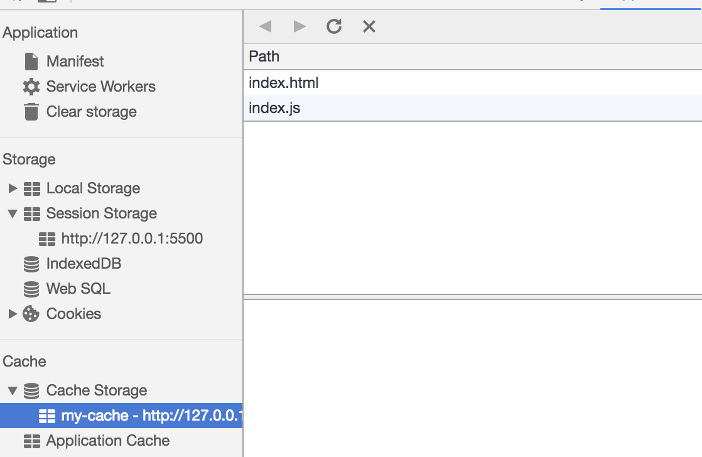

> 当我们重新刷新页面可以发现我们缓存的数据是从 `Service` `Worker` 中读取的

### [#](#_5-渲染机制) 5 渲染机制

**浏览器的渲染机制一般分为以下几个步骤**

*   处理 `HTML` 并构建 `DOM` 树。
*   处理 `CSS` 构建 `CSSOM` 树。
*   将 `DOM` 与 `CSSOM` 合并成一个渲染树。
*   根据渲染树来布局，计算每个节点的位置。
*   调用 `GPU` 绘制，合成图层，显示在屏幕上


*   在构建 CSSOM 树时，会阻塞渲染，直至 CSSOM 树构建完成。并且构建 CSSOM 树是一个十分消耗性能的过程，所以应该尽量保证层级扁平，减少过度层叠，越是具体的 CSS 选择器，执行速度越慢
*   当 HTML 解析到 script 标签时，会暂停构建 DOM，完成后才会从暂停的地方重新开始。也就是说，如果你想首屏渲染的越快，就越不应该在首屏就加载 JS 文件。并且 CSS 也会影响 JS 的执行，只有当解析完样式表才会执行 JS，所以也可以认为这种情况下，CSS 也会暂停构建 DOM

**图层**

> 一般来说，可以把普通文档流看成一个图层。特定的属性可以生成一个新的图层。不同的图层渲染互不影响，所以对于某些频繁需要渲染的建议单独生成一个新图层，提高性能。但也不能生成过多的图层，会引起反作用

*   通过以下几个常用属性可以生成新图层
    *   `3D`变换：`translate3d`、`translateZ`
    *   `will-change`
    *   `video`、`iframe` 标签
    *   通过动画实现的 `opacity` 动画转换
    *   `position: fixed`

**重绘（Repaint）和回流（Reflow）**

*   重绘是当节点需要更改外观而不会影响布局的，比如改变 `color` 就叫称为重绘
*   回流是布局或者几何属性需要改变就称为回流

> 回流必定会发生重绘，重绘不一定会引发回流。回流所需的成本比重绘高的多，改变深层次的节点很可能导致父节点的一系列回流

*   **所以以下几个动作可能会导致性能问题**：
    *   改变 `window` 大小
    *   改变字体
    *   添加或删除样式
    *   文字改变
    *   定位或者浮动
    *   盒模型

**很多人不知道的是，重绘和回流其实和 `Event loop` 有关**

*   当 `Event loop` 执行完 `Microtasks` 后，会判断 `document` 是否需要更新。因为浏览器是 `60Hz`的刷新率，每 `16ms`才会更新一次。
*   然后判断是否有 `resize` 或者 `scroll` ，有的话会去触发事件，所以 `resize` 和 `scroll` 事件也是至少 `16ms` 才会触发一次，并且自带节流功能。
*   判断是否触发了`media query`
*   更新动画并且发送事件
*   判断是否有全屏操作事件
*   执行 `requestAnimationFrame` 回调
*   执行 `IntersectionObserver` 回调，该方法用于判断元素是否可见，可以用于懒加载上，但是兼容性不好
*   更新界面
*   以上就是一帧中可能会做的事情。如果在一帧中有空闲时间，就会去执行 `requestIdleCallback` 回调

**减少重绘和回流**

*   使用 `translate` 替代 `top`
*   使用 `visibility` 替换`display: none` ，因为前者只会引起重绘，后者会引发回流（改变了布局）
*   不要使用 `table` 布局，可能很小的一个小改动会造成整个 table 的重新布局
*   动画实现的速度的选择，动画速度越快，回流次数越多，也可以选择使用 `requestAnimationFrame`
*   `CSS` 选择符从右往左匹配查找，避免 `DOM` 深度过深
*   将频繁运行的动画变为图层，图层能够阻止该节点回流影响别的元素。比如对于 `video`标签，浏览器会自动将该节点变为图层

[#](#三、性能) 三、性能
---------------

### [#](#_1-dns-预解析) 1 DNS 预解析

*   `DNS` 解析也是需要时间的，可以通过预解析的方式来预先获得域名所对应的 `IP`

    <link rel="dns-prefetch" href="//blog.poetries.top">
    

### [#](#_2-缓存) 2 缓存

*   缓存对于前端性能优化来说是个很重要的点，良好的缓存策略可以降低资源的重复加载提高网页的整体加载速度
*   通常浏览器缓存策略分为两种：强缓存和协商缓存

**强缓存**

> 实现强缓存可以通过两种响应头实现：`Expires`和 `Cache-Control` 。强缓存表示在缓存期间不需要请求，`state code`为 `200`

    Expires: Wed, 22 Oct 2018 08:41:00 GMT


> `Expires` 是 `HTTP / 1.0` 的产物，表示资源会在 `Wed, 22 Oct 2018 08:41:00 GMT` 后过期，需要再次请求。并且 `Expires` 受限于本地时间，如果修改了本地时间，可能会造成缓存失效

    Cache-control: max-age=30


> `Cache-Control` 出现于 `HTTP / 1.1`，优先级高于 `Expires` 。该属性表示资源会在 `30` 秒后过期，需要再次请求

**协商缓存**

*   如果缓存过期了，我们就可以使用协商缓存来解决问题。协商缓存需要请求，如果缓存有效会返回 304
*   协商缓存需要客户端和服务端共同实现，和强缓存一样，也有两种实现方式

`Last-Modified` 和 `If-Modified-Since`

*   `Last-Modified` 表示本地文件最后修改日期，`If-Modified-Since` 会将 `Last-Modified`的值发送给服务器，询问服务器在该日期后资源是否有更新，有更新的话就会将新的资源发送回来
*   但是如果在本地打开缓存文件，就会造成 `Last-Modified` 被修改，所以在 `HTTP / 1.1` 出现了 `ETag`

`ETag` 和 `If-None-Match`

*   `ETag` 类似于文件指纹，`If-None-Match` 会将当前 `ETag` 发送给服务器，询问该资源 ETag 是否变动，有变动的话就将新的资源发送回来。并且 `ETag` 优先级比 `Last-Modified` 高

**选择合适的缓存策略**

> 对于大部分的场景都可以使用强缓存配合协商缓存解决，但是在一些特殊的地方可能需要选择特殊的缓存策略

*   对于某些不需要缓存的资源，可以使用 `Cache-control: no-store` ，表示该资源不需要缓存
*   对于频繁变动的资源，可以使用 `Cache-Control: no-cache` 并配合 `ETag` 使用，表示该资源已被缓存，但是每次都会发送请求询问资源是否更新。
*   对于代码文件来说，通常使用 `Cache-Control: max-age=31536000` 并配合策略缓存使用，然后对文件进行指纹处理，一旦文件名变动就会立刻下载新的文件

### [#](#_3-使用-http-2-0) 3 使用 HTTP / 2.0

*   因为浏览器会有并发请求限制，在 `HTTP / 1.1` 时代，每个请求都需要建立和断开，消耗了好几个 `RTT` 时间，并且由于 `TCP` 慢启动的原因，加载体积大的文件会需要更多的时间
*   在 `HTTP / 2.0` 中引入了多路复用，能够让多个请求使用同一个 `TCP` 链接，极大的加快了网页的加载速度。并且还支持 `Header` 压缩，进一步的减少了请求的数据大小

### [#](#_4-预加载) 4 预加载

*   在开发中，可能会遇到这样的情况。有些资源不需要马上用到，但是希望尽早获取，这时候就可以使用预加载
*   预加载其实是声明式的 `fetch` ，强制浏览器请求资源，并且不会阻塞 `onload` 事件，可以使用以下代码开启预加载

    <link rel="preload" href="http://example.com">
    

> 预加载可以一定程度上降低首屏的加载时间，因为可以将一些不影响首屏但重要的文件延后加载，唯一缺点就是兼容性不好

### [#](#_5-预渲染) 5 预渲染

> 可以通过预渲染将下载的文件预先在后台渲染，可以使用以下代码开启预渲染

    <link rel="prerender" href="http://poetries.com">


*   预渲染虽然可以提高页面的加载速度，但是要确保该页面百分百会被用户在之后打开，否则就白白浪费资源去渲染

### [#](#_6-懒执行与懒加载) 6 懒执行与懒加载

**懒执行**

*   懒执行就是将某些逻辑延迟到使用时再计算。该技术可以用于首屏优化，对于某些耗时逻辑并不需要在首屏就使用的，就可以使用懒执行。懒执行需要唤醒，一般可以通过定时器或者事件的调用来唤醒

**懒加载**

*   懒加载就是将不关键的资源延后加载

> 懒加载的原理就是只加载自定义区域（通常是可视区域，但也可以是即将进入可视区域）内需要加载的东西。对于图片来说，先设置图片标签的 `src` 属性为一张占位图，将真实的图片资源放入一个自定义属性中，当进入自定义区域时，就将自定义属性替换为 `src` 属性，这样图片就会去下载资源，实现了图片懒加载

*   懒加载不仅可以用于图片，也可以使用在别的资源上。比如进入可视区域才开始播放视频等

### [#](#_7-文件优化) 7 文件优化

**图片优化**

> 对于如何优化图片，有 2 个思路

*   减少像素点
*   减少每个像素点能够显示的颜色

**图片加载优化**

*   不用图片。很多时候会使用到很多修饰类图片，其实这类修饰图片完全可以用 `CSS` 去代替。
*   对于移动端来说，屏幕宽度就那么点，完全没有必要去加载原图浪费带宽。一般图片都用 CDN 加载，可以计算出适配屏幕的宽度，然后去请求相应裁剪好的图片
*   小图使用 `base64`格式
*   将多个图标文件整合到一张图片中（雪碧图）
*   选择正确的图片格式：
    *   对于能够显示 `WebP` 格式的浏览器尽量使用 `WebP` 格式。因为 `WebP` 格式具有更好的图像数据压缩算法，能带来更小的图片体积，而且拥有肉眼识别无差异的图像质量，缺点就是兼容性并不好
    *   小图使用 `PNG`，其实对于大部分图标这类图片，完全可以使用 `SVG` 代替
    *   照片使用 `JPEG`

**其他文件优化**

*   `CSS`文件放在 `head` 中
*   服务端开启文件压缩功能
*   将 `script` 标签放在 `body` 底部，因为 `JS` 文件执行会阻塞渲染。当然也可以把 `script` 标签放在任意位置然后加上 `defer` ，表示该文件会并行下载，但是会放到 `HTML` 解析完成后顺序执行。对于没有任何依赖的 `JS`文件可以加上 `async` ，表示加载和渲染后续文档元素的过程将和 `JS` 文件的加载与执行并行无序进行。 执行 `JS`代码过长会卡住渲染，对于需要很多时间计算的代码
*   可以考虑使用 `Webworker`。`Webworker`可以让我们另开一个线程执行脚本而不影响渲染。

**CDN**

> 静态资源尽量使用 `CDN` 加载，由于浏览器对于单个域名有并发请求上限，可以考虑使用多个 `CDN` 域名。对于 `CDN` 加载静态资源需要注意 `CDN` 域名要与主站不同，否则每次请求都会带上主站的 `Cookie`

### [#](#_8-其他) 8 其他

**使用 Webpack 优化项目**

*   对于 `Webpack4`，打包项目使用 `production` 模式，这样会自动开启代码压缩
*   使用 `ES6` 模块来开启 `tree shaking`，这个技术可以移除没有使用的代码
*   优化图片，对于小图可以使用 `base64` 的方式写入文件中
*   按照路由拆分代码，实现按需加载
*   给打包出来的文件名添加哈希，实现浏览器缓存文件

**监控**

> 对于代码运行错误，通常的办法是使用 `window.onerror` 拦截报错。该方法能拦截到大部分的详细报错信息，但是也有例外

*   对于跨域的代码运行错误会显示 `Script error`. 对于这种情况我们需要给 `script` 标签添加 `crossorigin` 属性
*   对于某些浏览器可能不会显示调用栈信息，这种情况可以通过 `arguments.callee.caller` 来做栈递归
*   对于异步代码来说，可以使用 `catch` 的方式捕获错误。比如 `Promise` 可以直接使用 catch 函数，`async await` 可以使用 `try catch`
*   但是要注意线上运行的代码都是压缩过的，需要在打包时生成 `sourceMap` 文件便于 `debug`。
*   对于捕获的错误需要上传给服务器，通常可以通过 `img` 标签的 `src`发起一个请求

[#](#四、安全) 四、安全
---------------

### [#](#_1-xss) 1 XSS

> 跨网站指令码（英语：`Cross-site scripting`，通常简称为：`XSS`）是一种网站应用程式的安全漏洞攻击，是代码注入的一种。它允许恶意使用者将程式码注入到网页上，其他使用者在观看网页时就会受到影响。这类攻击通常包含了 `HTML` 以及使用者端脚本语言

> `XSS` 分为三种：反射型，存储型和 `DOM-based`

**如何攻击**

*   `XSS` 通过修改 `HTML`节点或者执行 `JS`代码来攻击网站。
*   例如通过 `URL` 获取某些参数

    <!-- http://www.domain.com?name=<script>alert(1)</script> -->
    <div>{{name}}</div>    
    

> 上述 `URL` 输入可能会将 `HTML` 改为 `<div><script>alert(1)</script></div>` ，这样页面中就凭空多了一段可执行脚本。这种攻击类型是反射型攻击，也可以说是 `DOM-based` 攻击

**如何防御**

> 最普遍的做法是转义输入输出的内容，对于引号，尖括号，斜杠进行转义

    function escape(str) {
    	str = str.replace(/&/g, "&amp;");
    	str = str.replace(/</g, "&lt;");
    	str = str.replace(/>/g, "&gt;");
    	str = str.replace(/"/g, "&quto;");
    	str = str.replace(/'/g, "&##39;");
    	str = str.replace(/`/g, "&##96;");
        str = str.replace(/\//g, "&##x2F;");
        return str
    }


> 通过转义可以将攻击代码 `<script>alert(1)</script>` 变成

    // -> &lt;script&gt;alert(1)&lt;&##x2F;script&gt;
    escape('<script>alert(1)</script>')


> 对于显示富文本来说，不能通过上面的办法来转义所有字符，因为这样会把需要的格式也过滤掉。这种情况通常采用白名单过滤的办法，当然也可以通过黑名单过滤，但是考虑到需要过滤的标签和标签属性实在太多，更加推荐使用白名单的方式

    var xss = require("xss");
    var html = xss('<h1 id="title">XSS Demo</h1><script>alert("xss");</script>');
    // -> <h1>XSS Demo</h1>&lt;script&gt;alert("xss");&lt;/script&gt;
    console.log(html);


> 以上示例使用了 `js-xss`来实现。可以看到在输出中保留了 `h1` 标签且过滤了 `script` 标签

### [#](#_2-csrf) 2 CSRF

> 跨站请求伪造（英语：`Cross-site request forgery`），也被称为 `one-click attack`或者 `session riding`，通常缩写为 `CSRF` 或者 `XSRF`， 是一种挟制用户在当前已登录的`Web`应用程序上执行非本意的操作的攻击方法

> `CSRF` 就是利用用户的登录态发起恶意请求

**如何攻击**

> 假设网站中有一个通过 Get 请求提交用户评论的接口，那么攻击者就可以在钓鱼网站中加入一个图片，图片的地址就是评论接口

    


**如何防御**

*   `Get` 请求不对数据进行修改
*   不让第三方网站访问到用户 `Cookie`
*   阻止第三方网站请求接口
*   请求时附带验证信息，比如验证码或者 `token`

### [#](#_3-密码安全) 3 密码安全

**加盐**

> 对于密码存储来说，必然是不能明文存储在数据库中的，否则一旦数据库泄露，会对用户造成很大的损失。并且不建议只对密码单纯通过加密算法加密，因为存在彩虹表的关系

*   通常需要对密码加盐，然后进行几次不同加密算法的加密

    // 加盐也就是给原密码添加字符串，增加原密码长度
    sha256(sha1(md5(salt + password + salt)))
    

> 但是加盐并不能阻止别人盗取账号，只能确保即使数据库泄露，也不会暴露用户的真实密码。一旦攻击者得到了用户的账号，可以通过暴力破解的方式破解密码。对于这种情况，通常使用验证码增加延时或者限制尝试次数的方式。并且一旦用户输入了错误的密码，也不能直接提示用户输错密码，而应该提示账号或密码错误

**前端加密**

> 虽然前端加密对于安全防护来说意义不大，但是在遇到中间人攻击的情况下，可以避免明文密码被第三方获取

[#](#五、小程序) 五、小程序
-----------------

### [#](#_1-登录) 1 登录

**unionid和openid**

> 了解小程序登陆之前，我们写了解下小程序/公众号登录涉及到两个最关键的用户标识：

*   `OpenId` 是一个用户对于一个小程序／公众号的标识，开发者可以通过这个标识识别出用户。
*   `UnionId` 是一个用户对于同主体微信小程序／公众号／`APP`的标识，开发者需要在微信开放平台下绑定相同账号的主体。开发者可通过`UnionId`，实现多个小程序、公众号、甚至APP 之间的数据互通了。

**关键Api**

*   `wx.login` 官方提供的登录能力
*   `wx.checkSession`校验用户当前的`session_key`是否有效
*   `wx.authorize` 提前向用户发起授权请求
*   `wx.getUserInfo` 获取用户基本信息

**登录流程设计**

*   **利用现有登录体系**

> 直接复用现有系统的登录体系，只需要在小程序端设计用户名，密码/验证码输入页面，便可以简便的实现登录，只需要保持良好的用户体验即可

*   **利用`OpenId` 创建用户体系**

> `OpenId` 是一个小程序对于一个用户的标识，利用这一点我们可以轻松的实现一套基于小程序的用户体系，值得一提的是这种用户体系对用户的打扰最低，可以实现静默登录。具体步骤如下

*   小程序客户端通过 `wx.login` 获取 `code`
*   传递 `code` 向服务端，服务端拿到 code 调用微信登录凭证校验接口，微信服务器返回 `openid` 和会话密钥 `session_key` ，此时开发者服务端便可以利用 `openid` 生成用户入库，再向小程序客户端返回自定义登录态
*   小程序客户端缓存 （通过`storage`）自定义登录态（`token`），后续调用接口时携带该登录态作为用户身份标识即可

**利用 Unionid 创建用户体系**

> 如果想实现多个小程序，公众号，已有登录系统的数据互通，可以通过获取到用户 `unionid` 的方式建立用户体系。因为 `unionid` 在同一开放平台下的所所有应用都是相同的，通过 `unionid` 建立的用户体系即可实现全平台数据的互通，更方便的接入原有的功能，那如何获取 `unionid` 呢，有以下两种方式

*   如果户关注了某个相同主体公众号，或曾经在某个相同主体`App`、公众号上进行过微信登录授权，通过 `wx.login` 可以直接获取 到 `unionid`
*   结合 `wx.getUserInfo` 和 `<button open-type="getUserInfo"><button/>` 这两种方式引导用户主动授权，主动授权后通过返回的信息和服务端交互 (这里有一步需要服务端解密数据的过程，很简单，微信提供了示例代码) 即可拿到 `unionid` 建立用户体系， 然后由服务端返回登录态，本地记录即可实现登录，附上微信提供的最佳实践
    *   调用 `wx.login` 获取 `code`，然后从微信后端换取到 `session_key`，用于解密 `getUserInfo`返回的敏感数据
    *   使用 `wx.getSetting` 获取用户的授权情况
        *   如果用户已经授权，直接调用 `API` `wx.getUserInfo` 获取用户最新的信息；
        *   用户未授权，在界面中显示一个按钮提示用户登入，当用户点击并授权后就获取到用户的最新信息
    *   获取到用户数据后可以进行展示或者发送给自己的后端。

注意事项

*   需要获取 `unionid` 形式的登录体系，在以前（18年4月之前）是通过以下这种方式来实现，但后续微信做了调整（因为一进入小程序，主动弹起各种授权弹窗的这种形式，比较容易导致用户流失），调整为必须使用按钮引导用户主动授权的方式，这次调整对开发者影响较大，开发者需要注意遵守微信的规则，并及时和业务方沟通业务形式，不要存在侥幸心理，以防造成小程序不过审等情况

     wx.login(获取code) ===> wx.getUserInfo(用户授权) ===> 获取 unionid
    
*   因为小程序不存在 `cookie` 的概念， 登录态必须缓存在本地，因此强烈建议为登录态设置过期时间
*   值得一提的是如果需要支持风控安全校验，多平台登录等功能，可能需要加入一些公共参数，例如`platform`，`channel`，`deviceParam`等参数。在和服务端确定方案时，作为前端同学应该及时提出这些合理的建议，设计合理的系统。
*   `openid` ， `unionid` 不要在接口中明文传输，这是一种危险的行为，同时也很不专业

### [#](#_2-图片导出) 2 图片导出

> 这是一种常见的引流方式，一般同时会在图片中附加一个小程序二维码。

**基本原理**

*   借助 `canvas` 元素，将需要导出的样式首先在 `canvas` 画布上绘制出来 （`api`基本和`h5`保持一致，但有轻微差异，使用时注意即可
*   借助微信提供的 `canvasToTempFilePath` 导出图片，最后再使用 `saveImageToPhotosAlbum` （需要授权）保存图片到本地

**如何优雅实现**

* 绘制出需要的样式这一步是省略不掉的。但是我们可以封装一个绘制库，包含常见图形的绘制，例如矩形，圆角矩形，圆， 扇形， 三角形， 文字，图片减少绘制代码，只需要提炼出样式信息，便可以轻松的绘制，最后导出图片存入相册。笔者觉得以下这种方式绘制更为优雅清晰一些，其实也可以使用加入一个type参数来指定绘制类型，传入的一个是样式数组，实现绘制。

*   结合上一步的实现，如果对于同一类型的卡片有多次导出需求的场景，也可以使用自定义组件的方式，封装同一类型的卡片为一个通用组件，在需要导出图片功能的地方，引入该组件即可。

    ```javascript
    class CanvasKit {
       constructor() {
       }
       drawImg(option = {}) {
         ...
         return this
       }
       drawRect(option = {}) {
         return this
       }
       drawText(option = {}) {
         ...
         return this
       }
       static exportImg(option = {}) {
         ...
       }
     }
    
     let drawer = new CanvasKit('canvasId').drawImg(styleObj1).drawText(styleObj2)
     drawer.exportImg()
    ```
    
    
    

注意事项

*   小程序中无法绘制网络图片到`canvas`上，需要通过`downLoadFile` 先下载图片到本地临时文件才可以绘制
*   通常需要绘制二维码到导出的图片上，有一种方式导出二维码时，需要携带的参数必须做编码，而且有具体的长度（`32`可见字符）限制，可以借助服务端生成 短链接 的方式来解决

### [#](#_3-数据统计) 3 数据统计

> 数据统计作为目前一种常用的分析用户行为的方式，小程序端也是必不可少的。小程序采取的曝光，点击数据埋点其实和h5原理是一样的。但是埋点作为一个和业务逻辑不相关的需求，我们如果在每一个点击事件，每一个生命周期加入各种埋点代码，则会干扰正常的业务逻辑，和使代码变的臃肿，笔者提供以下几种思路来解决数据埋点

**设计一个埋点sdk**

> 小程序的代码结构是，每一个 `Page` 中都有一个 `Page` 方法，接受一个包含生命周期函数，数据的 业务逻辑对象 包装这层数据，借助小程序的底层逻辑实现页面的业务逻辑。通过这个我们可以想到思路，对`Page`进行一次包装，篡改它的生命周期和点击事件，混入埋点代码，不干扰业务逻辑，只要做一些简单的配置即可埋点，简单的代码实现如下

    // 代码仅供理解思路
     page = function(params) {
       let keys = params.keys()
       keys.forEach(v => {
           if (v === 'onLoad') {
             params[v] = function(options) {
               stat()   //曝光埋点代码
               params[v].call(this, options)
             }
           }
           else if (v.includes('click')) {
             params[v] = funciton(event) {
               let data = event.dataset.config
               stat(data)  // 点击埋点
               param[v].call(this)
             }
           }
       })
     }


> 这种思路不光适用于埋点，也可以用来作全局异常处理，请求的统一处理等场景。

**分析接口**

> 对于特殊的一些业务，我们可以采取 接口埋点，什么叫接口埋点呢？很多情况下，我们有的`api`并不是多处调用的，只会在某一个特定的页面调用，通过这个思路我们可以分析出，该接口被请求，则这个行为被触发了，则完全可以通过服务端日志得出埋点数据，但是这种方式局限性较大，而且属于分析结果得出过程，可能存在误差，但可以作为一种思路了解一下。

**微信自定义数据分析**

> 微信本身提供的数据分析能力，微信本身提供了常规分析和自定义分析两种数据分析方式，在小程序后台配置即可。借助小程序数据助手这款小程序可以很方便的查看

### [#](#_4-工程化) 4 工程化

**工程化做什么**

> 目前的前端开发过程，工程化是必不可少的一环，那小程序工程化都需要做些什么呢，先看下目前小程序开发当中存在哪些问题需要解决：

*   不支持 `css`预编译器,作为一种主流的 `css`解决方案，不论是 `less`,`sass`,`stylus` 都可以提升`css`效率
*   不支持引入npm包 （这一条，从微信公开课中听闻，微信准备支持）
*   不支持`ES7`等后续的`js`特性，好用的`async await`等特性都无法使用
*   不支持引入外部字体文件，只支持`base64`
*   没有 `eslint` 等代码检查工具

**方案选型**

> 对于目前常用的工程化方案，`webpack`，`rollup`，`parcel`等来看，都常用与单页应用的打包和处理，而小程序天生是 “多页应用” 并且存在一些特定的配置。根据要解决的问题来看，无非是文件的编译，修改，拷贝这些处理，对于这些需求，我们想到基于流的 `gulp`非常的适合处理，并且相对于`webpack`配置多页应用更加简单。所以小程序工程化方案推荐使用 `gulp`

**具体开发思路**

> 通过 `gulp` 的 `task` 实现：

*   实时编译 `less` 文件至相应目录
*   引入支持`async`，`await`的运行时文件
*   编译字体文件为`base64` 并生成相应`css`文件，方便使用
*   依赖分析哪些地方引用了`npm`包，将`npm`包打成一个文件，拷贝至相应目录
*   检查代码规范

### [#](#_5-小程序架构) 5 小程序架构

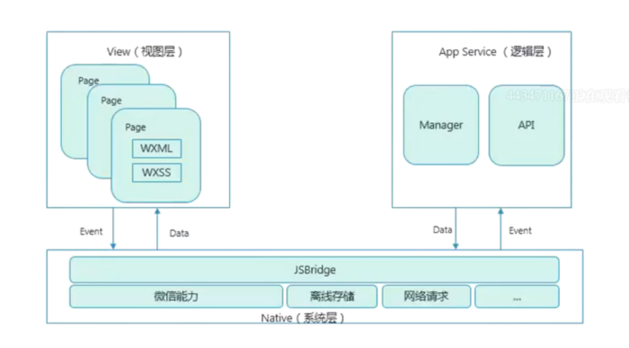

> 微信小程序的框架包含两部分 `View` 视图层、`App Service`逻辑层。`View` 层用来渲染页面结构，`AppService` 层用来逻辑处理、数据请求、接口调用。

它们在两个线程里运行。

> 视图层和逻辑层通过系统层的 `JSBridage` 进行通信，逻辑层把数据变化通知到视图层，触发视图层页面更新，视图层把触发的事件通知到逻辑层进行业务处理

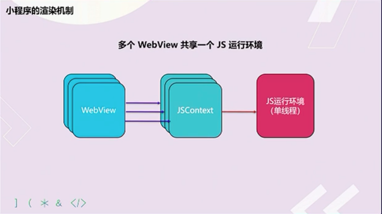

*   视图层使用 `WebView` 渲染，`iOS`中使用自带 `WKWebView`，在 `Android` 使用腾讯的 `x5`内核（基于 `Blink`）运行。
*   逻辑层使用在 `iOS` 中使用自带的 `JSCore` 运行，在 `Android`中使用腾讯的 `x5` 内核（基于 `Blink`）运行。
*   开发工具使用 `nw.js` 同时提供了视图层和逻辑层的运行环境。

### [#](#_6-wxml-wxss) 6 WXML && WXSS

**WXML**

*   支持数据绑定
*   支持逻辑算术、运算
*   支持模板、引用
*   支持添加事件（`bindtap`）
*   `Wxml`编译器：`Wcc` 把 `Wxml`文件 转为 `JS`
*   执行方式：`Wcc index.wxml`
*   使用 `Virtual DOM`，进行局部更新

**WXSS**

*   wxss编译器：`wcsc` 把`wxss`文件转化为 `js`
*   执行方式： `wcsc index.wxss`

**尺寸单位 rpx**

> `rpx（responsive pixel`）: 可以根据屏幕宽度进行自适应。规定屏幕宽为 `750rpx`。公式：

    const dsWidth = 750
    
    export const screenHeightOfRpx = function () {
      return 750 / env.screenWidth * env.screenHeight
    }
    
    export const rpxToPx = function (rpx) {
      return env.screenWidth / 750 * rpx
    }
    
    export const pxToRpx = function (px) {
      return 750 / env.screenWidth * px
    }


**样式导入**

> 使用 `@import`语句可以导入外联样式表，`@import`后跟需要导入的外联样式表的相对路径，用 `;` 表示语句结束

**内联样式**

> 静态的样式统一写到 `class` 中。`style` 接收动态的样式，在运行时会进行解析，请尽量避免将静态的样式写进 `style` 中，以免影响渲染速度

**全局样式与局部样式**

> 定义在 `app.wxss` 中的样式为全局样式，作用于每一个页面。在`page` 的 `wxss` 文件中定义的样式为局部样式，只作用在对应的页面，并会覆盖 `app.wxss` 中相同的选择器

### [#](#_7-小程序的问题) 7 小程序的问题

*   小程序仍然使用 `WebView` 渲染，并非原生渲染。（部分原生）
*   服务端接口返回的头无法执行，比如：`Set-Cookie`。
*   依赖浏览器环境的 `JS`库不能使用。
*   不能使用 `npm`，但是可以自搭构建工具或者使用 `mpvue`。（未来官方有计划支持）
*   不能使用 `ES7`，可以自己用`babel+webpack`自搭或者使用 `mpvue`。
*   不支持使用自己的字体（未来官方计划支持）。
*   可以用 `base64` 的方式来使用 `iconfont`。
*   小程序不能发朋友圈（可以通过保存图片到本地，发图片到朋友前。二维码可以使用B接口）。
*   获取二维码/小程序接口的限制
*   程序推送只能使用“服务通知” 而且需要用户主动触发提交 `formId`，`formId` 只有7天有效期。（现在的做法是在每个页面都放入`form`并且隐藏以此获取更多的 `formId`。后端使用原则为：优先使用有效期最短的）
*   小程序大小限制 2M，分包总计不超过 8M
*   转发（分享）小程序不能拿到成功结果，原来可以。链接（小游戏造的孽）
*   拿到相同的 `unionId` 必须绑在同一个开放平台下。开放平台绑定限制：
    *   `50`个移动应用
    *   `10`个网站
    *   `50`个同主体公众号
    *   `5`个不同主体公众号
    *   `50`个同主体小程序
    *   `5`个不同主体小程序
*   公众号关联小程序
    *   所有公众号都可以关联小程序。
    *   一个公众号可关联10个同主体的小程序，3个不同主体的小程序。
    *   一个小程序可关联500个公众号。
    *   公众号一个月可新增关联小程序13次，小程序一个月可新增关联500次。
*   一个公众号关联的10个同主体小程序和3个非同主体小程序可以互相跳转
*   品牌搜索不支持金融、医疗
*   小程序授权需要用户主动点击
*   小程序不提供测试 `access_token`
*   安卓系统下，小程序授权获取用户信息之后，删除小程序再重新获取，并重新授权，得到旧签名，导致第一次授权失败
*   开发者工具上，授权获取用户信息之后，如果清缓存选择全部清除，则即使使用了`wx.checkSession`，并且在`session_key`有效期内，授权获取用户信息也会得到新的`session_key`

### [#](#_8-授权获取用户信息流程) 8 授权获取用户信息流程

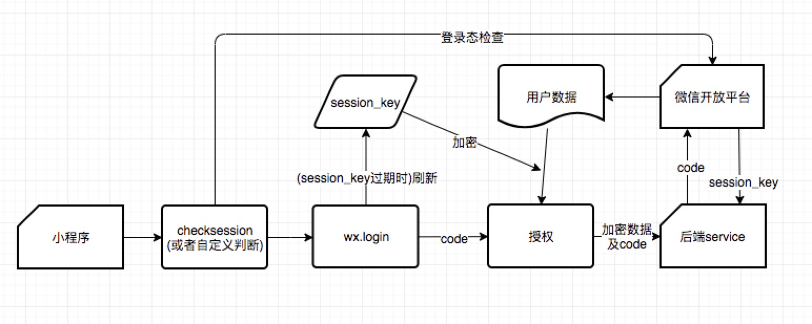

*   `session_key` 有有效期，有效期并没有被告知开发者，只知道用户越频繁使用小程序，`session_key` 有效期越长
*   在调用 `wx.login` 时会直接更新 `session_key`，导致旧 `session_key` 失效
*   小程序内先调用 `wx.checkSession` 检查登录态，并保证没有过期的 `session_key` 不会被更新，再调用 `wx.login` 获取 `code`。接着用户授权小程序获取用户信息，小程序拿到加密后的用户数据，把加密数据和 `code` 传给后端服务。后端通过 `code` 拿到 `session_key` 并解密数据，将解密后的用户信息返回给小程序

**面试题：先授权获取用户信息再 login 会发生什么？**

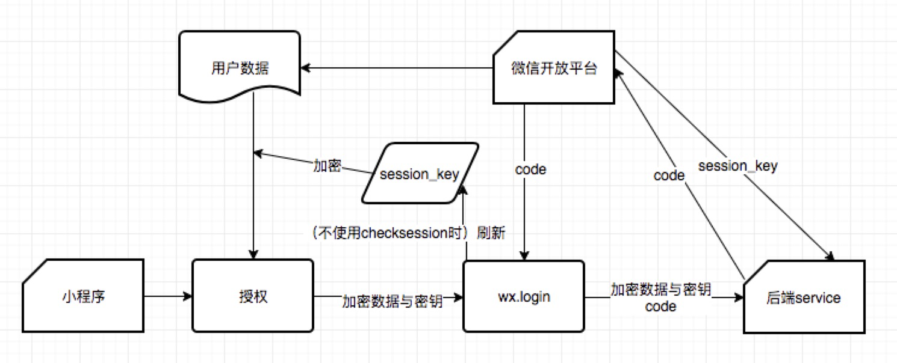

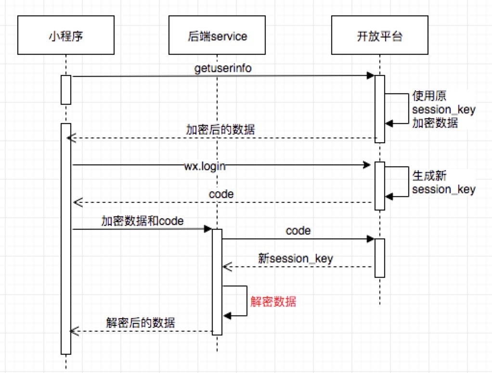

*   用户授权时，开放平台使用旧的 `session_key` 对用户信息进行加密。调用 `wx.login` 重新登录，会刷新 `session_key`，这时后端服务从开放平台获取到新 `session_key`，但是无法对老 `session_key` 加密过的数据解密，用户信息获取失败
*   在用户信息授权之前先调用 `wx.checkSession` 呢？`wx.checkSession` 检查登录态，并且保证 wx.login 不会刷新 `session_key`，从而让后端服务正确解密数据。但是这里存在一个问题，如果小程序较长时间不用导致 `session_key` 过期，则 `wx.login` 必定会重新生成 `session_key`，从而再一次导致用户信息解密失败

### [#](#_9-性能优化) 9 性能优化

> 我们知道`view`部分是运行在`webview`上的，所以前端领域的大多数优化方式都有用

**加载优化**

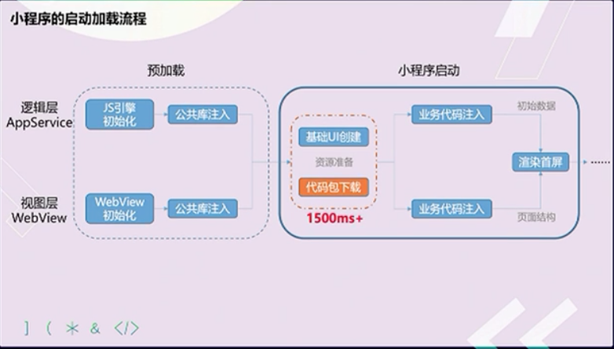

> 代码包的大小是最直接影响小程序加载启动速度的因素。代码包越大不仅下载速度时间长，业务代码注入时间也会变长。所以最好的优化方式就是减少代码包的大小

小程序加载的三个阶段的表示

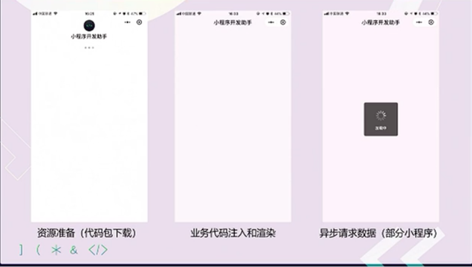

**优化方式**

*   代码压缩。
*   及时清理无用代码和资源文件。
*   减少代码包中的图片等资源文件的大小和数量。
*   分包加载。

**首屏加载的体验优化建议**

*   提前请求: 异步数据请求不需要等待页面渲染完成。
*   利用缓存: 利用 `storage API` 对异步请求数据进行缓存，二次启动时先利用缓存数据渲染页面，在进行后台更新。
*   避免白屏：先展示页面骨架页和基础内容。
*   及时反馈：即时地对需要用户等待的交互操作给出反馈，避免用户以为小程序无响应

**使用分包加载优化**

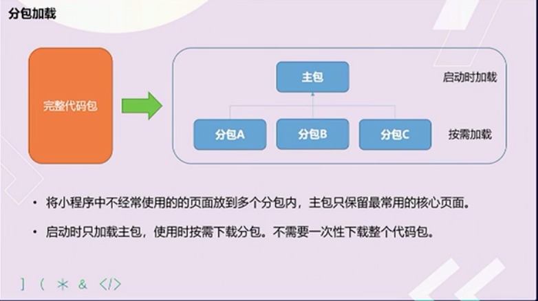

*   在构建小程序分包项目时，构建会输出一个或多个功能的分包，其中每个分包小程序必定含有一个主包，所谓的主包，即放置默认启动页面/`TabBar` 页面，以及一些所有分包都需用到公共资源/`JS` 脚本，而分包则是根据开发者的配置进行划分
*   在小程序启动时，默认会下载主包并启动主包内页面，如果用户需要打开分包内某个页面，客户端会把对应分包下载下来，下载完成后再进行展示。

**优点**：

*   对开发者而言，能使小程序有更大的代码体积，承载更多的功能与服务
*   对用户而言，可以更快地打开小程序，同时在不影响启动速度前提下使用更多功能

**限制**

*   整个小程序所有分包大小不超过 `8M`
*   单个分包/主包大小不能超过 `2M`
*   原生分包加载的配置 假设支持分包的小程序目录结构如下

    ├── app.js
    ├── app.json
    ├── app.wxss
    ├── packageA
    │   └── pages
    │       ├── cat
    │       └── dog
    ├── packageB
    │   └── pages
    │       ├── apple
    │       └── banana
    ├── pages
    │   ├── index
    │   └── logs
    └── utils

> 开发者通过在 `app.json` `subPackages` 字段声明项目分包结构

    {
      "pages":[
        "pages/index",
        "pages/logs"
      ],
      "subPackages": [
        {
          "root": "packageA",
          "pages": [
            "pages/cat",
            "pages/dog"
          ]
        }, {
          "root": "packageB",
          "pages": [
            "pages/apple",
            "pages/banana"
          ]
        }
      ]
    }


​    

**分包原则**

*   声明 `subPackages` 后，将按 `subPackages` 配置路径进行打包，`subPackages` 配置路径外的目录将被打包到 `app`（主包） 中
*   `app`（主包）也可以有自己的 `pages`（即最外层的 `pages` 字段
*   `subPackage` 的根目录不能是另外一个 `subPackage` 内的子目录
*   首页的 `TAB`页面必须在 `app`（主包）内

**引用原则**

*   ``packageA`无法`require packageB JS `文件，但可以`require app`、自己`package`内的`JS` 文件
*   ``packageA`无法`import packageB`的`template`，但可以`require app`、自己`package`内的`template`
*   ``packageA `无法使用`packageB`的资源，但可以使用`app`、自己`package` 内的资源

> 官方即将推出 分包预加载

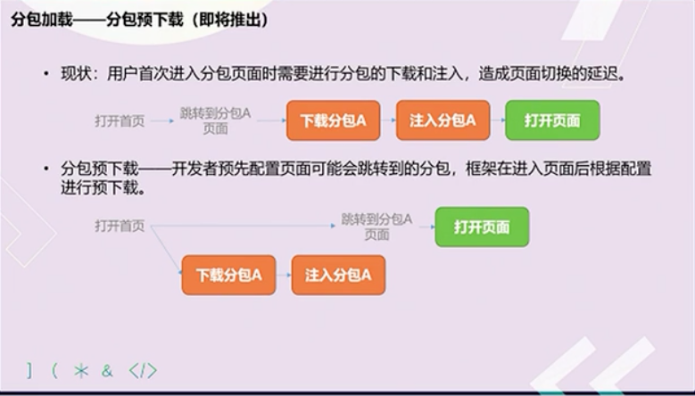

独立分包

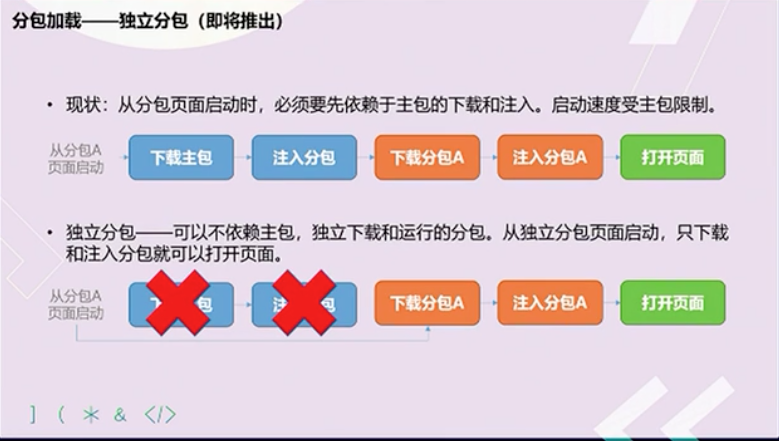

**渲染性能优化**

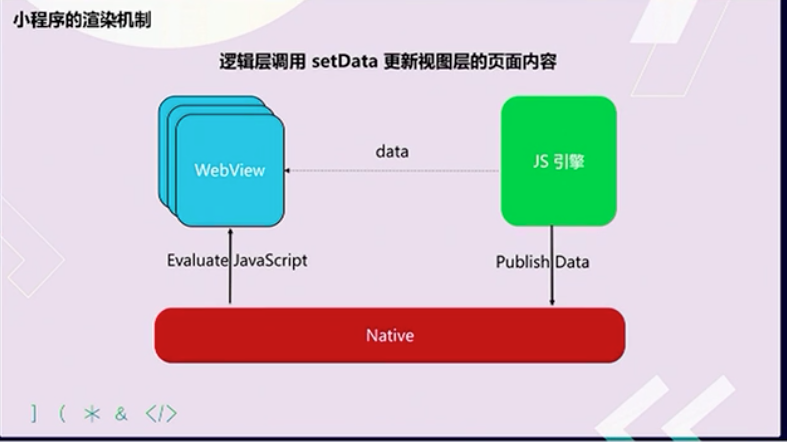

*   每次 `setData` 的调用都是一次进程间通信过程，通信开销与 `setData` 的数据量正相关。
*   `setData` 会引发视图层页面内容的更新，这一耗时操作一定时间中会阻塞用户交互。
*   `setData` 是小程序开发使用最频繁，也是最容易引发性能问题的

**避免不当使用 setData**

*   使用 `data` 在方法间共享数据，可能增加 `setData`传输的数据量。。`data` 应仅包括与页面渲染相关的数据。
*   使用 `setData` 传输大量数据，通讯耗时与数据正相关，页面更新延迟可能造成页面更新开销增加。仅传输页面中发生变化的数据，使用 `setData` 的特殊 `key`实现局部更新。
*   短时间内频繁调用 `setData`，操作卡顿，交互延迟，阻塞通信，页面渲染延迟。避免不必要的 `setData`，对连续的`setData`调用进行合并。
*   在后台页面进行 `setData`，抢占前台页面的渲染资源。页面切入后台后的 `setData` 调用，延迟到页面重新展示时执行。


**避免不当使用onPageScroll**

*   只在有必要的时候监听 `pageScroll` 事件。不监听，则不会派发。
*   避免在 `onPageScroll` 中执行复杂逻辑
*   避免在 `onPageScroll` 中频繁调用 `setData`
*   避免滑动时频繁查询节点信息（`SelectQuery`）用以判断是否显示，部分场景建议使用节点布局橡胶状态监听（`inersectionObserver`）替代

**使用自定义组件**

> 在需要频繁更新的场景下，自定义组件的更新只在组件内部进行，不受页面其他部分内容复杂性影响

### [#](#_10-wepy-vs-mpvue) 10 wepy vs mpvue

**数据流管理**

> 相比传统的小程序框架，这个一直是我们作为资深开发者比较期望去解决的，在 `Web` 开发中，随着 `Flux`、`Redu`x、`Vuex` 等多个数据流工具出现，我们也期望在业务复杂的小程序中使用

*   `WePY` 默认支持 `Redux`，在脚手架生成项目的时候可以内置
*   `Mpvue` 作为 `Vue` 的移植版本，当然支持 `Vuex`，同样在脚手架生成项目的时候可以内置

**组件化**

*   `WePY` 类似 `Vue`实现了单文件组件，最大的差别是文件后缀 `.wpy`，只是写法上会有差异

    export default class Index extends wepy.page {}
    
*   `Mpvue` 作为 `Vue` 的移植版本，支持单文件组件，`template`、`script` 和 `style` 都在一个 `.vue` 文件中，和 `vue` 的写法类似，所以对 `Vue` 开发熟悉的同学会比较适应

**工程化**

> 所有的小程序开发依赖官方提供的开发者工具。开发者工具简单直观，对调试小程序很有帮助，现在也支持腾讯云（目前我们还没有使用，但是对新的一些开发者还是有帮助的），可以申请测试报告查看小程序在真实的移动设备上运行性能和运行效果，但是它本身没有类似前端工程化中的概念和工具

*   `wepy` 内置了构建，通过 `wepy init` 命令初始化项目，大致流程如下：
    
    *   `wepy-cli` 会判断模版是在远程仓库还是在本地，如果在本地则会立即跳到第 `3` 步，反之继续进行。
    *   会从远程仓库下载模版，并保存到本地。
    *   询问开发者 `Project name` 等问题，依据开发者的回答，创建项目
*   `mpvue` 沿用了 `vue` 中推崇的 `webpack`作为构建工具，但同时提供了一些自己的插件以及配置文件的一些修改，比如
    
    *   不再需要 `html-webpack-plugin`
    *   基于 `webpack-dev-middleware` 修改成 `webpack-dev-middleware-hard-disk`
    *   最大的变化是基于 `webpack-loader` 修改成 `mpvue-loader`
    *   但是配置方式还是类似，分环境配置文件，最终都会编译成小程序支持的目录结构和文件后缀

### [#](#_11-mpvue) 11 mpvue

mpvue

`Vue.js` 小程序版, `fork` 自 `vuejs/vue@2.4.1`，保留了 `vue runtime` 能力，添加了小程序平台的支持。 `mpvue` 是一个使用 `Vue.js` 开发小程序的前端框架。框架基于 `Vue.js` 核心，`mpvue` 修改了 `Vue.js` 的 `runtime` 和 `compiler` 实现，使其可以运行在小程序环境中，从而为小程序开发引入了整套 `Vue.js` 开发体验

**框架原理**

> 两个大方向

*   通过`mpvue`提供 `mp` 的 `runtime` 适配小程序
*   通过`mpvue-loader`产出微信小程序所需要的文件结构和模块内容

> 七个具体问题

*   要了解 `mpvue` 原理必然要了解 `Vue` 原理，这是大前提

现在假设您对 Vue 原理有个大概的了解

*   由于 `Vue` 使用了 `Virtual DOM`，所以 `Virtual DOM`可以在任何支持 `JavaScript` 语言的平台上操作，譬如说目前 `Vue` 支持浏览器平台或 `weex`，也可以是 `mp`(小程序)。那么最后 `Virtual DOM` 如何映射到真实的 `DOM`节点上呢？`vue`为平台做了一层适配层，浏览器平台见 `runtime/node-ops.js`、`weex`平台见`runtime/node-ops.js`，小程序见`runtime/node-ops.js`。不同平台之间通过适配层对外提供相同的接口，`Virtual DOM`进行操作`Real DOM`节点的时候，只需要调用这些适配层的接口即可，而内部实现则不需要关心，它会根据平台的改变而改变
*   所以思路肯定是往增加一个 `mp` 平台的 `runtime`方向走。但问题是小程序不能操作 `DOM`，所以 `mp` 下的`node-ops.js`里面的实现都是直接 `return obj`
*   新 `Virtual DOM` 和旧 `Virtual DOM` 之间需要做一个 `patch`，找出 `diff`。`patch`完了之后的 `diff` 怎么更新视图，也就是如何给这些 `DOM` 加入 `attr`、`class`、`style`等 DOM 属性呢？ `Vue`中有 `nextTick` 的概念用以更新视图，`mpvue`这块对于小程序的 `setData` 应该怎么处理呢？
*   另外个问题在于小程序的 `Virtual DOM` 怎么生成？也就是怎么将 `template`编译成`render function`。这当中还涉及到运行时-编译器-vs-只包含运行时，显然如果要提高性能、减少包大小、输出 `wxml`、`mpvue` 也要提供预编译的能力。因为要预输出 `wxml` 且没法动态改变 `DOM`，所以动态组件，自定义 `render`，和`<script type="text/x-template">`字符串模版等都不支持

**另外还有一些其他问题，最后总结一下**

*   1.如何预编译生成`render function`
*   2.如何预编译生成 `wxml`，`wxss`，`wxs`
*   3.如何 p`atch` 出 `diff`
*   4.如何更新视图
*   5.如何建立小程序事件代理机制，在事件代理函数中触发与之对应的`vue`组件事件响应
*   6.如何建立`vue`实例与小程序 `Page`实例关联
*   7.如何建立小程序和`vue`生命周期映射关系，能在小程序生命周期中触发`vue`生命周期

> `platform/mp`的目录结构

    .
    ├── compiler //解决问题1，mpvue-template-compiler源码部分
    ├── runtime //解决问题3 4 5 6 7
    ├── util //工具方法
    ├── entry-compiler.js //mpvue-template-compiler的入口。package.json相关命令会自动生成mpvue-template-compiler这个package。
    ├── entry-runtime.js //对外提供Vue对象，当然是mpvue
    └── join-code-in-build.js //编译出SDK时的修复


**mpvue-loader**

> `mpvue-loader` 是 `vue-loader` 的一个扩展延伸版，类似于超集的关系，除了`vue-loader` 本身所具备的能力之外，它还会利用`mpvue-template-compiler`生成`render function`

**entry**

*   它会从 `webpack` 的配置中的 `entry` 开始，分析依赖模块，并分别打包。在`entry` 中 `app` 属性及其内容会被打包为微信小程序所需要的 `app.js／app.json／app.wxss`，其余的会生成对应的
*   页面`page.js`/`page.json`/`page.wxml`/`page.wxss`，如示例的 `entry` 将会生成如下这些文件，文件内容下文慢慢讲来：

    // webpack.config.js
    {
        // ...
        entry: {
            app: resolve('./src/main.js'),               // app 字段被识别为 app 类型
            index: resolve('./src/pages/index/main.js'),   // 其余字段被识别为 page 类型
            'news/home': resolve('./src/pages/news/home/index.js')
        }
    }
    
    // 产出文件的结构
    .
    ├── app.js
    ├── app.json
    ├──· app.wxss
    ├── components
    │   ├── card$74bfae61.wxml
    │   ├── index$023eef02.wxml
    │   └── news$0699930b.wxml
    ├── news
    │   ├── home.js
    │   ├── home.wxml
    │   └── home.wxss
    ├── pages
    │   └── index
    │       ├── index.js
    │       ├── index.wxml
    │       └── index.wxss
    └── static
        ├── css
        │   ├── app.wxss
        │   ├── index.wxss
        │   └── news
        │       └── home.wxss
        └── js
            ├── app.js
            ├── index.js
            ├── manifest.js
            ├── news
            │   └── home.js
            └── vendor.js
    

> `wxml` 每一个 `.vue` 的组件都会被生成为一个 `wxml` 规范的 `template`，然后通过 `wxml` 规范的 `import` 语法来达到一个复用，同时组件如果涉及到 `props`的 `data` 数据，我们也会做相应的处理，举个实际的例子：

    <template>
        <div class="my-component" @click="test">
            <h1>{{msg}}</h1>
            <other-component :msg="msg"></other-component>
        </div>
    </template>
    <script>
    import otherComponent from './otherComponent.vue'
    
    export default {
      components: { otherComponent },
      data () {
        return { msg: 'Hello Vue.js!' }
      },
      methods: {
        test() {}
      }
    }
    </script>


> 这样一个 `Vue`的组件的模版部分会生成相应的 `wxml`

    <import src="components/other-component$hash.wxml" />
    <template name="component$hash">
        <view class="my-component" bindtap="handleProxy">
            <view class="_h1">{{msg}}</view>
            <template is="other-component$hash" wx:if="{{ $c[0] }}" data="{{ ...$c[0] }}"></template>
        </view>
    </template>


> 可能已经注意到了 `other-component(:msg="msg")` 被转化成了 。`mpvue` 在运行时会从根组件开始把所有的组件实例数据合并成一个树形的数据，然后通过 `setData` 到 `appData`,`$c`是 `$children` 的缩写。至于那个 `0` 则是我们的 `compiler`处理过后的一个标记，会为每一个子组件打一个特定的不重复的标记。 树形数据结构如下

    // 这儿数据结构是一个数组，index 是动态的
    {
      $child: {
        '0'{
          // ... root data
          $child: {
            '0': {
              // ... data
              msg: 'Hello Vue.js!',
              $child: {
                // ...data
              }
            }
          }
        }
      }
    }


**wxss**

> 这个部分的处理同 `web` 的处理差异不大，唯一不同在于通过配置生成 `.css` 为 `.wxss` ，其中的对于 `css`的若干处理，在 `postcss-mpvue-wxss` 和 `px2rpx-loader` 这两部分的文档中又详细的介绍

*   推荐和小程序一样，将 `app.json／page.json` 放到页面入口处，使用 `copy-webpack-plugin` `copy` 到对应的生成位置。

> 这部分内容来源于 `app` 和`page` 的`entry` 文件，通常习惯是 `main.js`，你需要在你的入口文件中 `export default { config: {} }`，这才能被我们的 `loader` 识别为这是一个配置，需要写成 `json` 文件

    import Vue from 'vue';
    import App from './app';
    
    const vueApp = new Vue(App);
    vueApp.$mount();
    
    // 这个是我们约定的额外的配置
    export default {
        // 这个字段下的数据会被填充到 app.json ／ page.json
        config: {
            pages: ['static/calendar/calendar', '^pages/list/list'], // Will be filled in webpack
            window: {
                backgroundTextStyle: 'light',
                navigationBarBackgroundColor: '##455A73',
                navigationBarTitleText: '美团汽车票',
                navigationBarTextStyle: '##fff'
            }
        }
    };


[#](#六、react) 六、React
---------------------

### [#](#_1、react-中-keys-的作用是什么？) 1、React 中 keys 的作用是什么？

> `Keys`是 `React` 用于追踪哪些列表中元素被修改、被添加或者被移除的辅助标识

*   在开发过程中，我们需要保证某个元素的 `key` 在其同级元素中具有唯一性。在 `React Diff` 算法中`React` 会借助元素的 `Key` 值来判断该元素是新近创建的还是被移动而来的元素，从而减少不必要的元素重渲染。此外，React 还需要借助 `Key` 值来判断元素与本地状态的关联关系，因此我们绝不可忽视转换函数中 `Key` 的重要性

### [#](#_2、传入-setstate-函数的第二个参数的作用是什么？) 2、传入 setState 函数的第二个参数的作用是什么？

> 该函数会在 `setState` 函数调用完成并且组件开始重渲染的时候被调用，我们可以用该函数来监听渲染是否完成：

    this.setState(
      { username: 'tylermcginnis33' },
      () => console.log('setState has finished and the component has re-rendered.')
    )


    this.setState((prevState, props) => {
      return {
        streak: prevState.streak + props.count
      }
    })


### [#](#_3、react-中-refs-的作用是什么) 3、React 中 refs 的作用是什么

*   `Refs` 是 `React` 提供给我们的安全访问 `DOM`元素或者某个组件实例的句柄
*   可以为元素添加`ref`属性然后在回调函数中接受该元素在 `DOM` 树中的句柄，该值会作为回调函数的第一个参数返回

### [#](#_4、在生命周期中的哪一步你应该发起-ajax-请求) 4、在生命周期中的哪一步你应该发起 AJAX 请求

> 我们应当将AJAX 请求放到 `componentDidMount` 函数中执行，主要原因有下

*   `React` 下一代调和算法 `Fiber` 会通过开始或停止渲染的方式优化应用性能，其会影响到 `componentWillMount` 的触发次数。对于 `componentWillMount` 这个生命周期函数的调用次数会变得不确定，`React` 可能会多次频繁调用 `componentWillMount`。如果我们将 `AJAX` 请求放到 `componentWillMount` 函数中，那么显而易见其会被触发多次，自然也就不是好的选择。
*   如果我们将`AJAX` 请求放置在生命周期的其他函数中，我们并不能保证请求仅在组件挂载完毕后才会要求响应。如果我们的数据请求在组件挂载之前就完成，并且调用了`setState`函数将数据添加到组件状态中，对于未挂载的组件则会报错。而在 `componentDidMount` 函数中进行 `AJAX` 请求则能有效避免这个问题

### [#](#_5、shouldcomponentupdate-的作用) 5、shouldComponentUpdate 的作用

> `shouldComponentUpdate` 允许我们手动地判断是否要进行组件更新，根据组件的应用场景设置函数的合理返回值能够帮我们避免不必要的更新

### [#](#_6、如何告诉-react-它应该编译生产环境版) 6、如何告诉 React 它应该编译生产环境版

> 通常情况下我们会使用 `Webpack` 的 `DefinePlugin` 方法来将 `NODE_ENV` 变量值设置为 `production`。编译版本中 `React`会忽略 `propType` 验证以及其他的告警信息，同时还会降低代码库的大小，`React` 使用了 `Uglify` 插件来移除生产环境下不必要的注释等信息

### [#](#_7、概述下-react-中的事件处理逻辑) 7、概述下 React 中的事件处理逻辑

> 为了解决跨浏览器兼容性问题，`React` 会将浏览器原生事件（`Browser Native Event`）封装为合成事件（`SyntheticEvent`）传入设置的事件处理器中。这里的合成事件提供了与原生事件相同的接口，不过它们屏蔽了底层浏览器的细节差异，保证了行为的一致性。另外有意思的是，`React` 并没有直接将事件附着到子元素上，而是以单一事件监听器的方式将所有的事件发送到顶层进行处理。这样 `React` 在更新 `DOM` 的时候就不需要考虑如何去处理附着在 `DOM` 上的事件监听器，最终达到优化性能的目的

### [#](#_8、createelement-与-cloneelement-的区别是什么) 8、createElement 与 cloneElement 的区别是什么

> `createElement` 函数是 JSX 编译之后使用的创建 `React Element` 的函数，而 `cloneElement` 则是用于复制某个元素并传入新的 `Props`

### [#](#_9、redux中间件) 9、redux中间件

> 中间件提供第三方插件的模式，自定义拦截 `action` -\> `reducer` 的过程。变为 `action` -\> `middlewares` -\> `reducer`。这种机制可以让我们改变数据流，实现如异步`action` ，`action` 过滤，日志输出，异常报告等功能

*   `redux-logger`：提供日志输出
*   `redux-thunk`：处理异步操作
*   `redux-promise`：处理异步操作，`actionCreator`的返回值是`promise`

### [#](#_10、redux有什么缺点) 10、redux有什么缺点

*   一个组件所需要的数据，必须由父组件传过来，而不能像`flux`中直接从`store`取。
*   当一个组件相关数据更新时，即使父组件不需要用到这个组件，父组件还是会重新`render`，可能会有效率影响，或者需要写复杂的`shouldComponentUpdate`进行判断。

### [#](#_11、react组件的划分业务组件技术组件？) 11、react组件的划分业务组件技术组件？

*   根据组件的职责通常把组件分为UI组件和容器组件。
*   UI 组件负责 UI 的呈现，容器组件负责管理数据和逻辑。
*   两者通过`React-Redux` 提供`connect`方法联系起来

### [#](#_12、react旧版生命周期函数) 12、react旧版生命周期函数

**初始化阶段**

*   `getDefaultProps`:获取实例的默认属性
*   `getInitialState`:获取每个实例的初始化状态
*   `componentWillMount`：组件即将被装载、渲染到页面上
*   `render`:组件在这里生成虚拟的`DOM`节点
*   `componentDidMount`:组件真正在被装载之后

**运行中状态**

*   `componentWillReceiveProps`:组件将要接收到属性的时候调用
*   `shouldComponentUpdate`:组件接受到新属性或者新状态的时候（可以返回false，接收数据后不更新，阻止`render`调用，后面的函数不会被继续执行了）
*   `componentWillUpdate`:组件即将更新不能修改属性和状态
*   `render`:组件重新描绘
*   `componentDidUpdate`:组件已经更新

**销毁阶段**

*   `componentWillUnmount`:组件即将销毁

#### [#](#新版生命周期) 新版生命周期

> 在新版本中，React 官方对生命周期有了新的 变动建议:

*   使用`getDerivedStateFromProps`替换`componentWillMount；`
*   使用`getSnapshotBeforeUpdate`替换`componentWillUpdate；`
*   避免使用`componentWillReceiveProps`；

> 其实该变动的原因，正是由于上述提到的 `Fiber`。首先，从上面我们知道 React 可以分成 `reconciliation` 与 `commit`两个阶段，对应的生命周期如下:

**reconciliation**

*   `componentWillMount`
*   `componentWillReceiveProps`
*   `shouldComponentUpdate`
*   `componentWillUpdate`

**commit**

*   `componentDidMount`
*   `componentDidUpdate`
*   `componentWillUnmount`

> 在 `Fiber` 中，`reconciliation` 阶段进行了任务分割，涉及到 暂停 和 重启，因此可能会导致 `reconciliation` 中的生命周期函数在一次更新渲染循环中被 多次调用 的情况，产生一些意外错误

新版的建议生命周期如下:

    class Component extends React.Component {
      // 替换 `componentWillReceiveProps` ，
      // 初始化和 update 时被调用
      // 静态函数，无法使用 this
      static getDerivedStateFromProps(nextProps, prevState) {}
      
      // 判断是否需要更新组件
      // 可以用于组件性能优化
      shouldComponentUpdate(nextProps, nextState) {}
      
      // 组件被挂载后触发
      componentDidMount() {}
      
      // 替换 componentWillUpdate
      // 可以在更新之前获取最新 dom 数据
      getSnapshotBeforeUpdate() {}
      
      // 组件更新后调用
      componentDidUpdate() {}
      
      // 组件即将销毁
      componentWillUnmount() {}
      
      // 组件已销毁
      componentDidUnMount() {}
    }


**使用建议:**

*   在`constructor`初始化 `state`；
*   在`componentDidMount`中进行事件监听，并在`componentWillUnmount`中解绑事件；
*   在`componentDidMount`中进行数据的请求，而不是在`componentWillMount`；
*   需要根据 `props` 更新 `state` 时，使用`getDerivedStateFromProps(nextProps, prevState)`；
    *   旧 props 需要自己存储，以便比较；

    public static getDerivedStateFromProps(nextProps, prevState) {
    	// 当新 props 中的 data 发生变化时，同步更新到 state 上
    	if (nextProps.data !== prevState.data) {
    		return {
    			data: nextProps.data
    		}
    	} else {
    		return null1
    	}
    }
    

> 可以在componentDidUpdate监听 props 或者 state 的变化，例如:

    componentDidUpdate(prevProps) {
    	// 当 id 发生变化时，重新获取数据
    	if (this.props.id !== prevProps.id) {
    		this.fetchData(this.props.id);
    	}
    }


*   在componentDidUpdate使用setState时，必须加条件，否则将进入死循环；
*   getSnapshotBeforeUpdate(prevProps, prevState)可以在更新之前获取最新的渲染数据，它的调用是在 render 之后， update 之前；
*   shouldComponentUpdate: 默认每次调用setState，一定会最终走到 diff 阶段，但可以通过shouldComponentUpdate的生命钩子返回false来直接阻止后面的逻辑执行，通常是用于做条件渲染，优化渲染的性能。

### [#](#_13、react性能优化是哪个周期函数) 13、react性能优化是哪个周期函数

> `shouldComponentUpdate` 这个方法用来判断是否需要调用render方法重新描绘dom。因为dom的描绘非常消耗性能，如果我们能在`shouldComponentUpdate方`法中能够写出更优化的`dom diff`算法，可以极大的提高性能

### [#](#_14、为什么虚拟dom会提高性能) 14、为什么虚拟dom会提高性能

> 虚拟`dom`相当于在`js`和真实`dom`中间加了一个缓存，利用`dom diff`算法避免了没有必要的`dom`操作，从而提高性能

**具体实现步骤如下**

*   用 `JavaScript` 对象结构表示 DOM 树的结构；然后用这个树构建一个真正的 `DOM` 树，插到文档当中
*   当状态变更的时候，重新构造一棵新的对象树。然后用新的树和旧的树进行比较，记录两棵树差异
*   把2所记录的差异应用到步骤1所构建的真正的`DOM`树上，视图就更新

### [#](#_15、diff算法) 15、diff算法?

*   把树形结构按照层级分解，只比较同级元素。
*   给列表结构的每个单元添加唯一的`key`属性，方便比较。
*   `React` 只会匹配相同 `class` 的 `component`（这里面的`class`指的是组件的名字）
*   合并操作，调用 `component` 的 `setState` 方法的时候, `React` 将其标记为 \- `dirty`.到每一个事件循环结束, `React` 检查所有标记 `dirty`的 `component`重新绘制.
*   选择性子树渲染。开发人员可以重写`shouldComponentUpdate`提高`diff`的性能

### [#](#_16、react性能优化方案) 16、react性能优化方案

*   重写`shouldComponentUpdate`来避免不必要的dom操作
*   使用 `production` 版本的`react.js`
*   使用`key`来帮助`React`识别列表中所有子组件的最小变化

### [#](#_16、简述flux-思想) 16、简述flux 思想

> `Flux` 的最大特点，就是数据的"单向流动"。

*   用户访问 `View`
*   `View`发出用户的 `Action`
*   `Dispatcher` 收到`Action`，要求 `Store` 进行相应的更新
*   `Store` 更新后，发出一个`"change"`事件
*   `View` 收到`"change"`事件后，更新页面

### [#](#_17、说说你用react有什么坑点？) 17、说说你用react有什么坑点？

**1\. JSX做表达式判断时候，需要强转为boolean类型**

> 如果不使用 `!!b` 进行强转数据类型，会在页面里面输出 `0`。

    render() {
      const b = 0;
      return <div>
        {
          !!b && <div>这是一段文本</div>
        }
      </div>
    }


**2\. 尽量不要在 `componentWillReviceProps` 里使用 setState，如果一定要使用，那么需要判断结束条件，不然会出现无限重渲染，导致页面崩溃**

**3\. 给组件添加ref时候，尽量不要使用匿名函数，因为当组件更新的时候，匿名函数会被当做新的prop处理，让ref属性接受到新函数的时候，react内部会先清空ref，也就是会以null为回调参数先执行一次ref这个props，然后在以该组件的实例执行一次ref，所以用匿名函数做ref的时候，有的时候去ref赋值后的属性会取到null**

**4\. 遍历子节点的时候，不要用 index 作为组件的 key 进行传入**

### [#](#_18、我现在有一个button，要用react在上面绑定点击事件，要怎么做？) 18、我现在有一个button，要用react在上面绑定点击事件，要怎么做？

    class Demo {
      render() {
        return <button onClick={(e) => {
          alert('我点击了按钮')
        }}>
          按钮
        </button>
      }
    }


**你觉得你这样设置点击事件会有什么问题吗？**

> 由于`onClick`使用的是匿名函数，所有每次重渲染的时候，会把该`onClick`当做一个新的`prop`来处理，会将内部缓存的`onClick`事件进行重新赋值，所以相对直接使用函数来说，可能有一点的性能下降

修改

    class Demo {
    
      onClick = (e) => {
        alert('我点击了按钮')
      }
    
      render() {
        return <button onClick={this.onClick}>
          按钮
        </button>
      }


### [#](#_19、react-的虚拟dom是怎么实现的) 19、react 的虚拟dom是怎么实现的

> 首先说说为什么要使用`Virturl DOM`，因为操作真实`DOM`的耗费的性能代价太高，所以`react`内部使用`js`实现了一套dom结构，在每次操作在和真实dom之前，使用实现好的diff算法，对虚拟dom进行比较，递归找出有变化的dom节点，然后对其进行更新操作。为了实现虚拟`DOM`，我们需要把每一种节点类型抽象成对象，每一种节点类型有自己的属性，也就是prop，每次进行`diff`的时候，`react`会先比较该节点类型，假如节点类型不一样，那么`react`会直接删除该节点，然后直接创建新的节点插入到其中，假如节点类型一样，那么会比较`prop`是否有更新，假如有`prop`不一样，那么`react`会判定该节点有更新，那么重渲染该节点，然后在对其子节点进行比较，一层一层往下，直到没有子节点

### [#](#_20、react-的渲染过程中，兄弟节点之间是怎么处理的？也就是key值不一样的时候) 20、react 的渲染过程中，兄弟节点之间是怎么处理的？也就是key值不一样的时候

> 通常我们输出节点的时候都是map一个数组然后返回一个`ReactNode`，为了方便`react`内部进行优化，我们必须给每一个`reactNode`添加`key`，这个`key prop`在设计值处不是给开发者用的，而是给react用的，大概的作用就是给每一个`reactNode`添加一个身份标识，方便react进行识别，在重渲染过程中，如果key一样，若组件属性有所变化，则`react`只更新组件对应的属性；没有变化则不更新，如果key不一样，则react先销毁该组件，然后重新创建该组件

### [#](#_21、介绍一下react) 21、介绍一下react

1.  以前我们没有jquery的时候，我们大概的流程是从后端通过ajax获取到数据然后使用jquery生成dom结果然后更新到页面当中，但是随着业务发展，我们的项目可能会越来越复杂，我们每次请求到数据，或则数据有更改的时候，我们又需要重新组装一次dom结构，然后更新页面，这样我们手动同步dom和数据的成本就越来越高，而且频繁的操作dom，也使我我们页面的性能慢慢的降低。
2.  这个时候mvvm出现了，mvvm的双向数据绑定可以让我们在数据修改的同时同步dom的更新，dom的更新也可以直接同步我们数据的更改，这个特定可以大大降低我们手动去维护dom更新的成本，mvvm为react的特性之一，虽然react属于单项数据流，需要我们手动实现双向数据绑定。
3.  有了mvvm还不够，因为如果每次有数据做了更改，然后我们都全量更新dom结构的话，也没办法解决我们频繁操作dom结构(降低了页面性能)的问题，为了解决这个问题，react内部实现了一套虚拟dom结构，也就是用js实现的一套dom结构，他的作用是讲真实dom在js中做一套缓存，每次有数据更改的时候，react内部先使用算法，也就是鼎鼎有名的diff算法对dom结构进行对比，找到那些我们需要新增、更新、删除的dom节点，然后一次性对真实DOM进行更新，这样就大大降低了操作dom的次数。 那么diff算法是怎么运作的呢，首先，diff针对类型不同的节点，会直接判定原来节点需要卸载并且用新的节点来装载卸载的节点的位置；针对于节点类型相同的节点，会对比这个节点的所有属性，如果节点的所有属性相同，那么判定这个节点不需要更新，如果节点属性不相同，那么会判定这个节点需要更新，react会更新并重渲染这个节点。
4.  react设计之初是主要负责UI层的渲染，虽然每个组件有自己的state，state表示组件的状态，当状态需要变化的时候，需要使用setState更新我们的组件，但是，我们想通过一个组件重渲染它的兄弟组件，我们就需要将组件的状态提升到父组件当中，让父组件的状态来控制这两个组件的重渲染，当我们组件的层次越来越深的时候，状态需要一直往下传，无疑加大了我们代码的复杂度，我们需要一个状态管理中心，来帮我们管理我们状态state。
5.  这个时候，redux出现了，我们可以将所有的state交给redux去管理，当我们的某一个state有变化的时候，依赖到这个state的组件就会进行一次重渲染，这样就解决了我们的我们需要一直把state往下传的问题。redux有action、reducer的概念，action为唯一修改state的来源，reducer为唯一确定state如何变化的入口，这使得redux的数据流非常规范，同时也暴露出了redux代码的复杂，本来那么简单的功能，却需要完成那么多的代码。
6.  后来，社区就出现了另外一套解决方案，也就是mobx，它推崇代码简约易懂，只需要定义一个可观测的对象，然后哪个组价使用到这个可观测的对象，并且这个对象的数据有更改，那么这个组件就会重渲染，而且mobx内部也做好了是否重渲染组件的生命周期shouldUpdateComponent，不建议开发者进行更改，这使得我们使用mobx开发项目的时候可以简单快速的完成很多功能，连redux的作者也推荐使用mobx进行项目开发。但是，随着项目的不断变大，mobx也不断暴露出了它的缺点，就是数据流太随意，出了bug之后不好追溯数据的流向，这个缺点正好体现出了redux的优点所在，所以针对于小项目来说，社区推荐使用mobx，对大项目推荐使用redux

### [#](#_22、react怎么做数据的检查和变化) 22、React怎么做数据的检查和变化

> `Model`改变之后（可能是调用了`setState`），触发了`virtual dom`的更新，再用`diff`算法来`把virtual DOM`比较`real DOM`，看看是哪个`dom`节点更新了，再渲染`real dom`

### [#](#_23、react-router里的-link-标签和-a-标签有什么区别) 23、react-router里的`<Link>`标签和`<a>`标签有什么区别

> 对比`<a>`,`Link`组件避免了不必要的重渲染

### [#](#_24、connect原理) 24、connect原理

*   首先`connect`之所以会成功，是因为`Provider`组件：
*   在原应用组件上包裹一层，使原来整个应用成为`Provider`的子组件 接收`Redux`的`store`作为`props`，通过`context`对象传递给子孙组件上的`connect`

> `connect`做了些什么。它真正连接 `Redux` 和 `React`，它包在我们的容器组件的外一层，它接收上面 `Provider` 提供的 `store` 里面的`state` 和 `dispatch`，传给一个构造函数，返回一个对象，以属性形式传给我们的容器组件

*   `connect`是一个高阶函数，首先传入`mapStateToProps`、`mapDispatchToProps`，然后返回一个生产`Component`的函数(`wrapWithConnect`)，然后再将真正的`Component`作为参数传入`wrapWithConnect`，这样就生产出一个经过包裹的`Connect`组件，

**该组件具有如下特点**

*   通过`props.store`获取祖先`Component`的`store props`包括`stateProps`、`dispatchProps`、`parentProps`,合并在一起得到`nextState`，作为`props`传给真正的`Component componentDidMount`时，添加事件`this.store.subscribe(this.handleChange)`，实现页面交互
*   `shouldComponentUpdate`时判断是否有避免进行渲染，提升页面性能，并得到`nextState` `componentWillUnmount`时移除注册的事件`this.handleChange`

> 由于`connect`的源码过长，我们只看主要逻辑

    export default function connect(mapStateToProps, mapDispatchToProps, mergeProps, options = {}) {
      return function wrapWithConnect(WrappedComponent) {
        class Connect extends Component {
          constructor(props, context) {
            // 从祖先Component处获得store
            this.store = props.store || context.store
            this.stateProps = computeStateProps(this.store, props)
            this.dispatchProps = computeDispatchProps(this.store, props)
            this.state = { storeState: null }
            // 对stateProps、dispatchProps、parentProps进行合并
            this.updateState()
          }
          shouldComponentUpdate(nextProps, nextState) {
            // 进行判断，当数据发生改变时，Component重新渲染
            if (propsChanged || mapStateProducedChange || dispatchPropsChanged) {
              this.updateState(nextProps)
                return true
              }
            }
            componentDidMount() {
              // 改变Component的state
              this.store.subscribe(() = {
                this.setState({
                  storeState: this.store.getState()
                })
              })
            }
            render() {
              // 生成包裹组件Connect
              return (
                <WrappedComponent {...this.nextState} />
              )
            }
          }
          Connect.contextTypes = {
            store: storeShape
          }
          return Connect;
        }
      }


### [#](#_25、redux实现原理解析) 25、Redux实现原理解析

**为什么要用redux**

> 在`React`中，数据在组件中是单向流动的，数据从一个方向父组件流向子组件（通过`props`）,所以，两个非父子组件之间通信就相对麻烦，`redux`的出现就是为了解决`state`里面的数据问题

**Redux设计理念**

> `Redux`是将整个应用状态存储到一个地方上称为`store`,里面保存着一个状态树`store tree`,组件可以派发(`dispatch`)行为(`action`)给`store`,而不是直接通知其他组件，组件内部通过订阅`store`中的状态`state`来刷新自己的视图


**Redux三大原则**

*   唯一数据源

> 整个应用的state都被存储到一个状态树里面，并且这个状态树，只存在于唯一的store中

*   保持只读状态

> `state`是只读的，唯一改变`state`的方法就是触发`action`，`action`是一个用于描述以发生时间的普通对象

*   数据改变只能通过纯函数来执行

> 使用纯函数来执行修改，为了描述`action`如何改变`state`的，你需要编写`reducers`

**Redux源码**

    let createStore = (reducer) => {
        let state;
        //获取状态对象
        //存放所有的监听函数
        let listeners = [];
        let getState = () => state;
        //提供一个方法供外部调用派发action
        let dispath = (action) => {
            //调用管理员reducer得到新的state
            state = reducer(state, action);
            //执行所有的监听函数
            listeners.forEach((l) => l())
        }
        //订阅状态变化事件，当状态改变发生之后执行监听函数
        let subscribe = (listener) => {
            listeners.push(listener);
        }
        dispath();
        return {
            getState,
            dispath,
            subscribe
        }
    }
    let combineReducers=(renducers)=>{
        //传入一个renducers管理组，返回的是一个renducer
        return function(state={},action={}){
            let newState={};
            for(var attr in renducers){
                newState[attr]=renducers[attr](state[attr],action)
    
            }
            return newState;
        }
    }
    export {createStore,combineReducers};


### [#](#_26、purecomponent和functioncomponent区别) 26、pureComponent和FunctionComponent区别

> `PureComponent`和`Component`完全相同，但是在`shouldComponentUpdate`实现中，`PureComponent`使用了`props`和`state`的浅比较。主要作用是用来提高某些特定场景的性能

### [#](#_27-react-hooks，它带来了那些便利) 27 react hooks，它带来了那些便利

*   代码逻辑聚合，逻辑复用
*   HOC嵌套地狱
*   代替class

> React 中通常使用 类定义 或者 函数定义 创建组件:

在类定义中，我们可以使用到许多 React 特性，例如 state、 各种组件生命周期钩子等，但是在函数定义中，我们却无能为力，因此 React 16.8 版本推出了一个新功能 (React Hooks)，通过它，可以更好的在函数定义组件中使用 React 特性。

**好处:**

1.  跨组件复用: 其实 render props / HOC 也是为了复用，相比于它们，Hooks 作为官方的底层 API，最为轻量，而且改造成本小，不会影响原来的组件层次结构和传说中的嵌套地狱；
2.  类定义更为复杂

*   不同的生命周期会使逻辑变得分散且混乱，不易维护和管理；
*   时刻需要关注this的指向问题；
*   代码复用代价高，高阶组件的使用经常会使整个组件树变得臃肿；

3.  状态与UI隔离: 正是由于 Hooks 的特性，状态逻辑会变成更小的粒度，并且极容易被抽象成一个自定义 Hooks，组件中的状态和 UI 变得更为清晰和隔离。

**注意:**

*   避免在 循环/条件判断/嵌套函数 中调用 hooks，保证调用顺序的稳定；
*   只有 函数定义组件 和 hooks 可以调用 hooks，避免在 类组件 或者 普通函数 中调用；
*   不能在useEffect中使用useState，React 会报错提示；
*   类组件不会被替换或废弃，不需要强制改造类组件，两种方式能并存；

**重要钩子**

1.  状态钩子 (useState): 用于定义组件的 State，其到类定义中this.state的功能；

    // useState 只接受一个参数: 初始状态
    // 返回的是组件名和更改该组件对应的函数
    const [flag, setFlag] = useState(true);
    // 修改状态
    setFlag(false)
    	
    // 上面的代码映射到类定义中:
    this.state = {
    	flag: true	
    }
    const flag = this.state.flag
    const setFlag = (bool) => {
        this.setState({
            flag: bool,
        })
    }
    
2.  生命周期钩子 (useEffect):

> 类定义中有许多生命周期函数，而在 React Hooks 中也提供了一个相应的函数 (useEffect)，这里可以看做componentDidMount、componentDidUpdate和componentWillUnmount的结合。

**useEffect(callback, \[source\])接受两个参数**

*   callback: 钩子回调函数；
*   source: 设置触发条件，仅当 source 发生改变时才会触发；
*   useEffect钩子在没有传入\[source\]参数时，默认在每次 render 时都会优先调用上次保存的回调中返回的函数，后再重新调用回调；

    useEffect(() => {
    	// 组件挂载后执行事件绑定
    	console.log('on')
    	addEventListener()
    	
    	// 组件 update 时会执行事件解绑
    	return () => {
    		console.log('off')
    		removeEventListener()
    	}
    }, [source]);
    
    
    // 每次 source 发生改变时，执行结果(以类定义的生命周期，便于大家理解):
    // --- DidMount ---
    // 'on'
    // --- DidUpdate ---
    // 'off'
    // 'on'
    // --- DidUpdate ---
    // 'off'
    // 'on'
    // --- WillUnmount --- 
    // 'off'
    

**通过第二个参数，我们便可模拟出几个常用的生命周期:**

*   componentDidMount: 传入\[\]时，就只会在初始化时调用一次

    const useMount = (fn) => useEffect(fn, [])
    
*   componentWillUnmount: 传入\[\]，回调中的返回的函数也只会被最终执行一次

    const useUnmount = (fn) => useEffect(() => fn, [])
    
*   mounted: 可以使用 useState 封装成一个高度可复用的 mounted 状态；

    const useMounted = () => {
        const [mounted, setMounted] = useState(false);
        useEffect(() => {
            !mounted && setMounted(true);
            return () => setMounted(false);
        }, []);
        return mounted;
    }
    
*   componentDidUpdate: useEffect每次均会执行，其实就是排除了 DidMount 后即可；

    const mounted = useMounted() 
    useEffect(() => {
        mounted && fn()
    })
    

3.  其它内置钩子:

*   `useContext`: 获取 context 对象
*   `useReducer`: 类似于 Redux 思想的实现，但其并不足以替代 Redux，可以理解成一个组件内部的 redux:
    *   并不是持久化存储，会随着组件被销毁而销毁；
    *   属于组件内部，各个组件是相互隔离的，单纯用它并无法共享数据；
    *   配合useContext`的全局性，可以完成一个轻量级的 Redux；(easy-peasy)
*   `useCallback`: 缓存回调函数，避免传入的回调每次都是新的函数实例而导致依赖组件重新渲染，具有性能优化的效果；
*   `useMemo`: 用于缓存传入的 props，避免依赖的组件每次都重新渲染；
*   `useRef`: 获取组件的真实节点；
*   `useLayoutEffect`
    *   DOM更新同步钩子。用法与useEffect类似，只是区别于执行时间点的不同
    *   useEffect属于异步执行，并不会等待 DOM 真正渲染后执行，而useLayoutEffect则会真正渲染后才触发；
    *   可以获取更新后的 state；

4.  自定义钩子(useXxxxx): 基于 Hooks 可以引用其它 Hooks 这个特性，我们可以编写自定义钩子，如上面的useMounted。又例如，我们需要每个页面自定义标题:

    function useTitle(title) {
      useEffect(
        () => {
          document.title = title;
        });
    }
    
    // 使用:
    function Home() {
    	const title = '我是首页'
    	useTitle(title)
    	
    	return (
    		<div>{title}</div>
    	)
    }
    

### [#](#_28、react-portal-有哪些使用场景) 28、React Portal 有哪些使用场景

*   在以前， react 中所有的组件都会位于 #app 下，而使用 Portals 提供了一种脱离 #app 的组件
*   因此 Portals 适合脱离文档流(out of flow) 的组件，特别是 position: absolute 与 position: fixed的组件。比如模态框，通知，警告，goTop 等。

以下是官方一个模态框的示例，可以在以下地址中测试效果

    <html>
      <body>
        <div id="app"></div>
        <div id="modal"></div>
        <div id="gotop"></div>
        <div id="alert"></div>
      </body>
    </html>


    const modalRoot = document.getElementById('modal');
    
    class Modal extends React.Component {
      constructor(props) {
        super(props);
        this.el = document.createElement('div');
      }
    
      componentDidMount() {
        modalRoot.appendChild(this.el);
      }
    
      componentWillUnmount() {
        modalRoot.removeChild(this.el);
      }
    
      render() {
        return ReactDOM.createPortal(
          this.props.children,
          this.el,
        );
      }
    }


**React Hooks当中的useEffect是如何区分生命周期钩子的**

> useEffect可以看成是`componentDidMount`，`componentDidUpdate`和`componentWillUnmount`三者的结合。useEffect(callback, \[source\])接收两个参数，调用方式如下

     useEffect(() => {
       console.log('mounted');
       
       return () => {
           console.log('willUnmount');
       }
     }, [source]);


> 生命周期函数的调用主要是通过第二个参数\[source\]来进行控制，有如下几种情况：

*   `[source]`参数不传时，则每次都会优先调用上次保存的函数中返回的那个函数，然后再调用外部那个函数；
*   `[source]`参数传\[\]时，则外部的函数只会在初始化时调用一次，返回的那个函数也只会最终在组件卸载时调用一次；
*   `[source]`参数有值时，则只会监听到数组中的值发生变化后才优先调用返回的那个函数，再调用外部的函数。

### [#](#_29、react和vue的区别) 29、react和vue的区别

**相同点：**

1.  数据驱动页面，提供响应式的试图组件
2.  都有virtual DOM,组件化的开发，通过props参数进行父子之间组件传递数据，都实现了webComponents规范
3.  数据流动单向，都支持服务器的渲染SSR
4.  都有支持native的方法，react有React native， vue有wexx

**不同点：**

1.  数据绑定：Vue实现了双向的数据绑定，react数据流动是单向的
2.  数据渲染：大规模的数据渲染，react更快
3.  使用场景：React配合Redux架构适合大规模多人协作复杂项目，Vue适合小快的项目
4.  开发风格：react推荐做法jsx + inline style把html和css都写在js了

> vue是采用webpack +vue-loader单文件组件格式，html, js, css同一个文件

### [#](#_30、什么是高阶组件-hoc) 30、什么是高阶组件(HOC)

*   高阶组件(Higher Order Componennt)本身其实不是组件，而是一个函数，这个函数接收一个元组件作为参数，然后返回一个新的增强组件，高阶组件的出现本身也是为了逻辑复用，举个例子

    function withLoginAuth(WrappedComponent) {
      return class extends React.Component {
          
          constructor(props) {
              super(props);
              this.state = {
                isLogin: false
              };
          }
          
          async componentDidMount() {
              const isLogin = await getLoginStatus();
              this.setState({ isLogin });
          }
          
          render() {
            if (this.state.isLogin) {
                return <WrappedComponent {...this.props} />;
            }
            
            return (<div>您还未登录...</div>);
          }
      }
    }
    

### [#](#_31、react实现的移动应用中，如果出现卡顿，有哪些可以考虑的优化方案) 31、React实现的移动应用中，如果出现卡顿，有哪些可以考虑的优化方案

*   增加`shouldComponentUpdate`钩子对新旧`props`进行比较，如果值相同则阻止更新，避免不必要的渲染，或者使用`PureReactComponent`替代`Component`，其内部已经封装了`shouldComponentUpdate`的浅比较逻辑
*   对于列表或其他结构相同的节点，为其中的每一项增加唯一`key`属性，以方便`React`的`diff`算法中对该节点的复用，减少节点的创建和删除操作
*   `render`函数中减少类似`onClick={() => {doSomething()}}`的写法，每次调用render函数时均会创建一个新的函数，即使内容没有发生任何变化，也会导致节点没必要的重渲染，建议将函数保存在组件的成员对象中，这样只会创建一次
*   组件的`props`如果需要经过一系列运算后才能拿到最终结果，则可以考虑使用`reselect`库对结果进行缓存，如果props值未发生变化，则结果直接从缓存中拿，避免高昂的运算代价
*   `webpack-bundle-analyzer`分析当前页面的依赖包，是否存在不合理性，如果存在，找到优化点并进行优化

### [#](#_32、fiber) 32、Fiber

**React 的核心流程可以分为两个部分:**

*   `reconciliation` (调度算法，也可称为 `render`)
    *   更新 `state` 与 `props`；
    *   调用生命周期钩子；
    *   生成 `virtual dom`
        *   这里应该称为 `Fiber Tree` 更为符合；
    *   通过新旧 vdom 进行 diff 算法，获取 vdom change
    *   确定是否需要重新渲染
*   `commit`
    *   如需要，则操作 `dom` 节点更新

> 要了解 Fiber，我们首先来看为什么需要它

*   **问题**: 随着应用变得越来越庞大，整个更新渲染的过程开始变得吃力，大量的组件渲染会导致主进程长时间被占用，导致一些动画或高频操作出现卡顿和掉帧的情况。而关键点，便是 同步阻塞。在之前的调度算法中，React 需要实例化每个类组件，生成一颗组件树，使用 同步递归 的方式进行遍历渲染，而这个过程最大的问题就是无法 暂停和恢复。
*   **解决方**案: 解决同步阻塞的方法，通常有两种: 异步 与 任务分割。而 React Fiber 便是为了实现任务分割而诞生的
*   **简述**
    *   在 `React V16` 将调度算法进行了重构， 将之前的 `stack reconciler` 重构成新版的 fiber `reconciler`，变成了具有链表和指针的 单链表树遍历算法。通过指针映射，每个单元都记录着遍历当下的上一步与下一步，从而使遍历变得可以被暂停和重启
    *   这里我理解为是一种 任务分割调度算法，主要是 将原先同步更新渲染的任务分割成一个个独立的 小任务单位，根据不同的优先级，将小任务分散到浏览器的空闲时间执行，充分利用主进程的事件循环机制
*   **核心**
    *   `Fiber` 这里可以具象为一个 数据结构

    class Fiber {
    	constructor(instance) {
    		this.instance = instance
    		// 指向第一个 child 节点
    		this.child = child
    		// 指向父节点
    		this.return = parent
    		// 指向第一个兄弟节点
    		this.sibling = previous
    	}	
    }
    
*   **链表树遍历算法**: 通过 节点保存与映射，便能够随时地进行 停止和重启，这样便能达到实现任务分割的基本前提
    *   首先通过不断遍历子节点，到树末尾；
    *   开始通过 `sibling` 遍历兄弟节点；
    *   return 返回父节点，继续执行2；
    *   直到 root 节点后，跳出遍历；
*   **任务分割**，React 中的渲染更新可以分成两个阶段
    *   **reconciliation 阶段**: vdom 的数据对比，是个适合拆分的阶段，比如对比一部分树后，先暂停执行个动画调用，待完成后再回来继续比对
    *   **Commit 阶段**: 将 change list 更新到 dom 上，并不适合拆分，才能保持数据与 UI 的同步。否则可能由于阻塞 UI 更新，而导致数据更新和 UI 不一致的情况
*   **分散执行:** 任务分割后，就可以把小任务单元分散到浏览器的空闲期间去排队执行，而实现的关键是两个新API: `requestIdleCallback` 与 `requestAnimationFrame`
    *   低优先级的任务交给`requestIdleCallback`处理，这是个浏览器提供的事件循环空闲期的回调函数，需要 `pollyfill`，而且拥有 `deadline` 参数，限制执行事件，以继续切分任务；
    *   高优先级的任务交给`requestAnimationFrame`处理；

    // 类似于这样的方式
    requestIdleCallback((deadline) => {
        // 当有空闲时间时，我们执行一个组件渲染；
        // 把任务塞到一个个碎片时间中去；
        while ((deadline.timeRemaining() > 0 || deadline.didTimeout) && nextComponent) {
            nextComponent = performWork(nextComponent);
        }
    });
    
*   **优先级策略:** 文本框输入 > 本次调度结束需完成的任务 > 动画过渡 > 交互反馈 > 数据更新 \> 不会显示但以防将来会显示的任务

> *   Fiber 其实可以算是一种编程思想，在其它语言中也有许多应用(Ruby Fiber)。
> *   核心思想是 任务拆分和协同，主动把执行权交给主线程，使主线程有时间空挡处理其他高优先级任务。
> *   当遇到进程阻塞的问题时，任务分割、异步调用 和 缓存策略 是三个显著的解决思路。

### [#](#_33、setstate) 33、setState

> 在了解setState之前，我们先来简单了解下 React 一个包装结构: Transaction:

**事务 (Transaction)**

> 是 React 中的一个调用结构，用于包装一个方法，结构为: initialize - perform(method) - close。通过事务，可以统一管理一个方法的开始与结束；处于事务流中，表示进程正在执行一些操作

*   setState: React 中用于修改状态，更新视图。它具有以下特点:

**异步与同步:** setState并不是单纯的异步或同步，这其实与调用时的环境相关:

*   在**合成事件** 和 **生命周期钩子**(除 componentDidUpdate) 中，setState是"异步"的；
    *   原因: 因为在setState的实现中，有一个判断: 当更新策略正在事务流的执行中时，该组件更新会被推入dirtyComponents队列中等待执行；否则，开始执行batchedUpdates队列更新；
        *   在生命周期钩子调用中，更新策略都处于更新之前，组件仍处于事务流中，而componentDidUpdate是在更新之后，此时组件已经不在事务流中了，因此则会同步执行；
        *   在合成事件中，React 是基于 事务流完成的事件委托机制 实现，也是处于事务流中；
    *   问题: 无法在setState后马上从this.state上获取更新后的值。
    *   解决: 如果需要马上同步去获取新值，setState其实是可以传入第二个参数的。setState(updater, callback)，在回调中即可获取最新值；
*   在 **原生事件** 和 setTimeout 中，setState是同步的，可以马上获取更新后的值；
    *   原因: 原生事件是浏览器本身的实现，与事务流无关，自然是同步；而setTimeout是放置于定时器线程中延后执行，此时事务流已结束，因此也是同步；
*   **批量更新**: 在 合成事件 和 生命周期钩子 中，setState更新队列时，存储的是 合并状态(Object.assign)。因此前面设置的 key 值会被后面所覆盖，最终只会执行一次更新；
*   **函数式**: 由于 Fiber 及 合并 的问题，官方推荐可以传入 函数 的形式。setState(fn)，在fn中返回新的state对象即可，例如this.setState((state, props) => newState)；
    *   使用函数式，可以用于避免setState的批量更新的逻辑，传入的函数将会被 顺序调用；

**注意事项:**

*   setState 合并，在 合成事件 和 生命周期钩子 中多次连续调用会被优化为一次；
*   当组件已被销毁，如果再次调用setState，React 会报错警告，通常有两种解决办法
    *   将数据挂载到外部，通过 props 传入，如放到 Redux 或 父级中；
    *   在组件内部维护一个状态量 (isUnmounted)，componentWillUnmount中标记为 true，在setState前进行判断；

### [#](#_34、hoc-高阶组件) 34、HOC(高阶组件)

> HOC(Higher Order Componennt) 是在 React 机制下社区形成的一种组件模式，在很多第三方开源库中表现强大。

**简述:**

*   高阶组件不是组件，是 增强函数，可以输入一个元组件，返回出一个新的增强组件；
*   高阶组件的主要作用是 代码复用，操作 状态和参数；

**用法:**

*   属性代理 (Props Proxy): 返回出一个组件，它基于被包裹组件进行 功能增强；

1.  默认参数: 可以为组件包裹一层默认参数；

    function proxyHoc(Comp) {
    	return class extends React.Component {
    		render() {
    			const newProps = {
    				name: 'tayde',
    				age: 1,
    			}
    			return <Comp {...this.props} {...newProps} />
    		}
    	}
    }
    
2.  提取状态: 可以通过 props 将被包裹组件中的 state 依赖外层，例如用于转换受控组件:

    function withOnChange(Comp) {
    	return class extends React.Component {
    		constructor(props) {
    			super(props)
    			this.state = {
    				name: '',
    			}
    		}
    		onChangeName = () => {
    			this.setState({
    				name: 'dongdong',
    			})
    		}
    		render() {
    			const newProps = {
    				value: this.state.name,
    				onChange: this.onChangeName,
    			}
    			return <Comp {...this.props} {...newProps} />
    		}
    	}
    }
    

使用姿势如下，这样就能非常快速的将一个 Input 组件转化成受控组件。

    const NameInput = props => (<input name="name" {...props} />)
    export default withOnChange(NameInput)


**包裹组件: 可以为被包裹元素进行一层包装，**

    function withMask(Comp) {
      return class extends React.Component {
          render() {
    		  return (
    		      <div>
    				  <Comp {...this.props} />
    					<div style={{
    					  width: '100%',
    					  height: '100%',
    					  backgroundColor: 'rgba(0, 0, 0, .6)',
    				  }} 
    			  </div>
    		  )
    	  }
      }
    }


> **反向继承** (Inheritance Inversion): 返回出一个组件，继承于被包裹组件，常用于以下操作

    function IIHoc(Comp) {
        return class extends Comp {
            render() {
                return super.render();
            }
        };
    }


**渲染劫持 (Render Highjacking)**

条件渲染: 根据条件，渲染不同的组件

    function withLoading(Comp) {
        return class extends Comp {
            render() {
                if(this.props.isLoading) {
                    return <Loading />
                } else {
                    return super.render()
                }
            }
        };
    }


可以直接修改被包裹组件渲染出的 React 元素树

**操作状态 (Operate State)**: 可以直接通过 this.state 获取到被包裹组件的状态，并进行操作。但这样的操作容易使 state 变得难以追踪，不易维护，谨慎使用。

**应用场景:**

> 权限控制，通过抽象逻辑，统一对页面进行权限判断，按不同的条件进行页面渲染:

    function withAdminAuth(WrappedComponent) {
        return class extends React.Component {
    		constructor(props){
    			super(props)
    			this.state = {
    		    	isAdmin: false,
    			}
    		} 
    		async componentWillMount() {
    		    const currentRole = await getCurrentUserRole();
    		    this.setState({
    		        isAdmin: currentRole === 'Admin',
    		    });
    		}
    		render() {
    		    if (this.state.isAdmin) {
    		        return <Comp {...this.props} />;
    		    } else {
    		        return (<div>您没有权限查看该页面，请联系管理员！</div>);
    		    }
    		}
        };
    }


**性能监控**，包裹组件的生命周期，进行统一埋点:

    function withTiming(Comp) {
        return class extends Comp {
            constructor(props) {
                super(props);
                this.start = Date.now();
                this.end = 0;
            }
            componentDidMount() {
                super.componentDidMount && super.componentDidMount();
                this.end = Date.now();
                console.log(`${WrappedComponent.name} 组件渲染时间为 ${this.end - this.start} ms`);
            }
            render() {
                return super.render();
            }
        };
    }


代码复用，可以将重复的逻辑进行抽象。

**使用注意:**

*   纯函数: 增强函数应为纯函数，避免侵入修改元组件；
*   避免用法污染: 理想状态下，应透传元组件的无关参数与事件，尽量保证用法不变；
*   命名空间: 为 HOC 增加特异性的组件名称，这样能便于开发调试和查找问题；
*   **引用传递**: 如果需要传递元组件的 refs 引用，可以使用React.forwardRef；
*   **静态方法**: 元组件上的静态方法并无法被自动传出，会导致业务层无法调用；解决:
    *   函数导出
    *   静态方法赋值
*   **重新渲**染: 由于增强函数每次调用是返回一个新组件，因此如果在 Render中使用增强函数，就会导致每次都重新渲染整个HOC，而且之前的状态会丢失；

### [#](#_35、react如何进行组件-逻辑复用) 35、React如何进行组件/逻辑复用?

> 抛开已经被官方弃用的Mixin,组件抽象的技术目前有三种比较主流:

*   高阶组件:
    *   属性代理
    *   反向继承
*   渲染属性
*   react-hooks

### [#](#_36、你对-time-slice的理解) 36、你对 Time Slice的理解?

**时间分片**

*   React 在渲染（render）的时候，不会阻塞现在的线程
*   如果你的设备足够快，你会感觉渲染是同步的
*   如果你设备非常慢，你会感觉还算是灵敏的
*   虽然是异步渲染，但是你将会看到完整的渲染，而不是一个组件一行行的渲染出来
*   同样书写组件的方式

> 也就是说，这是React背后在做的事情，对于我们开发者来说，是透明的，具体是什么样的效果呢？

### [#](#_37、setstate到底是异步还是同步) 37、setState到底是异步还是同步?

> 先给出答案: 有时表现出异步,有时表现出同步

*   `setState`只在合成事件和钩子函数中是“异步”的，在原生事件和`setTimeout` 中都是同步的
*   `setState` 的“异步”并不是说内部由异步代码实现，其实本身执行的过程和代码都是同步的，只是合成事件和钩子函数的调用顺序在更新之前，导致在合成事件和钩子函数中没法立马拿到更新后的值，形成了所谓的“异步”，当然可以通过第二个参数`setState(partialState, callback)`中的`callback`拿到更新后的结果
*   `setState` 的批量更新优化也是建立在“异步”（合成事件、钩子函数）之上的，在原生事件和`setTimeout` 中不会批量更新，在“异步”中如果对同一个值进行多次`setState`，`setState`的批量更新策略会对其进行覆盖，取最后一次的执行，如果是同时`setState`多个不同的值，在更新时会对其进行合并批量更新

[#](#七、vue) 七、Vue
-----------------

### [#](#_1-对于mvvm的理解) 1 对于MVVM的理解

> MVVM是Model-View-ViewModel缩写，也就是把MVC中的Controller演变成ViewModel。Model层代表数据模型，View代表UI组件，ViewModel是View和Model层的桥梁，数据会绑定到viewModel层并自动将数据渲染到页面中，视图变化的时候会通知viewModel层更新数据。

*   MVVM 是 Model-View-ViewModel 的缩写
*   Model: 代表数据模型，也可以在Model中定义数据修改和操作的业务逻辑。我们可以把Model称为数据层，因为它仅仅关注数据本身，不关心任何行为
*   View: 用户操作界面。当ViewModel对Model进行更新的时候，会通过数据绑定更新到View
*   ViewModel： 业务逻辑层，View需要什么数据，ViewModel要提供这个数据；View有某些操作，ViewModel就要响应这些操作，所以可以说它是Model for View.
*   **总结**： MVVM模式简化了界面与业务的依赖，解决了数据频繁更新。MVVM 在使用当中，利用双向绑定技术，使得 Model 变化时，ViewModel 会自动更新，而 ViewModel 变化时，View 也会自动变化。

### [#](#_2-请详细说下你对vue生命周期的理解) 2 请详细说下你对vue生命周期的理解

> 答：总共分为8个阶段创建前/后，载入前/后，更新前/后，销毁前/后

**生命周期是什么**

> Vue 实例有一个完整的生命周期，也就是从开始创建、初始化数据、编译模版、挂载Dom -> 渲染、更新 -> 渲染、卸载等一系列过程，我们称这是Vue的生命周期

**各个生命周期的作用**

<table><thead><tr><th>生命周期</th> <th>描述</th></tr></thead> <tbody><tr><td>beforeCreate</td> <td>组件实例被创建之初，组件的属性生效之前</td></tr> <tr><td>created</td> <td>组件实例已经完全创建，属性也绑定，但真实dom还没有生成，$el还不可用</td></tr> <tr><td>beforeMount</td> <td>在挂载开始之前被调用：相关的 render 函数首次被调用</td></tr> <tr><td>mounted</td> <td>el 被新创建的 vm.$el 替换，并挂载到实例上去之后调用该钩子</td></tr> <tr><td>beforeUpdate</td> <td>组件数据更新之前调用，发生在虚拟 DOM 打补丁之前</td></tr> <tr><td>update</td> <td>组件数据更新之后</td></tr> <tr><td>activited</td> <td>keep-alive专属，组件被激活时调用</td></tr> <tr><td>deadctivated</td> <td>keep-alive专属，组件被销毁时调用</td></tr> <tr><td>beforeDestory</td> <td>组件销毁前调用</td></tr> <tr><td>destoryed</td> <td>组件销毁后调用</td></tr></tbody></table>


> 由于Vue会在初始化实例时对属性执行`getter/setter`转化，所以属性必须在`data`对象上存在才能让`Vue`将它转换为响应式的。Vue提供了`$set`方法用来触发视图更新

    export default {
        data(){
            return {
                obj: {
                    name: 'fei'
                }
            }
        },
        mounted(){
            this.$set(this.obj, 'sex', 'man')
        }
    
    }


**什么是vue生命周期？**

*   答： Vue 实例从创建到销毁的过程，就是生命周期。从开始创建、初始化数据、编译模板、挂载Dom→渲染、更新→渲染、销毁等一系列过程，称之为 Vue 的生命周期。

**vue生命周期的作用是什么？**

*   答：它的生命周期中有多个事件钩子，让我们在控制整个Vue实例的过程时更容易形成好的逻辑。

**vue生命周期总共有几个阶段？**

*   答：它可以总共分为`8`个阶段：创建前/后、载入前/后、更新前/后、销毁前/销毁后。

**第一次页面加载会触发哪几个钩子？**

*   答：会触发下面这几个`beforeCreate`、`created`、`beforeMount`、`mounted` 。

**DOM 渲染在哪个周期中就已经完成？**

*   答：`DOM` 渲染在 `mounted` 中就已经完成了

### [#](#_3-vue实现数据双向绑定的原理：object-defineproperty) 3 Vue实现数据双向绑定的原理：Object.defineProperty()

*   `vue`实现数据双向绑定主要是：采用数据劫持结合发布者-订阅者模式的方式，通过 `Object.defineProperty()` 来劫持各个属性的`setter`，`getter`，在数据变动时发布消息给订阅者，触发相应监听回调。当把一个普通 `Javascript` 对象传给 Vue 实例来作为它的 `data` 选项时，Vue 将遍历它的属性，用 `Object.defineProperty()` 将它们转为 `getter/setter`。用户看不到 `getter/setter`，但是在内部它们让 `Vue`追踪依赖，在属性被访问和修改时通知变化。
*   vue的数据双向绑定 将`MVVM`作为数据绑定的入口，整合`Observer`，`Compile`和`Watcher`三者，通过`Observer`来监听自己的`model`的数据变化，通过`Compile`来解析编译模板指令（`vue`中是用来解析 `{{}}`），最终利用`watcher`搭起`observer`和`Compile`之间的通信桥梁，达到数据变化 —>视图更新；视图交互变化（`input`）—>数据`model`变更双向绑定效果。

### [#](#_4-vue组件间的参数传递) 4 Vue组件间的参数传递

**父组件与子组件传值**

> 父组件传给子组件：子组件通过`props`方法接受数据；

*   子组件传给父组件： `$emit` 方法传递参数

**非父子组件间的数据传递，兄弟组件传值**

> `eventBus`，就是创建一个事件中心，相当于中转站，可以用它来传递事件和接收事件。项目比较小时，用这个比较合适（虽然也有不少人推荐直接用`VUEX`，具体来说看需求）

### [#](#_5-vue的路由实现：hash模式-和-history模式) 5 Vue的路由实现：hash模式 和 history模式

*   `hash`模式：在浏览器中符号`“#”`，#以及#后面的字符称之为`hash`，用 `window.location.hash` 读取。特点：`hash`虽然在`URL`中，但不被包括在`HTTP`请求中；用来指导浏览器动作，对服务端安全无用，`hash`不会重加载页面。
*   `history`模式：h`istory`采用`HTML5`的新特性；且提供了两个新方法： `pushState()`， `replaceState()`可以对浏览器历史记录栈进行修改，以及`popState`事件的监听到状态变更

### [#](#_5-vue路由的钩子函数) 5 vue路由的钩子函数

> 首页可以控制导航跳转，`beforeEach`，`afterEach`等，一般用于页面`title`的修改。一些需要登录才能调整页面的重定向功能。

*   `beforeEach`主要有3个参数`to`，`from`，`next`。
*   `to`：`route`即将进入的目标路由对象。
*   `from`：`route`当前导航正要离开的路由。
*   `next`：`function`一定要调用该方法`resolve`这个钩子。执行效果依赖n`ext`方法的调用参数。可以控制网页的跳转

### [#](#_6-vuex是什么？怎么使用？哪种功能场景使用它？) 6 vuex是什么？怎么使用？哪种功能场景使用它？

*   只用来读取的状态集中放在`store`中； 改变状态的方式是提交`mutations`，这是个同步的事物； 异步逻辑应该封装在`action`中。
*   在`main.js`引入`store`，注入。新建了一个目录`store`，`… export`
*   **场景有**：单页应用中，组件之间的状态、音乐播放、登录状态、加入购物车

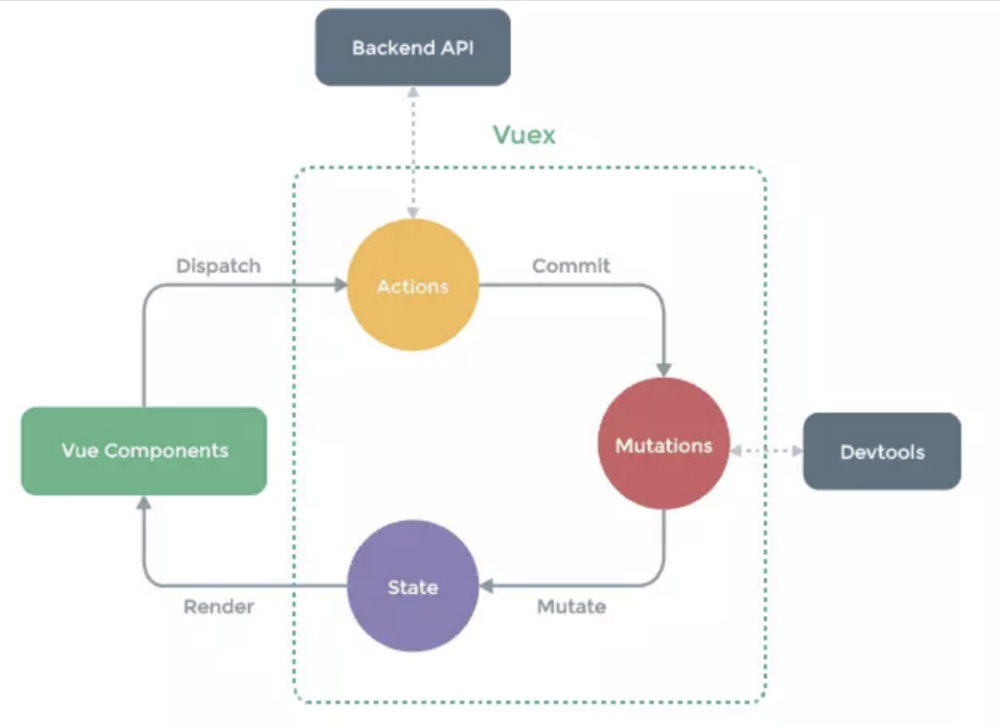

*   `state`：`Vuex` 使用单一状态树,即每个应用将仅仅包含一个`store` 实例，但单一状态树和模块化并不冲突。存放的数据状态，不可以直接修改里面的数据。
*   `mutations`：`mutations`定义的方法动态修改`Vuex` 的 `store` 中的状态或数据
*   `getters`：类似`vue`的计算属性，主要用来过滤一些数据。
*   `action`：`actions`可以理解为通过将`mutations`里面处里数据的方法变成可异步的处理数据的方法，简单的说就是异步操作数据。`view` 层通过 `store.dispath` 来分发 `action`

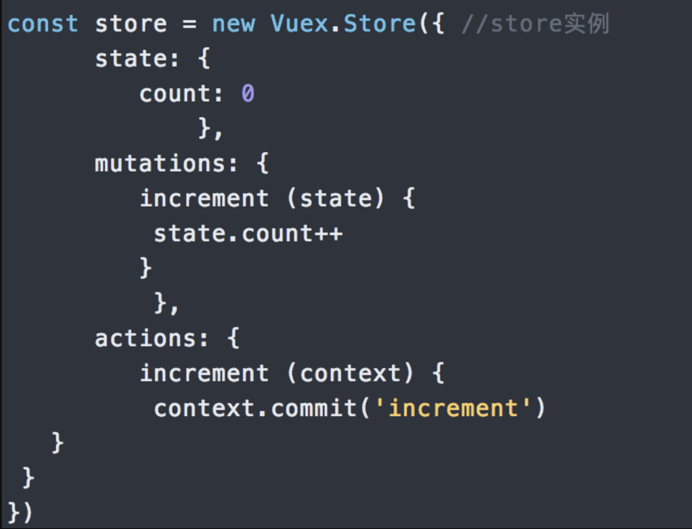

> `modules`：项目特别复杂的时候，可以让每一个模块拥有自己的`state`、`mutation`、`action`、`getters`，使得结构非常清晰，方便管理

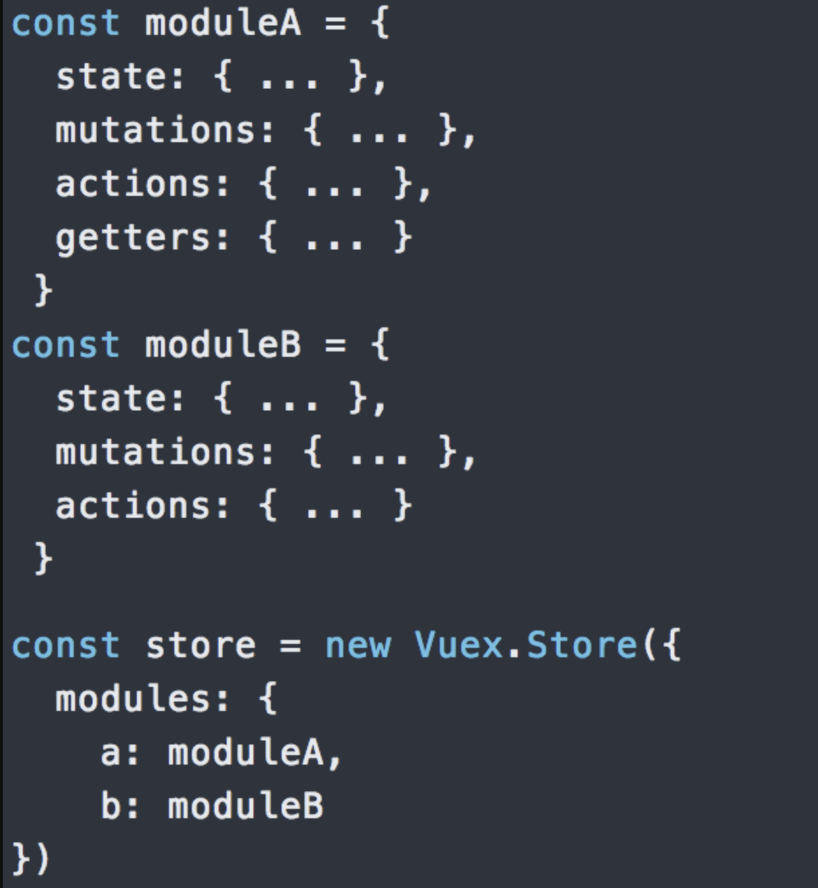

### [#](#_7-v-if-和-v-show-区别) 7 v-if 和 v-show 区别

*   答：`v-if`按照条件是否渲染，`v-show`是`display`的`block`或`none`；

### [#](#_8-route和-router的区别) 8 `$route`和`$router`的区别

*   `$route`是“路由信息对象”，包括`path`，`params`，`hash`，`query`，`fullPath`，`matched`，`name`等路由信息参数。
*   而`$router`是“路由实例”对象包括了路由的跳转方法，钩子函数等

### [#](#_9-如何让css只在当前组件中起作用) 9 如何让CSS只在当前组件中起作用?

> 将当前组件的`<style>`修改为`<style scoped>`

### [#](#_10-keep-alive-keep-alive-的作用是什么) 10 `<keep-alive></keep-alive>`的作用是什么?

> keep-alive可以实现组件缓存，当组件切换时不会对当前组件进行卸载

*   `<keep-alive></keep-alive>` 包裹动态组件时，会缓存不活动的组件实例,主要用于保留组件状态或避免重新渲染

> 比如有一个列表和一个详情，那么用户就会经常执行打开详情=>返回列表=>打开详情…这样的话列表和详情都是一个频率很高的页面，那么就可以对列表组件使用`<keep-alive></keep-alive>`进行缓存，这样用户每次返回列表的时候，都能从缓存中快速渲染，而不是重新渲染

*   常用的两个属性`include/exclude`，允许组件有条件的进行缓存
*   两个生命周期`activated/deactivated`，用来得知当前组件是否处于活跃状态

### [#](#_11-指令v-el的作用是什么) 11 指令v-el的作用是什么?

> 提供一个在页面上已存在的 `DOM`元素作为 `Vue`实例的挂载目标.可以是 CSS 选择器，也可以是一个 `HTMLElement` 实例,

### [#](#_12-在vue中使用插件的步骤) 12 在Vue中使用插件的步骤

*   采用`ES6`的`import ... from ...`语法或`CommonJS`的`require()`方法引入插件
*   使用全局方法`Vue.use( plugin )`使用插件,可以传入一个选项对象`Vue.use(MyPlugin, { someOption: true })`

### [#](#_13-请列举出3个vue中常用的生命周期钩子函数) 13 请列举出3个Vue中常用的生命周期钩子函数?

*   `created`: 实例已经创建完成之后调用,在这一步,实例已经完成数据观测, 属性和方法的运算, `watch/event`事件回调. 然而, 挂载阶段还没有开始, `$el`属性目前还不可见
*   `mounted`: `el`被新创建的 `vm.$el` 替换，并挂载到实例上去之后调用该钩子。如果 `root` 实例挂载了一个文档内元素，当 `mounted`被调用时 `vm.$el` 也在文档内。
*   `activated`: `keep-alive`组件激活时调用

### [#](#_14-vue-cli-工程技术集合介绍) 14 vue-cli 工程技术集合介绍

**问题一：构建的 vue-cli 工程都到了哪些技术，它们的作用分别是什么？**

*   `vue.js`：`vue-cli`工程的核心，主要特点是 双向数据绑定 和 组件系统。
*   `vue-router`：`vue`官方推荐使用的路由框架。
*   `vuex`：专为 `Vue.js` 应用项目开发的状态管理器，主要用于维护`vue`组件间共用的一些 变量 和 方法。
*   `axios`（ 或者 `fetch` 、`ajax` ）：用于发起 `GET` 、或 `POST` 等 `http`请求，基于 `Promise` 设计。
*   `vuex`等：一个专为`vue`设计的移动端UI组件库。
*   创建一个`emit.js`文件，用于`vue`事件机制的管理。
*   `webpack`：模块加载和`vue-cli`工程打包器。

**问题二：vue-cli 工程常用的 npm 命令有哪些？**

*   下载 `node_modules` 资源包的命令：

    npm install
    
*   启动 `vue-cli` 开发环境的 npm命令：

    npm run dev
    
*   `vue-cli` 生成 生产环境部署资源 的 `npm`命令：

    npm run build
    
*   用于查看 `vue-cli` 生产环境部署资源文件大小的 `npm`命令：

    npm run build --report
    

> 在浏览器上自动弹出一个 展示 `vue-cli` 工程打包后 `app.js`、`manifest.js`、`vendor.js` 文件里面所包含代码的页面。可以具此优化 `vue-cli` 生产环境部署的静态资源，提升 页面 的加载速度

### [#](#_15-nexttick) 15 NextTick

> `nextTick`可以让我们在下次 DOM 更新循环结束之后执行延迟回调，用于获得更新后的 `DOM`

### [#](#_16-vue的优点是什么？) 16 vue的优点是什么？

*   低耦合。视图（`View`）可以独立于`Model`变化和修改，一个`ViewModel`可以绑定到不同的`"View"`上，当View变化的时候Model可以不变，当`Model`变化的时候`View`也可以不变
*   可重用性。你可以把一些视图逻辑放在一个`ViewModel`里面，让很多`view`重用这段视图逻辑
*   可测试。界面素来是比较难于测试的，而现在测试可以针对`ViewModel`来写

### [#](#_17-路由之间跳转？) 17 路由之间跳转？

**声明式（标签跳转）**

    <router-link :to="index">


**编程式（ js跳转）**

    router.push('index')


### [#](#_18-实现-vue-ssr) 18 实现 Vue SSR

**其基本实现原理**

*   `app.js` 作为客户端与服务端的公用入口，导出 `Vue` 根实例，供客户端 `entry` 与服务端 `entry` 使用。客户端 `entry` 主要作用挂载到 `DOM` 上，服务端 `entry` 除了创建和返回实例，还进行路由匹配与数据预获取。
*   `webpack` 为客服端打包一个 `Client Bundle` ，为服务端打包一个 `Server Bundle` 。
*   服务器接收请求时，会根据 `url`，加载相应组件，获取和解析异步数据，创建一个读取 `Server Bundle` 的 `BundleRenderer`，然后生成 `html` 发送给客户端。
*   客户端混合，客户端收到从服务端传来的 `DOM` 与自己的生成的 DOM 进行对比，把不相同的 `DOM` 激活，使其可以能够响应后续变化，这个过程称为客户端激活 。为确保混合成功，客户端与服务器端需要共享同一套数据。在服务端，可以在渲染之前获取数据，填充到 `stroe` 里，这样，在客户端挂载到 `DOM` 之前，可以直接从 `store`里取数据。首屏的动态数据通过 `window.__INITIAL_STATE__`发送到客户端

> `Vue SSR` 的实现，主要就是把 `Vue` 的组件输出成一个完整 `HTML`, `vue-server-renderer` 就是干这事的

*   `Vue SSR`需要做的事多点（输出完整 HTML），除了`complier -> vnode`，还需如数据获取填充至 `HTML`、客户端混合（`hydration`）、缓存等等。 相比于其他模板引擎（`ejs`, `jade` 等），最终要实现的目的是一样的，性能上可能要差点

### [#](#_19-vue-组件-data-为什么必须是函数) 19 Vue 组件 data 为什么必须是函数

*   每个组件都是 `Vue` 的实例。
*   组件共享 `data` 属性，当 `data` 的值是同一个引用类型的值时，改变其中一个会影响其他

### [#](#_20-vue-computed-实现) 20 Vue computed 实现

*   建立与其他属性（如：`data`、 `Store`）的联系；
*   属性改变后，通知计算属性重新计算

> 实现时，主要如下

*   初始化 `data`， 使用 `Object.defineProperty` 把这些属性全部转为 `getter/setter`。
*   初始化 `computed`, 遍历 `computed` 里的每个属性，每个 `computed` 属性都是一个 `watch` 实例。每个属性提供的函数作为属性的 `getter`，使用 `Object.defineProperty` 转化。
*   `Object.defineProperty getter` 依赖收集。用于依赖发生变化时，触发属性重新计算。
*   若出现当前 `computed` 计算属性嵌套其他 `computed` 计算属性时，先进行其他的依赖收集

### [#](#_21-vue-complier-实现) 21 Vue complier 实现

*   模板解析这种事，本质是将数据转化为一段 `html` ，最开始出现在后端，经过各种处理吐给前端。随着各种 `mv*` 的兴起，模板解析交由前端处理。
*   总的来说，`Vue complier` 是将 `template` 转化成一个 `render` 字符串。

> 可以简单理解成以下步骤：

*   `parse` 过程，将 `template` 利用正则转化成`AST` 抽象语法树。
*   `optimize` 过程，标记静态节点，后 `diff` 过程跳过静态节点，提升性能。
*   `generate` 过程，生成 `render` 字符串

### [#](#_22-怎么快速定位哪个组件出现性能问题) 22 怎么快速定位哪个组件出现性能问题

> 用 `timeline` 工具。 大意是通过 `timeline` 来查看每个函数的调用时常，定位出哪个函数的问题，从而能判断哪个组件出了问题

### [#](#_23-开发中常用的指令有哪些) 23 开发中常用的指令有哪些

*   `v-model` :一般用在表达输入，很轻松的实现表单控件和数据的双向绑定
*   `v-html`: 更新元素的 `innerHTML`
*   `v-show` 与 `v-if`: 条件渲染, 注意二者区别

> 使用了v-if的时候，如果值为false，那么页面将不会有这个html标签生成。 v-show则是不管值为true还是false，html元素都会存在，只是CSS中的display显示或隐藏

*   `v-on` : `click`: 可以简写为`@click`,`@`绑定一个事件。如果事件触发了，就可以指定事件的处理函数
*   `v-for`:基于源数据多次渲染元素或模板块
*   `v-bind`: 当表达式的值改变时，将其产生的连带影响，响应式地作用于 `DOM`

> 语法：`v-bind:title="msg"`简写：`:title="msg"`

### [#](#_24-proxy-相比于-defineproperty-的优势) 24 Proxy 相比于 defineProperty 的优势

> Object.defineProperty() 的问题主要有三个：

*   不能监听数组的变化
*   必须遍历对象的每个属性
*   必须深层遍历嵌套的对象

> Proxy 在 ES2015 规范中被正式加入，它有以下几个特点

*   针对对象：针对整个对象，而不是对象的某个属性，所以也就不需要对 keys 进行遍历。这解决了上述 Object.defineProperty() 第二个问题
*   支持数组：Proxy 不需要对数组的方法进行重载，省去了众多 hack，减少代码量等于减少了维护成本，而且标准的就是最好的。

> 除了上述两点之外，Proxy 还拥有以下优势：

*   Proxy 的第二个参数可以有 13 种拦截方法，这比起 Object.defineProperty() 要更加丰富
*   Proxy 作为新标准受到浏览器厂商的重点关注和性能优化，相比之下 Object.defineProperty() 是一个已有的老方法。

### [#](#_25-vue-router-有哪几种导航守卫) 25 vue-router 有哪几种导航守卫?

*   全局守卫
*   路由独享守卫
*   路由组件内的守卫

**全局守卫**

> vue-router全局有三个守卫

*   `router.beforeEach` 全局前置守卫 进入路由之前
*   `router.beforeResolve` 全局解析守卫(2.5.0+) 在`beforeRouteEnter`调用之后调用
*   `router.afterEach` 全局后置钩子 进入路由之后

    // main.js 入口文件
    import router from './router'; // 引入路由
    router.beforeEach((to, from, next) => { 
      next();
    });
    router.beforeResolve((to, from, next) => {
      next();
    });
    router.afterEach((to, from) => {
      console.log('afterEach 全局后置钩子');
    });
    

**路由独享守卫**

> 如果你不想全局配置守卫的话，你可以为某些路由单独配置守卫

    const router = new VueRouter({
      routes: [
        {
          path: '/foo',
          component: Foo,
          beforeEnter: (to, from, next) => { 
            // 参数用法什么的都一样,调用顺序在全局前置守卫后面，所以不会被全局守卫覆盖
            // ...
          }
        }
      ]
    })


​    

**路由组件内的守卫**

*   beforeRouteEnter 进入路由前, 在路由独享守卫后调用 不能 获取组件实例 this，组件实例还没被创建
*   beforeRouteUpdate (2.2) 路由复用同一个组件时, 在当前路由改变，但是该组件被复用时调用 可以访问组件实例 this
*   beforeRouteLeave 离开当前路由时, 导航离开该组件的对应路由时调用，可以访问组件实例 this

### [#](#_26-组件之间的传值通信) 26 组件之间的传值通信

> 组件之间通讯分为三种: 父传子、子传父、兄弟组件之间的通讯

**1\. 父组件给子组件传值**

*   使用`props`，父组件可以使用`props`向子组件传递数据。
*   父组件`vue`模板`father.vue`:

    <template>
        <child :msg="message"></child>
    </template>
    
    <script>
    import child from './child.vue';
    export default {
        components: {
            child
        },
        data () {
            return {
                message: 'father message';
            }
        }
    }
    </script>
    

> 子组件vue模板child.vue:

    <template>
        <div>{{msg}}</div>
    </template>
    
    <script>
    export default {
        props: {
            msg: {
                type: String,
                required: true
            }
        }
    }
    </script>


**2\. 子组件向父组件通信**

> 父组件向子组件传递事件方法，子组件通过`$emit`触发事件，回调给父组件

父组件vue模板father.vue:

    <template>
        <child @msgFunc="func"></child>
    </template>
    
    <script>
    import child from './child.vue';
    export default {
        components: {
            child
        },
        methods: {
            func (msg) {
                console.log(msg);
            }
        }
    }
    </script>


> 子组件vue模板child.vue:

    <template>
        <button @click="handleClick">点我</button>
    </template>
    
    <script>
    export default {
        props: {
            msg: {
                type: String,
                required: true
            }
        },
        methods () {
            handleClick () {
                //........
                this.$emit('msgFunc');
            }
        }
    }
    </script>


**3\. 非父子, 兄弟组件之间通信**

> vue2中废弃了broadcast广播和分发事件的方法。父子组件中可以用props和$emit()。如何实现非父子组件间的通信，可以通过实例一个vue实例Bus作为媒介，要相互通信的兄弟组件之中，都引入Bus，然后通过分别调用Bus事件触发和监听来实现通信和参数传递。Bus.js可以是这样:

    import Vue from 'vue'
    export default new Vue()


> 在需要通信的组件都引入Bus.js:

    <template>
    	<button @click="toBus">子组件传给兄弟组件</button>
    </template>
    
    <script>
    import Bus from '../common/js/bus.js'
    export default{
    	methods: {
    	    toBus () {
    	        Bus.$emit('on', '来自兄弟组件')
    	    }
    	  }
    }
    </script>


> 另一个组件也import Bus.js 在钩子函数中监听on事件

    import Bus from '../common/js/bus.js'
    export default {
        data() {
          return {
            message: ''
          }
        },
        mounted() {
           Bus.$on('on', (msg) => {
             this.message = msg
           })
         }
       }


### [#](#_27-vue与angular以及react的区别？) 27 Vue与Angular以及React的区别？

**Vue与AngularJS的区别**

*   Angular采用TypeScript开发, 而Vue可以使用javascript也可以使用TypeScript
*   AngularJS依赖对数据做脏检查，所以Watcher越多越慢；Vue.js使用基于依赖追踪的观察并且使用异步队列更新，所有的数据都是独立触发的。
*   AngularJS社区完善, Vue的学习成本较小

**Vue与React的区别**

*   vue组件分为全局注册和局部注册，在react中都是通过import相应组件，然后模版中引用；
*   props是可以动态变化的，子组件也实时更新，在react中官方建议props要像纯函数那样，输入输出一致对应，而且不太建议通过props来更改视图；
*   子组件一般要显示地调用props选项来声明它期待获得的数据。而在react中不必需，另两者都有props校验机制；
*   每个Vue实例都实现了事件接口，方便父子组件通信，小型项目中不需要引入状态管理机制，而react必需自己实现；
*   使用插槽分发内容，使得可以混合父组件的内容与子组件自己的模板；
*   多了指令系统，让模版可以实现更丰富的功能，而React只能使用JSX语法；
*   Vue增加的语法糖computed和watch，而在React中需要自己写一套逻辑来实现；
*   react的思路是all in js，通过js来生成html，所以设计了jsx，还有通过js来操作css，社区的styled-component、jss等；而 vue是把html，css，js组合到一起，用各自的处理方式，vue有单文件组件，可以把html、css、js写到一个文件中，html提供了模板引擎来处理。
*   react做的事情很少，很多都交给社区去做，vue很多东西都是内置的，写起来确实方便一些， 比如 redux的combineReducer就对应vuex的modules， 比如reselect就对应vuex的getter和vue组件的computed， vuex的mutation是直接改变的原始数据，而redux的reducer是返回一个全新的state，所以redux结合immutable来优化性能，vue不需要。
*   react是整体的思路的就是函数式，所以推崇纯组件，数据不可变，单向数据流，当然需要双向的地方也可以做到，比如结合redux-form，组件的横向拆分一般是通过高阶组件。而vue是数据可变的，双向绑定，声明式的写法，vue组件的横向拆分很多情况下用mixin

### [#](#_28-vuex是什么？怎么使用？哪种功能场景使用它？) 28 vuex是什么？怎么使用？哪种功能场景使用它？

*   vuex 就是一个仓库，仓库里放了很多对象。其中 state 就是数据源存放地，对应于一般 vue 对象里面的 data
*   state 里面存放的数据是响应式的，vue 组件从 store 读取数据，若是 store 中的数据发生改变，依赖这相数据的组件也会发生更新
*   它通过 mapState 把全局的 state 和 getters 映射到当前组件的 computed 计算属性

> vuex的使用借助官方提供的一张图来说明:


> Vuex有5种属性: 分别是 state、getter、mutation、action、module;

**state**

> `Vuex` 使用单一状态树,即每个应用将仅仅包含一个store 实例，但单一状态树和模块化并不冲突。存放的数据状态，不可以直接修改里面的数据

**mutations**

> `mutations`定义的方法动态修改Vuex 的 store 中的状态或数据。

**getters**

> 类似vue的计算属性，主要用来过滤一些数据

**action**

*   actions可以理解为通过将mutations里面处里数据的方法变成可异步的处理数据的方法，简单的说就是异步操作数据。view 层通过 store.dispath 来分发 action。
*   vuex 一般用于中大型 web 单页应用中对应用的状态进行管理，对于一些组件间关系较为简单的小型应用，使用 vuex 的必要性不是很大，因为完全可以用组件 prop 属性或者事件来完成父子组件之间的通信，vuex 更多地用于解决跨组件通信以及作为数据中心集中式存储数据。
*   使用Vuex解决非父子组件之间通信问题 vuex 是通过将 state 作为数据中心、各个组件共享 state 实现跨组件通信的，此时的数据完全独立于组件，因此将组件间共享的数据置于 State 中能有效解决多层级组件嵌套的跨组件通信问题
*   vuex 作为数据存储中心 vuex 的 State 在单页应用的开发中本身具有一个“数据库”的作用，可以将组件中用到的数据存储在 State 中，并在 Action 中封装数据读写的逻辑。这时候存在一个问题，一般什么样的数据会放在 State 中呢？ 目前主要有两种数据会使用 vuex 进行管理： 1、组件之间全局共享的数据 2、通过后端异步请求的数据 比如做加入购物车、登录状态等都可以使用Vuex来管理数据状态

> 一般面试官问到这里vue基本知识就差不多了， 如果更深入的研究就是和你探讨关于vue的底层源码；或者是具体在项目中遇到的问题，下面列举几个项目中可能遇到的问题：

*   开发时，改变数组或者对象的数据，但是页面没有更新如何解决？
*   vue弹窗后如何禁止滚动条滚动？
*   如何在 vue 项目里正确地引用 jquery 和 jquery-ui的插件

### [#](#_28-watch与computed的区别) 28 watch与computed的区别

**computed:**

*   computed是计算属性,也就是计算值,它更多用于计算值的场景
*   computed具有缓存性,computed的值在getter执行后是会缓存的，只有在它依赖的属性值改变之后，下一次获取computed的值时才会重新调用对应的getter来计算 computed适用于计算比较消耗性能的计算场景

**watch:**

*   更多的是「观察」的作用,类似于某些数据的监听回调,用于观察props $emit或者本组件的值,当数据变化时来执行回调进行后续操作
*   无缓存性，页面重新渲染时值不变化也会执行

**小结:**

*   当我们要进行数值计算,而且依赖于其他数据，那么把这个数据设计为computed
*   如果你需要在某个数据变化时做一些事情，使用watch来观察这个数据变化

### [#](#_29、vue是如何实现双向绑定的) 29、Vue是如何实现双向绑定的?

> 利用Object.defineProperty劫持对象的访问器,在属性值发生变化时我们可以获取变化,然后根据变化进行后续响应,在vue3.0中通过Proxy代理对象进行类似的操作。

    // 这是将要被劫持的对象
    const data = {
      name: '',
    };
    
    function say(name) {
      if (name === '古天乐') {
        console.log('给大家推荐一款超好玩的游戏');
      } else if (name === '渣渣辉') {
        console.log('戏我演过很多,可游戏我只玩贪玩懒月');
      } else {
        console.log('来做我的兄弟');
      }
    }
    
    // 遍历对象,对其属性值进行劫持
    Object.keys(data).forEach(function(key) {
      Object.defineProperty(data, key, {
        enumerable: true,
        configurable: true,
        get: function() {
          console.log('get');
        },
        set: function(newVal) {
          // 当属性值发生变化时我们可以进行额外操作
          console.log(`大家好,我系${newVal}`);
          say(newVal);
        },
      });
    });
    
    data.name = '渣渣辉';
    //大家好,我系渣渣辉
    //戏我演过很多,可游戏我只玩贪玩懒月


### [#](#_29-vue2-x-响应式原理) 29 Vue2.x 响应式原理

> Vue 采用数据劫持结合发布—订阅模式的方法，通过 Object.defineProperty() 来劫持各个属性的 setter，getter，在数据变动时发布消息给订阅者，触发相应的监听回调。


*   `Observer` 遍历数据对象，给所有属性加上 `setter` 和 `getter`，监听数据的变化
*   `compile` 解析模板指令，将模板中的变量替换成数据，然后初始化渲染页面视图，并将每个指令对应的节点绑定更新函数，添加监听数据的订阅者，一旦数据有变动，收到通知，更新视图

> `Watcher` 订阅者是 `Observer` 和 `Compile` 之间通信的桥梁，主要做的事情

*   在自身实例化时往属性订阅器 (`dep`) 里面添加自己
*   待属性变动 `dep.notice()` 通知时，调用自身的 `update()` 方法，并触发 `Compile` 中绑定的回调

**Vue3.x响应式数据原理**

> `Vue3.x`改用P`roxy`替代`Object.defineProperty`。因为P`roxy`可以直接监听对象和数组的变化，并且有多达13种拦截方法。并且作为新标准将受到浏览器厂商重点持续的性能优化。

`Proxy`只会代理对象的第一层，那么`Vue3`又是怎样处理这个问题的呢？

> 判断当前`Reflect.get的`返回值是否为`Object`，如果是则再通过`reactive`方法做代理， 这样就实现了深度观测。

**监测数组的时候可能触发多次get/set，那么如何防止触发多次呢？**

> 我们可以判断`key`是否为当前被代理对象`target`自身属性，也可以判断旧值与新值是否相等，只有满足以上两个条件之一时，才有可能执行`trigger`

### [#](#_30-v-model双向绑定原理) 30 v-model双向绑定原理

> `v-model`本质上是语法糖，`v-model`在内部为不同的输入元素使用不同的属性并抛出不同的事件

*   `text` 和 `textarea` 元素使用 value 属性和 input 事件
*   `checkbox` 和 `radio` 使用 checked 属性和 change 事件
*   `select` 字段将 value 作为 prop 并将 change 作为事件

**所以我们可以v-model进行如下改写：**

    <input v-model="sth" />
    //  等同于
    <input :value="sth" @input="sth = $event.target.value" />


*   这个语法糖必须是固定的，也就是说属性必须为`value`，方法名必须为：`input`。
*   知道了`v-model`的原理，我们可以在自定义组件上实现`v-model`

    //Parent
    <template>
        {{num}}
        <Child v-model="num">
    </template>
    export default {
        data(){
            return {
                num: 0
            }
        }
    }
    
    //Child
    <template>
        <div @click="add">Add</div>
    </template>
    export default {
        props: ['value'],
        methods:{
            add(){
                this.$emit('input', this.value + 1)
            }
        }
    }
    

### [#](#_31-scoped样式穿透) 31 scoped样式穿透

> `scoped`虽然避免了组件间样式污染，但是很多时候我们需要修改组件中的某个样式，但是又不想去除`scoped`属性

1.  使用`/deep/`

    //Parent
    <template>
    <div class="wrap">
        <Child />
    </div>
    </template>
    
    <style lang="scss" scoped>
    .wrap /deep/ .box{
        background: red;
    }
    </style>
    
    //Child
    <template>
        <div class="box"></div>
    </template>
    
2.  使用两个style标签

    //Parent
    <template>
    <div class="wrap">
        <Child />
    </div>
    </template>
    
    <style lang="scss" scoped>
    //其他样式
    </style>
    <style lang="scss">
    .wrap .box{
        background: red;
    }
    </style>
    
    //Child
    <template>
        <div class="box"></div>
    </template>
    

### [#](#_32-ref的作用) 32 ref的作用

*   获取`dom`元素`this.$refs.box`
*   获取子组件中的`datathis.$refs.box.msg`
*   调用子组件中的方法`this.$refs.box.open()`

### [#](#_33-computed和watch区别) 33 computed和watch区别

1.  当页面中有某些数据依赖其他数据进行变动的时候，可以使用计算属性computed

> `Computed`本质是一个具备缓存的`watcher`，依赖的属性发生变化就会更新视图。 适用于计算比较消耗性能的计算场景。当表达式过于复杂时，在模板中放入过多逻辑会让模板难以维护，可以将复杂的逻辑放入计算属性中处理

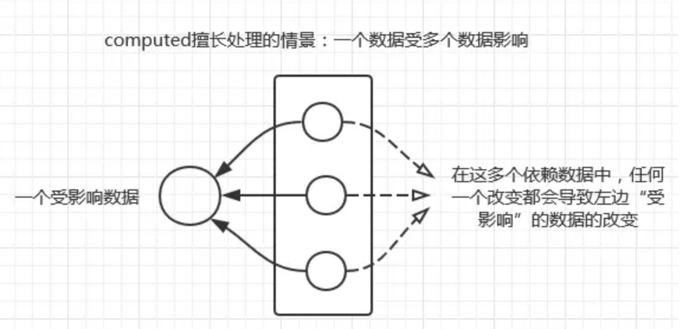

    <template>{{fullName}}</template>
    export default {
        data(){
            return {
                firstName: 'xie',
                lastName: 'yu fei',
            }
        },
        computed:{
            fullName: function(){
                return this.firstName + ' ' + this.lastName
            }
        }
    }


2.  `watch`用于观察和监听页面上的vue实例，如果要在数据变化的同时进行异步操作或者是比较大的开销，那么`watch`为最佳选择

> `Watch`没有缓存性，更多的是观察的作用，可以监听某些数据执行回调。当我们需要深度监听对象中的属性时，可以打开`deep：true`选项，这样便会对对象中的每一项进行监听。这样会带来性能问题，优化的话可以使用字符串形式监听，如果没有写到组件中，不要忘记使用`unWatch`手动注销

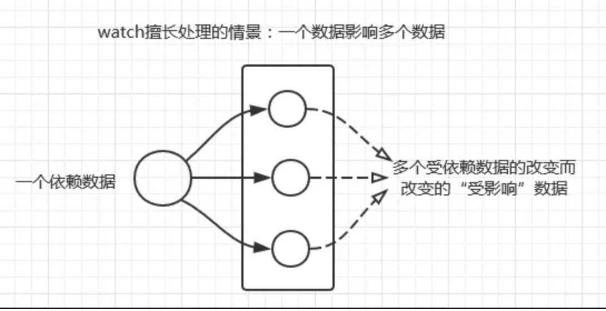

    <template>{{fullName}}</template>
    export default {
        data(){
            return {
                firstName: 'xie',
                lastName: 'xiao fei',
                fullName: 'xie xiao fei'
            }
        },
        watch:{
            firstName(val) {
                this.fullName = val + ' ' + this.lastName
            },
            lastName(val) {
                this.fullName = this.firstName + ' ' + val
            }
        }
    }


### [#](#_34-vue-router守卫) 34 vue-router守卫

> 导航守卫 `router.beforeEach` 全局前置守卫

*   `to: Route`: 即将要进入的目标（路由对象）
*   `from: Route`: 当前导航正要离开的路由
*   `next: Function`: 一定要调用该方法来 `resolve` 这个钩子。（一定要用这个函数才能去到下一个路由，如果不用就拦截）
*   执行效果依赖 next 方法的调用参数。
*   `next()`: 进行管道中的下一个钩子。如果全部钩子执行完了，则导航的状态就是 confirmed (确认的)。
*   `next(false)`:取消进入路由，url地址重置为from路由地址(也就是将要离开的路由地址)

    // main.js 入口文件
    import router from './router'; // 引入路由
    router.beforeEach((to, from, next) => { 
      next();
    });
    router.beforeResolve((to, from, next) => {
      next();
    });
    router.afterEach((to, from) => {
      console.log('afterEach 全局后置钩子');
    });

> 路由独享的守卫 你可以在路由配置上直接定义 `beforeEnter` 守卫

    const router = new VueRouter({
      routes: [
        {
          path: '/foo',
          component: Foo,
          beforeEnter: (to, from, next) => {
            // ...
          }
        }
      ]
    })


> 组件内的守卫你可以在路由组件内直接定义以下路由导航守卫

    const Foo = {
      template: `...`,
      beforeRouteEnter (to, from, next) {
        // 在渲染该组件的对应路由被 confirm 前调用
        // 不！能！获取组件实例 `this`
        // 因为当守卫执行前，组件实例还没被创建
      },
      beforeRouteUpdate (to, from, next) {
        // 在当前路由改变，但是该组件被复用时调用
        // 举例来说，对于一个带有动态参数的路径 /foo/:id，在 /foo/1 和 /foo/2 之间跳转的时候，
        // 由于会渲染同样的 Foo 组件，因此组件实例会被复用。而这个钩子就会在这个情况下被调用。
        // 可以访问组件实例 `this`
      },
      beforeRouteLeave (to, from, next) {
        // 导航离开该组件的对应路由时调用，我们用它来禁止用户离开
        // 可以访问组件实例 `this`
        // 比如还未保存草稿，或者在用户离开前，
        将setInterval销毁，防止离开之后，定时器还在调用。
      }
    }


### [#](#_35-vue修饰符) 35 vue修饰符

*   `stop`：阻止事件的冒泡
*   `prevent`：阻止事件的默认行为
*   `once`：只触发一次
*   `self`：只触发自己的事件行为时，才会执行

### [#](#_36-vue项目中的性能优化) 36 vue项目中的性能优化

*   不要在模板里面写过多表达式
*   循环调用子组件时添加key
*   频繁切换的使用v-show，不频繁切换的使用v-if
*   尽量少用float，可以用flex
*   按需加载，可以用require或者import()按需加载需要的组件
*   路由懒加载

### [#](#_37-vue-extend和vue-component) 37 vue.extend和vue.component

*   `extend`是构造一个组件的语法器。 然后这个组件你可以作用到Vue.component这个全局注册方法里还可以在任意vue模板里使用组件。 也可以作用到vue实例或者某个组件中的components属性中并在内部使用apple组件。
*   `Vue.component`你可以创建 ，也可以取组件。

### [#](#_38-vue的spa-如何优化加载速度) 38 Vue的SPA 如何优化加载速度

*   减少入口文件体积
*   静态资源本地缓存
*   开启Gzip压缩
*   使用SSR,nuxt.js

### [#](#_39-移动端如何设计一个比较友好的header组件？) 39 移动端如何设计一个比较友好的Header组件？

> 当时的思路是头部(Header)一般分为左、中、右三个部分，分为三个区域来设计，中间为主标题，每个页面的标题肯定不同，所以可以通过vue props的方式做成可配置对外进行暴露，左侧大部分页面可能都是回退按钮，但是样式和内容不尽相同，右侧一般都是具有功能性的操作按钮，所以左右两侧可以通过vue slot插槽的方式对外暴露以实现多样化，同时也可以提供default slot默认插槽来统一页面风格

### [#](#_40-proxy与object-defineproperty的优劣对比) 40 Proxy与Object.defineProperty的优劣对比?

**Proxy的优势如下:**

*   Proxy可以直接监听对象而非属性
*   Proxy可以直接监听数组的变化
*   Proxy有多达13种拦截方法,不限于apply、ownKeys、deleteProperty、has等等是Object.defineProperty不具备的
*   Proxy返回的是一个新对象,我们可以只操作新的对象达到目的,而Object.defineProperty只能遍历对象属性直接修改
*   Proxy作为新标准将受到浏览器厂商重点持续的性能优化，也就是传说中的新标准的性能红利

**Object.defineProperty的优势如下:**

兼容性好,支持IE9

### [#](#_41-你是如何理解vue的响应式系统的) 41 你是如何理解Vue的响应式系统的?

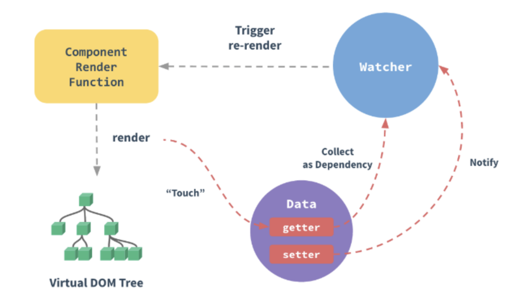

**响应式系统简述:**

*   任何一个 Vue Component 都有一个与之对应的 Watcher 实例。
*   Vue 的 data 上的属性会被添加 getter 和 setter 属性。
*   当 Vue Component render 函数被执行的时候, data 上会被 触碰(touch), 即被读, getter 方法会被调用, 此时 Vue 会去记录此 Vue component 所依赖的所有 data。(这一过程被称为依赖收集)
*   data 被改动时（主要是用户操作）, 即被写, setter 方法会被调用, 此时 Vue 会去通知所有依赖于此 data 的组件去调用他们的 render 函数进行更新。

### [#](#_42-既然vue通过数据劫持可以精准探测数据变化-为什么还需要虚拟dom进行diff检测差异) 42 既然Vue通过数据劫持可以精准探测数据变化,为什么还需要虚拟DOM进行diff检测差异?

> 现代前端框架有两种方式侦测变化,一种是pull一种是push

*   pull: 其代表为React,我们可以回忆一下React是如何侦测到变化的,我们通常会用setStateAPI显式更新,然后React会进行一层层的Virtual Dom Diff操作找出差异,然后Patch到DOM上,React从一开始就不知道到底是哪发生了变化,只是知道「有变化了」,然后再进行比较暴力的Diff操作查找「哪发生变化了」，另外一个代表就是Angular的脏检查操作。
*   push: Vue的响应式系统则是push的代表,当Vue程序初始化的时候就会对数据data进行依赖的收集,一但数据发生变化,响应式系统就会立刻得知,因此Vue是一开始就知道是「在哪发生变化了」,但是这又会产生一个问题,如果你熟悉Vue的响应式系统就知道,通常一个绑定一个数据就需要一个Watcher,一但我们的绑定细粒度过高就会产生大量的Watcher,这会带来内存以及依赖追踪的开销,而细粒度过低会无法精准侦测变化,因此Vue的设计是选择中等细粒度的方案,在组件级别进行push侦测的方式,也就是那套响应式系统,通常我们会第一时间侦测到发生变化的组件,然后在组件内部进行Virtual Dom Diff获取更加具体的差异,而Virtual Dom Diff则是pull操作,Vue是push+pull结合的方式进行变化侦测的

### [#](#_43-vue为什么没有类似于react中shouldcomponentupdate的生命周期？) 43 Vue为什么没有类似于React中shouldComponentUpdate的生命周期？

考点: Vue的变化侦测原理

前置知识: 依赖收集、虚拟DOM、响应式系统

> 根本原因是Vue与React的变化侦测方式有所不同

*   React是pull的方式侦测变化,当React知道发生变化后,会使用Virtual Dom Diff进行差异检测,但是很多组件实际上是肯定不会发生变化的,这个时候需要用shouldComponentUpdate进行手动操作来减少diff,从而提高程序整体的性能.
*   Vue是pull+push的方式侦测变化的,在一开始就知道那个组件发生了变化,因此在push的阶段并不需要手动控制diff,而组件内部采用的diff方式实际上是可以引入类似于shouldComponentUpdate相关生命周期的,但是通常合理大小的组件不会有过量的diff,手动优化的价值有限,因此目前Vue并没有考虑引入shouldComponentUpdate这种手动优化的生命周期.

### [#](#_44-vue中的key到底有什么用？) 44 Vue中的key到底有什么用？

*   key是为Vue中的vnode标记的唯一id,通过这个key,我们的diff操作可以更准确、更快速
*   diff算法的过程中,先会进行新旧节点的首尾交叉对比,当无法匹配的时候会用新节点的key与旧节点进行比对,然后超出差异.

> diff程可以概括为：oldCh和newCh各有两个头尾的变量StartIdx和EndIdx，它们的2个变量相互比较，一共有4种比较方式。如果4种比较都没匹配，如果设置了key，就会用key进行比较，在比较的过程中，变量会往中间靠，一旦StartIdx>EndIdx表明oldCh和newCh至少有一个已经遍历完了，就会结束比较,这四种比较方式就是首、尾、旧尾新头、旧头新尾.

> 准确: 如果不加key,那么vue会选择复用节点(Vue的就地更新策略),导致之前节点的状态被保留下来,会产生一系列的bug. 快速: key的唯一性可以被Map数据结构充分利用,相比于遍历查找的时间复杂度`O(n)`,`Map`的时间复杂度仅仅为`O(1)`.

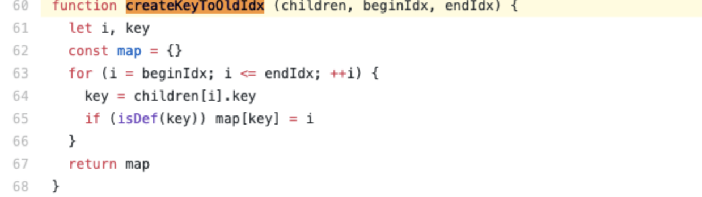

### [#](#_45-vue-项目性能优化) 45 vue 项目性能优化

**代码层面：**

*   合理使用 `v-if` 和 `v-show`
*   区分 `computed` 和 `watch` 的使用
*   `v-for` 遍历为 `item` 添加 `key`
*   `v-for` 遍历避免同时使用 `v-if`
*   通过 `addEventListener`添加的事件在组件销毁时要用 `removeEventListener` 手动移除这些事件的监听
*   图片懒加载
*   路由懒加载
*   第三方插件按需引入
*   `SSR`服务端渲染，首屏加载速度快，`SEO`效果好

**Webpack 层面优化：**

*   对图片进行压缩
*   使用 `CommonsChunkPlugin` 插件提取公共代码
*   提取组件的 CSS
*   优化 `SourceMap`
*   构建结果输出分析，利用 `webpack-bundle-analyzer` 可视化分析工具

### [#](#_46-nexttick) 46 nextTick

> `nextTick` 可以让我们在下次 `DOM` 更新循环结束之后执行延迟回调，用于获得更新后的 `DOM`

`nextTick`主要使用了宏任务和微任务。根据执行环境分别尝试采用

*   `Promise`
*   `MutationObserver`
*   `setImmediate`
*   如果以上都不行则采用`setTimeout`

> 定义了一个异步方法，多次调用`nextTick`会将方法存入队列中，通过这个异步方法清空当前队列

### [#](#_47-说一下vue2-x中如何监测数组变化) 47 说一下vue2.x中如何监测数组变化

> 使用了函数劫持的方式，重写了数组的方法，`Vue`将`data`中的数组进行了原型链重写，指向了自己定义的数组原型方法。这样当调用数组api时，可以通知依赖更新。如果数组中包含着引用类型，会对数组中的引用类型再次递归遍历进行监控。这样就实现了监测数组变化。

### [#](#_48-你的接口请求一般放在哪个生命周期中) 48 你的接口请求一般放在哪个生命周期中

> 接口请求一般放在`mounted`中，但需要注意的是服务端渲染时不支持`mounted`，需要放到`created`中

### [#](#_49-组件中的data为什么是一个函数) 49 组件中的data为什么是一个函数

> 一个组件被复用多次的话，也就会创建多个实例。本质上，这些实例用的都是同一个构造函数。如果`data`是对象的话，对象属于引用类型，会影响到所有的实例。所以为了保证组件不同的实例之间d`ata`不冲突，data必须是一个函数

### [#](#_50-说一下v-model的原理) 50 说一下v-model的原理

> `v-model`本质就是一个语法糖，可以看成是`value + input`方法的语法糖。 可以通过`model`属性的`prop`和`event`属性来进行自定义。原生的`v-model`，会根据标签的不同生成不同的事件和属性

### [#](#_51-vue事件绑定原理说一下) 51 Vue事件绑定原理说一下

> 原生事件绑定是通过`addEventListener`绑定给真实元素的，组件事件绑定是通过`Vue`自定义的`$on`实现的

### [#](#_52-vue模版编译原理知道吗，能简单说一下吗？) 52 Vue模版编译原理知道吗，能简单说一下吗？

> 简单说，`Vue`的编译过程就是将`template`转化为`render`函数的过程。会经历以下阶段：

*   生成`AST`树
    
*   优化
    
*   `codegen`
    
*   首先解析模版，生成`AST`语法树(一种用J`avaScript`对象的形式来描述整个模板)。 使用大量的正则表达式对模板进行解析，遇到标签、文本的时候都会执行对应的钩子进行相关处理。
    
*   `Vue`的数据是响应式的，但其实模板中并不是所有的数据都是响应式的。有一些数据首次渲染后就不会再变化，对应的DOM也不会变化。那么优化过程就是深度遍历AST树，按照相关条件对树节点进行标记。这些被标记的节点(静态节点)我们就可以跳过对它们的比对，对运行时的模板起到很大的优化作用。
    
*   编译的最后一步是将优化后的`AST`树转换为可执行的代码
    

### [#](#_53-vue2-x和vue3-x渲染器的diff算法分别说一下) 53 Vue2.x和Vue3.x渲染器的diff算法分别说一下

> 简单来说，`diff`算法有以下过程

*   同级比较，再比较子节点
    
*   先判断一方有子节点一方没有子节点的情况(如果新的`children`没有子节点，将旧的子节点移除)
    
*   比较都有子节点的情况(核心`diff`)
    
*   递归比较子节点
    
*   正常`Diff`两个树的时间复杂度是`O(n^3)`，但实际情况下我们很少会进行跨层级的移动`DOM`，所以`Vue`将`Diff`进行了优化，从`O(n^3) -> O(n)`，只有当新旧`children`都为多个子节点时才需要用核心的`Diff`算法进行同层级比较。
    
*   `Vue2`的核心`Diff`算法采用了双端比较的算法，同时从新旧`children`的两端开始进行比较，借助`key`值找到可复用的节点，再进行相关操作。相比`React`的`Diff`算法，同样情况下可以减少移动节点次数，减少不必要的性能损耗，更加的优雅
    
*   在创建`VNode`时就确定其类型，以及在`mount/patch`的过程中采用位运算来判断一个`VNode`的类型，在这个基础之上再配合核心的`Diff`算法，使得性能上较`Vue2.x`有了提升
    

### [#](#_54-再说一下虚拟dom以及key属性的作用) 54 再说一下虚拟Dom以及key属性的作用

*   由于在浏览器中操作`DOM`是很昂贵的。频繁的操作`DOM`，会产生一定的性能问题。这就是虚拟Dom的产生原因
*   `Virtual DOM`本质就是用一个原生的JS对象去描述一个`DOM`节点。是对真实DOM的一层抽象
*   `VirtualDOM`映射到真实DOM要经历`VNode`的`create`、`diff`、`patch`等阶段

**key的作用是尽可能的复用 DOM 元素**

*   新旧 `children` 中的节点只有顺序是不同的时候，最佳的操作应该是通过移动元素的位置来达到更新的目的
*   需要在新旧 `children` 的节点中保存映射关系，以便能够在旧 `children` 的节点中找到可复用的节点。`key`也就是`children`中节点的唯一标识

### [#](#_55-vue中组件生命周期调用顺序说一下) 55 Vue中组件生命周期调用顺序说一下

*   组件的调用顺序都是先父后子,渲染完成的顺序是先子后父。
*   组件的销毁操作是先父后子，销毁完成的顺序是先子后父。

**加载渲染过程**

> `父beforeCreate`->`父created`->`父beforeMount`->`子beforeCreate`->`子created`->`子beforeMount`\- >`子mounted`->`父mounted`

**子组件更新过程**

> `父beforeUpdate`->`子beforeUpdate`->`子updated`->`父updated`

**父组件更新过程**

> `父 beforeUpdate` -\> `父 updated`

**销毁过程**

> `父beforeDestroy`->`子beforeDestroy`->`子destroyed`->`父destroyed`

### [#](#_56-ssr了解吗) 56 SSR了解吗

> `SSR`也就是服务端渲染，也就是将`Vue`在客户端把标签渲染成HTML的工作放在服务端完成，然后再把html直接返回给客户端

`SSR`有着更好的`SEO`、并且首屏加载速度更快等优点。不过它也有一些缺点，比如我们的开发条件会受到限制，服务器端渲染只支持`beforeCreate`和`created`两个钩子，当我们需要一些外部扩展库时需要特殊处理，服务端渲染应用程序也需要处于`Node.js`的运行环境。还有就是服务器会有更大的负载需求

### [#](#_57-你都做过哪些vue的性能优化) 57 你都做过哪些Vue的性能优化

**编码阶段**

*   尽量减少`data`中的数据，`data`中的数据都会增加`getter`和`setter`，会收集对应的`watcher`
*   `v-if`和`v-for`不能连用
*   如果需要使用`v-for`给每项元素绑定事件时使用事件代理
*   `SPA` 页面采用`keep-alive`缓存组件
*   在更多的情况下，使用`v-if`替代`v-show`
*   `key`保证唯一
*   使用路由懒加载、异步组件
*   防抖、节流
*   第三方模块按需导入
*   长列表滚动到可视区域动态加载
*   图片懒加载

**SEO优化**

*   预渲染
*   服务端渲染`SSR`

**打包优化**

*   压缩代码
*   `Tree Shaking/Scope Hoisting`
*   使用`cdn`加载第三方模块
*   多线程打包`happypack`
*   `splitChunks`抽离公共文件
*   `sourceMap`优化

**用户体验**

*   骨架屏
*   `PWA`

> 还可以使用缓存(客户端缓存、服务端缓存)优化、服务端开启`gzip`压缩等。

### [#](#_58-vue-js特点) 58 Vue.js特点

*   简洁：页面由`HTML`模板+Json数据+`Vue`实例组成
*   数据驱动：自动计算属性和追踪依赖的模板表达式
*   组件化：用可复用、解耦的组件来构造页面
*   轻量：代码量小，不依赖其他库
*   快速：精确有效批量DOM更新
*   模板友好：可通过npm，bower等多种方式安装，很容易融入

### [#](#_59-请说出vue-cli项目中src目录每个文件夹和文件的用法) 59 请说出vue.cli项目中src目录每个文件夹和文件的用法

*   `assets`文件夹是放静态资源；
*   `components`是放组件；
*   `router`是定义路由相关的配置;
*   `view`视图；
*   `app.vue`是一个应用主组件；
*   `main.js`是入口文件

### [#](#_60-vue路由传参数) 60 vue路由传参数

*   使用`query`方法传入的参数使用`this.$route.query`接受
*   使用`params`方式传入的参数使用`this.$route.params`接受

### [#](#_61-vuex-是什么？-有哪几种属性？) 61 vuex 是什么？ 有哪几种属性？

> *   `Vuex` 是一个专为 `Vue.js` 应用程序开发的状态管理模式。
> *   有 5 种，分别是 `state`、`getter`、`mutation`、`action`、`module`

*   `Vuex` 是一个专为 `Vue.js` 应用程序开发的状态管理模式。
*   有 5 种，分别是 `state`、`getter`、`mutation`、`action`、`module`
*   `vuex` 的 `store` 是什么？
*   `vuex` 就是一个仓库，仓库里放了很多对象。其中 `state` 就是数据源存放地，对应于一般 vue 对象里面的 `datastate` 里面存放的数据是响应式的，`vue` 组件从 `store` 读取数据，若是 `store` 中的数据发生改变，依赖这相数据的组件也会发生更新它通过 `mapState` 把全局的 `state` 和 `getters` 映射到当前组件的 `computed` 计算属性

**vuex 的 getter 是什么？**

*   `getter` 可以对 `state` 进行计算操作，它就是 `store` 的计算属性虽然在组件内也可以做计算属性，但是 `getters` 可以在多给件之间复用如果一个状态只在一个组件内使用，是可以不用 `getters`

**vuex 的 mutation 是什么？**

*   更改`Vuex`的`store`中的状态的唯一方法是提交`mutation`

**vuex 的 action 是什么？**

*   `action` 类似于 `muation`, 不同在于：`action` 提交的是 `mutation`,而不是直接变更状态`action` 可以包含任意异步操作
*   `vue` 中 `ajax` 请求代码应该写在组件的 `methods` 中还是 `vuex` 的 `action` 中
*   `vuex` 的 `module` 是什么？

> 面对复杂的应用程序，当管理的状态比较多时；我们需要将`vuex`的`store`对象分割成模块(`modules`)。

> 如果请求来的数据不是要被其他组件公用，仅仅在请求的组件内使用，就不需要放入 `vuex` 的 `state` 里如果被其他地方复用，请将请求放入 `action` 里，方便复用，并包装成 `promise` 返回

### [#](#_62-如何让css只在当前组件中起作用？) 62 如何让CSS只在当前组件中起作用？

> 将当前组件的`<style>`修改为`<style scoped>`

### [#](#_63-delete和vue-delete删除数组的区别？) 63 delete和Vue.delete删除数组的区别？

*   `delete`只是被删除的元素变成了 `empty/undefined` 其他的元素的键值还是不变。
*   `Vue.delete`直接删除了数组 改变了数组的键值。

    var a=[1,2,3,4]
    var b=[1,2,3,4]
    delete a[0]
    console.log(a)  //[empty,2,3,4]
    this.$delete(b,0)
    console.log(b)  //[2,3,4]
    

### [#](#_64-v-on可以监听多个方法吗？) 64 v-on可以监听多个方法吗？

可以

    <input type="text" :value="name" @input="onInput" @focus="onFocus" @blur="onBlur" />


**v-on 常用修饰符**

*   `.stop` 该修饰符将阻止事件向上冒泡。同理于调用 `event.stopPropagation()` 方法
*   `.prevent` 该修饰符会阻止当前事件的默认行为。同理于调用 `event.preventDefault()` 方法
*   `.self` 该指令只当事件是从事件绑定的元素本身触发时才触发回调
*   `.once` 该修饰符表示绑定的事件只会被触发一次

### [#](#_65-vue子组件调用父组件的方法) 65 Vue子组件调用父组件的方法

*   第一种方法是直接在子组件中通过`this.$parent.event`来调用父组件的方法
*   第二种方法是在子组件里用`$emit`向父组件触发一个事件，父组件监听这个事件就行了。

### [#](#_66-vue如何兼容ie的问题) 66 vue如何兼容ie的问题

> babel-polyfill插件

### [#](#_67-vue-改变数组触发视图更新) 67 Vue 改变数组触发视图更新

> 以下方法调用会改变原始数组：`push()`, `pop()`, `shift()`, `unshift()`, `splice()`, `sort()`, `reverse()`,`Vue.set( target, key, value )`

*   调用方法：`Vue.set( target, key, value )`
    *   `target`：要更改的数据源(可以是对象或者数组)
    *   `key`：要更改的具体数据
    *   `value` ：重新赋的值

### [#](#_68-dom-渲染在哪个周期中就已经完成？) 68 DOM 渲染在哪个周期中就已经完成？

> 在`mounted`

注意 `mounted` 不会承诺所有的子组件也都一起被挂载。如果你希望等到整个视图都渲染完毕，可以用 `vm.$nextTick` 替换掉 `mounted`

    mounted: function () {
      this.$nextTick(function () {
        // Code that will run only after the
        // entire view has been rendered
      })
    }


### [#](#_69-简述每个周期具体适合哪些场景) 69 简述每个周期具体适合哪些场景

*   `beforecreate` : 可以在这加个`loading`事件，在加载实例时触发
*   `created` : 初始化完成时的事件写在这里，如在这结束`loading`事件，异步请求也适宜在这里调用
*   `mounted` : 挂载元素，获取到DOM节点 `updated` : 如果对数据统一处理，在这里写上相应函数
*   `beforeDestroy` : 可以做一个确认停止事件的确认框

**第一次加载会触发哪几个钩子**

> 会触发`beforeCreate` , `created` ,`beforeMount` ,`mounted`

### [#](#_70-动态绑定class) 70 动态绑定class

> `active` `classname`， `isActive` 变量

    <div :class="{ active: isActive }"></div>


[#](#八、框架通识) 八、框架通识
-------------------

### [#](#_1-mvvm) 1 MVVM

> `MVVM` 由以下三个内容组成

*   `View`：界面
*   `Model`：数据模型
*   `ViewModel`：作为桥梁负责沟通 `View` 和 `Model`

> 在 `JQuery` 时期，如果需要刷新 `UI` 时，需要先取到对应的 `DOM` 再更新 `UI`，这样数据和业务的逻辑就和页面有强耦合。

MVVM

在 `MVVM` 中，`UI` 是通过数据驱动的，数据一旦改变就会相应的刷新对应的 `UI`，`UI` 如果改变，也会改变对应的数据。这种方式就可以在业务处理中只关心数据的流转，而无需直接和页面打交道。`ViewModel` 只关心数据和业务的处理，不关心 `View` 如何处理数据，在这种情况下，`View` 和 `Model` 都可以独立出来，任何一方改变了也不一定需要改变另一方，并且可以将一些可复用的逻辑放在一个 `ViewModel` 中，让多个 `View`复用这个 `ViewModel`。

*   在 `MVVM` 中，最核心的也就是数据双向绑定，例如 `Angluar` 的脏数据检测，`Vue` 中的数据劫持。

**脏数据检测**

> 当触发了指定事件后会进入脏数据检测，这时会调用 `$digest` 循环遍历所有的数据观察者，判断当前值是否和先前的值有区别，如果检测到变化的话，会调用 `$watch` 函数，然后再次调用 `$digest` 循环直到发现没有变化。循环至少为二次 ，至多为十次。

> 脏数据检测虽然存在低效的问题，但是不关心数据是通过什么方式改变的，都可以完成任务，但是这在 `Vue` 中的双向绑定是存在问题的。并且脏数据检测可以实现批量检测出更新的值，再去统一更新 `UI`，大大减少了操作 `DOM` 的次数。所以低效也是相对的，这就仁者见仁智者见智了。

**数据劫持**

> `Vue` 内部使用了 `Object.defineProperty()` 来实现双向绑定，通过这个函数可以监听到 `set` 和 `get` 的事件。

    var data = { name: 'yck' }
    observe(data)
    let name = data.name // -> get value
    data.name = 'yyy' // -> change value
    
    function observe(obj) {
      // 判断类型
      if (!obj || typeof obj !== 'object') {
        return
      }
      Object.keys(obj).forEach(key => {
        defineReactive(obj, key, obj[key])
      })
    }
    
    function defineReactive(obj, key, val) {
      // 递归子属性
      observe(val)
      Object.defineProperty(obj, key, {
        enumerable: true,
        configurable: true,
        get: function reactiveGetter() {
          console.log('get value')
          return val
        },
        set: function reactiveSetter(newVal) {
          console.log('change value')
          val = newVal
        }
      })
    }


> 以上代码简单的实现了如何监听数据的 `set` 和 `get` 的事件，但是仅仅如此是不够的，还需要在适当的时候给属性添加发布订阅

    <div>
        {{name}}
    </div>


> 在解析如上模板代码时，遇到 `{name}` 就会给属性 `name` 添加发布订阅。

    // 通过 Dep 解耦
    class Dep {
      constructor() {
        this.subs = []
      }
      addSub(sub) {
        // sub 是 Watcher 实例
        this.subs.push(sub)
      }
      notify() {
        this.subs.forEach(sub => {
          sub.update()
        })
      }
    }
    // 全局属性，通过该属性配置 Watcher
    Dep.target = null
    
    function update(value) {
      document.querySelector('div').innerText = value
    }
    
    class Watcher {
      constructor(obj, key, cb) {
        // 将 Dep.target 指向自己
        // 然后触发属性的 getter 添加监听
        // 最后将 Dep.target 置空
        Dep.target = this
        this.cb = cb
        this.obj = obj
        this.key = key
        this.value = obj[key]
        Dep.target = null
      }
      update() {
        // 获得新值
        this.value = this.obj[this.key]
        // 调用 update 方法更新 Dom
        this.cb(this.value)
      }
    }
    var data = { name: 'yck' }
    observe(data)
    // 模拟解析到 `{{name}}` 触发的操作
    new Watcher(data, 'name', update)
    // update Dom innerText
    data.name = 'yyy'


> 接下来,对 `defineReactive` 函数进行改造

    function defineReactive(obj, key, val) {
      // 递归子属性
      observe(val)
      let dp = new Dep()
      Object.defineProperty(obj, key, {
        enumerable: true,
        configurable: true,
        get: function reactiveGetter() {
          console.log('get value')
          // 将 Watcher 添加到订阅
          if (Dep.target) {
            dp.addSub(Dep.target)
          }
          return val
        },
        set: function reactiveSetter(newVal) {
          console.log('change value')
          val = newVal
          // 执行 watcher 的 update 方法
          dp.notify()
        }
      })
    }


> 以上实现了一个简易的双向绑定，核心思路就是手动触发一次属性的 `getter` 来实现发布订阅的添加

**Proxy 与 Object.defineProperty 对比**

> `Object.defineProperty` 虽然已经能够实现双向绑定了，但是他还是有缺陷的。

*   只能对属性进行数据劫持，所以需要深度遍历整个对象 对于数组不能监听到数据的变化
*   虽然 `Vue` 中确实能检测到数组数据的变化，但是其实是使用了 `hack`的办法，并且也是有缺陷的。

    const arrayProto = Array.prototype
    export const arrayMethods = Object.create(arrayProto)
    // hack 以下几个函数
    const methodsToPatch = [
      'push',
      'pop',
      'shift',
      'unshift',
      'splice',
      'sort',
      'reverse'
    ]
    methodsToPatch.forEach(function (method) {
      // 获得原生函数
      const original = arrayProto[method]
      def(arrayMethods, method, function mutator (...args) {
        // 调用原生函数
        const result = original.apply(this, args)
        const ob = this.__ob__
        let inserted
        switch (method) {
          case 'push':
          case 'unshift':
            inserted = args
            break
          case 'splice':
            inserted = args.slice(2)
            break
        }
        if (inserted) ob.observeArray(inserted)
        // 触发更新
        ob.dep.notify()
        return result
      })
    })
    

> 反观 `Proxy`就没以上的问题，原生支持监听数组变化，并且可以直接对整个对象进行拦截，所以 `Vue` 也将在下个大版本中使用 `Proxy` 替换 `Object.defineProperty`

    let onWatch = (obj, setBind, getLogger) => {
      let handler = {
        get(target, property, receiver) {
          getLogger(target, property)
          return Reflect.get(target, property, receiver);
        },
        set(target, property, value, receiver) {
          setBind(value);
          return Reflect.set(target, property, value);
        }
      };
      return new Proxy(obj, handler);
    };
    
    let obj = { a: 1 }
    let value
    let p = onWatch(obj, (v) => {
      value = v
    }, (target, property) => {
      console.log(`Get '${property}' = ${target[property]}`);
    })
    p.a = 2 // bind `value` to `2`
    p.a // -> Get 'a' = 2


### [#](#_2-路由原理) 2 路由原理

> 前端路由实现起来其实很简单，本质就是监听 `URL` 的变化，然后匹配路由规则，显示相应的页面，并且无须刷新。目前单页面使用的路由就只有两种实现方式

*   `hash` 模式
*   `history` 模式

> `www.test.com/##/` 就是 `Hash URL`，当 `##` 后面的哈希值发生变化时，不会向服务器请求数据，可以通过 `hashchange` 事件来监听到 `URL` 的变化，从而进行跳转页面。


> `History`模式是 `HTML5` 新推出的功能，比之 `Hash URL` 更加美观


### [#](#_3-virtual-dom) 3 Virtual Dom

**为什么需要 Virtual Dom**

> 众所周知，操作 `DOM` 是很耗费性能的一件事情，既然如此，我们可以考虑通过 `JS` 对象来模拟 `DOM` 对象，毕竟操作 `JS` 对象比操作 `DOM` 省时的多

    // 假设这里模拟一个 ul，其中包含了 5 个 li
    [1, 2, 3, 4, 5]
    // 这里替换上面的 li
    [1, 2, 5, 4]


> 从上述例子中，我们一眼就可以看出先前的 `ul` 中的第三个 `li` 被移除了，四五替换了位置。

*   如果以上操作对应到 `DOM` 中，那么就是以下代码

    // 删除第三个 li
    ul.childNodes[2].remove()
    // 将第四个 li 和第五个交换位置
    let fromNode = ul.childNodes[4]
    let toNode = node.childNodes[3]
    let cloneFromNode = fromNode.cloneNode(true)
    let cloenToNode = toNode.cloneNode(true)
    ul.replaceChild(cloneFromNode, toNode)
    ul.replaceChild(cloenToNode, fromNode)
    

> 当然在实际操作中，我们还需要给每个节点一个标识，作为判断是同一个节点的依据。所以这也是 `Vue` 和 `React` 中官方推荐列表里的节点使用唯一的 `key` 来保证性能。

*   那么既然 `DOM` 对象可以通过 `JS` 对象来模拟，反之也可以通过 `JS` 对象来渲染出对应的 `DOM`
*   以下是一个 `JS` 对象模拟 `DOM` 对象的简单实现

    export default class Element {
      /**
       * @param {String} tag 'div'
       * @param {Object} props { class: 'item' }
       * @param {Array} children [ Element1, 'text']
       * @param {String} key option
          */
    
        constructor(tag, props, children, key) {
        
        this.tag = tag
        this.props = props
        if (Array.isArray(children)) {
          this.children = children
        } else if (isString(children)) {
          this.key = children
          this.children = null
        }
        if (key) this.key = key
      }
      // 渲染
      render() {
        let root = this._createElement(
          this.tag,
          this.props,
          this.children,
          this.key
        )
        document.body.appendChild(root)
        return root
      }
      create() {
        return this._createElement(this.tag, this.props, this.children, this.key)
      }
      // 创建节点
      _createElement(tag, props, child, key) {
        // 通过 tag 创建节点
        let el = document.createElement(tag)
        // 设置节点属性
        for (const key in props) {
          if (props.hasOwnProperty(key)) {
            const value = props[key]
            el.setAttribute(key, value)
          }
        }
        if (key) {
          el.setAttribute('key', key)
        }
        // 递归添加子节点
        if (child) {
          child.forEach(element => {
            let child
            if (element instanceof Element) {
              child = this._createElement(
                element.tag,
                element.props,
                element.children,
                element.key
              )
            } else {
              child = document.createTextNode(element)
            }
            el.appendChild(child)
          })
        }
        return el
      }
    }
    

**Virtual Dom 算法简述**

*   既然我们已经通过 `JS` 来模拟实现了 `DOM`，那么接下来的难点就在于如何判断旧的对象和新的对象之间的差异。
*   `DOM` 是多叉树的结构，如果需要完整的对比两颗树的差异，那么需要的时间复杂度会是 `O(n ^ 3)`，这个复杂度肯定是不能接受的。于是 `React`团队优化了算法，实现了 `O(n)` 的复杂度来对比差异。
*   实现`O(n)` 复杂度的关键就是只对比同层的节点，而不是跨层对比，这也是考虑到在实际业务中很少会去跨层的移动 `DOM` 元素

> 所以判断差异的算法就分为了两步

*   首先从上至下，从左往右遍历对象，也就是树的深度遍历，这一步中会给每个节点添加索引，便于最后渲染差异
*   一旦节点有子元素，就去判断子元素是否有不同

**Virtual Dom 算法实现**

**树的递归**

*   首先我们来实现树的递归算法，在实现该算法前，先来考虑下两个节点对比会有几种情况
*   新的节点的 `tagName` 或者 `key` 和旧的不同，这种情况代表需要替换旧的节点，并且也不再需要遍历新旧节点的子元素了，因为整个旧节点都被删掉了
*   新的节点的 `tagName` 和 `key`（可能都没有）和旧的相同，开始遍历子树
*   没有新的节点，那么什么都不用做

    import { StateEnums, isString, move } from './util'
    import Element from './element'
    
    export default function diff(oldDomTree, newDomTree) {
      // 用于记录差异
      let pathchs = {}
      // 一开始的索引为 0
      dfs(oldDomTree, newDomTree, 0, pathchs)
      return pathchs
    }
    
    function dfs(oldNode, newNode, index, patches) {
      // 用于保存子树的更改
      let curPatches = []
      // 需要判断三种情况
      // 1.没有新的节点，那么什么都不用做
      // 2.新的节点的 tagName 和 `key` 和旧的不同，就替换
      // 3.新的节点的 tagName 和 key（可能都没有） 和旧的相同，开始遍历子树
      if (!newNode) {
      } else if (newNode.tag === oldNode.tag && newNode.key === oldNode.key) {
        // 判断属性是否变更
        let props = diffProps(oldNode.props, newNode.props)
        if (props.length) curPatches.push({ type: StateEnums.ChangeProps, props })
        // 遍历子树
        diffChildren(oldNode.children, newNode.children, index, patches)
      } else {
        // 节点不同，需要替换
        curPatches.push({ type: StateEnums.Replace, node: newNode })
      }
    
      if (curPatches.length) {
        if (patches[index]) {
          patches[index] = patches[index].concat(curPatches)
        } else {
          patches[index] = curPatches
        }
      }
    }
    

**判断属性的更改**

> 判断属性的更改也分三个步骤

*   遍历旧的属性列表，查看每个属性是否还存在于新的属性列表中
*   遍历新的属性列表，判断两个列表中都存在的属性的值是否有变化
*   在第二步中同时查看是否有属性不存在与旧的属性列列表中

    function diffProps(oldProps, newProps) {
      // 判断 Props 分以下三步骤
      // 先遍历 oldProps 查看是否存在删除的属性
      // 然后遍历 newProps 查看是否有属性值被修改
      // 最后查看是否有属性新增
      let change = []
      for (const key in oldProps) {
        if (oldProps.hasOwnProperty(key) && !newProps[key]) {
          change.push({
            prop: key
          })
        }
      }
      for (const key in newProps) {
        if (newProps.hasOwnProperty(key)) {
          const prop = newProps[key]
          if (oldProps[key] && oldProps[key] !== newProps[key]) {
            change.push({
              prop: key,
              value: newProps[key]
            })
          } else if (!oldProps[key]) {
            change.push({
              prop: key,
              value: newProps[key]
            })
          }
        }
      }
      return change
    }
    

**判断列表差异算法实现**

> 这个算法是整个 `Virtual Dom` 中最核心的算法，且让我一一为你道来。 这里的主要步骤其实和判断属性差异是类似的，也是分为三步

*   遍历旧的节点列表，查看每个节点是否还存在于新的节点列表中
*   遍历新的节点列表，判断是否有新的节点
*   在第二步中同时判断节点是否有移动

> PS：该算法只对有 `key` 的节点做处理

    function listDiff(oldList, newList, index, patches) {
      // 为了遍历方便，先取出两个 list 的所有 keys
      let oldKeys = getKeys(oldList)
      let newKeys = getKeys(newList)
      let changes = []
    
      // 用于保存变更后的节点数据
      // 使用该数组保存有以下好处
      // 1.可以正确获得被删除节点索引
      // 2.交换节点位置只需要操作一遍 DOM
      // 3.用于 `diffChildren` 函数中的判断，只需要遍历
      // 两个树中都存在的节点，而对于新增或者删除的节点来说，完全没必要
      // 再去判断一遍
      let list = []
      oldList &&
        oldList.forEach(item => {
          let key = item.key
          if (isString(item)) {
            key = item
          }
          // 寻找新的 children 中是否含有当前节点
          // 没有的话需要删除
          let index = newKeys.indexOf(key)
          if (index === -1) {
            list.push(null)
          } else list.push(key)
        })
      // 遍历变更后的数组
      let length = list.length
      // 因为删除数组元素是会更改索引的
      // 所有从后往前删可以保证索引不变
      for (let i = length - 1; i >= 0; i--) {
        // 判断当前元素是否为空，为空表示需要删除
        if (!list[i]) {
          list.splice(i, 1)
          changes.push({
            type: StateEnums.Remove,
            index: i
          })
        }
      }
      // 遍历新的 list，判断是否有节点新增或移动
      // 同时也对 `list` 做节点新增和移动节点的操作
      newList &&
        newList.forEach((item, i) => {
          let key = item.key
          if (isString(item)) {
            key = item
          }
          // 寻找旧的 children 中是否含有当前节点
          let index = list.indexOf(key)
          // 没找到代表新节点，需要插入
          if (index === -1 || key == null) {
            changes.push({
              type: StateEnums.Insert,
              node: item,
              index: i
            })
            list.splice(i, 0, key)
          } else {
            // 找到了，需要判断是否需要移动
            if (index !== i) {
              changes.push({
                type: StateEnums.Move,
                from: index,
                to: i
              })
              move(list, index, i)
            }
          }
        })
      return { changes, list }
    }
    
    function getKeys(list) {
      let keys = []
      let text
      list &&
        list.forEach(item => {
          let key
          if (isString(item)) {
            key = [item]
          } else if (item instanceof Element) {
            key = item.key
          }
          keys.push(key)
        })
      return keys
    }


**遍历子元素打标识**

> 对于这个函数来说，主要功能就两个

*   判断两个列表差异
    *   给节点打上标记
    *   总体来说，该函数实现的功能很简单

    function diffChildren(oldChild, newChild, index, patches) {
      let { changes, list } = listDiff(oldChild, newChild, index, patches)
      if (changes.length) {
        if (patches[index]) {
          patches[index] = patches[index].concat(changes)
        } else {
          patches[index] = changes
        }
      }
      // 记录上一个遍历过的节点
      let last = null
      oldChild &&
        oldChild.forEach((item, i) => {
          let child = item && item.children
          if (child) {
            index =
              last && last.children ? index + last.children.length + 1 : index + 1
            let keyIndex = list.indexOf(item.key)
            let node = newChild[keyIndex]
            // 只遍历新旧中都存在的节点，其他新增或者删除的没必要遍历
            if (node) {
              dfs(item, node, index, patches)
            }
          } else index += 1
          last = item
        })
    }
    

**渲染差异**

> 通过之前的算法，我们已经可以得出两个树的差异了。既然知道了差异，就需要局部去更新 `DOM` 了，下面就让我们来看看 `Virtual Dom` 算法的最后一步骤

**这个函数主要两个功能**

*   深度遍历树，将需要做变更操作的取出来
*   局部更新 `DOM`

    let index = 0
    export default function patch(node, patchs) {
      let changes = patchs[index]
      let childNodes = node && node.childNodes
      // 这里的深度遍历和 diff 中是一样的
      if (!childNodes) index += 1
      if (changes && changes.length && patchs[index]) {
        changeDom(node, changes)
      }
      let last = null
      if (childNodes && childNodes.length) {
        childNodes.forEach((item, i) => {
          index =
            last && last.children ? index + last.children.length + 1 : index + 1
          patch(item, patchs)
          last = item
        })
      }
    }
    
    function changeDom(node, changes, noChild) {
      changes &&
        changes.forEach(change => {
          let { type } = change
          switch (type) {
            case StateEnums.ChangeProps:
              let { props } = change
              props.forEach(item => {
                if (item.value) {
                  node.setAttribute(item.prop, item.value)
                } else {
                  node.removeAttribute(item.prop)
                }
              })
              break
            case StateEnums.Remove:
              node.childNodes[change.index].remove()
              break
            case StateEnums.Insert:
              let dom
              if (isString(change.node)) {
                dom = document.createTextNode(change.node)
              } else if (change.node instanceof Element) {
                dom = change.node.create()
              }
              node.insertBefore(dom, node.childNodes[change.index])
              break
            case StateEnums.Replace:
              node.parentNode.replaceChild(change.node.create(), node)
              break
            case StateEnums.Move:
              let fromNode = node.childNodes[change.from]
              let toNode = node.childNodes[change.to]
              let cloneFromNode = fromNode.cloneNode(true)
              let cloenToNode = toNode.cloneNode(true)
              node.replaceChild(cloneFromNode, toNode)
              node.replaceChild(cloenToNode, fromNode)
              break
            default:
              break
          }
        })
    }
    

**Virtual Dom 算法的实现也就是以下三步**

*   通过 `JS` 来模拟创建 `DOM` 对象
*   判断两个对象的差异
*   渲染差异

    let test4 = new Element('div', { class: 'my-div' }, ['test4'])
    let test5 = new Element('ul', { class: 'my-div' }, ['test5'])
    
    let test1 = new Element('div', { class: 'my-div' }, [test4])
    
    let test2 = new Element('div', { id: '11' }, [test5, test4])
    
    let root = test1.render()
    
    let pathchs = diff(test1, test2)
    console.log(pathchs)
    
    setTimeout(() => {
      console.log('开始更新')
      patch(root, pathchs)
      console.log('结束更新')
    }, 1000)