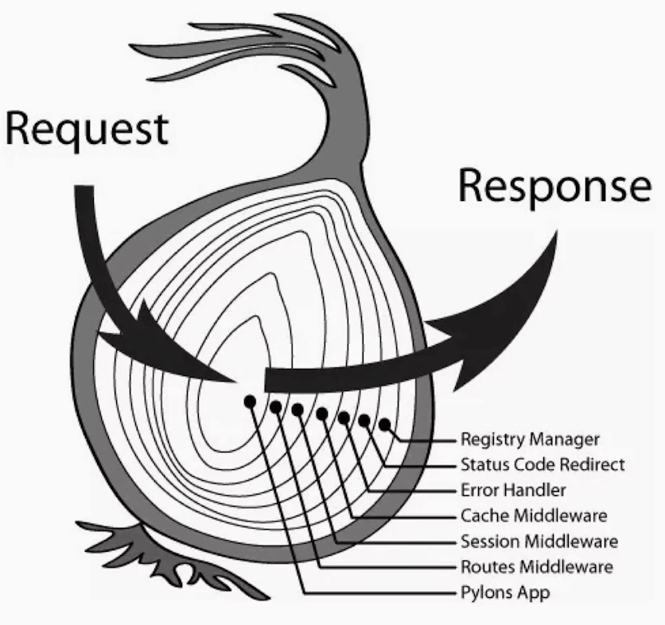

# vue基础

## 模板语法

```javascript
//v-html指令,解析代码html
v-html="rawHtml"

//v-bind特性
<div v-bind:id="dynamicld"></div>

//表达式
{{number+1}}
{{ok?'Yes':'No'}}
{{message.split('').reverse().join('')}}

//v-if指令
<p v-if="seen">see</p>

//自定义指令
// el,所绑定的元素，可以直接操作DOM
// binding,一个对象，包含有属性：value(指令的绑定值)等等
Vue.directive('n',{
    //只调用一次 第一次绑定到元素时调用
    bind:function(el,binding){
        el.textContent=Math.pow(binding.value,2)
    },
    //所在组件的VNode更新时调用
    update:function(el,binding){
        el.texttContent=Math.pow(binding.value,2)
    }
})


//修饰符prevent
<form v-on:submit.prevent="onSubmit">...</form>


//缩写
<a v-bind:href="url">...</a>
<a :href='url'></a>

<a v-on:click="doSomething">...</a>
<a @click="doSomething">...</a>


```

- data为什么必须是函数
  - 最根本原因是**`js`对于对象（以及数组等）是传引用的**，因为如果直接写一个对象进去，那么当依此配置初始化了多个实例之后，这个对象必定是多个实例共享的。
- 自定义指令场景：对数据进行复杂处理

## 计算属性（具有依赖关系的数据监听）

```javascript

<div>
    {{money}},{{a}},{{b}}
</div>

data(){
    return{
        money:100,
        a:1
    }
},
computed:{
    b:function(){
        return this.money-this.a
    }
}

```


## 类与样式,条件&列表渲染

```javascript
// class的数组形式：元素a,b为class名称
<div :class="[a,b]">
</div>
// class的对象形式：属性名为class的名称，值a3为Boolean值
<div :class="{'test-1':a3}"
</div>
// class的字符串形式：obj为{'class类名':Boolean值}
<div :class="obj">
    
</div>

//v-for,列表循环
<ul>
    <li v-for="(item,idx) in  list" :key="item.index">
        {{item}},{{idx}}
    </li>
</ul>

// v-for,分组模板
<ul>
   <template v:for="item in list">
       <li :key="item+1"/>hello</li>
       <li :key="item">{{item}}</li>
   </template>
</ul>
data(){
    return{
        a:'test-1',
        b:'test-2',
        a3:true,
        obj:{
            'test-1':false
        },
        list:[
            'a','b','c','d'
        ]
    }
}

```


## 事件处理

events.vue

```javascript
<div>
    <button type="button" name="button" v-on:click="counter +=1 ">test</button>
</div>
inport ev from './components/ev.vue'
export default{
    data(){
        return{
            counter:0
        }
    }
    methods:{
        msg:function(){
            window.console.log(Math.random())
        },
        
    },
    
}

```

- 获取触发的DOM元素

  参数$event传入方法中（event**.target属性就是触发元素**）

## 深入了解组件

com.vue

```javascript
//父组件
<com @path="msg"/>
    
msg:function(){
    this.data++
}

```


## 路由基础

router.js

```javascript
import Vue from 'vue'
import VueRouter from 'vue-router'
Vue.use(VueRouter)
const routes=[
    
    {
        path:'/pagea',
        component:pageA
    },{
        path:'/pageb',
        component:pageB
    }
]
const router=new VueRouter({
    routes
})
export default router


```


main.js

```javascript
import Vue from 'vue'
import router from './router'

Vue.config.productionTip=false
new Vue({
    router
}).$mount('#app')
```

- **vue.config.js文件：runtimeCompiler:true** // 开启使用运行时编译器的vue构建版本，可以在vue组件中使用template选项了。

## vuex基础


Vuex简单来说就是多个组件共享数据，但是组件是不能直接操纵数据的，如下图所示，我们的数据放在紫色部分state里面（没有放在data里），操作数据源由红色部分Mutations完成，什么时候操控数据有黄色部分Actions来控制，这里就是由用户来操纵组件来触发 Actions ，最后，由 Actons 提交 Commit 通知改变数据源，来完成组件视图的更新渲染。


# koa基础

```javascript
// 安装脚手架
cnpm i -g koa-generator
//创建项目，基于ejs模板引擎
koa2 -e 项目名称
// 运行 
DEBUG=koa2-learn:* npm start
// 可能安装fsevents
cnpm i --update-binary
//开发运行
npm run dev
```


## async和await

1. await 后面需要一个promise对象或者一个被转换为promise的对象（promise.resolve(普通对象)）


## koa2中间件



服务端接受客户端的 Request，经过服务端一些流程，然后 Response 返回给浏览器，**其中每一个环，都是一个中间件**。进来的时候会经过某个中间件，出去的时候也会经过，**这样的机制就可以让中间件引用顺序和代码执行顺序不一致。**

## 路由和cookie

koa路由写法

```javascript
router.get('/',async(ctx,netx)=>{
    ctx.cookies.set('pvid:',Math.Random());
    await ctx.render('index',{title:'hello koa2'})
})
```


# mongoose和redis

https://www.runoob.com/mongodb/mongodb-tutorial.html

https://www.runoob.com/redis/redis-tutorial.html

# Nuxt.js（v1.42）

**基于Vue2**

**包含Vue Router**

**支持Vuex(included only when using the store option)**

**支持Vue Server Renderer(exclude when using mode:'spa')**

**支持vue-meta**(需要配置文件书写)

## Nuxt.js工作流


- **Incoming Request** 浏览器发送一个请求
- 服务端检查是否有 **nuxtServerInit 配置项**，有的话就会执行这个函数，其中包含一个标注： **Store action** 用来操作 vuex
- 下一个环节就是**中间件 middleware** ，**与路由相关**，做任何你想要的功能
- **预验证 validate()** 可以配合高级动态路由，做一些验证，比如是否允许跳转某个页面
- **asyncData()** & **fetch()** 获取数据，前一个是用来渲染vue component，即 vue组件的，后一个通常用来修改 vuex，即 Store数据
- 有了数据，模板后，最后一步就是 Render 渲染了，方式是 SSR


## Nuxt.js安装

```javascript
vue init nuxt-community/koa-template
//https://zh.nuxtjs.org/guide/installation
```

## Nuxt.js目录

### 资源目录

资源目录 `assets` 用于组织未编译的静态资源如 `LESS`、`SASS` 或 `JavaScript`。

[关于 assets 目录的更多信息](https://zh.nuxtjs.org/guide/assets)

### 组件目录

组件目录 `components` 用于组织应用的 Vue.js 组件。Nuxt.js 不会扩展增强该目录下 Vue.js 组件，即这些组件不会像页面组件那样有 `asyncData` 方法的特性。

### 布局目录

布局目录 `layouts` 用于组织应用的布局组件。

*若无额外配置，该目录不能被重命名。*

[关于布局的更多信息](https://zh.nuxtjs.org/guide/views#布局)

### 中间件目录

`middleware` 目录用于存放应用的中间件。

[关于中间件的更多信息](https://zh.nuxtjs.org/guide/routing#中间件)

### 页面目录

页面目录 `pages` 用于组织应用的路由及视图。Nuxt.js 框架读取该目录下所有的 `.vue` 文件并自动生成对应的路由配置。

*若无额外配置，该目录不能被重命名。*

[关于页面的更多信息](https://zh.nuxtjs.org/guide/views)

### 插件目录

插件目录 `plugins` 用于组织那些需要在 `根vue.js应用` 实例化之前需要运行的 Javascript 插件。

[关于插件的更多信息](https://zh.nuxtjs.org/guide/plugins)

### 静态文件目录

静态文件目录 `static` 用于存放应用的静态文件，此类文件不会被 Nuxt.js 调用 Webpack 进行构建编译处理。 服务器启动的时候，该目录下的文件会映射至应用的根路径 `/` 下。

**举个例子:** `/static/robots.txt` 映射至 `/robots.txt`

*若无额外配置，该目录不能被重命名。*

[关于静态文件的更多信息](https://zh.nuxtjs.org/guide/assets#静态文件)

### Store 目录

`store` 目录用于组织应用的 [Vuex 状态树](http://vuex.vuejs.org/) 文件。 Nuxt.js 框架集成了 [Vuex 状态树](http://vuex.vuejs.org/) 的相关功能配置，在 `store` 目录下创建一个 `index.js` 文件可激活这些配置。

*若无额外配置，该目录不能被重命名。*

[关于 store 的更多信息](https://zh.nuxtjs.org/guide/vuex-store)

### nuxt.config.js 文件

`nuxt.config.js` 文件用于组织Nuxt.js 应用的个性化配置，以便覆盖默认配置。

*若无额外配置，该文件不能被重命名。*

[关于 nuxt.config.js 的更多信息](https://zh.nuxtjs.org/guide/configuration)

### package.json 文件

`package.json` 文件用于描述应用的依赖关系和对外暴露的脚本接口。

*该文件不能被重命名。*

### 别名

| 别名         | 目录                                                       |
| ------------ | ---------------------------------------------------------- |
| `~` 或 `@`   | [srcDir](https://zh.nuxtjs.org/api/configuration-srcdir)   |
| `~~` 或 `@@` | [rootDir](https://zh.nuxtjs.org/api/configuration-rootdir) |

默认情况下，`srcDir` 和 `rootDir` 相同。

**提示:** 在您的 `vue` 模板中, 如果你需要引入 `assets` 或者 `static` 目录, 使用 `~/assets/your_image.png` 和 `~/static/your_image.png`方式。

## Vue SSR 工作原理

ssr是用来解决SEO问题，适用于数据快速展现的场景的，实现的原理:

如果不给数据的话，就是一个静态html模板，一个静态的内容，没有任何交互，那交互是在哪完成的呢？

交互是在浏览器端完成的，也就是说浏览器端会有一个入口，进行预编译，但不会再渲染页面了，因为服务器端已经在页面渲染过一次了。它要做的是创建一个虚拟的编译结果（可以理解为虚拟dom）， 和服务器端传过来的结果进行对比，如果有区别，它会重新请求数据。在nuxt项目中都是一套文件，没有特别指定是在浏览器端运行还是服务端运行，也就是SSR常说的同构，浏览器端编译虚拟dom，也依赖于 vue 文件，因此模板是有的，而编译这个dom，需要的是额外的数据，此数据是服务器端渲染之前请求而来的数据，如果数据不同步在浏览器端，编译出来的结果必然和服务器端编译结果不一致。

综上，服务器端异步获取的数据会同步在浏览器端，作对比，如果对比一致的话，浏览器端就会对对应的dom结点注册事件，达到交互作用。

