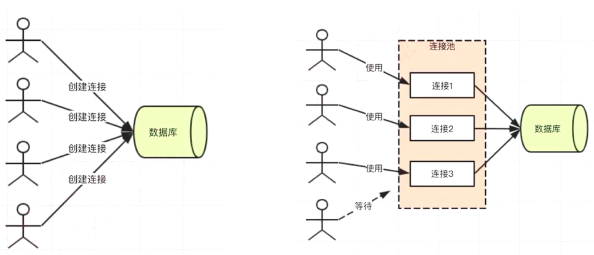

# ejs
## 变量
## 判断和循环
## 引用组件

# mysql

```mysql
use koa2_weibo_koa2;

```

## 外键

## 更新限制&删除级联

## 连表查询


```mysql
select * from blogs inner join users on users.id=blogs.userid; -- 不一定有外键
select blogs.*,users.username,users.nickname from blogs inner join users.id=blogs.userid where users.username='lisi';
```

## sequelize

ORM工具。

- 数据表，用JS中的模型（class 或对象）代替
- 一条或多条记录，用JS中一个对象或数组代替
- sql 语句，用对象方法代替

### 建模&同步到数据库


```javascript
npm i mysql2 sequelize -d
```


### 增删改查&连表查询


```javascript

// 连表1

// 删除

```

### 连接池



```javascript
const Sequelize = require('sequelize')
const conf = {
    host：'localhost',
    dialect: 'mysql'
}
// 线上环境，使用连接池
conf.pool={
    max: 5, // 连接池中最大的连接数量
    min: 0, // 最小
    idle: 10000  // 如果一个连接池 10 s 之内没有被使用，则释放
}
const seq = new Sequelize("database", "user", "password", conf)

```

# Redis

redis,是内存数据库，mysql是硬盘数据库

 config/db.js

```javascript
//node操作redis
// config/db.js
let REDIS_CONF={
    port:6379,
    host:'127.0.0.1'
}
module.exports = {
    REDIS_CONF
}


```

 src/cache/_redis.js

```javascript
const redis=require('redis')
const {REDIS_CONF}=require('../conf/db')

// 创建客户端
const redisClient = redis.createClient(REDIS_CONF.port, REDIS_CONF.host)
redisClient.on('error', err => {
    console.error('redis error', err)
})

/**
 * redis set
 * @param {string} key 键
 * @param {string} val 值
 * @param {number} timeout 过期时间，单位 s
 */
function set(key, val, timeout = 60 * 60) {
    if (typeof val === 'object') {
        val = JSON.stringify(val)
    }
    redisClient.set(key, val)
    redisClient.expire(key, timeout)
    

/**
 * redis get
 * @param {string} key 键
 */
function get(key) {
    const promise = new Promise((resolve, reject) => {
        redisClient.get(key, (err, val) => {
            if (err) {
                reject(err)
                return
            }
            if (val == null) {
                resolve(null)
                return
            }

            try {
                resolve(
                    // string=>json
                    JSON.parse(val)
                )
            } catch (ex) {
                // 直接返回
                resolve(val)
            }
        })
    })
    return promise
}
    
    
module.exports = {
    set,
    get
}
```


# 线上线下环境配置


```javascript
// /src/utils/env.js


const ENV = process.env.NODE_ENV

module.exports = {
    isDev: ENV === 'dev',
    notDev: ENV !== 'dev',
    isProd: ENV === 'production',
    notProd: ENV !== 'production',
    isTest: ENV === 'test',
    notTest: ENV !== 'test'
}


```

# 登陆


## cookie和session


## session存储redis


- 将web server和redis 拆分为两个单独的服务

- 双方都是独立的，都是可扩展的（例如都扩展成集群）

- 包括mysql，也是一个单独的服务，也可扩展

  **session更适合存储在redis中**

- session 访问频繁，对性能要求极高

- session 可不考虑断电丢失数据的问题（内存的硬伤）

- session 数据量不会太大（相比于mysql中存储的数据）

  **redis不适合存储网站数据**

- 操作频率不是太高（相比于session操作）

- 断电不能丢失，必须保留

- 数据量太大，内存成本太高


## koa2中使用


```javascript

// npm i koa-redis koa-generic-session --save

// session 配置
app.keys = [SESSION_SECRET_KEY]
app.use(session({
    key: '', // cookie name 默认是 `koa.sid`
    prefix: '', // redis key 的前缀，默认是 `koa:sess:`
    cookie: {
        path: '/',
        httpOnly: true,
        maxAge: 24 * 60 * 60 * 1000  // 单位 ms
    },
    store: redisStore({
        all: `${REDIS_CONF.host}:${REDIS_CONF.port}`
    })
}))

// git commit -m  'feat:增加session配置'
```

# jest单元测试

***.test.js文件**

```javascript
// npm i jest --save-dev

// package.json
// colors,分颜色输出
// forceExit,运行完退出
// runInBand, 顺序执行
 "test": "cross-env NODE_ENV=test jest --runInBand --forceExit --colors"

```

http测试

test/server.js

```javascript
// npm i supertest --save-dev
const request = require('supertest')
const server = require('../src/app').callback()

module.exports = request(server)

// git diff 
// git commit -m 'feat:jest'
```


bin/www

```javascript
var app = require('../src/app');
var http = require('http');
var server = http.createServer(app.callback());
```


测试用例

```javascript
const server = require('../server')
// 注册
test('注册一个用户，应该成功', async () => {
    const res = await server
        .post('/api/user/register')
        .send(testUser)
    expect(res.body.errno).toBe(0)
})
```


# 开发环境koa


## eslint

**npm i eslint eslint-babel --save-dev**

```javascript
//.eslintignore
node_modules
test
src/public
bin

//.eslintrc.json
{
    "parser": "babel-eslint",
    "env": {
        "es6": true,
        "commonjs": true,
        "node": true
    },
    "rules": {
        // 使用4个空格，否则报错
        "indent": ["error", 4],
         // 使用单引号，否则报错    
         // 允许反引号，模板字符串
        "quotes": [
            "error",
            "single",
            {
              "allowTemplateLiterals": true
            }
        ],
        // 不使用分号，否则报错
        "semi": [
            "error",
            "never"
        ]
    }
}

```

package.json

```json
 "lint": "eslint --ext .js ./src",
```

### pre-commit

```javascript
// npm i pre-commit --save-dev

//package.json 最下面
// commit 前执行script中的lint命令
  "pre-commit": [
    "lint"
  ]


```


## inspect调试

package.json

```javascript
// 添加--inspect=29229 端口调试，端口冲突可以更换
"dev": "cross-env NODE_ENV=dev ./node_modules/.bin/nodemon --inspect=29229 bin/www",
// 配合debugger断点 chrome打开：chomre://inspect,点击target

```


## 404错误页面

app.js

```javascript
const errorViewRouter = require('./routes/view/error')
app.use(errorViewRouter.routes(), errorViewRouter.allowedMethods()) // 404 路由注册到最后面

// app.js
let onerrorConf = {}
if (isProd) {
    // 生产环境下跳转主页
    onerrorConf = {
        redirect: '/error'
    }
}
// 开发环境下报错
onerror(app, onerrorConf)
```


# jwt（json web token）

-  用户认证成功之后，server端返回一个加密的token给客户端
- ​	客户端后续每次请求都带 token，以示当前的用户身份

## koa2实现jwt

```javascript
// npm i koa-jwt --save 
// app.js
const jwtKoa=require('koa-jwt')
// 放在路由最前面
app.use(jwtKoa({
    secret:'密钥字符'
    
}).unless({
    // 忽略jwt验证的目录:users和login
    path:[/^\/users\/login/]
}))
// npm i jsonwebtoken --save

```

routes/users.js

```javascript
const jwt=require('jsonwebtoken')
```


 客户端携带token

```javascript

```


## jwt和session

**公共点：**是为了解决，登陆&存储登陆用户的信息

**不同点**：

​	jwt用户信息加密存储在客户端，不依赖cookie，可跨域，应用场景：服务节点较多，跨域比较多的系统

​	session用户信息存储在服务端，依赖cookie，默认不可以跨域，应用场景：同意的web服务，server要严格管理用户信息

# 关系型数据库 三大范式

**属性的原子性：每一列都不可再拆解**

**记录的唯一性：有唯一标识（主键），其他属性都依赖于主键**

**字段的冗余性：不存在数据冗余和传递依赖**

好处：

数据规范严谨，不宜出错

占用空间更小，b

访问速度快

# PM2


```javascript
npm i pm2 -g 

// pm2 进程列表
PM2 list
// 开启
pm2 start app-name或id

// 停止
pm2 stop app-name或id

// 重启
pm2 restart app-name或id

// 删除
pm2 delete  app-name或id

// 信息
pm2 info app-name或id

// 日志
pm2 log  app-name或id

// 监控
pm2 monit  app-name或id
```


```javascript
// pm2配置
// pm2.conf.json
{
    "apps": {
        "name": "SNS",
        "script": "bin/www",
        "watch": true,
        "ignore_watch": [
            "node_modules",
            "logs",
            "uploadFiles"
        ],
        "instances": 1,
        "error_file": "./logs/err.log",
        "out_file": "./logs/out.log",
        "log_date_format": "YYYY-MM-DD HH:mm:ss"
    }
}
```


# Nginx


# 日志


# 补充：

## vscode 拼写检查插件：

