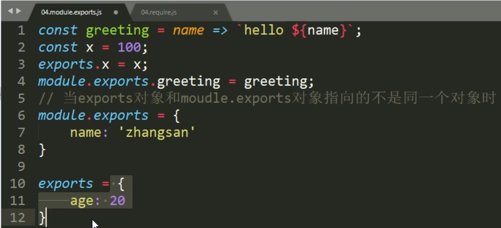

# 介绍

## node属于服务器端开发基础

1. 和后端程序员更加紧密配合
2. **网站业务逻辑前置，学习前端技术需要后端技术支持（Ajax）**
3. 扩展知识视野，高度审视整个项目

## 服务器开发

1. 实现网站的业务逻辑
2. 基于数据做增删改查工作

## Node的特点

1. **使用JS语法开发后端应用**
2. **基于Chrome V8引擎的JS代码运行环境**
3. **业务需要掌握Node开发**
4. **生态系统活跃，有大量开源库可以使用**
5. **前端开发工具大多基于Node开发**
6. 错误优先的回调函数（callba的第一个参数为错误对象）

# 运行环境搭建

## 版本

**LTS=long Term Support 长期支持版**

## 错误情况

1. **错误代码2503或2502，表示权限不足**
   - 解决：以管理员身份运行powershell，并输入：**msiexec    /package  此处写上node安装包的路径带扩展名**
2. **执行报错，表示写入环境变量失败**
   - 解决：安装路径写入系统环境变量

# 入门知识

## Node的组成

1. JS 的组成，**ECMAScript,DOM,BOM**
2. **Node是，ECMAScript和Node环境提供的一些附加API组成的，包括文件、网络、路径等API**

## 基础语法

1. **所有ECMAScript语法在node环境中都可以使用**

## 执行node

1. js文件目录下，打开powershell，运行：**node   js文件路径**

# node模块化开发

## JS开发的弊端

1. **JS开发的两大问题，文件依赖和命名冲突**
   - 文件依赖关系错综复杂需要人为分析来确定
   - **js文件中互相开放，变量可以互相访问到**。引用顺序决定了，命名可能会存在覆盖和冲突
2. **Nodejs文件依赖关系可以自动维护，不用人为分析；js文件半封闭，指定的变量和代码可以访问到**

## 模块化开发

一个功能就是一个模块，多个模块可以组成应用，抽离其中一个模块也不影响其他功能的运行

1. Node.js规定**一个JS文件就是一个模块**，**模块内部定义的变量和函数默认情况下外部无法得到**
2. **导入模块时后缀JS可以省略**
3. 模块成员导出方式**exports对象**
   
   - 使用**require()方法导入模块**
4. 模块成员导出方式**module.exports**
   
   - 使用require()方法导入模块
5. **exports**是**module.exports的别名(地址引用关系)**，导出对象最终以**module.exports**为准
   
   - 当地址引用发生了变化（两者的指向不相同了）,那么**导出对象最终以module.exports为准**
   
     
   
     

# 系统模块

1. Node运行环境提供的API。（这些**API以模块化的方式进行开发**）

## fs文件操作

1. 读取文件内容**fs.readFile()**

   ``````javascript
   示例：fs.readFile('文件路径/文件名称'[,'文件编码'],callback);
   //通过模块的名称对模块进行引用
   const fs=require('fs');
   fs.readFile('base.css','utf8',(err,doc)=>{
       //doc为文件内容，如果文件读取发生错误，参数err的值为错误对象。否则err的值为null
       if(err==null){
           console.log(doc);
       }
   })
   ``````

   - 通过模块的名称对模块进行引用
   -  **callback函数中，doc为文件内容，如果文件读取发生错误，参数err的值为错误对象。否则err的值为null**
   - **fs.readFile需要绝对路径**

2. 写入文件内容**fs.writeFile()**

   ``````javascript
   示例: fs.writeFile('文件路径/文件名称','数据',callback);//写入数据为字符串类型
   const fs=require('fs');
   const content='<h1>fs.writeFile写入内容</h1>'
   fs.writeFile('index.html',content,err=>{
       if(err!=null){
           console.log(err);
           return;
       }
       console.log('文件写入成功');
   })
   //写入文件不存在的情况下，系统会自动创建该文件
   
   ``````

   - **写入数据为字符串类型**
   - **写入文件不存在的情况下，系统会自动创建该文件**
   - **fs.readFile可以写相对路径**

## path路径操作

1. 路径拼接的原因

   - **不同操作系统的路径分隔符不统一：win上是\   /  ;   linux是   /**
   - //正斜线
   - \\ \反斜线

2. 语法

   ``````
   path.join('路径','路径',...)
   ``````

   ``````javascript
   const path=require('path');
   let finalPath=path.join('a','b','c','d.css');
   //输出结果：a\b\c\d.css
   console.log(finalPath);
   ``````

   

3. 相对路径和绝对路径

   - 使用**_ _dirname获取当前文件所在的绝对路径**

     ``````javascript
     const path=require('path');
     const fs=require('fs');
     fs.readFile(path.join(__dirname,'index.html'),'utf8',(err,doc)=>{
     	console.log(err)
         console.log(doc)
     })
     ``````

     

# 第三方模块

1. 两种存在形式
   - 以**JS文件**的形式存在，提供实现具体功能的API接口
   - 以**命令行工具**形式存在，辅助项目开发
2. npm：Node第三方模块管理工具

# nodemon

1. 监控文件的保存操作，然后执行该文件
2. 安装**npm i nodemon -G**，然后使用**nodemon代替node来执行文件**

# nrm

1. npm下载地址切换工具
2. **npm i  nrm -G** ,然后**nrm ls**列出下载地址，**nrm use 地址名** 切换下载地址。

